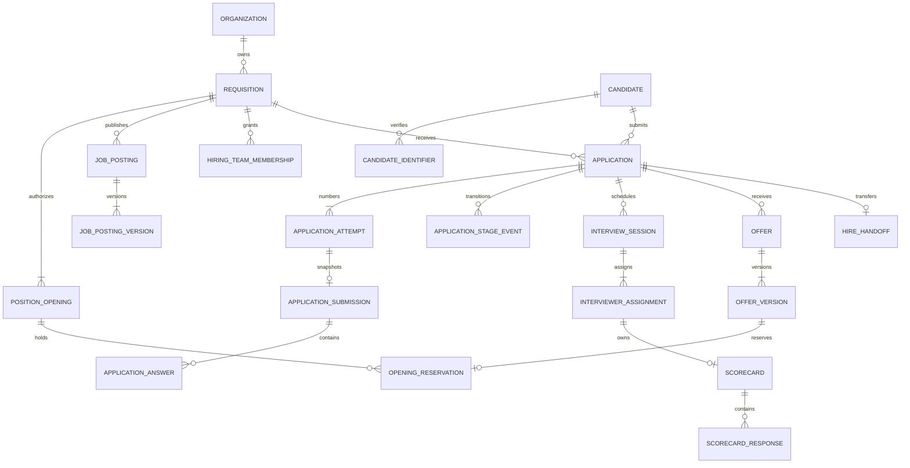

# Recruitment System v1.9 canonical data model

## 1. Purpose and authority

This document is the readable companion to the executable v1.9 data-model contract. It replaces the assumption that the 92 navigation families or 1,472 v1.8 family-template fields are a build-ready physical schema.

Authority order:

1. `src/data/canonicalDataModel.ts` — executable concept, field, relationship, transition, event, security, analytics and quality contracts;
2. `src/data/canonicalRuntime.ts` — normalized synthetic operational store and UI projection rules;
3. `docs/MATRIX-v1.9.md` — count and acceptance ledger;
4. this document — architectural explanation and review guide;
5. PRD section 15.17 — product boundary and acceptance requirements.

The model is complete as a synthetic logical/runtime contract. All Salesforce API names and persistence targets remain proposals until accountable approval.

## 2. Model layers

| Layer | Identifier | Purpose | Canonical? |
| --- | --- | --- | --- |
| Navigation family | `OBJ-*` | Groups List/New/Detail/Edit journeys and governance discovery | No |
| Atomic concept | `CON-*` | Declares one independently governed business/configuration/evidence grain | Yes, at logical-design level |
| Atomic field | `AFLD-*` | Declares typed business and governance data | Yes, at logical-design level |
| Relationship | `REL-*` | Declares foreign-key semantics, cardinality, time and delete behavior | Yes, at logical-design level |
| Transition | `DTR-*` | Declares guarded lifecycle mutation and recovery | Yes, at logical-design level |
| Invariant | `INV-DM-*` | Declares cross-record truth that must hold transactionally | Yes |
| Quality rule | `DQ-*` | Declares monitored completeness, uniqueness, validity, integrity and lifecycle checks | Yes |
| UI projection | Core `JobRecord`, `CandidateRecord`, etc. | Formats canonical records for a particular screen | No |
| Analytics fact/dimension | Named fact/dimension contracts | Reconstructs metrics from canonical events and versions | Derived |
| Salesforce/API target | Proposed API name | Candidate physical implementation target | No; approval required |

## 3. Atomicity decision

The inherited 92-family catalogue expands to 111 named concepts. v1.9 adds 18 supporting concepts that were required by the PRD or by integrity/authorization/lineage rules but absent from the navigation inventory. The target model therefore contains 129 atomic concepts.

Each concept is classified as one of:

- canonical entity;
- child entity;
- junction;
- immutable version;
- append-only event;
- derived snapshot;
- configuration metadata;
- external reference; or
- read-model projection.

Combined labels no longer share one grain. For example:

```text
ApprovalPolicy
  └── ApprovalPolicyVersion
        └── ApprovalProcess
              └── ApprovalStep

ApprovalAttempt
  └── ApprovalDecision
```

The version selected by an attempt is immutable. A material subject change supersedes the attempt and requires a new fingerprint-bound attempt.

## 4. Canonical aggregate boundaries

### 4.1 Requisition and posting

`Requisition` authorizes recruiting work and headcount. `PositionOpening` is the individually reservable headcount ledger. `JobPosting` is the stable candidate-facing posting identity; `JobPostingVersion` is immutable public content. `PostingChannel` records delivery/reconciliation to a channel but never becomes publication truth.

Rules:

- approved headcount reconciles to authorized openings;
- publication requires an approved current requisition, hiring-plan version and policy evaluation;
- public content never carries internal budget, approval comment or restricted policy facts;
- a changed public field creates a new posting version;
- applications from the portal pin their originating posting version.

### 4.2 Candidate and identity

`Candidate` is one reviewed person identity. Contact/identity values are stored in `CandidateIdentifier`; IdP subjects are stored in `CandidateIdentity`; duplicate review is stored in `CandidateDuplicateCase`.

Rules:

- applications, dispositions, consents and protected/restricted facts never become candidate-wide attributes;
- only verified, normalized identifiers participate in entity-resolution matching;
- a signal opens a human duplicate-review case;
- merge/split corrections preserve old identifiers, actor, reason and lineage;
- no automatic merge is permitted.

### 4.3 Application and submission

`Application` is the candidate-to-requisition aggregate. `ApplicationAttempt` carries the immutable attempt number. `ApplicationSubmission` captures the immutable submitted snapshot. `ApplicationAnswer` carries one version-bound answer. `ApplicationStageEvent` is the append-only source of current stage.

Canonical Application fields include:

- organization ID;
- application ID;
- candidate ID;
- requisition ID;
- originating posting version ID;
- attempt number;
- application/process template versions;
- owner ID;
- submitted/withdrawn/terminal times where applicable;
- terminal disposition reference;
- business version, classification, retention and hold state.

Candidate name, job title, formatted age and next-action text are projections. They are not duplicated canonical Application truth.

### 4.4 Interview and evidence

`InterviewSession` is the canonical logistics record. Calendar events are projections. `InterviewerAssignment` binds one interviewer and role slot to one session and access window. `Scorecard` belongs to one assignment; `ScorecardResponse` belongs to one pinned rubric criterion.

Rules:

- qualification, availability and conflicts are rechecked before confirmation;
- assignment access starts/ends explicitly;
- each evaluator submits independently;
- other feedback remains hidden until the approved debrief rule opens access;
- amendments append and preserve the original submission.

### 4.5 Decision, offer, opening and hire

Human decision, disposition, approval, offer response, opening reservation, contingency and hire handoff are separate facts.

`Hired` is valid only when:

```text
current human decision permits hire
AND current offer version is accepted
AND one active reservation holds one open PositionOpening
AND every required contingency is cleared or validly waived
AND the exact handoff payload is acknowledged by the destination
```

Transport success is not acknowledgement. Accepted is not Hired. A failed handoff leaves the application not Hired and creates owned recovery work using the same idempotency key.

## 5. Field contract

Each atomic concept inherits 13 governance fields and declares at least three concept-specific business fields. The complete generated dictionary contains 2,350 field contracts: 673 business and 1,677 governance/provenance fields.

Every `AFLD-*` defines:

- key and human label;
- business definition and record grain;
- atomic data type;
- nullability and explicit null meaning;
- required condition and default;
- allowed values, unit, currency or timezone semantics;
- source, accountable authority and provenance class;
- captured/authoritative/copied/derived status;
- classification, encryption and masking;
- read and write roles;
- validation and data-quality rule;
- retention and legal-hold behavior;
- history/versioning behavior;
- index and unique-group intent;
- reference target and effective dating;
- proposed Salesforce/API mapping; and
- permitted reporting use.

The shared governance fields are:

1. `id`;
2. `organization_id`;
3. `lifecycle_state`;
4. `business_version`;
5. `created_at`;
6. `created_by`;
7. `updated_at`;
8. `updated_by`;
9. `source_system`;
10. `classification`;
11. `retention_class`;
12. `legal_hold_state`; and
13. `evidence_fingerprint`.

These are logical fields. A future Salesforce design may use standard system fields, history objects, calculated values, external archives or platform capabilities rather than deploying all 13 as custom fields on every object.

## 6. Data types and null semantics

Runtime canonical records use typed values rather than `Record<string,string>`. Monetary values use integer minor units plus ISO-4217 currency. Timestamps use ISO-8601 and explicit timezone semantics. Country, locale and timezone values use ISO/IANA/BCP standards. References carry target concept and organization constraints.

Null meanings are never ambiguous:

- not yet captured;
- not applicable under the field condition;
- not available from source;
- intentionally withheld by policy; or
- not authorized for the current projection.

The physical design must not overload zero, empty string, `unknown`, `N/A` or a sentinel date as null.

## 7. Structured relationship contract

Every `REL-*` declares:

- source concept and reference field;
- target concept;
- cardinality;
- required/optional status;
- delete behavior;
- ownership/access inheritance;
- effective-time rule; and
- invariant.

All persisted tenant concepts also relate to one Organization. Cross-organization lookup, query and mutation are prohibited.

Core cardinalities:



## 8. Lifecycle and transition contract

Every concept has a state vocabulary and adjacent guarded transitions. A `DTR-*` includes:

- source and destination state;
- command and required permission;
- current-version/configuration/evidence/policy guard;
- reason requirement;
- business-audit, work, projection and analytics side effects;
- candidate-safe communication evaluation;
- emitted event;
- stable idempotency scope; and
- failure/recovery behavior.

Application, Offer and HireHandoff transitions use stronger domain-specific guards. The browser wireframe remains a simulation; a future domain service/database transaction must enforce the same result atomically.

## 9. Event and audit envelope

Every consequential event carries:

- event ID, name and schema version;
- organization;
- aggregate type, ID and version;
- actor ID/type and authority reference;
- occurred and observed timestamps;
- correlation and causation IDs;
- idempotency key; and
- payload hash.

Payloads exclude names, contact values, message/file content, secrets, unrestricted rationale and protected/restricted raw data unless a separately approved event contract explicitly requires a minimized field.

Business events support state reconstruction and side effects. Business audit records support accountability. Integration delivery records support transport and reconciliation. None substitutes for the others.

## 10. Authorization model

Authorization evaluates:

```text
object capability
AND field entitlement
AND relationship to this record
AND approved business purpose
AND effective time
AND restricted entitlement where applicable
```

Relationship evidence includes organization membership, record ownership, hiring-team membership, interviewer assignment, approval-step assignment, restricted-case assignment, candidate self identity, delegation and break-glass grant.

The v1.9 object workspace uses explicit security context on each row. It no longer selects a row by hashing a role name. This is still a browser simulation and does not prove Salesforce sharing, CRUD/FLS, user-mode Apex or BFF authorization.

## 11. Sensitive-data separation

The model separates or expressly restricts:

- compensation and offer terms;
- accommodation/medical detail;
- privacy identity proof and export/delete payloads;
- integrity signals and redress evidence;
- background/reference/adverse-action detail;
- candidate survey identity/free text;
- application answers classified as restricted;
- message/file content; and
- integration payloads and secrets.

Routine hiring roles receive only the safe operational fact needed to act, such as an accommodation logistics adjustment or policy blocker. They do not receive the restricted reason or evidence.

## 12. Canonical runtime

`canonicalRuntime.ts` normalizes the v1.8 dense records into:

- Requisition/posting facts with numeric compensation and typed publication time;
- Candidate plus separate identifiers and consent;
- Application with only identifiers and aggregate facts;
- append-only ApplicationStageEvent;
- separate governed work item;
- InterviewSession without copied candidate/job names;
- InterviewerAssignment with user ID and access window.

The UI receives derived `JobRecord`, `CandidateRecord`, `ApplicationRecord`, `InterviewRecord` and `AssignmentRecord` projections. Create/edit actions mutate the canonical in-memory store; application stage changes append events. Duplicate verified email creates an error directing the user to duplicate review rather than automatically merging.

## 13. Analytics model

The 324 dashboard rows now derive from the same canonical 640-application store. The fixture generator ensures contract-complete coverage of three jobs × four sources × nine stages × three rolling-window positions. Each row includes canonical Application ID, source stage-event ID, aggregate version, observed time and restatement version.

The analytical contract defines eight facts and four conformed dimensions. It prohibits silent historical rewrites: late or corrected events produce an attributable restatement tied to the superseded version.

## 14. Reference data

Country, currency, timezone, locale, workplace mode, worker type, job architecture, source, disposition reason, workflow phase/state, business calendar and data classification are versioned governed reference datasets. Display labels may change without changing stable identifiers or historical grouping.

## 15. Data quality

The 15 `DQ-*` controls cover:

- primary/composite uniqueness;
- foreign-key and organization integrity;
- state reachability;
- version pinning;
- temporal and reference validity;
- provenance completeness;
- sensitive-field minimization;
- idempotency;
- projection reconciliation;
- freshness;
- volume/share/parent skew;
- retention/hold completeness; and
- migration reconciliation.

Blocker failures prevent consequential action and create an owned `DataQualityIssue`. High findings may permit read-only/degraded operation only under an approved runbook.

## 16. Physical Salesforce disposition

Every concept has a proposed persistence target and API name so design review can be complete and traceable. These proposals do not freeze a one-concept-to-one-object implementation. The final review must decide:

- standard versus custom object/metadata;
- consolidation or child/value-object storage;
- lookup versus master-detail;
- API name, type, length, precision and null behavior;
- unique/external IDs and indexes;
- ownership, OWD, sharing and field entitlements;
- encryption, history and archive;
- expected child/share/event volumes and skew;
- integration mappings; and
- migration/cutover/rollback.

No Salesforce metadata is present. The approved physical object count remains zero.

## 17. Migration and lifecycle

Before cutover, every source field maps through a versioned `MigrationMapping`. Migration proves source/target counts, primary/composite key uniqueness, required lookup coverage, current-stage event reconstruction, opening/offer/hire invariants, file references, restricted-field handling and retention/hold state.

Invalid rows enter a nonproduction quarantine with reason and owner. Cutover requires a source freeze/checkpoint, delta plan, reconciliation report, rollback checkpoint and accountable sign-off. Historical corrections after cutover use the same append/version model as normal operation.

## 18. Definition of completion

v1.9 logical/runtime completion requires:

1. 111 inherited and 18 supporting concepts reconcile to 129;
2. every concept has unique grain, kind, fields, state vocabulary and disposition;
3. every persisted concept has an organization relationship and every relationship target resolves;
4. every concept has transition contracts;
5. all 15 invariants, 13 events, 13 human-role policies, 12 analytical contracts, 12 reference datasets and 15 quality rules are present;
6. canonical dense data passes uniqueness and referential checks;
7. core UI records are projections from the canonical store;
8. all 324 analytics rows have canonical application/event/version lineage;
9. relationship-backed row security denies wrong-organization and expired access;
10. duplicate identity and stage-append mutation tests pass;
11. artifact audit, TypeScript, unit/component/accessibility tests, build and browser journeys pass; and
12. documentation never claims physical Salesforce approval or production readiness.

Completion of this document does not complete Salesforce implementation, authentication, BFF/services, provider integrations, security/legal approval, manual accessibility, operational exercises or pilot evidence.
