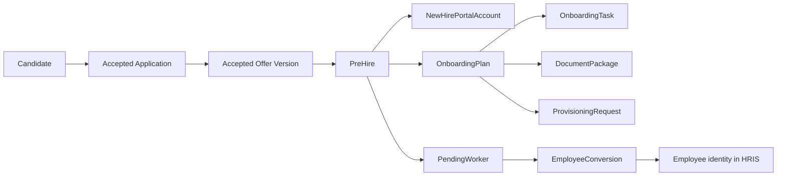

# Recruitment System v2.0 — Lifecycle Data-Model Extension

Status: proposed logical contract for the synthetic wireframe. It adds 46 lifecycle objects to the 129-object v1.9 core logical model. The combined 175 concepts are not 175 Salesforce custom objects; approved physical-object count remains zero.

## Authoritative distinctions

- A Job is represented by the core `Requisition`, `PositionOpening`, `JobPosting`, `JobPostingVersion`, `JobLocation` and related concepts. “Job” remains the product/UI aggregate label.
- A person/candidate identity is not an application. `Application` remains the candidate–requisition junction.
- Offer acceptance does not make a candidate an employee. `PreHire`, `PendingWorker` and `EmployeeConversion` are independent linked grains.
- An onboarding template is not an assigned plan. Stable template identity, immutable version, definition and instance objects remain separate.
- A task definition is not a task instance; a delivery or message is not evidence that its business task completed.
- A prospect is a purpose-scoped relationship, not a generic Lead and not an application.
- A channel delivery is not canonical job-publication truth until it reconciles to the pinned posting version.

## Identity and onboarding relationship chain

Candidate, new-hire and workforce credentials remain in separate identity audiences. The relationship is an opaque subject binding; passwords, MFA secrets and recovery credentials are never copied.

## Domain composition

| Domain | Objects | Key field contracts | Lifecycle states |
| --- | ---: | ---: | ---: |
| Onboarding | 28 | 114 | 143 |
| Talent relationship | 7 | 28 | 37 |
| Internal mobility | 3 | 12 | 17 |
| Platform | 8 | 32 | 41 |
| Total | 46 | 186 | 238 |

The executable source calculates the total. Domain subtotals above are governed companion values and must be updated with the source when concepts change.

## Core onboarding grains

| Object | Grain | Required authoritative parent | Critical invariant |
| --- | --- | --- | --- |
| `PreHire` | One accepted application converted for pre-employment work | Application + accepted offer version | At most one active pre-hire per accepted offer version and destination organization |
| `PendingWorker` | One staged destination-worker payload/identity | PreHire | Destination ID cannot become employee truth until provider acknowledgement reconciles |
| `EmployeeConversion` | One idempotent conversion attempt | PendingWorker | Same business key cannot create two employees; reversal is compensating evidence |
| `OnboardingTemplateVersion` | One immutable approved definition | OnboardingTemplate | Used versions never mutate |
| `OnboardingPlan` | One template-version assignment to one pre-hire | PreHire | One current active base plan; addenda are explicit separate assignments |
| `OnboardingStage` | One stage instance inside one plan | OnboardingPlan | Completion derives from required task/evidence rules |
| `OnboardingTask` | One definition instance assigned to one owner | OnboardingPlan + definition | Exactly one accountable owner at a time; waiver is an independent decision |
| `SignatureEnvelope` | One provider envelope for one document version and signer | DocumentPackage | Signed state requires reconciled provider evidence, not a UI flag |
| `ProvisioningRequest` | One service/asset/access request for one plan | OnboardingPlan | Provider effect uses one idempotency key and reconciles destination state |
| `OnboardingException` | One owned blocking/risk occurrence | OnboardingPlan or child | Cannot close without resolution/accepted-risk evidence and owner attribution |

## Key invariants

1. Offer acceptance, opening reservation and pre-hire creation are version-bound and idempotent.
2. Candidate evaluation data is excluded from the employee-transfer payload unless an approved, lawful field contract explicitly requires it.
3. New-hire portal scope exists only for an active pre-hire and expires/changes at cancellation or employee conversion.
4. A plan pins one approved template version and selection explanation.
5. Required task completion needs evidence; email delivery, page view or provider request alone is insufficient.
6. Manager and ordinary People Ops projections never expose raw tax, payroll, benefits, eligibility or restricted-document values.
7. Start-date changes recalculate due dates and downstream effects through a versioned impact plan; they do not silently rewrite historical dates.
8. Provider retry retains business idempotency; correction creates a new payload/version but not a second business worker/request.
9. Provisioned access and physical credentials are revoked/reconciled on cancellation or invalidated conversion.
10. Every exception has severity, owner, due/SLA, safe impact, next action, source event and resolution evidence.
11. Prospect/community/campaign processing rechecks current purpose, consent and suppression before every communication effect.
12. Internal mobility does not notify a manager before the approved employee-visible milestone.

## State ownership

Canonical state lives on the aggregate or append-only event fold named in the contract. Portfolio risk, progress percentage, days-to-start, readiness and dashboard status are derived projections with source facts, as-of time and version. A derived value is never independently edited.

## Physical disposition gate

Before implementation, accountable architecture must decide which concepts become Salesforce standard/platform objects, custom objects, custom metadata, an external private document/form service, an event/audit archive, provider-owned records or rebuildable BFF read models. Each physical decision must define field types/lengths, keys/indexes, encryption, sharing/authorization, retention/hold, scale/skew, transaction boundary, API/event schema, migration, backup/restore and exit/export behavior.

The wireframe’s proposed system-of-record labels are design inputs only. No Salesforce metadata, schema migration, database, credential or production connection is present in the repository.
