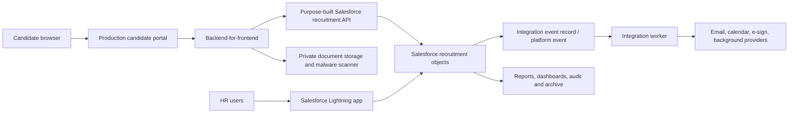

# Recruitment System — Product Requirements Document

| Field | Value |
| --- | --- |
| Status | Draft v0.3 |
| Last updated | August 22, 2026 |
| Product owner | Aditya Singh |
| Initial market | San Francisco–based employer hiring in the United States |
| Primary timezone | America/Los_Angeles |
| Currency | USD |
| Prototype deployment | Public GitHub Pages demonstration using synthetic data only |
| Pilot/production candidate deployment | Approved external application host and backend-for-frontend; providers TBD |
| Pilot/production HR deployment | Native Salesforce Lightning application |
| Operational system of record | Salesforce custom recruitment application |

## 1. Executive summary

Recruitment System is an end-to-end applicant tracking system (ATS) for a San Francisco–based company. It gives HR and hiring teams one structured place to create and publish jobs, collect applications, screen candidates, run assessments, schedule interviews, capture evidence-based feedback, make decisions, issue offers, and retain a complete audit trail. Candidates get a clear, accessible experience from job discovery through application status and offer response.

The first release is a single-company product, not a multi-tenant SaaS platform. It should feel modern, calm, inclusive, and trustworthy. The system must reduce hiring coordination work without turning consequential hiring decisions over to opaque automation.

Development starts with a public GitHub Pages prototype containing synthetic demonstration data and no functioning collection of candidate information. Before a pilot handles real identities, applications, resumes, evaluations, or offers, the frontend must move to an approved production application host. GitHub Pages remains a project showcase and deployment preview, not the production recruitment system.

For pilot and production, Salesforce is the operational recruitment system of record and workflow engine. Internal HR users work in a native Salesforce Lightning application. Candidates use an externally hosted React portal whose backend-for-frontend exposes only purpose-built recruitment operations to Salesforce. Candidate documents remain in approved private object storage and Salesforce stores controlled metadata and references.

### 1.1 Key architecture decisions

- Separate prototype, pilot, and production release definitions.
- Restrict GitHub Pages to public, synthetic-data demonstrations.
- Define a smaller P0 pilot workflow and move enhancements into P1/P2.
- Add default permission and decision-right matrices.
- Add candidate, workflow, and integration exception handling.
- Add background-check/adverse-action, privacy-request, and data-lifecycle requirements.
- Add job-search discovery, production operations, ownership, and rollout requirements.
- Use Salesforce custom objects for recruitment records; do not repurpose Leads or Opportunities.
- Use `Candidate__c` as the candidate identity record; do not enable Person Accounts solely for this product.
- Use native Lightning Web Components and Salesforce Flow/Apex for the internal HR workspace.
- Keep candidate authentication outside Salesforce in the default architecture; Experience Cloud is an evaluated alternative, not the baseline.
- Store resume/offer/reference binaries outside Salesforce unless a later security, capacity, and licensing decision explicitly approves Salesforce Files.
- Manage Salesforce metadata through Salesforce DX, an unlocked-package/source-driven model, automated validation, and reviewed Git commits.

## 2. Problem statement

Recruiting data is often fragmented across email, spreadsheets, calendars, shared drives, messaging tools, and interviewer notes. This causes:

- Slow requisition and offer approvals.
- Inconsistent candidate screening and interview evaluation.
- Duplicate or stale candidate records.
- Missed interviews, feedback, and follow-ups.
- Poor visibility into pipeline health and hiring bottlenecks.
- Candidate communications that are late or inconsistent.
- Sensitive hiring information being shared too broadly.
- Weak auditability and avoidable compliance risk.

## 3. Product vision

Enable a hiring team to run a fair, structured, human-led recruitment process from approved headcount to accepted offer, while giving every candidate timely information, control over their data, and a respectful experience.

### 3.1 Operating assumptions requiring validation

The system will be designed against the following working assumptions. They are product defaults, not legal conclusions. The product owner must replace every `Unconfirmed` entry before a real-candidate pilot.

| Assumption | Working position | Validation state |
| --- | --- | --- |
| Employer model | One private-sector employer headquartered in San Francisco | Unconfirmed |
| Employer legal name and address | Not yet supplied | Unconfirmed |
| Employee count | Unknown; product applies conservative California safeguards regardless of threshold | Unconfirmed |
| Initial hiring jurisdictions | California roles plus U.S. applicants for authorized remote roles | Unconfirmed |
| Hiring volume | Design for up to 100 open jobs and 100 hires per year initially | Unconfirmed |
| Worker types | Regular full-time and part-time employees first | Unconfirmed |
| Internal applicants | Supported after the external-candidate pilot | Unconfirmed |
| Staffing agencies | Controlled agency access is post-pilot | Unconfirmed |
| Federal-contractor status | Treat as not established; OFCCP requirements require separate review if applicable | Unconfirmed |
| Background checks | Manual controlled handoff in pilot; provider integration later | Unconfirmed |
| E-signature | Secure recorded acceptance in pilot; provider integration later | Unconfirmed |
| Salesforce org | Dedicated recruitment org preferred; an existing company org requires an impact assessment | Unconfirmed |
| Salesforce edition | Enterprise, Performance, or Unlimited target; exact edition and entitlements not supplied | Unconfirmed |
| Salesforce licenses | Internal, integration, Shield, storage, masking, and analytics quantities not supplied | Unconfirmed |
| Candidate portal identity | External identity provider and backend-for-frontend; no Salesforce external user by default | Confirmed architecture assumption |
| HR workspace | Native Salesforce Lightning application | Confirmed architecture assumption |
| Candidate system of record | Custom `Candidate__c`; no Lead/Contact/Person Account as canonical candidate record | Confirmed architecture assumption |
| Document storage | External private object storage with signed URLs and malware scanning | Confirmed architecture assumption |
| Languages | English/US first | Confirmed product assumption |
| Hiring decisions | Human-owned; no autonomous ranking, rejection, advancement, or selection | Confirmed product principle |

Changes to employer size, jurisdictions, federal-contractor status, industry, worker types, Salesforce org strategy, edition, licensing, or material platform entitlements trigger a documented compliance, architecture, and scope review.

## 4. Goals and success measures

### 4.1 Product goals

1. Provide one system of record for jobs, candidates, applications, interviews, evaluations, decisions, and offers.
2. Make the next action, owner, and deadline visible for every active application.
3. Standardize screening, assessments, interviews, and scorecards around job-related criteria.
4. Automate routine coordination and notifications while preserving human hiring decisions.
5. Provide a polished candidate experience optimized for mobile, accessibility, and transparency.
6. Build privacy, security, San Francisco/California hiring guardrails, and audit history into core workflows.

### 4.2 Pilot and v1 success metrics

| Metric | Definition | Initial target | Accountable owner |
| --- | --- | --- | --- |
| Application completion rate | Submitted applications / started applications | At least 70% | Product owner |
| Time to first review | Median time from submission to first HR action | Under 2 business days | Recruiting operations |
| Interview feedback SLA | Scorecards submitted within 24 hours / completed interviews | At least 90% | Hiring manager |
| Candidate communication SLA | Stage-changing messages sent within 1 business day | At least 95% | Recruiting operations |
| Scheduling cycle time | Median time from interview request to confirmed schedule | Under 2 business days | Recruiting coordinator |
| Offer acceptance rate | Accepted offers / offers sent | Baseline first; target after two quarters | Head of HR |
| Process completeness | Hires with complete approvals, scorecards, and audit history | 100% | HR administrator |
| Accessibility | Critical WCAG 2.2 AA violations in release QA | 0 | Product and engineering |
| Security | Critical or high-severity open findings at release | 0 | Security owner |

Metrics must be segmented only where privacy thresholds are met. Voluntary demographic data must never be exposed to hiring decision-makers.

## 5. Users and roles

| Role | Primary needs | Default access |
| --- | --- | --- |
| Candidate | Find jobs, apply, provide availability, complete assessments, track status, respond to offers, manage privacy requests | Own profile and applications only |
| Recruiter | Manage jobs and pipelines, screen candidates, coordinate communication, progress candidates | Assigned jobs and candidates |
| Recruiting coordinator | Schedule interviews, manage logistics and reminders | Scheduling and candidate contact data for assigned jobs |
| Hiring manager | Define requirements, review candidates, approve stages, lead decisions | Their jobs and candidate packets |
| Interviewer | Review interview kit, conduct interview, submit scorecard | Minimum candidate information for assigned interviews |
| Offer approver | Review compensation and offer terms | Offer packet and necessary candidate data |
| HR administrator | Configure organization, workflows, permissions, templates, retention, and integrations | Full administrative access |
| Compliance auditor | Review immutable history, access logs, reports, and retention actions | Read-only, scoped audit access |

Permission checks must be enforced by the backend, not only hidden in the user interface.

### 5.1 Default decision and permission matrix

`Manage` includes create/update actions. `Scoped` means only assigned jobs, applications, or interviews. Backend policy is authoritative.

| Action | Recruiter | Coordinator | Hiring manager | Interviewer | Offer approver | HR admin | Auditor |
| --- | --- | --- | --- | --- | --- | --- | --- |
| Create/edit requisition | Manage | No | Manage own | No | No | Manage | View |
| Approve requisition | No | No | Approve own | No | No | Configure/override | View |
| Publish/close job | Manage approved | No | Request | No | No | Manage | View |
| View candidate application | Scoped | Logistics fields | Scoped | Interview packet only | Offer packet only | Manage | Restricted view |
| Move pipeline stage | Scoped | Scheduling stages | Recommend/approve | No | No | Manage/override | View |
| Schedule interview | Manage | Manage | View | Assigned view | No | Manage | View metadata |
| Submit scorecard | No | No | If assigned | Own assignment | No | If assigned | View after decision |
| View other scorecards | After submit/debrief | No | After submit/debrief | After submit/debrief | No | Manage | View after decision |
| Reject/close application | Manage with reason | No | Approve/perform if configured | Recommend only | No | Manage/override | View |
| View compensation | If assigned and authorized | No | If authorized | No | Manage assigned | Configure/manage | Restricted view |
| Draft offer | Manage | No | Recommend | No | No | Manage | View after close |
| Approve offer | No | No | If approval rule assigns | No | Approve assigned | Configure/override | View |
| Export candidate data | Restricted | No | No by default | No | No | Approve/export | Approved audit export |
| Manage users/roles | No | No | No | No | No | Manage | View history |
| Configure retention/legal hold | No | No | No | No | No | Manage with dual control | View |
| View audit log | Own actions | Own actions | Scoped | Own actions | Own actions | Manage | Read-only |

Access to voluntary demographics, accommodation/medical information, background results, privacy-request identity evidence, and raw security logs requires separate named entitlements. Ordinary recruiter, hiring-manager, interviewer, offer-approver, or general HR-administrator status does not grant those entitlements automatically.

### 5.2 Decision governance

- Every requisition, rejection, stage override, offer approval, offer withdrawal/rescission, export, record merge, and legal-hold action has a named accountable role.
- Overrides require a reason and elevated permission; the system never silently bypasses a required approval or scorecard.
- The product owner approves organization-wide policy. HR owns hiring-process policy. Legal/privacy owns regulated notices and retention. Security owns access and incident controls. Engineering owns implementation and reliability.
- No user may approve their own access escalation. Production administrator access is reviewed at least quarterly.

## 6. Key journeys

### 6.1 Recruiter: open and publish a job

1. Create a requisition from a template or blank form.
2. Enter title, department, location, workplace type, employment type, headcount, hiring manager, description, qualifications, compensation range, and target dates.
3. Select a structured hiring plan with screening criteria, assessments, interview rounds, competencies, and scorecards.
4. Route the requisition for required approvals.
5. Publish the approved job to the public careers portal.
6. Share or copy a trackable job link.

### 6.2 Candidate: apply for a job

1. Browse and filter open jobs without creating an account.
2. View a job page with responsibilities, qualifications, compensation, location/workplace type, hiring process, accommodations contact, and privacy notice.
3. Start an application using email verification or a secure magic link.
4. Upload a resume and enter only job-relevant information.
5. Answer job-specific screening questions and optionally provide voluntary demographic information in a separate protected flow.
6. Review, consent, and submit.
7. Receive confirmation, a status link, and a copy of submitted answers.

### 6.3 Hiring team: evaluate a candidate

1. Recruiter reviews the submitted application against the job rubric.
2. Candidate advances to phone screen, assessment, or interview plan.
3. Coordinator collects availability and confirms interviews in Pacific Time with timezone conversion for candidates.
4. Interviewers receive role-specific kits and submit independent scorecards before debrief.
5. Hiring manager runs a debrief using submitted evidence.
6. Authorized user records the decision and rationale; the candidate receives an appropriate communication.

### 6.4 HR: make and close an offer

1. Recruiter prepares an offer from an approved template.
2. Compensation and other terms route through configured approval rules.
3. Candidate receives a secure offer link and can accept, decline, or ask a question.
4. If required, background or reference steps occur only in their legally permitted stage and with appropriate consent.
5. Accepted offer converts the application to hired and triggers a handoff package.
6. The job closes automatically when approved headcount is filled, subject to recruiter confirmation.

## 7. Scope

### 7.1 Release definitions

| Release | Data allowed | Purpose | Exit condition |
| --- | --- | --- | --- |
| Pages prototype | Synthetic data only; no candidate submissions, authentication, uploads, or production integrations | Validate information architecture, visual direction, responsive behavior, and core journeys | Product owner approves flows and visual direction |
| Pilot MVP (P0) | Real data on approved production hosting and backend only | Run a controlled end-to-end hiring process with a small HR team and limited number of jobs | Pilot launch gates pass and owners accept operations |
| Production v1 (P1) | Real data | Add operational scale, automation, configuration, and core integrations | Production launch gates and service ownership pass |
| Later (P2) | Real data subject to feature review | Expand channels, automation, markets, and enterprise capabilities | Separate approval per initiative |

Priority meanings:

- **P0:** Required for the controlled pilot; the pilot cannot launch without it.
- **P1:** Required for production v1 but may use an approved manual process during pilot.
- **P2:** Valuable later; not part of the committed v1 release.

### 7.2 Prioritized release backlog

| ID | Capability | Priority | Pilot implementation |
| --- | --- | --- | --- |
| RS-001 | Secure HR identity, MFA, invite/deactivation, and backend RBAC | P0 | Approved application host and auth provider |
| RS-002 | Requisition creation, single approval, job publishing, pause, close, and archive | P0 | One configurable approval step |
| RS-003 | Public job search/detail with pay range, workplace type, accommodations, privacy, and canonical URL | P0 | Production careers surface; synthetic version on Pages |
| RS-004 | Candidate application, verified email/magic link, autosave, private resume upload, consent snapshot, and confirmation | P0 | One configurable application template per job |
| RS-005 | Candidate/application record, list view, fixed pilot pipeline, owner, due date, timeline, and disposition | P0 | List view first; board is P1 |
| RS-006 | Manual recruiter screen using a versioned job-related rubric | P0 | No automated ranking or decisioning |
| RS-007 | Interview plan, candidate availability, manual scheduling, calendar file, independent scorecards, and debrief | P0 | Direct calendar integration is P1 |
| RS-008 | Reviewed transactional email for confirmation, scheduling, reminders, status, and rejection | P0 | Send through backend email provider |
| RS-009 | Human decision, rejection reason, override controls, and candidate communication | P0 | Required evidence and audit history |
| RS-010 | Offer draft, one approval chain, immutable version, secure view, and accept/decline response | P0 | E-signature integration is P1 |
| RS-011 | Privacy notice, accommodation channel, restricted fields, audit events, retention rules, legal hold, and data-request case | P0 | Counsel-approved templates required |
| RS-012 | Operational dashboard for open jobs, active candidates, overdue tasks, interviews, missing scorecards, and offers | P0 | No advanced demographic reporting |
| RS-013 | Structured assessments and evaluator workflow | P1 | Approved manual/external handoff in pilot |
| RS-014 | Direct calendar integration and automated rescheduling | P1 | Calendar files and manual confirmation in pilot |
| RS-015 | Configurable pipeline builder, reusable templates, board view, and controlled bulk actions | P1 | Fixed templates in pilot |
| RS-016 | Reference-check workflow plus e-signature and background-check provider integrations | P1 | Controlled manual handoffs in pilot |
| RS-017 | Advanced funnel, source, SLA, cohort-protected demographic, and data-quality reporting | P1 | P0 operational dashboard only |
| RS-018 | Duplicate merge, talent pools, campaigns, referrals, internal applicants, and agency access | P1 | Duplicate warning with manual review in pilot |
| RS-019 | Job-board syndication and inbound integration | P1 | Canonical job links in pilot |
| RS-020 | Multi-brand, multi-country, multi-language, and multi-tenant capabilities | P2 | Out of v1 |
| RS-021 | Validated explainable decision support with impact monitoring | P2 | No automated decision support in P0/P1 |

#### Salesforce implementation requirements

| ID | Capability | Priority | Acceptance summary |
| --- | --- | --- | --- |
| SFDC-001 | Org, edition, license, My Domain, and system-of-record decision | P0 | Approved org assessment and entitlement inventory before Salesforce build |
| SFDC-002 | Source-driven Salesforce DX project and unlocked-package strategy | P0 | Metadata reproducibly validated and deployed from Git |
| SFDC-003 | Custom recruitment object model and metadata dictionary | P0 | Objects, fields, relationships, ownership, retention, external IDs, and indexes approved |
| SFDC-004 | Private-by-default sharing architecture | P0 | OWD, hierarchy, queues, permission-set groups, custom permissions, restriction rules, and managed sharing tested |
| SFDC-005 | Native Lightning HR application | P0 | Required HR P0 screens implemented as secure Lightning pages/LWCs/Flows |
| SFDC-006 | External candidate portal backend-for-frontend | P0 | No direct browser-to-Salesforce privileged access; purpose-built, candidate-scoped operations only |
| SFDC-007 | Dedicated API-only integration identities | P0 | One least-privilege Salesforce integration user/external client app per trust boundary |
| SFDC-008 | Governed Flow/Apex automation model | P0 | One documented entry strategy per object; bulk, idempotency, fault, and async tests pass |
| SFDC-009 | External private document storage | P0 | Salesforce stores scan/status/hash/reference metadata; no permanent public document URLs |
| SFDC-010 | Salesforce business audit, field history, and access monitoring model | P0 | Consequential actions reconstructable; Shield decision and compensating controls approved |
| SFDC-011 | Salesforce capacity and limits model | P0 | Record/file/API/async/email/event budgets and alert thresholds accepted before load testing |
| SFDC-012 | Salesforce reporting and protected analytics | P0 | Operational report types and sharing-safe dashboards reconcile to source records |
| SFDC-013 | Sandbox/scratch-org data protection | P0 | Synthetic or approved masked data only; production PII prohibited in developer environments |
| SFDC-014 | Durable integration and event reconciliation | P0 | Salesforce event bus is not the durable queue/audit store; replay and reconciliation tested |
| SFDC-015 | Salesforce release and seasonal-upgrade operations | P0 | CI/CD, regression, rollback/fix-forward, runbooks, and ownership established |
| SFDC-016 | Experience Cloud alternative assessment | P1 | License, identity, Contact/Person Account, sharing, guest, cost, and migration impact documented before adoption |

Every product story, design screen, test case, release note, and material change should reference at least one `RS-###` or `SFDC-###` requirement. A P0 item may be removed or materially weakened only through an approved PRD change that records owner, rationale, affected risks, and revised launch gate.

### 7.3 Detailed v1 functional backlog

#### Organization and access

- Single employer account with San Francisco headquarters profile.
- Role-based access control and least-privilege defaults.
- HR user authentication, verified email, password reset, and MFA support.
- Invite, deactivate, and role-change flows.
- Audit trail for sign-ins, permission changes, exports, and sensitive record access.

#### Requisitions and jobs

- Draft, approval requested, approved, published, paused, closed, and archived states.
- Requisition ID, owner, hiring manager, department, headcount, reason, target start date, and approval history.
- Job title, rich description, responsibilities, minimum/preferred qualifications, location, workplace type, employment type, compensation range, currency, benefits summary, and application deadline.
- Reusable job, approval, interview-plan, and message templates.
- Public job preview before publishing.
- Publish/unpublish controls and shareable canonical URL.
- Search and filters for title, department, location, workplace type, and employment type.
- Required compensation range for every California-fillable job as a product guardrail.
- No salary-history question in any system template.

#### Candidate profiles and applications

- Candidate profile with preferred name, legal name only when necessary, email, phone, location, work authorization response, links, skills, employment history, education, and resume.
- Multiple applications may reference one candidate profile without merging unrelated people automatically.
- Resume upload with file type/size validation, malware scanning, private storage, and signed download URLs.
- Autosave and resume-later application flow.
- Configurable screening questions with validation and required/optional controls.
- Duplicate warning based on verified contact identifiers, followed by human review.
- Candidate source and campaign attribution.
- Candidate withdrawal and data-rights request entry points.
- Immutable submitted-answer snapshot so later template edits do not rewrite history.

#### Pipeline and workflow

- Configurable pipeline per job, created from an organization template.
- Default stages: New, Recruiter Review, Screening, Assessment, Interviews, Debrief, Offer, and Hired.
- Terminal dispositions: Rejected, Withdrawn, Position Closed, Duplicate, and Hired.
- Drag-and-drop and explicit stage-change action, with the same server-side validation.
- Bulk actions limited to low-risk operations; rejection always requires a reason and communication review.
- Stage owner, due date, SLA indicator, last activity, and next action.
- Application timeline containing every stage, message, interview, assessment, decision, and actor.
- Rejection reasons drawn from a controlled, job-related list with optional restricted notes.
- Talent-pool tagging only with appropriate notice/consent and retention policy.

#### Screening and assessments

- Structured recruiter screen form with anchored rubric.
- Assessment types: secure instructions/file submission, structured questionnaire, and approved external-provider link.
- Due date, reminder, submission state, accommodation path, rubric, evaluator assignment, and scored result.
- Assessment template versioning; an active candidate remains on the version assigned.
- Optional blinded review that suppresses selected identity fields where operationally feasible.
- Human review required for every recommendation; no automated final rejection, advancement, ranking, or hiring decision in pilot/v1.

#### Interview lifecycle

- Interview plan composed of ordered rounds and sessions.
- Each session includes duration, mode, location/video link, interviewers, competencies, questions, and scorecard.
- Candidate availability collection and timezone-aware scheduling.
- Confirmation, reschedule, cancellation, and reminder messages.
- Calendar invitation file in pilot; direct Google/Microsoft calendar integration is P1.
- Interviewer conflict warning and assignment acknowledgement.
- Structured scorecards with anchored 1–4 ratings, evidence notes, and final recommendation.
- Interviewers cannot see other scorecards until they submit their own or the debrief begins.
- Scorecard lock after submission, with an attributed amendment workflow.
- Debrief view showing evidence by competency, missing feedback, risks, and decision record.
- Accommodation requests routed separately to authorized HR staff; interviewers see only approved logistics they need.

#### Communications

- Transactional email templates for confirmation, scheduling, reminders, assessment, stage updates, rejection, offer, and withdrawal.
- Merge-field validation and preview before send.
- Send now or schedule in the candidate’s timezone.
- Central communication log with delivery status and actor.
- Candidate replies route to the responsible recruiter or a configured recruiting inbox.
- Manual review required for sensitive messages; no autonomous generative sending.

#### Reference checks

- P1 structured reference-check workflow with candidate notice/consent, referee identity and relationship, invitation/expiry/reminder state, job-related questionnaire, completion status, and restricted reviewer notes.
- Referee contact details and responses are restricted, used only for the approved purpose, and retained under the approved schedule.
- The hiring team receives only the approved decision-relevant summary; raw responses are not broadly exposed.
- Pilot uses a documented manual handoff and records completion/status without placing unapproved reference content in email or general notes.

#### Offers and closeout

- Offer fields: title, manager, location/workplace type, start date, base compensation, variable compensation, equity text, benefits summary, contingencies, expiration, and internal notes.
- Template-based offer document generation.
- Configurable approval chain with timestamped approvals and change invalidation.
- Secure candidate link to view, download, accept, decline, or ask a question.
- Acceptance captures signer, timestamp, document version, and consent evidence.
- Conditional-offer flag that gates background-check workflow.
- Hired handoff export for downstream HR onboarding; onboarding itself is out of pilot/v1.

#### Reporting and operations

- Dashboard: open jobs, active candidates, overdue actions, upcoming interviews, pending feedback, pending approvals, and offers.
- Funnel conversion by job and stage.
- Time to first review, time in stage, time to fill, time to hire, interviewer feedback SLA, source performance, and offer acceptance.
- Export permissions, export reason, watermark/metadata, and audit event.
- Configurable minimum cohort size for demographic reports.
- Data-quality warnings for missing owners, stale stages, incomplete scorecards, and unclosed jobs.

### 7.4 Additional P1/P2 candidates

- **P1:** Direct Google Workspace and Microsoft 365 calendar integrations.
- **P1:** Job-board syndication and inbound source integrations.
- **P1:** E-signature provider integration.
- **P1:** Background-check provider integration after legal and security review.
- **P1:** Employee referral portal and agency portal.
- **P2:** Advanced recruiting CRM, campaigns, events, and evergreen talent communities.
- **P2:** Interviewer training and certification tracking.
- **P2:** Headcount planning and finance-system integration.
- **P2:** Offer benchmarking and compensation-band integration.
- **P2:** Multilingual candidate experience.
- **P2:** Multi-brand, multi-country, and multi-tenant support.
- **P2:** Validated decision-support features with bias, accessibility, explainability, and human-oversight controls.

### 7.5 Explicitly out of scope for pilot and v1

- Payroll, benefits enrollment, performance management, and employee onboarding.
- Autonomous AI screening, inferred personality, emotion recognition, face/voice analysis, or hidden candidate scoring.
- Scraping candidate data from third-party sites.
- Storing authentication secrets, resumes, candidate data, or offer documents in the Git repository or GitHub Pages build.
- Publicly exposing the production HR workspace or any backend data.
- Multi-company SaaS billing and tenant administration.

## 8. Application state model

The system separates workflow stage from terminal disposition so reporting does not confuse “where the candidate is” with “how the application ended.”

```text
Draft application
  -> Submitted
  -> New
  -> Recruiter Review
  -> Screening
  -> Assessment (optional)
  -> Interviews (one or more rounds)
  -> Debrief
  -> Offer
  -> Hired

From any active stage:
  -> Rejected
  -> Withdrawn
  -> Position Closed
  -> Duplicate
```

Rules:

- Every stage transition records actor, timestamp, source stage, destination stage, and reason where required.
- Reopening a terminal application requires elevated permission and an audit reason.
- Job closure does not silently reject active applicants; HR must select and review communications.
- A candidate may have multiple applications with separate state histories.
- Configurable stages must map to stable reporting categories.

### 8.1 Required exception handling

| Scenario | Required behavior |
| --- | --- |
| Suspected duplicate | Warn the recruiter; never auto-merge. An authorized user compares records, selects the surviving identity, records the reason, and preserves both application histories. |
| Candidate applies to multiple jobs | Maintain one candidate identity where verified, but separate applications, permissions, scorecards, dispositions, and communications. |
| Candidate changes email | Verify the new address, preserve the former identifier in restricted history, and invalidate outstanding magic links as appropriate. |
| Candidate withdraws | Record the withdrawal timestamp and optional reason, cancel pending tasks/interviews, notify owners, and retain records under the applicable schedule. |
| Candidate wants to reapply | Create a new application snapshot; do not reactivate or rewrite the former application. |
| Job is paused | Hide new-application actions if configured, retain active applicants, stop nonessential automation, and show HR an action list. |
| Job is canceled or closed with active applicants | Require disposition review and communication selection for every active application; no silent bulk rejection. |
| Pipeline stage is skipped | Require permission and a reason; record which required tasks were waived. |
| Interviewer is unavailable or conflicts | Reassign or reschedule with candidate notification; never expose internal conflict details. |
| Candidate/interviewer no-show | Record who was absent, offer an authorized reschedule path, and avoid automatic rejection. |
| Required scorecard is late | Send reminders and block final decision unless an authorized user records an override. |
| Scorecard needs correction | Preserve the submitted version and add an attributed amendment; do not overwrite history. |
| Candidate requests accommodation | Route to restricted HR handling, pause affected deadlines where appropriate, and disclose only approved logistical instructions. |
| Message delivery fails | Retry safely, surface failure to the owner, prevent duplicate sends, and provide a manual contact path. |
| Integration is unavailable | Queue retryable work, show degraded state, and provide a documented manual fallback without losing the source action. |
| Offer terms change | Create a new immutable offer version and invalidate previous approvals and acceptance links. |
| Offer is withdrawn or rescinded | Require elevated permission, documented reason, counsel-approved communication, and complete audit history. |
| Candidate accepts after expiration | Do not auto-hire; route to recruiter review and offer reissue if approved. |
| User leaves the company | Deactivate access immediately, preserve attributed history, reassign owned work, and revoke active sessions. |
| Privacy deletion conflicts with retention/legal hold | Suspend deletion of affected records, document the legal basis and scope, delete eligible data, and communicate the outcome through the approved process. |

Internal candidates, staffing-agency submissions, employee referrals, and former-employee rehires require dedicated visibility and conflict rules before their P1 activation.

## 9. Functional requirements and acceptance criteria

### 9.1 Job publishing

- Given an approved requisition with all required fields, an authorized recruiter can publish it and see the public page within five minutes.
- A California-fillable job cannot publish without a numeric pay range, currency, pay period, location/workplace type, and hiring process summary.
- A user without publish permission cannot publish even by calling the API directly.
- Unpublishing removes the job from search while preserving its canonical record and applicants.

### 9.2 Application

- A candidate can complete the primary application on a mobile viewport using keyboard and assistive technology.
- Progress autosaves without storing an uploaded resume in public browser storage.
- Submission creates a timestamped answer snapshot and sends a confirmation.
- Required validation errors identify the affected field and do not erase other answers.
- Voluntary demographic questions are clearly optional and stored separately from hiring review data.

### 9.3 Pipeline

- Moving a candidate updates the timeline, stage owner, SLA, and permitted automation exactly once.
- Rejection requires an approved disposition reason and a reviewed candidate communication.
- Users can filter by job, stage, owner, source, tag, date, and overdue status.
- Unauthorized users cannot retrieve hidden fields through search, export, or direct URLs.

### 9.4 Interviews

- A candidate sees interview time in both their local timezone and Pacific Time.
- Double-booking and missing-video-link warnings appear before confirmation.
- Interviewers can submit only assigned scorecards.
- Other interviewer ratings remain hidden until independent feedback is submitted or debrief is opened.
- A decision cannot be finalized while required scorecards are missing unless an authorized user records an override reason.

### 9.5 Offers

- An offer cannot be sent until required approvals match the current offer version.
- Any compensation or material-term change invalidates prior approvals.
- Candidate acceptance is bound to an immutable document version.
- Only users with explicit compensation access can view compensation fields or offer documents.

### 9.6 Audit and privacy

- Sensitive reads, writes, downloads, exports, permission changes, and retention actions create audit events.
- Audit events capture actor, action, target, timestamp, request context, and result without logging secrets or excessive PII.
- A data request can be located, verified, assigned, fulfilled, and closed with an evidence trail.
- A legal hold prevents normal deletion and records who placed or released the hold.

### 9.7 Identity, session, and recovery

- HR users must verify identity, enroll required MFA, and receive only backend-enforced permissions assigned by an administrator.
- Candidate access links must be single-purpose, short-lived, revocable, rate-limited, and unusable after sensitive identity changes.
- Candidate email changes require verification; HR-assisted recovery requires an approved identity-check process and an audit event.
- Deactivated HR users lose active sessions and API access promptly while their historical actions remain attributed.
- Authentication, authorization, and account-recovery errors must not reveal whether unrelated candidate or employee identities exist.

### 9.8 Communications and integrations

- Every outbound message has an idempotency key, template version, intended recipient, actor/rule, delivery state, and retry history.
- A failed or bounced time-sensitive message creates an owner task and visible fallback action.
- Candidate replies attach to the correct application or enter a reviewed exception queue when matching is uncertain.
- Integration retries cannot repeat the source business action, duplicate an interview, or send a duplicate offer/rejection.
- Disabling an integration stops new work safely without deleting synchronized business records or audit evidence.

### 9.9 Background-check and adverse-action handoff

- The workflow cannot begin before a recorded conditional offer unless counsel has documented a role-specific legal exception.
- The system records the candidate’s standalone disclosure/authorization version and timestamp before any provider order or manual handoff.
- Raw reports and sensitive results are restricted to specifically authorized HR users and are not exposed to interviewers.
- A potentially adverse result opens a controlled review containing the applicable individualized assessment, evidence, notices, response/dispute tracking, final review, and final communication.
- Waiting periods and notice templates are configurable and approved by counsel; no adverse action may finalize while the response window or a timely dispute is open.
- Provider identity, report/version, notices, delivery evidence, candidate response, decision-maker, rationale, and final action remain auditable under the approved retention schedule.

## 10. Candidate experience principles

1. **Clarity:** Show the role, pay range, work arrangement, steps, expected timing, and current status in plain language.
2. **Respect:** Ask only for information needed at the current stage and never ask candidates to repeat stored information unnecessarily.
3. **Access:** Provide a visible accommodations route on job, application, assessment, and interview screens.
4. **Agency:** Allow candidates to withdraw, correct contact details, manage communication preferences, and request access/deletion subject to applicable retention obligations.
5. **Responsiveness:** Acknowledge every submission and major scheduling or status change.
6. **Fairness:** Use the same documented, job-related rubric for candidates in the same process; preserve human accountability.

## 11. San Francisco and California requirements

These are product guardrails, not a substitute for employment counsel. Before production use, counsel must confirm the employer’s size, industry, government-contract status, hiring locations, retention schedule, notices, and exact workflows.

- **Pay transparency:** Require the salary or hourly range on every job that may be filled in California. Do not collect salary history. California’s Labor Commissioner states that employers with at least 15 employees must include a pay scale in covered postings and interprets this to include positions that may be filled in California, in person or remotely. [California Equal Pay Act FAQ](https://www.dir.ca.gov/dlse/California_Equal_Pay_Act.htm)
- **Fair chance:** Do not ask about conviction history or expose a background-check step before a conditional offer. Include individualized-assessment and preliminary/final notice workflows before adverse action when applicable. San Francisco’s ordinance applies to covered employers with five or more employees, and California has a related Fair Chance Act. [SF Fair Chance materials](https://www.sf.gov/resource--2023--citywide-labor-law-videos) · [California Fair Chance Act](https://calcivilrights.ca.gov/fair-chance-act/)
- **Privacy notice:** Present a versioned notice at or before collection, record acknowledgement/version, inventory data uses and recipients, and support applicable access, correction, deletion, restriction, and opt-out workflows. The effective-2026 CCPA text expressly illustrates that covered businesses collecting job-applicant data must provide a Notice at Collection. [CCPA effective January 1, 2026](https://cppa.ca.gov/regulations/pdf/ccpa_statute_eff_20260101.pdf)
- **Record retention:** Make retention configurable by record class, default California employment records to at least four years from record creation or employment action (whichever is later), and support legal holds. Counsel must validate longer obligations and deletion exceptions. [California CRD legislative summary for SB 807](https://calcivilrights.ca.gov/wp-content/uploads/sites/32/2021/12/2021-Legislative-Summary.pdf)
- **Nondiscrimination:** Use job-related criteria, consistent workflows, structured evidence, and access-controlled aggregate monitoring. California protects applicants from discrimination by covered employers, and federal selection procedures can create liability through intentional discrimination or unjustified disparate impact. [California CRD employment guidance](https://calcivilrights.ca.gov/Employment/) · [EEOC selection-procedure guidance](https://www.eeoc.gov/laws/guidance/employment-tests-and-selection-procedures)
- **Disability and accommodations:** Do not ask disability-related or medical questions before a conditional offer except as legally permitted. Store accommodation/medical information separately and confidentially, and provide an accessible request process. [EEOC applicant guidance](https://www.eeoc.gov/disability-discrimination-and-employment-decisions)
- **Background reports:** When a third-party consumer report informs a decision, require the approved disclosure/authorization and pre-adverse/final-adverse workflows, including required report and rights materials. State and local requirements may add steps. [FTC and EEOC background-check guidance](https://www.ftc.gov/business-guidance/resources/background-checks-what-employers-need-know)
- **Work authorization:** Ask only standardized, counsel-approved questions about current U.S. work authorization and future sponsorship. Do not request citizenship details or Form I-9 documents during application; employment verification is a post-acceptance/hire process. [DOJ IER hiring guidance](https://www.justice.gov/crt/iers-frequently-asked-questions-faqs) · [USCIS employer responsibility](https://www.uscis.gov/sites/default/files/document/foia/Employer_Responsibility.pdf)
- **Federal contractor/EEO reporting:** If federal-contractor or reporting thresholds apply, add approved Internet Applicant, demographic self-identification, disposition, outreach, and recordkeeping requirements before launch. [U.S. DOL applicant recordkeeping guidance](https://www.dol.gov/sites/dolgov/files/ofccp/CAGuides/files/Applicant-Recordkeeping-FAQ-WEB_080119_CONTR508c.pdf)
- **Accessibility:** Design and test the candidate and HR experiences against WCAG 2.2 AA, including keyboard use, focus visibility, target size, error handling, accessible authentication, and reduced-motion support. [WCAG 2.2](https://www.w3.org/TR/WCAG22/)

## 12. Security, privacy, and trust requirements

### 12.1 Data classification

| Class | Examples | Handling |
| --- | --- | --- |
| Public | Published jobs, employer brand content | Synthetic prototype may be served by GitHub Pages; production content uses approved hosting |
| Internal | Interview plans, templates, aggregate operational metrics | Authenticated and role-scoped |
| Confidential | Candidate profiles, resumes, scorecards, messages, references | Encrypted, least privilege, audited |
| Highly restricted | Demographics, accommodations/medical data, background results, offers/compensation, identity documents | Segregated access, enhanced audit, no routine export |

### 12.2 Mandatory controls

- TLS in transit and provider-managed encryption at rest.
- MFA support for HR users; MFA required for administrators before production.
- Server-enforced RBAC and row-level authorization.
- Short-lived signed URLs for private files.
- Secure, HTTP-only session handling where architecture permits; no secrets in browser code.
- Malware scanning and content-type verification for uploads.
- Rate limiting, bot protection, and abuse monitoring on public forms.
- CSRF, XSS, injection, broken-access-control, and insecure-direct-object-reference protections.
- Dependency, secret, and static application security scanning in CI.
- Encrypted backups with tested restoration and documented recovery targets.
- Environment separation for development, test, and production.
- Vendor inventory and data-processing review before enabling any integration.
- Incident response runbook with candidate notification assessment.
- No PII, resumes, API keys, service-role keys, or production exports in Git history, GitHub Issues, Actions logs, or Pages artifacts.

### 12.3 Data lifecycle and retention baseline

The following is a product baseline pending counsel and privacy approval. “Deletion” includes primary records, indexes, derived search documents, caches, files, and downstream vendor copies; encrypted backups expire through the documented backup lifecycle.

| Record class | Proposed baseline | Access/deletion notes |
| --- | --- | --- |
| Unsubmitted application draft | Delete 30 days after last activity | Candidate receives expiry notice where practical |
| Candidate profile, submitted application, resume, answers, notes, scorecards, decision, and hiring communication | At least four years from record creation or employment action, whichever is later, for California baseline | Legal hold and longer applicable duties override; delete/deidentify after schedule |
| Offer, approvals, acceptance/decline, and conditional-offer evidence | Same approved employment-record schedule | Compensation-restricted; immutable versions |
| Background workflow records and reports | Minimum required by approved employment/background-check schedule | Highly restricted; avoid retaining raw report longer than necessary where law permits |
| Voluntary demographic data | Separate from decision data; retain only for approved reporting/recordkeeping period | Cohort controls; never visible to decision-makers |
| Accommodation/medical information | Separate restricted record for the minimum approved period | Disclose only necessary logistics; confidential handling |
| Privacy notices, consent/acknowledgement, and data requests | Underlying-record period or longer where required to prove compliance | Immutable notice version and fulfillment evidence |
| Audit events | Six years proposed, subject to security/legal approval | Append-only logical model; tightly controlled access |
| Security/session logs | One year proposed unless incident/legal hold requires longer | Minimize identifiers and exclude content fields |
| Deleted-record backups | Expire within 35 days proposed | Restoration process must reapply deletion tombstones |

Retention jobs must support preview, dual-control approval for destructive batches, retry/reconciliation, deletion evidence, and legal-hold exclusion. No production deletion policy is enabled until its owner and counsel approve it.

### 12.4 Candidate privacy-request workflow

1. Receive request through candidate portal or monitored privacy contact.
2. Verify identity proportionately without collecting unnecessary new data.
3. Locate records across primary services, files, logs, and enabled subprocessors.
4. Identify applicable retention, legal-hold, security, and other approved exceptions.
5. Produce a human-reviewed export, correction, deletion/deidentification, or reasoned response as applicable.
6. Propagate approved actions to subprocessors and verify completion.
7. Notify the requester and close the case with timestamps, actors, scope, and evidence.

Request deadlines, extension rules, appeal routes, and templates are configurable policy values approved before pilot; they are not hardcoded in frontend logic.

## 13. Technical architecture

### 13.1 Hosting boundary

GitHub Pages is limited to a public project prototype using synthetic data. It must not collect candidate data, accept uploads, provide real authentication, display production records, or call production services. Pages sites are publicly available even when their source repository is private, and GitHub states that Pages should not be used for sensitive transactions or as commercial SaaS hosting. [GitHub Pages visibility](https://docs.github.com/en/pages/setting-up-a-github-pages-site-with-jekyll/creating-a-github-pages-site-with-jekyll) · [GitHub Pages limits](https://docs.github.com/en/pages/getting-started-with-github-pages/github-pages-limits)

The pilot and production candidate frontend requires an approved application host supporting the organization’s security, availability, custom-domain, deployment, observability, and incident-response requirements. Salesforce hosts the internal HR application and operational recruiting records. Candidate authentication, document storage, public delivery, and selected integration/observability functions run on approved external services connected through controlled trust boundaries.

### 13.2 Proposed starting stack

| Layer | Proposed choice | Notes |
| --- | --- | --- |
| Candidate frontend | React, TypeScript, Vite | Shared UI code may build both prototype and production candidate applications |
| HR frontend | Salesforce Lightning application, Lightning Web Components, Screen Flows | Native internal workspace governed by Salesforce permissions and sharing |
| Styling | CSS design tokens and accessible component primitives | Avoid locking core UI to a proprietary theme |
| Prototype routing | Client router configured for `/Recruitment-System/` | Must handle GitHub Pages base path and direct navigation |
| Prototype hosting | GitHub Pages via GitHub Actions | Public synthetic demo: `https://singhaditya21.github.io/Recruitment-System/` |
| Candidate pilot/production hosting | Approved application host, provider TBD | Custom domain, secure delivery controls, rollbacks, previews, and service ownership required |
| Candidate identity | Approved external identity provider | Passwordless access/recovery and candidate-to-Salesforce identity mapping |
| Backend-for-frontend | Approved managed service, provider TBD | Authenticates candidates and exposes purpose-built operations; never forwards Salesforce credentials to browsers |
| Operational system of record | Salesforce custom recruitment application | Jobs, candidates, applications, interviews, decisions, offers, consent, and operational audit |
| Salesforce automation | Flow, Apex, Queueable/Batch Apex, and platform events under an approved decision matrix | One governed entry strategy per object; durable state stored outside the event bus |
| Email | Transactional email provider invoked only from backend | Domain authentication and delivery events required |
| Files | External private object storage with signed URLs and malware scanning | Salesforce stores metadata, checksum, classification, scan state, and opaque object reference |
| Reporting | Salesforce reports/dashboards for operational reporting; optional approved analytics platform | Restricted data and demographic cohorts remain separately controlled |
| Observability | Salesforce business audit plus privacy-filtered external logs/error tracking; Shield decision required | No resume contents or sensitive form values in telemetry |

### 13.3 Frontend applications

The synthetic prototype may present nonfunctional versions of both surfaces for usability review. Pilot and production have two separately deployed surfaces:

- **Careers and candidate portal:** externally hosted public job search/details plus authenticated application/status/offer routes backed by purpose-built APIs.
- **HR workspace:** native Salesforce Lightning application containing dashboards, jobs, candidates, interviews, scorecards, reports, offers, settings, and audit routes.

Public static bundles are inspectable by anyone. Therefore, hiding a route or configuration in the frontend is never an access-control mechanism. The candidate browser never receives a Salesforce integration credential or general-purpose Salesforce API access.

### 13.4 Core entities

- Organization, User, Role, Permission, Team, Department.
- Requisition, Approval, Job, JobLocation, HiringPlan, PipelineStage.
- Candidate, CandidateIdentity, Application, ApplicationAnswer, ConsentRecord.
- Resume/FileAsset, TalentPool, Tag, Source.
- Screen, Assessment, AssessmentSubmission, Rubric, Competency.
- InterviewPlan, InterviewRound, InterviewSession, InterviewerAssignment, Scorecard.
- Decision, Disposition, Offer, OfferVersion, OfferApproval, OfferResponse.
- Message, MessageTemplate, DeliveryEvent, Notification.
- AccommodationRequest, PrivacyRequest, RetentionRule, LegalHold.
- AuditEvent and IntegrationEvent.

Every mutable business record should include stable ID, organization ID, created/updated timestamps, creator/updater, version, and soft-delete or lifecycle status where appropriate.

### 13.5 Environments and data boundaries

| Environment | Purpose | Data policy |
| --- | --- | --- |
| Local | Developer implementation and unit testing | Generated synthetic fixtures only |
| Pages prototype | Public product demonstration | Generated synthetic fixtures only; no write-capable production API |
| Test/staging | Integration, accessibility, security, and end-to-end verification | Synthetic or formally deidentified test data only |
| Pilot/production | Authorized hiring operations | Real candidate data under approved access, retention, monitoring, and incident controls |

- Each environment uses separate projects, credentials, storage, email configuration, and callback URLs.
- Production secrets exist only in approved secret stores and server-side runtimes.
- Production data is never copied to local, Pages, pull-request previews, or test environments.
- Database changes require reviewed migrations, backward-compatible rollout where practical, and tested rollback or recovery procedures.
- Prototype builds fail if secret scanning or artifact inspection detects likely credentials or prohibited production data.

### 13.6 Job discovery and indexing

- Each open production job has one crawlable canonical URL with visible content matching its structured data.
- Job detail pages emit valid `JobPosting` JSON-LD containing required fields and applicable recommended fields, including title, description, dates, hiring organization, location/remote eligibility, employment type, and compensation.
- Job-list pages do not incorrectly present a single-job `JobPosting` schema.
- Production provides a sitemap, accurate `lastmod`, canonical tags, robots rules, and search-console ownership.
- Closed/expired jobs promptly remove job structured data or return the approved `404`/`410` behavior; `validThrough` is accurate.
- Candidate application, status, assessment, offer, HR, and token-bearing pages are excluded from indexing and never appear in sitemaps.
- Publishing and closing a job triggers a reliable indexing update or a visible reconciliation task.
- Structured-data validation and expired-job tests are release gates. [Google JobPosting guidance](https://developers.google.com/search/docs/appearance/structured-data/job-posting)

### 13.7 Integration acceptance contract

Before any external integration is enabled, its architecture decision or specification must identify:

- Business purpose, accountable owner, provider, contract/service plan, and approved environments.
- Data fields sent and received, source of truth, sync direction, identity matching, and field-level permissions.
- Authentication method, minimum scopes, secret rotation, webhook verification, network restrictions, and administrator access.
- Trigger, idempotency key, ordering behavior, rate limits, retry/backoff, timeout, and duplicate prevention.
- Delivery states, reconciliation query/report, outage behavior, manual fallback, and disable/rollback steps.
- Privacy role, subprocessors, retention/deletion propagation, data-location commitments, and incident notification terms.
- Audit events, monitoring, alert owner, support escalation, test fixtures, and production acceptance evidence.

An integration cannot become the only path for a P0 action until its failure and reconciliation flows have passed end-to-end testing.

## 14. Salesforce solution architecture

### 14.1 Target architecture decision

The baseline architecture is:

- Salesforce is the operational system of record for jobs, candidate identity metadata, applications, stages, interviews, evaluations, decisions, offers, consent, cases, and business audit events.
- Internal HR users work in a native Salesforce Lightning application composed of Lightning pages, Lightning Web Components, reports/dashboards, Screen Flows, and governed Apex services.
- Candidates use an externally hosted React portal. A backend-for-frontend authenticates the candidate and calls purpose-built Salesforce recruitment APIs using a dedicated API-only integration identity.
- Public job data is projected from approved `Job_Posting__c` records to a public delivery/cache layer so anonymous traffic does not query Salesforce directly.
- Resume, assessment attachment, reference attachment, identity, background, and offer-document binaries use approved external private object storage. Salesforce stores opaque references and security metadata.
- Salesforce calls email, calendar, storage, e-signature, background, and other providers using Named Credentials/External Credentials or publishes durable work for an external integration worker.
- A durable Salesforce record and/or approved external queue accompanies every event-driven integration. Platform events are transport, not the permanent business record.



This decision requires an architecture record before build. Replacing Salesforce as system of record, using Experience Cloud for candidate identity, storing candidate files primarily in Salesforce, or serving real candidate flows from GitHub Pages is a material PRD change.

### 14.2 Org strategy, edition, and licensing

#### Preferred org strategy

A dedicated Salesforce recruitment org is preferred because candidate PII, hiring-team sharing, retention, automation, storage, and release ownership differ materially from sales/service data. Deployment into an existing company org is permitted only after an impact assessment covers:

- Existing Account, Contact, Lead, Person Account, Individual, Case, Activity, File, and consent usage.
- Existing organization-wide defaults, role hierarchy, Experience Cloud sites, sharing rules, restriction rules, queues, and public groups.
- Existing Flows, Apex triggers, validation rules, approval automation, installed packages, integrations, event consumers, and naming conventions.
- Available custom-object/field capacity, data/file storage, API and async usage, email allocations, and report/dashboard capacity.
- Existing My Domain, SSO/MFA, session, IP/network, Shield, encryption, monitoring, backup, data residency, and incident controls.
- Current admin ownership, release calendar, sandbox topology, managed-package dependencies, and seasonal-release testing.
- Segregation requirements between recruiting, sales, service, HR, legal, finance, and system administrators.

The approved org strategy is recorded in `ADR-SF-001`. No production object or Person Account setting is created before this assessment.

#### Licensing and entitlement matrix

| Capability | Working requirement | Decision required |
| --- | --- | --- |
| Salesforce edition | Enterprise, Performance, or Unlimited target | Confirm existing/new org, contract, region, and feature allocations |
| Internal HR users | Salesforce Platform or full Salesforce licenses based on required objects/features | Map every persona to license, permission-set license, and cost |
| Integration users | Dedicated Salesforce Integration user for each calling system/trust boundary | Confirm quantity and least-privilege permission sets |
| Shield Platform Encryption | Required if approved controls depend on native encryption/key management | Confirm field/file coverage, functional limitations, key ownership, and add-on cost |
| Event Monitoring | Required if Salesforce access/download monitoring is part of the audit design | Confirm events, retention, export/SIEM, alerts, and add-on cost |
| Field Audit Trail | Required if standard field history cannot meet approved retention/evidence needs | Confirm tracked fields, archive behavior, retrieval, and add-on cost |
| Data masking | Synthetic-only environments preferred; approved Salesforce masking needed for any copied production data | Confirm native masking/Data Mask entitlement and operating owner |
| Additional data/file storage or archive | Capacity model determines need | Confirm price, alert thresholds, archive technology, and procurement lead time |
| CRM Analytics | Optional P1 for complex historical/funnel analytics | Confirm whether standard reports/dashboards suffice |
| Experience Cloud/External Identity | Not used in baseline candidate architecture | Evaluate only through SFDC-016 before purchase or implementation |

Salesforce external site users require suitable external licenses, while API-only integrations should use dedicated integration identities. [Experience Cloud user licenses](https://help.salesforce.com/s/articleView?id=sf.users_license_types_communities.htm&language=en_US&type=0) · [Salesforce integration users](https://help.salesforce.com/s/articleView?id=sf.integration_user.htm&language=en_US&type=5) Shield capabilities and extended field audit are separately licensed capabilities in supported editions. [Salesforce Shield](https://help.salesforce.com/s/articleView?id=sf.salesforce_shield.htm&language=en_US&type=5) · [Field Audit Trail](https://help.salesforce.com/s/articleView?id=sf.field_audit_trail.htm&language=en_US&type=5)

### 14.3 Candidate identity and portal boundary

- `Candidate__c` is the canonical Salesforce candidate record. Leads, Opportunities, Contacts, and Person Accounts are not repurposed as the recruitment data model.
- `Candidate_Identity__c` links the candidate to the external identity-provider subject using an opaque provider ID, verification state, former identifiers, and revocation state.
- Candidate login, passwordless challenge, MFA if introduced, recovery, session, bot defense, and rate limiting run outside Salesforce.
- The candidate browser calls only the backend-for-frontend. It never receives Salesforce client secrets, integration access tokens, session IDs, or general Salesforce REST/GraphQL access.
- The backend-for-frontend authenticates the candidate, resolves the allowed `Candidate__c` identity, and exposes allow-listed operations such as view own application, save draft, submit, provide availability, withdraw, and respond to own offer.
- Salesforce exposes purpose-built Apex REST/service operations that query by authenticated candidate context and business purpose. The general sObject API is not the candidate portal API.
- Every candidate-originated write records the external subject, candidate, application, idempotency key, timestamp, source channel, and resulting Salesforce actor/integration user.
- Candidate email change and recovery revoke relevant sessions/links and require re-verification before Salesforce identity fields change.

Person Accounts are not enabled solely for this product because enabling them changes the Account/Contact model and cannot be reversed. [Salesforce Person Account guidance](https://help.salesforce.com/s/articleView?id=000387315&language=en_US&type=1)

### 14.4 Salesforce data model

| Object or metadata | Purpose | Ownership/sharing baseline |
| --- | --- | --- |
| `Recruiting_Settings__mdt` | Organization feature flags, policy references, integration routing, and nonsecret configuration | Deployed metadata; admins do not store secrets here |
| `Pipeline_Stage__mdt`, `Disposition_Reason__mdt` | Stable reporting mappings, sequence, required tasks, and allowed transitions | Deployed/versioned metadata |
| `Job_Requisition__c` | Headcount request, department, owner, manager, dates, status, and approval summary | Private; owner recruiter/HR queue; explicit approver sharing |
| `Requisition_Approval__c` | Versioned approval request, approver, decision, timestamp, and invalidation | Controlled by/private to requisition participants |
| `Job_Posting__c` | Approved public content, compensation, workplace type, canonical URL, publish/expiry state | Internal read broadly; external projection exposes only approved fields |
| `Hiring_Plan__c` | Pipeline, competencies, assessment/interview plan, and template version | Private to assigned recruiting/hiring team |
| `Hiring_Team_Member__c` | Job/application participant, responsibility, access level, effective dates, and revocation state | Private; source record for derived application and interview sharing |
| `Candidate__c` | Canonical candidate identity, contact fields, source summary, and lifecycle state | Private; recruiting-operations queue or assigned owner |
| `Candidate_Identity__c` | External identity-provider subjects, verification, aliases, and revocation | Private; identity administrators only |
| `Application__c` | Candidate-to-job record, current stage, owner, SLA, disposition, and next action | Private; derived hiring-team sharing |
| `Application_Response__c` | Immutable submitted application snapshot plus reporting-safe indexed answers | Controlled by application; sensitive fields separated where required |
| `Application_Stage_Event__c` | Append-only stage transition, actor, reason, source/destination, and override evidence | Private; application viewers; no routine edits/deletes |
| `Recruiter_Screen__c` | Versioned structured screen rubric and evidence | Private; assigned recruiter/hiring manager |
| `Assessment_Assignment__c` | Assessment type/version, due date, accommodation flag, state, and result summary | Private; restricted attachment reference |
| `Interview_Plan__c` | Ordered interview rounds, competencies, questions, and required scorecards | Private to hiring team |
| `Interview_Session__c` | Scheduled session, timezone, mode, status, candidate communication, and logistics | Private; assignment-driven sharing |
| `Interviewer_Assignment__c` | Interviewer, role, acknowledgment, access window, and submission state | Private; assigned interviewer sees own assignment |
| `Scorecard__c`, `Scorecard_Response__c` | Independent recommendation, anchored ratings, evidence, submission, lock, and amendments | Private; submitter-only until debrief rule opens access |
| `Decision__c` | Debrief decision, evidence completeness, decision-maker, rationale, and override | Private; hiring decision group |
| `Reference_Check__c` | Consent, referee metadata, request/completion state, restricted summary, and file reference | Private; specifically entitled HR users |
| `Offer__c`, `Offer_Version__c`, `Offer_Approval__c` | Offer lifecycle, immutable terms/document hash, approvals, expiry, and response | Private; compensation entitlement; hierarchy access disabled where approved |
| `Communication__c`, `Delivery_Event__c` | Message purpose/template version, recipient reference, send state, provider ID, retry, and reply match | Private; body minimized or externalized |
| `Consent_Record__c` | Notice/authorization type, immutable version, purpose, timestamp, and evidence | Private; no update to historical evidence |
| `Restricted_HR_Case__c` | Accommodation, background, medical, privacy, or other restricted case metadata | Private; restricted queue; hierarchy access disabled where approved |
| `Privacy_Request__c`, `Legal_Hold__c`, `Retention_Execution__c` | Data-rights workflow, hold scope, preview/approval/execution, and evidence | Private; privacy/legal entitlement and dual control |
| `File_Reference__c` | Provider, opaque object key, classification, hash, size, MIME type, scan state, version, and retention class | Private; signed access generated externally |
| `Integration_Event__c` | Durable work state, idempotency, attempt count, next retry, provider response, and reconciliation | Private; integration operators only |
| `Business_Audit_Event__c` | Consequential business action, actor, target, request context, result, and correlation ID | Append-only logical model; auditors/admin service only |

Data-model rules:

- Candidate/application/job relationships use lookups with deletion protection rather than cascade deletion where retention or legal hold can differ.
- Each submitted application has an immutable application-response snapshot; later template changes never rewrite it.
- Stable external IDs and idempotency keys exist for every externally created or synchronized record.
- Candidate duplicate detection uses normalized verified identifiers plus human review. Candidate records are never auto-merged.
- High-volume histories, message bodies, and aged audit data are archived to approved storage while retaining Salesforce operational summaries and legal-hold behavior.
- Search/report fields are deliberately indexed or submitted for custom indexing based on query/load testing; free-text sensitive content is not used as an integration key.
- Every field has a data dictionary entry covering business definition, owner, source, classification, field-level access, encryption decision, history/audit requirement, retention class, integration use, and reporting use.

### 14.5 Salesforce ownership, sharing, and authorization

| Object family | OWD baseline | Ownership/access mechanism |
| --- | --- | --- |
| Requisitions and hiring plans | Private | Recruiter/queue ownership; explicit approver and hiring-team sharing |
| Published job records | Public read-only to internal licensed users | External audiences receive a sanitized projection, not Salesforce guest access |
| Candidates and applications | Private | Recruiting owner plus derived shares from `Hiring_Team_Member__c`/application assignment |
| Interviews and assignments | Private | Time-bound Apex-managed sharing to assigned interviewers and coordinators |
| Scorecards and decisions | Private | Submitter access before debrief; controlled debrief/decision-group sharing afterward |
| Offers and compensation | Private | Named compensation permission and explicit case/record sharing; hierarchy access disabled where approved |
| Restricted HR cases | Private | Restricted queues and named entitlements; hierarchy access disabled where approved |
| Consent, privacy, legal hold, retention | Private | Privacy/legal administrators and approved auditors only |
| Integration and audit events | Private | API-only services, operations, security, and read-only audit roles |

- Profiles provide minimum login/default access. Permission sets and permission-set groups grant persona capabilities; custom permissions gate consequential application actions.
- Permission sets grant access rather than deny it, so every user’s aggregate profile, permission-set, group, package, and license assignment must be tested. [Salesforce permissions](https://developer.salesforce.com/docs/atlas.en-us.securityImplGuide.meta/securityImplGuide/permissions_about_users_access.htm)
- Apex-managed shares are created/revoked from stable hiring-team and interviewer-assignment records. Reassignment and user deactivation trigger deterministic share recalculation.
- Separate named entitlements protect compensation, demographics, accommodation/medical, background, reference, privacy identity evidence, exports, legal holds, audit, and system-mode operations.
- Lightning Data Service/UI API is preferred for standard record UI because it respects CRUD, field-level security, and sharing. Apex uses explicit sharing declarations and user-mode operations unless an approved system-mode service is required. [Lightning Data Service](https://developer.salesforce.com/docs/platform/lwc/guide/data-ui-api.html) · [Secure Apex](https://developer.salesforce.com/docs/platform/lwc/guide/apex-security)
- Every approved system-mode operation documents why user mode is insufficient, validates input/record scope, applies least privilege, emits an audit event, and has negative authorization tests.
- No candidate, interviewer, or integration access relies on page layout visibility, hidden components, client-side route guards, or obscured record IDs.

### 14.6 Salesforce automation decision matrix

| Domain | Primary mechanism | Architecture rule |
| --- | --- | --- |
| Requisition/offer approval orchestration | Screen/record-triggered Flow plus approval records | Version changes invalidate approvals; faults create owned operational work |
| Candidate application ingestion | Purpose-built Apex REST/service layer | Bulk-safe, idempotent, candidate-scoped, no general sObject exposure |
| Stage transition and disposition | Apex domain service invoked by LWC/Flow | One authoritative transition validator and audit writer |
| Required fields/simple validation | Validation rules and before-save Flow | No duplicate validation logic across UI and service layers |
| Tasks, reminders, SLAs | Scheduled paths/Flow for simple cases; invocable Apex for business-hours/complex rules | Recalculation and cancellation behavior documented |
| Interview/scorecard access | Apex-managed sharing service | Grant and revoke access from assignment state; bulk-safe recalculation |
| Communications and provider work | After-commit event plus Queueable Apex/external worker | Durable `Integration_Event__c`, idempotency, retry, and reconciliation required |
| Candidate merge | Restricted Apex service | Preview, conflict report, dual authorization where configured, no history loss |
| Retention/deletion | Scheduled/Batch Apex plus external deletion worker | Preview, legal-hold exclusion, dual control, reconciliation, and evidence |
| Reporting snapshots/archive | Scheduled Flow/Apex or external data pipeline | Source counts reconcile; restricted data remains segregated |

For each object, the solution design declares one primary record-triggered entry strategy and controlled execution order. Flow is preferred for low-density transparent orchestration; Apex is used for high-volume, transaction-sensitive, or complex logic. Salesforce warns that mixing automation entry points and ignoring automation density increases maintainability and limit risk. [Salesforce record-triggered automation guide](https://architect.salesforce.com/docs/architect/decision-guides/guide/record-triggered.html)

All automations must be bulk-safe, recursion-safe, idempotent where externally triggered, observable, and testable. Flow fault paths must not terminate invisibly. Provider calls, large work, file processing, and noncritical notifications run after the source transaction commits.

### 14.7 Salesforce integration architecture

- Each external system uses its own External Client App/Connected App and dedicated Salesforce Integration user with API-only minimum access and purpose-specific permission sets.
- Server-to-server portal and worker access uses an approved OAuth flow such as client credentials, with credentials stored only in the external secret manager. All actions run as the configured integration user, so its permissions are deliberately narrow. [Salesforce OAuth integration-user pattern](https://developer.salesforce.com/blogs/2024/02/invoke-rest-apis-with-the-salesforce-integration-user-and-oauth-client-credentials)
- Salesforce outbound calls use modern Named Credentials and External Credentials; endpoints or tokens are not hardcoded in Apex, Flow, custom metadata, or repository files. [Salesforce Named Credentials](https://developer.salesforce.com/docs/platform/named-credentials/guide/get-started.html)
- Public job delivery uses a sanitized projection/cache. Candidate reads/writes use purpose-built service resources. Internal system integrations use REST, Bulk API 2.0, CDC, Platform Events, or scheduled reconciliation according to the approved integration pattern.
- Every integration record carries source system, external ID, correlation ID, idempotency key, payload/schema version, attempt state, and last verified reconciliation result.
- Platform Events/CDC transport notifications but do not replace durable state. Salesforce documents a 72-hour event retention window; consumers store replay position and reconcile missed work from source records. [Salesforce event durability](https://developer.salesforce.com/docs/platform/pub-sub-api/guide/event-message-durability.html)
- Webhooks validate signatures, timestamps, replay/nonces, payload size, and provider allow-listing before updating business records.
- API version is pinned per integration and upgraded through test/UAT rather than floating automatically.
- Integration users, credentials, scopes, certificates, secrets, and callbacks are unique per environment and rotated under an owned procedure.

### 14.8 Files and highly sensitive content

- Production resumes, assessment files, reference documents, background reports, offer PDFs, identity evidence, and accommodation/medical attachments are not stored as ordinary Salesforce Attachments.
- The external storage service encrypts content, isolates environments, uses private buckets/containers, enforces retention, provides malware/content scanning, and generates short-lived audience-scoped URLs.
- `File_Reference__c` contains only the opaque storage key, document classification, hash, file metadata, version, scan state, retention class, owner record, and provider deletion state.
- A file remains unavailable until scan and validation succeed. A rejected or timed-out scan creates an owned exception without exposing content.
- Downloads require current Salesforce/backend authorization at request time; copied signed URLs expire quickly and cannot bypass candidate/application/offer permissions.
- File replacement creates a new version and preserves required evidence. Hashes bind immutable application/offer versions to their exact documents.
- Salesforce Files may be used for public design assets and synthetic fixtures. Any future use for production candidate documents requires a Shield/encryption, file-sharing, version-retention, guest/external access, backup, deletion, storage-cost, and malware-scanning assessment.

### 14.9 Salesforce audit, privacy, and retention

The Salesforce evidence model has four complementary layers:

1. **Business audit:** `Business_Audit_Event__c` records consequential hiring actions and their business context.
2. **Field history:** Standard Field History Tracking and, if licensed/approved, Field Audit Trail preserve selected field changes.
3. **Access/security monitoring:** Event Monitoring and external security telemetry capture logins, API use, exports, downloads, and anomalous behavior when licensed/configured.
4. **Configuration audit:** Setup Audit Trail, metadata history, Git commits, package versions, and deployment records show configuration changes.

No single layer is treated as complete. Platform Events are not audit storage, and Salesforce system timestamps alone do not explain a business decision.

- Business audit events are logically append-only to human users. Corrections append superseding events rather than editing history.
- Audit data required beyond active Salesforce capacity is exported to approved immutable/append-only archive storage with checksum, retention, legal-hold, and retrieval evidence.
- The Shield decision identifies which candidate, compensation, restricted-case, and file fields require Platform Encryption and tests effects on search, filters, reports, formulas, automation, and integrations.
- Field Audit Trail selection is field-by-field and record-class-aware. Existing archived history encryption behavior is assessed before enabling or changing encryption.
- Recruitment-specific consent remains in immutable `Consent_Record__c`. If the organization already operates Salesforce’s standard Individual/Contact Point consent model, an architecture decision defines the link without making Contact or Person Account the canonical candidate. [Salesforce consent data model](https://help.salesforce.com/s/articleView?id=sf.consent_data_model_mc_about.htm&language=en_US&type=5)
- Retention rules are stored as versioned policy metadata and executed through preview, approval, batch, external deletion, and reconciliation records.
- Legal hold is evaluated before Salesforce delete, archive, file delete, search deindex, integration deletion, and backup-expiry requests.
- Salesforce soft delete/Recycle Bin is not considered completed privacy deletion. Approved deletion verifies primary records, child records, files/versions, indexes, archives, integrations, and external storage under the applicable policy.
- Data-subject exports are assembled through the controlled privacy workflow, reviewed, and delivered outside Salesforce through a secure expiring channel.

### 14.10 Capacity, governor limits, and large-data-volume plan

The initial five-year sizing envelope is a planning model to validate, not a promise of included Salesforce capacity:

| Record/file family | Planning volume | Design response |
| --- | ---: | --- |
| Active/archived jobs and requisitions | 5,000 | Retain operational summary; archive obsolete versions where approved |
| Candidates | 100,000 | Private custom records with selective identity keys |
| Applications and submitted response snapshots | 150,000 each | Indexed job/candidate/status/owner/external IDs; immutable snapshot per submission |
| Stage/audit events | 900,000+ | Active history in Salesforce; policy-driven archive for aged data |
| Interviews, assignments, and scorecards | 300,000–750,000 related records | Selective job/application/date queries; archive closed-job detail as approved |
| Communication/delivery metadata | Up to 1,000,000 | Store metadata and provider references; externalize large message bodies |
| Integration/business audit events | 2,000,000+ before archive | Short active operational window plus durable external archive |
| Resume and other candidate files | 100,000–300,000 binaries | External private storage; excluded from Salesforce file-capacity baseline |

Salesforce storage varies by edition and license count, and data and file storage are allocated separately. Many custom records are estimated at approximately 2 KB before large field/body effects, so row multiplication is explicitly budgeted. [Salesforce data/file storage allocations](https://help.salesforce.com/s/articleView?id=limits.htm&language=en_US&type=5) · [Estimated record sizes](https://help.salesforce.com/s/articleView?id=000383664&language=en_US&type=1)

Before pilot and at each scale step, the capacity model covers:

- Data/file storage, Recycle Bin, field-history/archive, and backup growth.
- Daily and peak API calls per integration and candidate workflow.
- Synchronous SOQL/DML/CPU/heap, query rows, callouts, and transaction size.
- Async Apex, scheduled jobs, Flow interviews, platform-event publish/delivery, and email/provider volume.
- Report/dashboard query selectivity, sharing-calculation cost, search/index behavior, and concurrent HR activity.
- Bulk import, job closure, stage update, reminder, retention, share recalculation, and integration-replay load.

Operational alerts are configured at approved warning/critical thresholds, with 70%/80%/90% of purchased allocation as the initial review points unless Salesforce-specific behavior requires earlier action. Large datasets not needed for daily Salesforce work or reporting should be archived or maintained externally. [Salesforce Well-Architected reliability guidance](https://architect.salesforce.com/docs/architect/well-architected/guide/reliable)

### 14.11 Salesforce reporting and analytics

P0 standard report types include:

- Requisitions with jobs and approvals.
- Jobs with applications, current stage, owner, SLA, and disposition.
- Applications with stage events and time-in-stage.
- Interviews with assignments, attendance, and required scorecard status.
- Scorecard/debrief completeness without exposing restricted notes to unauthorized viewers.
- Offers with approval/version/response and compensation access controls.
- Source, funnel, time-to-review, time-to-fill, time-to-hire, feedback SLA, communication SLA, and offer acceptance.
- Data quality, failed automation/integration, stale work, retention, legal hold, and privacy-request operations.

Reporting rules:

- Custom report types and dashboard folders inherit record sharing and field-level security; separate restricted report types are used for compensation, privacy, background, accommodation, and demographics.
- Voluntary demographics are not joined into ordinary application/interview reports. Approved cohort reports enforce minimum counts and do not permit row-level drill-through by decision-makers.
- Historical trend requirements use approved reporting snapshots, archived facts, or an analytics platform rather than mutable current-state fields alone.
- Dashboard totals reconcile on a scheduled basis to source-object counts and state-transition events.
- CRM Analytics or an external warehouse is P1 and requires its own data-copy, permission, retention, export, and cost assessment.

### 14.12 Salesforce DevOps, packaging, and environments

| Environment | Salesforce purpose | Data rule |
| --- | --- | --- |
| Dev Hub | Manages scratch orgs and unlocked packages | No candidate production data |
| Scratch org | Feature development and automated metadata tests | Generated synthetic data only |
| Developer/Integration sandbox | Cross-component and integration testing where scratch org is insufficient | Synthetic data only by default |
| UAT sandbox | HR workflow, permission, accessibility, and release acceptance | Synthetic or formally masked approved copy |
| Training sandbox | Role-based HR training | Synthetic training scenarios only |
| Production | Authorized hiring operations | Approved real data and integrations |

- Salesforce metadata, Apex, LWC, Flow, permission sets, custom metadata, layouts, report definitions, and package configuration live in the repository as a Salesforce DX project.
- A namespaced unlocked package is the preferred starting model for new recruitment metadata; deviations require `ADR-SF-002`. Salesforce supports source-driven unlocked packages and versioned installation artifacts. [Salesforce package creation](https://developer.salesforce.com/docs/platform/salesforce-cli-reference/guide/cli_reference_package_create.html)
- Direct untracked production customization is prohibited. Emergency changes are retrieved, reviewed, tested, and committed immediately through the hotfix process.
- CI performs source formatting/linting, Salesforce Code Analyzer/security checks, LWC unit tests, Apex tests, Flow/metadata validation, permission-negative tests, secret scanning, dependency checks, and a Salesforce validation deployment.
- Apex coverage percentage alone is not acceptance. Tests cover positive/negative authorization, bulk operations, limit behavior, idempotency, retries, sharing recalculation, stage invariants, versioning, legal holds, and regulated workflow blocks.
- Scratch org definitions and sandbox setup scripts capture required features/settings. Scratch orgs are short-lived and do not contain production metadata/data unless deliberately pushed from source. [Salesforce scratch-org development](https://developer.salesforce.com/docs/platform/lwc/guide/get-started-sfdx-scratch-org.html)
- Any sandbox copied from production is masked before general developer/test access. Masking method, unsupported object/field types, validation, and residual-data handling are documented. [Salesforce Data Mask guidance](https://help.salesforce.com/s/articleView?id=000396214&language=en_US&type=1)
- Releases use immutable version/tag, deployment manifest, pre/post-deployment steps, data migration, feature flags, smoke tests, monitoring window, fix-forward/rollback plan, and release evidence.
- Salesforce API versions are pinned. Preview sandbox/scratch testing and regression suites run against each seasonal Salesforce release before production upgrade impact is accepted.
- Secrets, user external credentials, auth tokens, certificates, environment IDs, candidate data, and production exports are never packaged or committed.

### 14.13 Salesforce administration and operations

| Cadence | Required review |
| --- | --- |
| Continuous/daily | Failed/paused Flows, failed Apex/async jobs, `Integration_Event__c` backlog, candidate/email failures, file-scan exceptions, login/security alerts, and candidate-support queue |
| Weekly | Overdue/stale recruiting work, sharing exceptions, audit anomalies, API/async/event/storage trends, reconciliation failures, and data-quality dashboard |
| Monthly | License/permission-set assignment, inactive users, integration identities, connected/external client apps, named credentials, capacity forecast, package/version drift, and critical vendor status |
| Quarterly | Full access recertification, restricted entitlements, break-glass use, credential/certificate rotation plan, Shield/encryption review, retention sampling, restore exercise, incident tabletop, and seasonal-release readiness |

Operations requirements:

- Named Salesforce product owner, platform owner, primary/backup administrator, security owner, integration owner, release owner, and recruiting-operations owner.
- SSO/MFA, login hours/IP/network policies as approved, session controls, deactivation SLA, and emergency/break-glass access with alerting and retrospective review.
- Queue and record reassignment when a recruiter, interviewer, manager, approver, admin, or integration owner leaves or becomes unavailable.
- Runbooks for failed Flow/Apex, locked records, sharing lag, integration outage, event replay, provider failure, storage/API limit pressure, email outage, file scanning, retention failure, restore, and Salesforce outage.
- Configuration drift checks compare production metadata/package versions with Git and approved post-deploy configuration.
- Support personnel cannot use “login as” or broad administrator access to view candidate/offer/restricted records without approved purpose and audit evidence.

### 14.14 Salesforce migration and reconciliation

Before importing any legacy spreadsheet, ATS, CRM, email, file, or shared-drive data:

1. Inventory source owners, record classes, quality, duplicates, prohibited fields, notices/consent, retention status, holds, and security restrictions.
2. Approve source-to-Salesforce field/object mappings, picklist translations, identity matching, external IDs, ownership, sharing, and record dates.
3. Remove or restrict salary-history, unstructured medical/background, irrelevant protected information, credentials, and other data not approved for migration.
4. Run duplicate analysis without auto-merging; preserve source IDs and produce a human-review queue.
5. Load synthetic/dry-run data into a nonproduction org and reconcile source/target counts, totals, owners, state, files, errors, and checksums.
6. Import through a dedicated API-only migration identity using bulk-safe processes and quarantined error records.
7. Migrate files to approved private storage, scan them, then create verified `File_Reference__c` records.
8. Recalculate sharing, search/indexing, derived fields, and reporting snapshots after load.
9. Obtain business, privacy, security, and technical sign-off before production cutover.
10. Preserve migration manifests, rejected rows, transformations, reconciliation, deletion of temporary copies, and rollback/fix-forward evidence.

### 14.15 Experience Cloud alternative

Experience Cloud is not the baseline candidate portal. It may replace the external identity/portal architecture only if `ADR-SF-003` demonstrates a better security, experience, cost, and operating outcome.

The assessment must cover:

- External Identity/Experience Cloud license type, member-versus-login pricing, expected unique daily/monthly logins, and growth.
- Required Salesforce Contact or Person Account record for authenticated site users and the resulting candidate-model synchronization.
- Irreversible Person Account impact if considered, existing Account/Contact model conflicts, duplicate behavior, storage, and reporting.
- Site membership, registration, recovery, MFA, deactivation, guest profile, sharing sets, external OWD, role/account ownership, and candidate isolation.
- Guest/public job-page security and prohibition on guest access to candidate, application, file, assessment, interview, offer, or restricted records.
- Experience Builder/LWR accessibility, SEO, custom-domain, deployment, performance, telemetry, and release ownership.
- Migration of existing external identities and links if the portal model changes later.

All authenticated Experience Cloud users require an appropriate external-user license and are represented through Salesforce external-user identity records such as Contacts or Person Accounts. [Salesforce external-user considerations](https://help.salesforce.com/s/articleView?id=platform.networks_create_ext_users_considerations.htm&language=en_US&type=5)

### 14.16 Salesforce acceptance gates

- `SFDC-001` through `SFDC-015` are implemented and evidenced for pilot; `SFDC-016` is required only before any Experience Cloud adoption.
- Org/edition/license/entitlement inventory and five-year capacity forecast are approved with procurement lead times.
- Object/field dictionary, relationship diagram, ownership model, OWD, sharing logic, permission-set matrix, and restricted-entitlement tests are complete.
- Candidate portal penetration tests confirm no direct privileged Salesforce access, cross-candidate access, general sObject enumeration, token leakage, or insecure record ID behavior.
- Integration users are API-only, dedicated, least privilege, environment-specific, and traceable; Named/External Credentials contain outbound secrets.
- Bulk/limit tests pass for imports, stage transitions, job closure, reminders, sharing recalculation, retention, and replay/reconciliation.
- Salesforce and external file/audit/deletion paths pass end-to-end legal-hold, retention, data-request, and evidence tests.
- Shield, Field Audit Trail, Event Monitoring, encryption, masking, CRM Analytics, archive, and storage decisions are documented with licensed/implemented controls or approved compensating controls.
- UAT validates every HR persona, negative access case, candidate exception, report visibility, and administrator/support restriction.
- CI/CD can reproduce the approved package/metadata version in a clean environment; production manual setup is documented and verified.
- Seasonal-release, operations, support, incident, recovery, and platform-owner runbooks have named owners.

## 15. Design direction

### 15.1 Brand and visual language

- San Francisco character without clichés: confident typography, generous whitespace, fog/charcoal neutrals, bay blue, and one warm accent.
- Professional enough for HR operations; warm and plainspoken for candidates.
- Mobile-first candidate flows and dense-but-readable desktop operations views.
- Avoid decorative animations in task flows; honor reduced-motion preferences.
- Use inclusive imagery only when authentic assets are available; do not fabricate employee representation.

### 15.2 Initial information architecture

**Candidate navigation**

- Open roles
- Job detail
- Apply
- My applications
- Interview/assessment task
- Offer
- Privacy and accommodations

**HR navigation**

- Overview
- Jobs
- Candidates
- Interviews
- Offers
- Reports
- Templates
- Settings
- Audit

### 15.3 P0 screen inventory

**Pages prototype**

- Careers landing, job search/list, job detail, application walkthrough, confirmation, candidate-status mock, HR overview mock, pipeline mock, candidate detail mock, interview scorecard mock, and offer mock.
- All calls to action that would collect real data are visibly labeled as demonstration-only and use generated fixtures.

**Pilot candidate surface**

- Careers landing, job search/list, job detail, privacy notice, application steps, resume upload, review/submit, confirmation, magic-link request, application status, withdrawal, availability, interview details, offer view/response, accommodations contact, privacy request, expired/invalid link, and support/error pages.

**Pilot HR surface**

- Sign-in/MFA/recovery, overview, requisition/job list, job editor/preview/approval, candidate list, candidate application/timeline, recruiter screen, pipeline action, interview plan/schedule, interviewer packet, scorecard, debrief, decision/disposition, offer draft/approval, communication preview/log, restricted privacy/accommodation case, users/roles, retention/legal hold, and audit view.

### 15.4 Required interface states

Every P0 screen specifies and tests:

- First-use empty state with a safe primary action.
- Loading or skeleton state that preserves layout and communicates progress accessibly.
- Inline validation and submission-error state that preserves entered data.
- Authorization-denied state that does not leak resource existence or sensitive metadata.
- Expired-session/link state with a safe recovery path.
- Network, service, integration, and file-processing failure states with retry or owned fallback.
- Partial/degraded state when noncritical data is unavailable.
- Confirmation/success state showing what happened and what happens next.
- Keyboard focus order, visible focus, zoom/reflow, screen-reader names/status messages, reduced motion, and color-independent meaning.
- Mobile behavior for candidate screens and minimum supported desktop behavior for HR operational screens.

Candidate-facing language must be maintained in a versioned content inventory with owner, reading-level review, template purpose, and legal-review flag where applicable.

## 16. Analytics and instrumentation

Track events such as job viewed, application started, step completed, application submitted, stage changed, assessment assigned/submitted, interview requested/confirmed/completed, scorecard submitted, decision recorded, offer sent/viewed/responded, and candidate withdrawn.

Rules:

- Use opaque internal IDs in analytics; do not send resumes, free-text notes, names, emails, answers, demographic values, or offer terms.
- Document an owner and business purpose for every event.
- Define funnel denominators and stage mappings before dashboard implementation.
- Separate operational analytics from protected demographic reporting.
- Suppress small cohorts and restrict demographic reports to authorized users.

### 16.1 Instrumentation contract

Every approved event definition includes event name/version, business purpose, trigger, source service, actor type, opaque organization/job/application identifiers where permitted, event timestamp, schema owner, retention class, and downstream metrics. Schema validation rejects unexpected free text or prohibited personal data.

The analytics specification must define before pilot:

- Exact start/submission and stage-entry/stage-exit events used in each funnel denominator.
- Treatment of duplicates, withdrawals, reopened applications, canceled jobs, and multiple applications.
- Business-hours calendar and timezone used for SLA metrics.
- Metric owner, alert threshold, minimum cohort size, and review cadence.
- Reconciliation between event-derived metrics and source-of-record database counts.
- Counsel-approved method for monitoring selection-rate differences without exposing individual demographic attributes to decision-makers.
- A documented response process for a possible adverse-impact signal; analytics never automatically changes an individual decision.

## 17. Non-functional requirements

| Area | Requirement |
| --- | --- |
| Availability | Target 99.9% monthly availability for pilot/production backend services |
| Performance | Public job pages interactive within 3 seconds at p75 on a typical mobile connection; common HR views within 2 seconds after authentication |
| Scalability | Initial target: 100 open jobs, 100,000 candidate/application records, and 100 concurrent HR users without redesign |
| Reliability | Idempotent stage transitions and message sends; retryable integration events; no duplicate offer or rejection messages |
| Recovery | Initial RPO 24 hours and RTO 8 hours; improve before enterprise use |
| Accessibility | WCAG 2.2 AA release gate with automated and manual testing |
| Browser support | Current and previous major versions of Chrome, Edge, Firefox, and Safari; current mobile Safari and Chrome |
| Auditability | All consequential hiring actions attributable to an authenticated user or named system rule |
| Localization | English/US first, but store timezones, locale-aware dates, and currency explicitly |

## 18. Release plan

### Phase 0 — Product, policy, and architecture foundation

- Approve PRD assumptions, P0/P1/P2 boundary, and decision owners.
- Choose product name and employer branding.
- Select the Salesforce org strategy, edition, licenses/add-ons, environments, Dev Hub, package/namespace model, and named platform owner.
- Approve the Salesforce object model, sharing model, Flow/Apex automation matrix, capacity forecast, integration pattern, reporting model, and archive/recovery approach through architecture decision records.
- Select the candidate-portal host, external identity/BFF, private file storage and scanning, email, and observability providers through architecture decision records.
- Define threat model, data map, retention schedule, and legal notice requirements.
- Approve permission, requisition, disposition, offer, background, privacy, and accommodation policies.

### Phase 1 — Synthetic GitHub Pages prototype

- Create design tokens, accessible component standards, navigation shell, representative screens, CI, and Pages deployment.
- Demonstrate P0 candidate and HR journeys with generated fixtures only.
- Test responsive behavior, navigation, content hierarchy, accessibility foundations, and stakeholder comprehension.
- Do not enable authentication, form submission, file upload, production APIs, or real integrations.

### Phase 2 — Secure pilot foundation

- Provision the Dev Hub, scratch-org workflow, integration sandbox, UAT sandbox, training environment, and production org, plus separated candidate-portal test and pilot environments.
- Establish the Salesforce DX project and approved unlocked/source-driven package; deploy metadata only through CI/CD with documented rollback and reconciliation.
- Implement HR SSO/MFA, permission-set groups, OWD/sharing, field-level controls, separate least-privilege integration users, external IdP/BFF, secrets, audit foundation, monitoring, backups, and deployment rollback.
- Complete Salesforce org-impact, license, storage, API-limit, data-flow, authorization, system-mode Apex, threat-model, vendor, and logging reviews.

### Phase 3 — P0 careers and application

- Implement RS-002 through RS-004 on the candidate portal and purpose-built Salesforce APIs: requisitions/jobs, a sanitized public-job projection, crawlable production job pages, candidate identity/application, private resume handling, privacy notice, confirmation, and status access.
- Persist canonical recruitment records in Salesforce and documents in approved private object storage; expose neither Salesforce credentials nor general Salesforce APIs to the browser.
- Validate job discovery, structured data, application accessibility, abuse controls, and message delivery.

### Phase 4 — P0 ATS, interviews, decisions, and offers

- Implement RS-005 through RS-010 in the native Salesforce Lightning application: application list/timeline, recruiter screen, fixed pipeline, interviews, scorecards, debrief, communication, decisions, dispositions, and offer workflow.
- Exercise exception paths, record/field permissions, time-bound interviewer sharing, versioning, bulk behavior, governor-limit resilience, and idempotency.

### Phase 5 — P0 privacy, operations, and controlled pilot

- Implement RS-011 and RS-012: restricted records, data-request case, retention/legal hold, audit coverage, and operational dashboard.
- Configure Salesforce reports/dashboards, durable integration-event reconciliation, archive jobs, access reviews, Flow/Apex failure handling, and the approved Shield/Event Monitoring/Field Audit Trail baseline.
- Complete accessibility, Salesforce security, capacity/load, seasonal-release, backup/restore, incident, legal, privacy, email, and operational-readiness gates.
- Run a time-boxed pilot with named HR users, limited jobs, daily support coverage, and weekly issue review.

### Phase 6 — Production v1 expansion

- Prioritize and implement approved P1 requirements RS-013 through RS-019 based on pilot evidence.
- Repeat applicable launch gates for each new integration and regulated workflow.

### 18.1 Delivery and operational ownership

| Area | Accountable role | Required artifact/service |
| --- | --- | --- |
| Product scope and acceptance | Product owner | Prioritized backlog, acceptance sign-off, change log |
| Recruiting workflow | Head of HR / recruiting operations | Approved job, interview, decision, and offer policies |
| Legal and privacy | Qualified counsel/privacy owner | Notices, retention schedule, regulated workflows, request process |
| Security | Named security owner | Threat model, access review, incident plan, vendor review |
| Engineering | Engineering owner | Architecture decisions, implementation, CI/CD, reliability, recovery |
| Salesforce platform | Salesforce product/platform owner | Org roadmap, license/capacity plan, architecture decisions, release approval |
| Salesforce administration | Named Salesforce administrator | User lifecycle, permission-set groups, queues, configuration, access reviews |
| Salesforce release engineering | Release/DevOps owner | Dev Hub, Salesforce DX, packaging, CI/CD, environment promotion, rollback |
| Integrations and candidate portal | Integration owner | IdP/BFF, integration users, APIs/events, reconciliation, external file controls |
| Accessibility and content | Product/design owner | Screen inventory, content inventory, accessibility evidence |
| Candidate support | Recruiting operations | Monitored contact, response SLA, escalation and outage scripts |
| Production operations | Engineering and HR operations | Monitoring, on-call/escalation, runbooks, status communication |

No role is considered staffed merely because it appears in this table; a named person or approved provider must accept each responsibility before pilot.

### 18.2 Pilot operating model

- Limit the initial pilot to named HR users, a documented maximum number of open jobs, and approved candidate cohorts.
- Provide a monitored candidate-support address during stated Pacific Time support hours and an after-hours path for urgent interview/offer issues.
- Review access, failed messages, overdue tasks, integration failures, privacy cases, and audit alerts on an assigned cadence.
- Monitor Salesforce storage, API consumption, async work, Flow/Apex failures, sharing anomalies, package/configuration drift, and seasonal-release advisories.
- Use feature flags or configuration to disable incomplete P1 capabilities.
- Maintain migration/import reconciliation for any spreadsheet-sourced jobs or candidates; no silent partial import.
- Publish incident, degradation, and recovery communications through approved templates.
- Define rollback criteria, pilot suspension authority, and candidate communication steps before first real submission.
- Hold weekly pilot reviews covering defects, accessibility, data quality, support themes, metrics, and scope decisions.

## 19. Launch gates

### 19.1 Pages prototype gates

- Repository and built artifacts contain no secrets, production endpoints with privileged access, real candidate data, resumes, or offer documents.
- Every data-entry interaction is synthetic/nonfunctional or writes only to an isolated synthetic demonstration service explicitly approved for public use.
- The site visibly identifies itself as a product prototype and does not misrepresent real employment opportunities.
- Core prototype screens pass baseline automated accessibility and responsive checks.
- Deployment uses GitHub Actions with reproducible build and rollback instructions.

### 19.2 Real-candidate pilot gates

- All P0 flows pass end-to-end tests using non-production test identities.
- Every P0 `RS-###` requirement and `SFDC-001` through `SFDC-015` has traceable acceptance evidence or a formally approved, time-bound exception; `SFDC-016` is evidenced before any Experience Cloud adoption.
- The frontend is no longer hosted on GitHub Pages and uses approved pilot/production hosting.
- Salesforce is the canonical operational system of record, the HR workspace runs in native Lightning, and the candidate browser communicates only with the approved BFF and public-content boundary.
- No critical/high security findings and no secrets or PII in repository/build artifacts.
- Server-side authorization tests cover every protected object and action.
- OWD, role hierarchy, sharing rules/Apex-managed sharing, permission-set groups, custom permissions, field-level security, and time-bound interviewer access pass positive and negative tests.
- All Apex entry points enforce record, object, and field access; any reviewed system-mode exception has a named owner and regression tests.
- Separate least-privilege Salesforce integration identities, OAuth policies, credential rotation, IP/session controls, and per-environment secrets are verified.
- Salesforce data/file storage, API, async, query, automation, event, reporting, and archive plans pass forecast and representative-load tests.
- Durable integration reconciliation is proven across retries, duplicates, out-of-order delivery, event-retention expiry, and downstream outage.
- The approved Salesforce package is promoted through the defined sandbox path; metadata drift, rollback, backup restore, and post-deploy smoke tests are demonstrated.
- Non-production orgs contain only generated or properly masked data, and production support access is logged and time-bound.
- The Shield, Event Monitoring, Field Audit Trail, Data Mask, backup, archive, and analytics licensing decisions are documented, funded where selected, and reflected in controls.
- WCAG 2.2 AA automated checks pass and manual keyboard/screen-reader testing is complete.
- Pay-range, salary-history, fair-chance, accommodations, privacy-notice, retention, and adverse-action workflows are reviewed by qualified counsel.
- Email domain authentication and suppression/bounce handling are verified.
- Backup restore and incident-response tabletop exercises are completed.
- Audit history can reconstruct a sampled hire and rejection from submission through decision.
- Candidate-facing privacy, accommodations, and support contacts are live and monitored.
- Pilot HR users complete role-based training and approve workflow usability.
- Every operating assumption marked `Unconfirmed` has been resolved or explicitly accepted by the accountable owner with documented impact.
- Every area in the delivery-ownership table has a named, accepting owner.

## 20. Risks and mitigations

| Risk | Impact | Mitigation |
| --- | --- | --- |
| Using GitHub Pages for the live system | Public exposure, sensitive-transaction risk, and hosting-policy conflict | Synthetic public prototype only; real-candidate surfaces use approved production hosting |
| Over-broad permissions | Sensitive hiring data exposed internally | Least privilege, field-level restrictions, access reviews, audit alerts |
| Inconsistent evaluations | Biased or low-quality decisions | Structured plans, anchored rubrics, independent scorecards, evidence-based debrief |
| Automated bias | Discriminatory outcomes and loss of trust | No autonomous decisions in pilot/v1; human review, documented criteria, impact monitoring |
| Candidate drop-off | Lost applicants | Mobile-first short forms, autosave, progress, plain language, accessible support |
| Communication mistakes | Candidate harm and brand damage | Preview, approvals for sensitive templates, idempotency, delivery logs, cancel window where feasible |
| Retention conflict | Premature deletion or over-retention | Record-class rules, legal holds, verified privacy workflows, counsel-approved schedule |
| Integration failure | Missed interviews or messages | Delivery states, retries, reconciliation views, clear manual fallback |
| Existing-org collision | Recruitment metadata, automation, security, or limits interfere with current Salesforce workloads | Prefer a dedicated org; otherwise require dependency inventory, namespace/package analysis, limit baseline, regression plan, and platform-owner approval |
| Misconfigured Salesforce sharing or system-mode code | Candidate, compensation, demographic, or interview data is exposed | Private/restricted OWD, permission-set groups, explicit sharing service, user-mode enforcement where possible, negative authorization tests, recurring access review |
| Irreversible Person Account activation | Permanent org-model and integration complexity | Keep candidates in `Candidate__c`; consider Person Accounts only through a separately approved architecture decision and org-impact assessment |
| Governor, storage, API, or async limits | Failed submissions, stale workflows, or platform degradation | Five-year capacity model, representative load tests, bulk-safe automation, daily limit telemetry, archive thresholds, vendor capacity review |
| Flow/Apex automation sprawl | Recursion, ordering defects, unowned failures, and slow releases | One primary trigger strategy per object, decision matrix, domain ownership, fault routes, static analysis, bulk/idempotency tests |
| Overprivileged integration identity | Broad data compromise through one credential | One least-privilege integration user per system/purpose, scoped OAuth, credential rotation, monitoring, rapid disable runbook |
| Treating platform events as a durable ledger | Lost updates after retention expiry or subscriber outage | Persist `Integration_Event__c` state, replay/reconcile by external ID, and treat events as transport rather than the source of truth |
| Missing Salesforce add-on entitlement | Audit, masking, retention, or monitoring controls cannot meet policy | Resolve license matrix in Phase 0; map every required control to base platform, add-on, or external service before pilot |
| Production PII copied to sandboxes | Privacy breach and excessive test-data exposure | Generated data by default; approved Salesforce Data Mask or controlled masking pipeline; restrict refresh/export and verify post-refresh controls |
| Candidate-document control failure | Malware exposure or unauthorized resume/offer access | External private storage, upload quarantine, scan-before-release, short-lived signed URLs, hash/version metadata, access logging, deletion reconciliation |
| Salesforce outage or lock-in | Recruiting interruption and difficult migration | Manual continuity runbook, external backup/export, documented schemas and APIs, recovery tests, reconciliation, bounded vendor-specific logic |
| Scope expansion | Delayed usable release | Single employer, English/US, explicit P0/P1/P2 IDs, controlled change approval |

## 21. Open decisions

Open decisions do not block the synthetic prototype unless noted, but every item marked “Before pilot” blocks real-candidate collection.

| ID | Decision | Accountable owner | Required by | Status |
| --- | --- | --- | --- | --- |
| OD-01 | Employer legal name/address, employee count, industry, jurisdictions, hiring volume, worker types, and federal-contractor status | Product owner / HR | Before pilot | Open |
| OD-02 | Final product/employer brand, logo, public domain, support contacts, and careers copy | Product owner | Prototype content approval | Open |
| OD-03 | Pilot/production frontend host and custom-domain model | Engineering/security | Before pilot build | Open |
| OD-04 | Backend, authentication, database, storage, malware scanning, email, and observability providers | Engineering/security | Before pilot build | Open |
| OD-05 | Candidate passwordless identity/recovery policy and HR SSO/MFA policy | Security/HR | Before pilot build | Open |
| OD-06 | Final requisition, stage override, disposition, export, merge, offer, compensation, legal-hold, and administrator permissions | HR/legal/security | Before pilot | Open |
| OD-07 | Application fields, sponsorship questions, demographic form, privacy notices, accommodation process, retention schedule, and request SLAs | HR/legal/privacy | Before pilot | Open |
| OD-08 | Calendar, reference-check, e-signature, background-check, job-board, and onboarding handoffs for pilot versus P1 | Product owner / HR | Before corresponding build | Open |
| OD-09 | Pilot size, support hours, named operators, success period, suspension criteria, and production rollout | Product owner / operations | Before pilot | Open |
| OD-10 | Final design system and SF brand expression | Product/design | Prototype content approval | Open |
| OD-11 | Delivery budget, service plans, vendor procurement, and ongoing operating cost owner | Product owner | Before provider commitment | Open |
| OD-12 | Dedicated recruitment Salesforce org versus an approved existing org, including edition, contractual data location, business continuity, and org-impact assessment | Salesforce platform owner / security | Phase 0 | Open |
| OD-13 | Salesforce internal/integration/external-user license counts and add-ons for Shield, Event Monitoring, Field Audit Trail, Data Mask, storage/archive, backup, and analytics | Product owner / procurement / security | Phase 0 | Open |
| OD-14 | Candidate-portal production host, external IdP, BFF technology, Salesforce client-app/OAuth pattern, and public-job projection/caching | Engineering / Salesforce architect / security | Before pilot build | Open |
| OD-15 | Dev Hub, sandbox strategy, Salesforce DX project, namespace/unlocked-package model, CI/CD, metadata ownership, and rollback process | Salesforce release owner | Phase 0 | Open |
| OD-16 | Final Salesforce object/field data dictionary, external IDs, ownership, OWD, sharing, field-level security, encryption classification, indexing, and archive partitioning | Salesforce architect / HR / security | Before pilot build | Open |
| OD-17 | Final Flow/Apex/async/event decision matrix, transaction boundaries, fault routing, retry rules, and performance/limit budgets | Salesforce architect / engineering | Before pilot build | Open |
| OD-18 | Salesforce reports/dashboards, CRM Analytics decision, five-year capacity model, archive, backup/restore, RPO/RTO, and operational monitoring | Salesforce platform owner / operations | Before pilot | Open |
| OD-19 | Whether Experience Cloud will be evaluated as a future candidate portal, including license, identity, sharing, guest-user, Person Account/Contact, and total-cost implications | Product owner / Salesforce architect | Before any Experience Cloud build | Open |

## 22. Definition of v1 product approval

This PRD is approved when the product owner confirms:

- The single-employer, U.S.-first scope.
- The roles and end-to-end workflow.
- The prototype/P0/P1/P2 boundary and numbered release backlog.
- GitHub Pages as a public synthetic-data prototype only, with approved hosting required for real candidate data.
- Salesforce as the operational recruitment system of record, using custom recruitment objects led by `Candidate__c`, a native Lightning HR workspace, and purpose-built APIs behind an external candidate-portal BFF.
- The approved Salesforce org/edition/license, data model, sharing model, Flow/Apex strategy, integration boundary, file-storage model, capacity/archive plan, DevOps/package model, reporting, audit, and recovery decisions.
- Human-led decisions and prohibition on autonomous candidate selection in pilot/v1.
- Default decision rights, exception behavior, data-lifecycle baseline, and regulated-workflow requirements.
- The Phase 0 open decisions, accountable roles, milestones, and named owners for resolving them.

## 23. Change log

| Version | Date | Summary |
| --- | --- | --- |
| 0.3 | August 22, 2026 | Made Salesforce the operational system of record; added the native Lightning HR workspace, external candidate-portal/BFF boundary, custom object and sharing model, Flow/Apex governance, integration and file patterns, capacity, audit, licensing, DevOps, reporting, migration, operations, acceptance gates, risks, and decisions |
| 0.2 | August 22, 2026 | Added hosting correction, operating assumptions, prioritized releases, permission governance, exception flows, regulated workflows, data lifecycle, SEO, operations, and launch gates |
| 0.1 | August 22, 2026 | Initial end-to-end PRD for a San Francisco–based company recruitment system |
