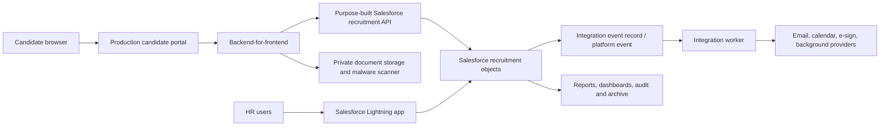

# Recruitment System — Product Requirements Document

| Field | Value |
| --- | --- |
| Status | Draft v2.2 — deep recruitment and onboarding journey wireframe contract |
| Last updated | August 28, 2026 |
| Product owner | Aditya Singh |
| Initial market | San Francisco–based employer hiring in the United States |
| Primary timezone | America/Los_Angeles |
| Currency | USD |
| Prototype deployment | [Public GitHub Pages wireframe](https://singhaditya21.github.io/Recruitment-System/) using synthetic data only; the local v2.2 release candidate is not the deployed release until section 22.20 records the exact Pages commit and successful workflow |
| Pilot/production candidate deployment | Approved external application host and backend-for-frontend; providers TBD |
| Pilot/production HR deployment | Native Salesforce Lightning application |
| Operational system of record | Salesforce custom recruitment application |
| Implementation state | React/TypeScript/Vite synthetic prototype inherits the v1.9 canonical recruitment model, v2.0 lifecycle extension and v2.1 object coverage, then adds v2.2 depth: 32 screen contracts, 71 declared routes/69 functional destinations, 138 families/552 List-New-Detail-Edit pages, candidate saved jobs/alerts/events/checks, 32 regulated screening cases, eight high-volume programs, 12 locale variants, 24 recovery scenarios and distinct manager/IT/agency portals; every action remains browser-memory-only and no production service or physical schema exists |
| Pilot contract state | Proposed control envelope in section 7.6; employer, legal, provider, Salesforce, and named-owner decisions remain unapproved until their `OD-##` records close |
| Full-audit state | [v2.2 deep-journey audit](AUDIT-v2.2.md) reconciles the expanded wireframe; prior controlled findings remain formally Open until accountable dated review, and the platform control center explicitly retains every production gate |
| v2.2 change boundary | Public-safe journey-depth release: candidate relationship/check flows, regulated cases, high-volume/campus operations, localization, recovery and manager/IT/agency portals may change; no deployable Salesforce metadata, production backend, authentication, provider write, real candidate/employee data, legal approval or pilot authorization is created |

## 1. Executive summary

Recruitment System is an end-to-end recruitment and onboarding platform for a San Francisco–based company. It gives HR and hiring teams one structured place to build talent relationships, create and distribute jobs, collect applications, screen candidates, run assessments, schedule interviews, capture evidence-based feedback, make decisions, issue offers, transition accepted candidates into pre-hires, orchestrate onboarding and provisioning, and retain a complete audit trail. Candidates get a clear, accessible experience from job discovery through application status, interview self-service and version-bound offer response; accepted candidates get a separate purpose-limited new-hire experience from preboarding through orientation and the first 90 days.

The first release is a single-company product, not a multi-tenant SaaS platform. It should feel modern, calm, inclusive, and trustworthy. The system must reduce hiring coordination work without turning consequential hiring decisions over to opaque automation.

The product bet is narrower than “build another ATS.” Recruitment System is a Salesforce-centered system of accountable hiring work for an employer that needs one reliable opening-to-hire record, structured human evidence, explicit ownership and a candidate experience that does not conceal uncertainty. Its value must be proven through reduced coordination effort, higher governed-work adoption, complete hiring evidence and safer candidate commitments—not through screen count, automation volume or feature parity.

Development starts with a public GitHub Pages prototype containing synthetic demonstration data and no functioning collection of candidate information. Before a pilot handles real identities, applications, resumes, evaluations, or offers, the frontend must move to an approved production application host. GitHub Pages remains a project showcase and deployment preview, not the production recruitment system.

For pilot and production, Salesforce is the operational recruitment system of record and workflow engine. Internal HR users work in a native Salesforce Lightning application. Candidates use an externally hosted React portal whose backend-for-frontend exposes only purpose-built recruitment operations to Salesforce. Candidate documents remain in approved private object storage and Salesforce stores controlled metadata and references.

### 1.1 Key architecture decisions

- Separate prototype, pilot, and production release definitions.
- Restrict GitHub Pages to public, synthetic-data demonstrations.
- Define a smaller P0 pilot workflow and move enhancements into P1/P2.
- Add default permission and decision-right matrices.
- Add candidate, workflow, and integration exception handling.
- Add background-check/adverse-action, privacy-request, and data-lifecycle requirements.
- Add job-search discovery, production operations, ownership, and rollout requirements.
- Use Salesforce custom objects for recruitment records; do not repurpose Leads or Opportunities.
- Use `Candidate__c` as the candidate identity record; do not enable Person Accounts solely for this product.
- Use native Lightning Web Components and Salesforce Flow/Apex for the internal HR workspace.
- Keep candidate authentication outside Salesforce in the default architecture; Experience Cloud is an evaluated alternative, not the baseline.
- Store resume/offer/reference binaries outside Salesforce unless a later security, capacity, and licensing decision explicitly approves Salesforce Files.
- Manage Salesforce metadata through Salesforce DX, an unlocked-package/source-driven model, automated validation, and reviewed Git commits.
- Model approved headcount as individual openings; accepting an offer reserves but does not fill an opening.
- Treat `Application__c` as the candidate–requisition junction, with a formal ERD, cardinalities, uniqueness rules, and immutable application attempts.
- Use governed Salesforce work items for required recruiting actions; standard Tasks/Events are projections or ordinary personal work, not the sole business ledger.
- Separate the candidate identity from every job-specific application, and separate configurable display stages from stable reporting milestones and candidate-safe statuses.
- Derive decision readiness and role work from authoritative facts instead of maintaining independent dashboard flags that can become stale.
- Run stage-triggered coordination through versioned automation rules and durable execution records with simulation, idempotency, cancellation, retry, suppression, and replay behavior.
- Freeze P0 to the approved controlled-pilot catalogue; a new P0 capability requires an explicit trade, affected requirement IDs, owner, risk impact, and revised exit evidence.
- Define target-employer fit, ordered product principles and candidate rights before feature, schedule or ROI trade-offs are accepted.
- Require an approved current-state baseline, falsifiable hypotheses and precommitted pilot outcomes; no post-hoc success criteria or unsupported savings claim.
- Ramp live exposure by approved jobs and evidence, measure governed adoption/off-system work, and require a named outcome at each boundary.
- Treat expansion, provider replacement, portability and system retirement as governed product lifecycles with candidate continuity and residual ownership.
- Treat the PRD as the product contract and keep physical schemas, APIs, UX specifications, security models, test catalogues, and runbooks as versioned companion artifacts referenced by stable IDs.
- Separate offer acceptance, post-offer contingencies, ready-for-hire, handoff, and completed-hire states.
- Never mutate a candidate into an employee. Create linked `PreHire`, `PendingWorker` and `EmployeeConversion` records with explicit lineage, reconciliation and cancellation.
- Pin every onboarding plan to an approved template version; assign independently owned, dependency-aware tasks to the new hire, People Ops, manager, IT and facilities.
- Keep the new-hire identity audience, session, fields and portal separate from candidate and workforce identity; expire it at validated employee conversion.
- Treat CRM outreach, campaign membership and talent-community membership as purpose- and consent-scoped relationships with suppression immediately before delivery.
- Treat job distribution as a posting-version-to-channel delivery ledger; provider publication is never canonical posting truth without reconciliation.
- Protect internal-mobility confidentiality with explicit visibility and manager-notification milestones.
- Evaluate versioned jurisdiction rules at posting and regulated-action time; preserve the applied policy snapshot.
- Disable interview recording/transcription and automated candidate decision support by default; either capability requires a separately approved control package.
- Use Salesforce External Client Apps for new OAuth integrations; Connected Apps are legacy-only unless an approved exception applies.

### 1.2 v0.9 implementation snapshot

v0.9 implements the synthetic portion of `WP-01/02` as a public-safe React/TypeScript/Vite prototype. It includes all 12 `UI-*` routes, all 12 `SCN-*` scenarios, deterministic fictional fixtures, machine-readable `ART-001/003/004/005/007/010/014/015/016/021` companions, 9 unit/component/automated-accessibility tests, 6 desktop/mobile browser smoke checks, and CI/Pages workflow definitions.

The [v0.9 audit](AUDIT-v0.9.md) records exactly what passed and what remains. The implemented surface has no authentication, upload, network request, browser persistence or production endpoint; all actions are memory-only simulations and all jobs/people are fictional. Automated test success does not substitute for content approval, moderated usability, manual assistive-technology assurance, production security review, Salesforce/BFF implementation or legal/policy decisions.

### 1.3 v1.2 executive decision brief

This brief is a review entrypoint, not a substitute for the numbered contract. Approval occurs through section 21 decisions/ballots and section 22 acceptance.

| Executive question | Proposed v1.2 answer | Decision/evidence still required |
| --- | --- | --- |
| What are we building? | A single-employer, Salesforce-centered system of accountable recruitment work from approved opening through reconciled hire handoff, with an external candidate portal and native Lightning HR operation | Employer/process fit under `BAL-001/008/009/012`; named employer and operating facts |
| What is the differentiated product bet? | Make required work, human evidence, headcount truth and candidate commitments more reliable and easier than fragmented email/spreadsheets—without opaque candidate ranking or enterprise-suite breadth | `HYP-*`, `BAS-*`, `MET-*` and `ART-022` evidence |
| What is P0? | California-work-location, English/US, external regular-employee roles; 5 open requisitions, 10 openings, 1,000 applications, 25 internal users maximum; transactional email and manual scheduling/handoffs inside the fixed `PIL-*` contract | All blocker ballots, actual job cohort, policies/providers/support and `RMP-*` entry evidence |
| What is explicitly prohibited? | Autonomous or hidden ranking/advancement/rejection/selection, interview recording/transcription, inferred personality/emotion/biometrics, uncontrolled bulk decisions, silent provider truth, public real-candidate hosting and cross-tenant data | Configuration/provider proof, negative tests, kill switches and accountable control approval |
| What must remain human? | Hiring criteria approval, evidence interpretation, advancement/rejection, disposition, offer/waiver/exception, contingency readiness and final hire responsibility | `HDA-*`, permission/approval policy, human attribution and sampling evidence |
| What must be configurable? | Only approved versioned content, job plans, bounded stages/mappings, rubrics, queues/calendars and finite rules inside the `CFG-*` authority model | Named configuration/reviewer roles, physical catalog and release evidence |
| How will value be judged? | Governed adoption, reduced active coordination/scheduling effort, complete evidence, candidate clarity/support, safe operation and a conservative ≥1.5× recurring benefit-to-cost with ≤24-month modeled payback | Employer baseline, finance assumptions and comparable pilot evidence; economics cannot offset failed rights/guardrails |
| How will exposure grow? | Synthetic rehearsal → nonproduction qualification → one-job limited live cohort → measured multi-job cohort → full bounded pilot; each boundary ends in one `OUT-*` decision | Approved `ART-002/022/023`, role qualification, launch gates and prior-ramp evidence |
| What exists now? | The v2.1 synthetic React full-lifecycle wireframe, inherited v1.9 canonical recruitment model/runtime, 46-object lifecycle extension, current PRD/matrices/artifacts, local automated evidence and GitHub Pages deployment workflow | Accountable physical-schema approval and every production Salesforce/BFF/IdP/provider layer remain unproven |
| What does this PRD approval authorize? | Agreement on the product contract and recorded decisions only | It does not authorize development, procurement, real candidate data, production deployment or pilot launch without their independent gates |

Executive decision requested:

1. Accept, amend, narrow or reject the product fit, P0 envelope and principle/right boundaries.
2. Assign accountable owners and dates for all 18 ballots and `ART-022`–`027`.
3. Approve the configuration/waiver/human-assurance/research/product-debt controls before implementation choices can fill gaps implicitly.
4. Select one permitted next maturity movement: complete prototype acceptance and Phase 0 decisions. No broader build or live-pilot authority is requested by v1.2.

### 1.4 v1.3 wireframe implementation brief

v1.3 executes the public synthetic wireframe authority granted after v1.2. It does not implement the production Salesforce org. The internal experience is a React rendering of the agreed Lightning interaction model so product, recruiting, design, architecture, privacy and operations reviewers can inspect the same seeded journeys on GitHub Pages before Salesforce metadata, licenses or integrations are committed.

| Question | v1.3 implemented answer | Boundary that remains unchanged |
| --- | --- | --- |
| What changed visually? | Internal routes now use a Lightning-recognizable global header, app launcher, app navigation, object iconography, record highlights panel, compact actions, card/list/table composition, utility bar and responsive mobile menu | No Salesforce logo, proprietary org asset, Lightning component runtime, metadata, Salesforce URL or API is used |
| What stayed separate? | The candidate careers, job detail, guided application and candidate hub retain the employer-branded external experience | Candidate routes do not masquerade as an internal Salesforce org and remain public-safe/memory-only |
| Which screen contracts are represented? | All 4 candidate and all 8 HR `UI-*` families remain routed; the implementation does not add a thirteenth family | Tabs, tables, modals, role views, empty/error/success states and mobile compositions do not inflate the canonical 12-family count |
| Which users can reviewers inspect? | One candidate fixture plus 12 switchable internal persona fixtures aligned to section 15.11 | The switcher demonstrates context; it is not authentication, sharing, permission-set enforcement or proof of negative access |
| Is every operating end populated? | Jobs, applications, queues, candidates, interview sessions, scorecards, decisions, offers, opening reservation, handoff, communications, automation runs, provider status, policy cases, privacy requests and audit events have deterministic synthetic examples | A deliberately blocked, failed, suppressed or restricted state is still populated evidence; no fixture may be mistaken for a live record |
| What can actions do? | Filters, scenario switching, persona switching, modal previews, simulated transitions, rescheduling, scorecard submission, automation simulation/pause and governance tabs operate in browser memory | Refresh resets state; there is no storage, upload, identity, email, calendar, HRIS, analytics or other external write |
| What does this validate? | Product composition, navigation, information hierarchy, data-density, seeded journey continuity, responsive behavior and governed state explanations | It does not validate Salesforce technical feasibility, production content, real permissions, provider behavior, legal conclusions, user desirability or pilot readiness |

The visual implementation follows the Lightning page grammar because the production HR workspace remains native Salesforce. The prototype must nevertheless use recruitment-domain language and must display “synthetic wireframe” and “not a Salesforce org” boundaries. “Replica” in this release means high-fidelity visual and interaction composition, not copying Salesforce source code, trademarks, tenant chrome, record IDs, metadata or customer data.

### 1.5 v1.4 semantic operating brief

v1.4 changes the wireframe from a set of individually plausible screens into a coherent operating model. It does not expand the product beyond the 12 contracted screen families and does not authorize production development. Its primary acceptance question is whether a reviewer can follow one synthetic hiring fact through every relevant candidate and internal projection without contradiction.

| Product question | v1.4 implemented contract | Acceptance evidence |
| --- | --- | --- |
| What is the source of demo truth? | A canonical `ScenarioState` owns candidate-safe status, application stage, missing scorecard count, interview state, decision/offer/handoff states, opening reservation/fill counts and the policy gate | Changing `SCN-005`, `SCN-007` or `SCN-012` updates all affected routes from the same snapshot; derived views cannot carry independent conflicting flags |
| Do record URLs identify real fixtures? | Job, application, interview, scorecard-assignment and decision routes resolve their path identifier against a seeded registry; collection routes present list views within the same canonical screen family | `APP-DEMO-004` renders Noah Williams rather than the Maya default; list-to-record navigation preserves the selected identifier |
| Does persona switching change work? | Persona context persists across route navigation and changes visible navigation, action queue, metrics, focus statement and least-privilege denial behavior | Interviewer, coordinator, approver, privacy, configuration, HRIS and auditor views expose different bounded work; direct access outside scope fails safely |
| Are controls honest? | Search returns route-bound fixtures; launcher/help/setup/notification affordances open bounded previews; primary work rows navigate to their authoritative record; utilities explain their simulated result; unavailable production actions are disabled or explicitly preview-only | No visible control silently implies an email, calendar, HRIS, Salesforce, file or configuration write |
| Can blocked work recover? | The application transition preview links to the missing assignment and offers reminder/waiver simulations; scorecard submission recalculates readiness across the action center, assignment list and application record | Completing `ASN-DEMO-001` removes the overdue action and moves `APP-DEMO-001` from Interviews to Debrief in memory |
| Is candidate context safe and useful? | Candidate scenario labels contain no internal edge-case or evaluation language; the hub provides application detail, process timeline, latest safe update, next action, availability preview and confirmed withdrawal recovery | Candidate copy never exposes scorecard ratings, decision reasons, internal stage names, other candidates or employee-only owners |
| Is dense content usable beyond desktop? | Mobile list/table rows become labeled record cards, the utility bar no longer overlays content, focus indication is visible, minimum supporting text is raised and automated color contrast is enabled | 390 px browser checks show no page-level horizontal overflow and automated axe checks include `color-contrast` |

The semantic graph is deliberately bounded but complete across all 12 inherited scenario identifiers. `SCN-001/002/003` project golden-path, human-close and withdrawal outcomes without creating an offer or hire accidentally. `SCN-004` demonstrates a candidate-safe availability request while the internal interview record owns the scheduling conflict. `SCN-005` is the default evidence-blocked state: Maya’s interview is complete, one scorecard is missing, Debrief/decision are blocked, no offer exists and no opening is reserved. `SCN-006` exposes a revised-offer review without treating the superseded version as current. `SCN-007` is the accepted-offer/handoff-failure state: evidence is complete, the offer is accepted, one opening is reserved, handoff reconciliation failed and Hired remains false. `SCN-008/009/010` keep possible-duplicate, message-delivery and out-of-order-event blockers internal while showing safe active-process copy to the candidate. `SCN-011` demonstrates access boundaries without changing candidate truth. `SCN-012` is the unknown-policy state: publication and downstream regulated action remain blocked and the candidate receives only a safe “details under review” projection.

### 1.6 v1.7 remediation brief

v1.7 turns the earlier matrix and audit into an executable wireframe contract while preserving every production gate. The authoritative count ledger is [MATRIX-v1.7.md](MATRIX-v1.7.md).

| Audit question | v1.7 implemented answer | Boundary still open |
| --- | --- | --- |
| Do all objects have actual pages? | All 92 families resolve through role-checked List, New, Detail and Edit templates, creating 368 routed page instances with validation, version, history, relationship, command, empty/not-found/denied states and 276 seeded records | Production page composition, Salesforce metadata, sharing/FLS and persistence are unproved |
| Is 920 the full dictionary? | No. The 920 value is explicitly retained as ten shared governance/provenance fields per family; six domain-specific business fields per family add 552 contracts for 1,472 total | The approved physical field dictionary, API names, lengths, encryption, indexes and migration mapping remain open |
| Do personas control data, not only navigation? | Twelve internal roles have declared populations plus identity, contact, decision-evidence, compensation, accommodation, privacy, integrity and export scopes; core records and generic pages apply row and field decisions | Server-side authorization, IdP claims, Salesforce OWD/sharing/FLS and negative integration evidence remain open |
| Are filters and denominators trustworthy? | A complete 324-row cross-product fixture populates all 600 supported date/job/source/stage combinations; zero-eligible rates render N/A; numerator, denominator and availability are contract-tested | Employer data, final targets, validation queries, late data and production restatement remain open |
| Does Data Readiness reconcile? | It has its own object-domain/lifecycle filters and one filtered object population for cards, charts and detail; it no longer mixes application filters with catalog KPIs | Approved physical metadata readiness and org validation remain open |
| Is reporting actionable? | Six saved reports, a governed builder, drill-through, schedule preview, delivery/revocation audit, controlled aggregate export, targets and restatements are seeded | Production report engine, recipient identity, distribution, storage and approval remain open |
| Are architecture/security/operations specified? | Proposed OpenAPI, AsyncAPI, logical Salesforce map, ADR, threat model, privacy flows, SLO/observability, incident, cutover/rollback/restore and pilot evidence plans exist | These are review scaffolds, not deployed or exercised evidence |
| Is repository governance adequate? | `main` is protected with strict `verify`/`codeql` checks, CODEOWNER review, admin enforcement, linear history, conversation resolution and force-push/deletion prevention; Dependabot, dependency review, CodeQL, secret scanning/push protection, security updates, a security policy and PR checklist are enabled | Controls must remain maintained and their alerts/upgrade PRs require accountable review |

The v1.7 definition of “fixed” is deliberately layered: a synthetic product/contract defect may be implemented and tested while the corresponding production finding remains Open until the accountable reviewer accepts dated evidence from the selected org, services, providers and pilot environment.

### 1.7 v1.8 dense-data and core-form brief

v1.8 closes the wireframe-level ambiguity around “New job,” “New candidate” and “New application” while preserving the production and privacy boundaries. The authoritative count and creation ledger is [MATRIX-v1.8.md](MATRIX-v1.8.md).

| Product question | v1.8 implemented answer | Boundary still open |
| --- | --- | --- |
| Is the dataset heavy enough to exercise collections? | The deterministic core registry contains 48 jobs, 320 candidates, 640 applications, 192 interviews and 160 scorecard assignments; the 92-family workspace contains 12 records per family (1,104), for 2,464 core-plus-generic records | Pilot volumes, production data distribution, seasonality, skew, migration quality and load/performance evidence remain unproved |
| Where is New Job? | `#/hr/jobs/new` is a recruiter/hiring-manager form with title/team/location/type/pay/owner/content validation; every created job starts as Draft and publication remains a separate governed action | Requisition approval, headcount integration, policy evaluation, Salesforce transaction and public projection are not implemented |
| Where is New Candidate? | `#/hr/candidates/new` creates a candidate identity with source, notice evidence, contact, timezone, state and owner; it rejects non-`example.test` email domains and duplicate synthetic email | Production identity proofing, consent/notice content, duplicate resolution, import authorization, retention and privacy execution remain open |
| Does creating a candidate create an application? | No. Candidate identity is independent. The candidate detail explains the boundary and offers an explicit application action only to an authorized recruiter | Production relationship integrity, ownership and server-side authorization remain open |
| Where is New Application? | `#/hr/applications/new` creates one explicit candidate–job junction after both references exist and rejects an active duplicate pair | Production immutable-attempt rules, transaction concurrency, candidate communication and Salesforce uniqueness enforcement remain open |
| Why are there no standalone New Interview/Scorecard/Offer forms? | The relevant list states its creation source: interviews follow validated scheduling requests; assignments follow approved interview plans; decisions/offers/handoffs follow readiness and approval gates | Those workflows remain synthetic previews; their durable events, failures, retries, provider behavior and audit records are not implemented |
| Can users find records in a large seed? | Core lists expose role-scoped total, search, state filter, 20-row pagination, deterministic empty recovery and route-bound detail; public careers includes Published jobs only | Server pagination/query plans, search indexing, saved list preferences, export controls and production performance remain open |
| Do forms enforce persona rules? | Recruiter can create/edit job, candidate and application; Hiring Manager can create/edit job; Recruiting Coordinator may edit application logistics; all other mutations deny safely in the route | The persona switcher is not authentication and cannot prove IdP, sharing, FLS, Apex/BFF or integration authorization |

The dense fixture is generated at runtime from compact deterministic rules. “Heavy” means enough related rows to exercise search, filtering, pagination, role populations and referential-integrity tests without shipping real or realistic personal data. It does not claim production-scale load testing.

### 1.8 v1.9 canonical data-model brief

v1.9 closes the logical/runtime gaps identified after the 92-object audit without pretending that a Salesforce org has been designed or deployed. The authoritative ledgers are [DATA-MODEL-v1.9.md](DATA-MODEL-v1.9.md) and [MATRIX-v1.9.md](MATRIX-v1.9.md).

| Data-model question | v1.9 implemented answer | Boundary still open |
| --- | --- | --- |
| Are slash-combined objects one record? | No. All 111 inherited concepts receive independent grains and kinds; 18 missing supporting concepts add submission/stage evidence, hiring-team/access grants, identity review, restricted HR/background/adverse, retention, quality and migration control | Accountable review may consolidate an atomic concept into metadata, an embedded value, an external store or another physical construct |
| Is the 1,472-field family dictionary the production dictionary? | No. The authoritative atomic dictionary now contains 2,350 contracts: 673 object-specific business fields and 1,677 shared governance/provenance fields across 129 concepts | Salesforce field types/lengths, standard-versus-custom selection, encryption, indexes and migration mappings remain proposed |
| Are relationships enforceable in the model? | 173 `REL-*` contracts define source/field/target, cardinality, required status, deletion, ownership, time and invariant; 15 `INV-DM-*` rules define application/offer/opening/hire/scorecard/identity/access/audit/analytics truth | Database/Salesforce constraints, transaction services, concurrency/load proof and org-specific delete behavior are not implemented |
| Is lifecycle a list of labels? | No. 675 `DTR-*` contracts carry source/destination, command, permission, guard, reason, side effects, safe communication, event, idempotency and recovery | Production transition services, Flow/Apex/BFF implementation and provider side effects remain absent |
| Is runtime data canonical? | Core browser state normalizes requisition/posting, candidate/identifier/consent, application/stage event/work item and session/assignment records; UI names, titles, relative ages and next-action strings are projections | Memory reset remains deliberate; there is no database, server transaction or durable event ledger |
| Do dashboards use separate business rows? | No. The 324 contract-complete rows now point to canonical Application, ApplicationStageEvent and aggregate version; analytical contracts define late arrival, restatement and security | Production ETL/semantic-layer queries, employer data and reconciliation monitoring remain absent |
| Is row access random fixture sampling? | No. Generic rows carry organization, owner, user/role assignment, purposes, effective window and restricted entitlements; wrong-organization and expired access deny | Browser evaluation is not authentication, Salesforce sharing/FLS, BFF authorization or security evidence |
| Is the physical object count now known? | No. Every concept has a proposed target/API name for review, but the approved count is zero and the model explicitly separates navigation, atomic and physical counts | `OD-16/20/21`, `ART-003/006/008/010/018`, org/edition/capacity and accountable architecture review remain required |

### 1.9 v2.0 full recruitment and onboarding brief

v2.0 extends the complete recruitment wireframe through talent relationship management, accepted-candidate transition, onboarding and production-control design. [MATRIX-v2.0.md](MATRIX-v2.0.md) is the authoritative route/persona/object/seed ledger, [DATA-MODEL-v2.0.md](DATA-MODEL-v2.0.md) is the lifecycle extension contract and [AUDIT-v2.0.md](AUDIT-v2.0.md) records what is complete versus still production-blocking.

| Lifecycle question | v2.0 wireframe answer | Boundary that remains open |
| --- | --- | --- |
| What happens after offer acceptance? | An accepted application creates a linked `PreHire`; HRIS staging creates a separate `PendingWorker`; a validated, idempotent conversion later links an employee. Candidate, pre-hire, pending-worker and employee identities never collapse into one mutable record | Real HRIS schema, matching, correction, cancellation, legal-name and destination-worker rules require accountable approval and provider testing |
| How is onboarding configured? | Eight synthetic templates demonstrate stable identity plus immutable versions, population rules, five stages, task definitions, owner selectors, relative dates, dependencies, evidence and assignment simulation | Template approval, migration of active plans, jurisdiction content and owner/service catalogues require production configuration governance |
| What can a new hire do? | Seven new-hire screens cover home, task list, form/signature task detail, documents, personal-information correction, day-one agenda and private help. Completion updates shared browser memory and never exposes internal evaluation | Production identity, secure form/document storage, e-sign provider, accessibility/usability evidence and legally approved content do not exist |
| How are documents and restricted values handled? | Version, checksum/evidence, type, due date and retention are visible; restricted form values are separated from manager/operations completion state; the prototype stores no submitted value across refresh | Encryption, key ownership, malware scanning, signed URLs, provider receipts, deletion and legal retention execution require implementation and approval |
| Who owns downstream readiness? | A provisioning board models 72 manager/IT/facilities requests; an exception register models 18 owned blockers with severity, SLA, safe impact, next action and evidence-based resolution; progress analytics reconciles to 36 seeded new hires | ITSM/IGA/facilities connections, real entitlements/assets, escalation SLOs and on-call ownership remain unimplemented |
| What expands recruitment before application? | Talent CRM models 120 prospects, eight communities and six campaigns with authority/suppression; distribution models 24 posting-channel deliveries; internal mobility models eight roles/gigs/projects/mentorships with visibility and manager-notification policy | Real sourcing/provider terms, contact authority, communication delivery, employee profile data, mobility policy and works-council/legal approvals remain open |
| What is the new logical model? | A 46-object extension defines 28 onboarding, seven talent-relationship, three internal-mobility and eight platform-control objects, each with explicit grain, parent, proposed system of record, four key data points and four-or-more lifecycle states | The extension is logical only. The combined 175 logical concepts are not an approved Salesforce/database schema; approved physical-object count remains zero |
| What production design is visible? | Platform controls show four identity boundaries, six integration contracts, four proposed data stores, server-side authorization layers and six security/operations evidence gates | No IdP, BFF, API gateway, service, datastore, credential, SLO, observability, backup, incident exercise, cutover or rollback evidence exists |
| How are persona restrictions represented? | Navigation gates 12 internal roles; hiring-manager new-hire rows are relationship-scoped; prospect identities are minimized for privacy/audit views; mutating actions are disabled for read-only or non-owning roles | Browser rendering is not security. Every object/row/field/purpose denial must be reimplemented and proven server-side |

v2.0 changes the product description from “complete ATS wireframe” to “full recruitment and onboarding wireframe.” It does not earn the description “production recruitment and onboarding platform” until the production gates in sections 7, 20 and 22.15 are closed with deployed evidence.

### 1.10 v2.1 surface-completeness brief

v2.1 converts the v2.0 lifecycle design into broader inspectable work. It does not add a database, API, authentication or production integration. [MATRIX-v2.1.md](MATRIX-v2.1.md) is the current surface/persona/object/seed ledger and [AUDIT-v2.1.md](AUDIT-v2.1.md) distinguishes first-class journeys from metadata-driven page coverage and production readiness.

| Full-platform question | v2.1 wireframe answer | Remaining boundary |
| --- | --- | --- |
| Can every declared object be inspected and edited? | Yes. All 92 core plus 46 lifecycle object families resolve through role-aware List, New, Detail and Edit contracts: 138 families, 552 page instances, 1,656 seeded rows and 2,208 workspace fields | Complex operational families still require bespoke workflow UX before a reviewer should treat generic page coverage as journey completeness |
| Does candidate self-service stop at application status? | No. The candidate hub adds interview confirmation/reschedule/accommodation flows and version-bound offer review, accept/decline confirmation and a synthetic receipt | Saved jobs, job alerts, event registration, referral submission and deeper assessment/background-check self-service remain later wireframe work |
| Is onboarding just a task list? | No. Eight lifecycle programs cover new hire, manager addendum, rehire, crossboarding, contingent worker, internship, relocation and offboarding. Compliance cases, orientation sessions, 30/60/90 check-ins and an eight-milestone new-hire journey make the experience continuous through day 90 | Country-specific variants, substantive learning content and deeper crossboarding/offboarding persona experiences remain incomplete |
| Are attraction channels represented? | Career events, referrals and agency partners now have operational views alongside communities, campaigns, distribution and internal mobility | Registration, referral reward, agency submission/ownership and high-volume/campus flows remain preview-level |
| Are data and permission claims precise? | Each family exposes six business plus ten governance/provenance fields; roles carry declared population, row and data-group scope; compliance and referral views demonstrate masking and action denial | Browser enforcement is illustrative only; field dictionary depth varies and production authorization requires IdP, BFF and Salesforce evidence |
| Is this a production application? | No. Every action and record remains synthetic and browser-memory-only, and the approved physical-object count remains zero | Production architecture, security, legal, integration, accessibility, operations and pilot gates remain blocking |

The competitive design basis is current first-party product material: [Greenhouse structured interviewing and candidate self-scheduling](https://www.greenhouse.com/interviewing-decision-making), [Workday talent acquisition and candidate engagement](https://www.workday.com/en-us/products/talent-management/talent-acquisition.html), [Workday personalized preboarding](https://doc.workday.com/admin-guide/en-us/human-capital-management/recruiting/onboarding-experience/concept--preboarding-and-onboarding.html?toc=3.14.7), [SAP SuccessFactors onboarding journeys and 30/60/90 plans](https://www.sap.com/products/hcm/employee-onboarding/features.html) and [Rippling attribute-driven lifecycle workflows](https://www.rippling.com/en-GB/platform/workflows). Those references guide capability coverage; they do not authorize copying proprietary interfaces or claims.

### 1.11 v2.2 deep-journey brief

v2.2 converts the highest-priority v2.1 depth gaps into first-class wireframe journeys while preserving all production gates. [MATRIX-v2.2.md](MATRIX-v2.2.md) is the current route/persona/data/flow ledger and [AUDIT-v2.2.md](AUDIT-v2.2.md) records what remains.

| Depth question | v2.2 wireframe answer | Boundary retained |
| --- | --- | --- |
| Can candidates manage relationships before applying? | Saved jobs, alerts and event registration/waitlist/cancellation have explicit criteria, cadence, locale, capacity, notice and authority semantics; none creates an application implicitly | No persistent candidate account, SMS/email delivery or provider event exists |
| Can candidates understand assessments and checks? | A candidate task center covers assessment, references, background notice/support and pre-adverse correction/dispute, including expired-link replacement and provider-safe status | Internal scores/reports remain hidden; provider and legal workflow execution are absent |
| Are regulated cases bespoke? | Thirty-two assessment/reference/background/adverse-action cases have queue/detail views, jurisdiction, notice, consent, version, owner, human-review and redress guardrails | The content is synthetic and not legal advice or an approved adverse-action process |
| Does the product support volume and campus? | Eight evergreen/campus/hiring-event/seasonal campaigns expose linked jobs, capacity, deterministic eligibility, bounded bulk invitations, exceptions and human-decision limits | No bulk message/provider effect or autonomous ranking/decision exists |
| Are locales more than a dropdown? | Twelve country/language/worker-type variants bind notice/form/pay/signature packs and review state; incomplete variants remain visibly blocked | Packs are demonstrations, not legally approved localized content |
| Are failures recoverable? | Twenty-four scenarios cover expiry, cancellation, duplicates, stale versions, validation/provider failure, capacity and permission change with safe state, owner, retry/reconcile and idempotency evidence | No external effect or durable replay ledger exists |
| Are downstream users distinct? | Separate manager, IT and agency portal shells enforce seeded relationship/function/partner scope, including direct-URL denial | These are persona simulations, not authentication or server authorization |

v2.2 increases the executable contract to 32 screens and 71 declared routes/69 functional destinations. The 138 object families, 552 generated object pages, 1,656 generated object rows, 2,208 workspace fields, 175 canonical-plus-lifecycle concepts and zero approved physical objects remain unchanged.

## 2. Problem statement

Recruiting data is often fragmented across email, spreadsheets, calendars, shared drives, messaging tools, and interviewer notes. This causes:

- Slow requisition and offer approvals.
- Inconsistent candidate screening and interview evaluation.
- Duplicate or stale candidate records.
- Missed interviews, feedback, and follow-ups.
- Poor visibility into pipeline health and hiring bottlenecks.
- Candidate communications that are late or inconsistent.
- Sensitive hiring information being shared too broadly.
- Weak auditability and avoidable compliance risk.

## 3. Product vision

Enable a hiring team to run a fair, structured, human-led recruitment process from approved headcount through a reconciled hire handoff, while giving every candidate timely information, control over their data, and a respectful experience.

### 3.1 Operating assumptions requiring validation

The system will be designed against the following working assumptions. They are product defaults, not legal conclusions. The product owner must replace every `Unconfirmed` entry before a real-candidate pilot.

| Assumption | Working position | Validation state |
| --- | --- | --- |
| Employer model | One private-sector employer headquartered in San Francisco | Unconfirmed |
| Employer legal name and address | Not yet supplied | Unconfirmed |
| Employee count | Unknown; product applies conservative California safeguards regardless of threshold | Unconfirmed |
| Initial hiring jurisdictions | California roles plus U.S. applicants for authorized remote roles | Unconfirmed |
| Hiring volume | Design for up to 100 open jobs and 100 hires per year initially | Unconfirmed |
| Worker types | Regular full-time and part-time employees first | Unconfirmed |
| Internal applicants | Supported after the external-candidate pilot | Unconfirmed |
| Staffing agencies | Controlled agency access is post-pilot | Unconfirmed |
| Federal-contractor status | Treat as not established; OFCCP requirements require separate review if applicable | Unconfirmed |
| Background checks | Manual controlled handoff in pilot; provider integration later | Unconfirmed |
| E-signature | Secure recorded acceptance in pilot; provider integration later | Unconfirmed |
| Salesforce org | Dedicated recruitment org preferred; an existing company org requires an impact assessment | Unconfirmed |
| Salesforce edition | Enterprise, Performance, or Unlimited target; exact edition and entitlements not supplied | Unconfirmed |
| Salesforce licenses | Internal, integration, Shield, storage, masking, and analytics quantities not supplied | Unconfirmed |
| California privacy applicability | Employer revenue, California personal-information volume, sale/share practices, and other CCPA threshold facts not supplied | Unconfirmed |
| Automated decision systems | No ranking, matching, scoring, knockout, resume screening, voice/facial analysis, or provider recommendation may affect a candidate unless separately inventoried and approved | Confirmed product principle |
| Interview recording/transcription | Disabled for pilot and v1 unless counsel, privacy, security, accessibility, consent, storage, and retention controls are separately approved | Confirmed product principle |
| Candidate portal identity | External identity provider and backend-for-frontend; no Salesforce external user by default | Confirmed architecture assumption |
| HR workspace | Native Salesforce Lightning application | Confirmed architecture assumption |
| Candidate system of record | Custom `Candidate__c`; no Lead/Contact/Person Account as canonical candidate record | Confirmed architecture assumption |
| Document storage | External private object storage with signed URLs and malware scanning | Confirmed architecture assumption |
| Languages | English/US first | Confirmed product assumption |
| Hiring decisions | Human-owned; no autonomous ranking, rejection, advancement, or selection | Confirmed product principle |

Changes to employer size, revenue/privacy thresholds, jurisdictions, federal-contractor status, industry, worker types, Salesforce org strategy, edition, licensing, material platform entitlements, automated-decision usage, or recording/transcription usage trigger a documented compliance, architecture, and scope review.

### 3.2 Competitive product benchmark

The product team reviewed publicly available first-party product and help documentation on August 24, 2026. The benchmark is a directional interaction and capability study, not a contractual feature comparison: competitor availability can vary by subscription, configuration, geography, integration, and release. Before using a competitor pattern, the team must validate that it improves this product's defined journeys and does not weaken its security, privacy, accessibility, or human-decision requirements.

| Product | Publicly documented experience pattern | Recruitment System response |
| --- | --- | --- |
| Greenhouse Recruiting | A scan-friendly candidate profile combines a persistent identity header, stage workspace, interviews, scorecards, offers, activity, notes, tasks, cross-job history, quick actions, and private-data mode. Greenhouse also documents passwordless reusable application information, candidate self-scheduling, and candidate-experience surveys. [Candidate profile](https://support.greenhouse.io/hc/en-us/articles/30352015432987-Candidate-profile-redesign-overview) · [Quick Apply](https://support.greenhouse.io/hc/en-us/articles/35746094035099-MyGreenhouse-Quick-Apply) · [Self-scheduling](https://support.greenhouse.io/hc/en-us/articles/4409534663579-Candidate-self-scheduling-overview) · [Candidate survey](https://support.greenhouse.io/hc/en-us/articles/360029861512-Candidate-survey-overview) | Make the application-specific workspace the primary HR operating surface; keep identity/context, current stage, evidence, work, communications, and decisions visible without excessive page changes. Provide progressive candidate identity, safe reuse of stable profile fields, self-scheduling in P1, and governed experience surveys. |
| Lever | A unified ATS/CRM emphasizes visual pipeline, structured scorecards, talent rediscovery, nurture campaigns, self-service scheduling, automated status loops, and stakeholder-specific dashboards. [LeverTRM](https://www.lever.co/lever-trm) | Keep the controlled ATS and headcount ledger in P0. Add consented CRM/talent-pool engagement, visual pipeline, self-scheduling, and stakeholder dashboards in P1; do not copy AI-ranked shortlists into P0/P1. |
| Ashby | A visual pipeline and opening-aware ATS connects job setup, structured interview plans, activity automation, interviewer briefing views, feedback blinding, mobile actions, scheduling, analytics, candidate surveys, and offer approvals. [ATS](https://www.ashbyhq.com/platform/recruiting/ats) · [Scheduling metrics](https://www.ashbyhq.com/product-updates/advanced-scheduling-metrics-to-analyze-efficiency-and-remove-bottlenecks) | Preserve the existing opening ledger, independent scorecards, governed work items, and analytics model. Add an action-oriented pipeline/list pair, concise interviewer briefing, candidate-experience measurement, and scheduling-efficiency metrics. Any fraud or AI signal remains a reviewable case, never an automatic disposition. |
| Workable | Branded mobile career pages, autofill, configurable pipelines and permissions, consolidated communication, self-service scheduling, multi-part interview coordination, offer approvals, and mobile recruiter actions are presented as one accessible operating flow. [Feature summary](https://www.workable.com/static/downloads/Workable-features.pdf) | Require a responsive, low-friction application and a consolidated communications/interview view. P1 adds candidate self-scheduling, calendar synchronization, and approved mobile quick actions without exposing restricted data. |
| Workday Recruiting | Candidate Home supports reusable application information, job alerts, profiles, and suggested jobs; Candidate Engagement adds branded landing pages, campaigns, events, and engagement analytics, while HCM integration supports internal mobility and downstream worker data. [Recruiting](https://www.workday.com/content/dam/web/en-us/documents/datasheets/datasheet-workday-recruiting.pdf) · [Candidate Engagement](https://doc.workday.com/admin-guide/en-us/workday-feature-descriptions/workday-talent-management/future--career-engagement.html) | Add a candidate application hub with reusable, candidate-controlled profile data and explicit drafts/tasks/status. Keep campaigns, talent communities, internal mobility, and skills-based recommendations in P1/P2 under consent and automated-decision review. |
| SAP SuccessFactors Recruiting | Its reimagined candidate experience documents an adaptive guided application, card-based My Applications hub for drafts/status/tasks, profile and account controls, and timezone-aware interview management. Career Site Builder, CRM, and source analytics extend the acquisition surface. [Candidate experience](https://help.sap.com/docs/successfactors-recruiting/setting-up-and-maintaining-sap-successfactors-recruiting/reimagined-candidate-experience) · [Interview scheduling](https://help.sap.com/docs/successfactors-recruiting/setting-up-and-maintaining-sap-successfactors-recruiting/interview-scheduling-candidate-view) | Make progressive disclosure, clear step count, save/resume, application cards, candidate tasks, privacy controls, and explicit timezone part of the P0 candidate experience. Add richer career-content management and candidate CRM only when P1 is approved. |
| SmartRecruiters | The platform presents an end-to-end activity-oriented recruiting workspace with applicant tracking, scheduling, offers, analytics, and integrations. Its public API documents a self-scheduling lifecycle with create/update/cancel operations and webhook events. [Platform](https://www.smartrecruiters.com/) · [Self-scheduling API](https://developers.smartrecruiters.com/docs/self-scheduling-api) | Use explicit activity and reconciliation records for scheduling and other integrations. P1 self-scheduling must support expiration, reschedule, cancellation, webhook replay, capacity, timezone, and manual fallback. AI matching/screening remains disabled until the separate P2 control package passes. |
| iCIMS | A candidate dashboard centralizes profile updates, current opportunities, in-progress applications, withdrawal, job alerts, communication subscriptions, and data-subject requests. Recruiter search combines candidate/job/workflow data with facets, saved searches, dashboard placement, and controlled bulk actions. [Candidate guide](https://community.icims.com/articles/HowTo/Candidate-Guide-to-the-iCIMS-Talent-Platform) · [Search and reporting](https://community.icims.com/articles/HowTo/Introduction-to-Searching-Reporting) | Provide a P0 candidate control center and P0 recruiter operational filters. P1 adds saved views, alert subscriptions, talent engagement, and broader low-risk bulk actions, all subject to purpose, preference, permission, and audit controls. |
| Oracle Recruiting | The product documents email/phone-first application, personalized career sites, mobile/SMS interaction, self-scheduling, a prioritized Recruiting Activity Center, CRM/talent communities, offers, analytics, and integrated onboarding. [Oracle Recruiting](https://www.oracle.com/human-capital-management/recruiting/) | Keep account creation progressive rather than a precondition to view jobs. Make the next action and due date central for candidates and HR. Evaluate SMS, campaigns, talent communities, and direct-apply partners in P1; keep AI recommendations outside P0/P1. |

The common visual model is not a generic CRM record page. It is a role-specific work surface:

- **Recruiter home:** prioritized work, pipeline health, exceptions, approvals, upcoming interviews, and service-level breaches.
- **Job workspace:** requisition/opening health, publishing state, hiring plan, pipeline, team, activity, and analytics.
- **Candidate/application workspace:** a persistent summary header, stage journey and primary action area, plus collapsible contextual details, evidence, notes, tasks, communication, related applications, and restricted-data indicators.
- **Interviewer workspace:** minimal briefing, job-related competencies/questions, logistics, and an independent scorecard with no unrelated candidate data.
- **Candidate hub:** cards for drafts and submitted applications, safe status, next action, deadlines, messages, interview/offer tasks, privacy controls, and support.

### 3.3 Product position and parity policy

Recruitment System will not attempt to reproduce every talent-acquisition-suite feature. It will compete on a trusted end-to-end hiring workflow, explicit opening/headcount integrity, a native Salesforce HR operating model, candidate control, and evidence-backed human decisions.

- **P0 interaction parity:** guided mobile application, candidate application hub, role-based action center, consolidated candidate/application workspace, structured interview evidence, clear work ownership, operational filtering, and safe status communication.
- **P1 interaction parity:** visual board, saved views, candidate self-scheduling, direct calendar synchronization, candidate-experience surveys, consented CRM/talent pools, optional messaging channels, and deeper workflow analytics.
- **Deliberately deferred or prohibited:** autonomous ranking/rejection/advancement, inferred personality or emotion, unapproved skills matching, interview recording/transcription, silent candidate transfer, uncontrolled bulk rejection, and any convenience feature that bypasses evidence, authorization, preference, or reconciliation.
- **Configuration discipline:** templates and automation must provide speed without creating unlimited workflow variants. Every configurable item needs an owner, version, effective date, reporting mapping, default, and retirement behavior.
- **Competitive review cadence:** product and design repeat this benchmark before pilot design approval, after pilot, and at least annually, recording only evidence-backed scope changes in the PRD.

### 3.4 Deep competitive operating-model benchmark

The v0.6 review goes below visible features into the records, state transitions, work-routing logic, and failure behavior documented by competitors. These sources show configurable product patterns, not guaranteed behavior for every customer or edition. Recruitment System adopts the useful pattern only when it can be made auditable, accessible, privacy-preserving, and consistent with the human-decision boundary.

| Operating problem | First-party competitive evidence | v0.6 design response |
| --- | --- | --- |
| One person can pursue several jobs without becoming several people | Greenhouse exposes a candidate with multiple applications; Lever explicitly separates a person-like Contact from job-specific Opportunities and Applications. [Greenhouse Harvest API](https://developer.greenhouse.io/harvest.html) · [Lever data model](https://hire.lever.co/developer/documentation) | Keep `Candidate__c` as verified identity and `Application__c` as an immutable candidate–requisition attempt. Application state, evidence, consent, communication, disposition, offer, and retention are never stored as candidate-wide truth. |
| Customers need local stage names without destroying cross-job analytics | Lever disposition stages include a stable milestone and rank; Workable stages expose both display name and stable kind; Ashby maps job-specific stages to grouped interview-plan stages; Oracle uses a two-level phase/state model. [Lever dispositions](https://hire.lever.co/developer/documentation) · [Workable stages](https://workable.readme.io/reference/stages) · [Ashby grouped interview plans](https://docs.ashbyhq.com/what-is-a-grouped-interview-plan) · [Oracle phases and states](https://docs.oracle.com/en/cloud/saas/talent-management/25b/faimh/candidate-selection-process-phases-and-states.html) | Store four separate concepts: stable milestone, configured process stage/version, exact state within that stage, and candidate-safe status mapping. Reporting never groups on editable display labels. |
| Recruiters need an answer to “what requires action now?” rather than another record list | Greenhouse documents action-oriented pipeline filters such as needs decision, scheduling, scorecards due, time in stage, and last activity; SAP documents home cards for requisition/offer approval and pending interview feedback. [Greenhouse pipeline filters](https://support.greenhouse.io/hc/en-us/articles/360043184152-Candidate-and-prospect-filters) · [Greenhouse visual pipeline](https://support.greenhouse.io/hc/en-us/articles/4874727408795-Visual-Candidate-Pipeline) · [SAP recruiting action cards](https://help.sap.com/docs/successfactors-platform/managing-sap-successfactors-user-experience/recruiting-on-home-page) | Compute role work from source records and governed work items. Every item has a reason, source, owner, due/SLA state, readiness blockers, freshness, and reconciliation status; the action center is never a second ledger. |
| Structured hiring starts before the first application | Greenhouse’s structured-hiring guidance and Ashby’s interview-plan model bind competencies, stages, interviews, and scorecards to the job rather than improvising per candidate. [Greenhouse role kickoff](https://support.greenhouse.io/hc/en-us/articles/360007247092-Structured-hiring-Role-kick-off-meeting) · [Ashby schedule-interview activities](https://docs.ashbyhq.com/setting-up-schedule-interview-activities) | Add a P0 kickoff/readiness gate: business outcomes, competencies, stage/assessment coverage, interview ownership, rubric anchors, approval policy, candidate communication, and SLA must be complete before publication. |
| Stage entry can eliminate repetitive coordination but can also create hidden side effects | Greenhouse stage-transition rules, Ashby automated activities, Workable automated actions, and iCIMS event notifications all connect workflow events to messages, scheduling, questionnaires, assessments, or tasks. Workable also documents that some triggers require a real stage move and that scheduled actions can be canceled. [Greenhouse transition rules](https://support.greenhouse.io/hc/en-us/articles/360053129752-Stage-transition-rules-overview) · [Ashby automated activities](https://docs.ashbyhq.com/automated-activities) · [Workable automated actions](https://help.workable.com/hc/en-us/articles/1500007691921-Setting-up-automated-actions) · [iCIMS event notifications](https://community.icims.com/articles/Knowledge/Feature-Highlight-Automatic-Notifications) | Use a versioned event–condition–action engine with explicit entry semantics, delayed-run visibility, cancellation conditions, quiet hours, idempotency, execution history, dry run, and manual recovery. A display move, import, retry, or correction cannot accidentally fire a different semantic event. |
| Interview scheduling is a constrained resource-allocation problem, not only a calendar link | Ashby documents required-role/pool logic, interviewer load balancing, training, availability, limits, rooms, sequence, and timing constraints; SmartRecruiters models interviews with multiple timeslots, attendees, timezone, cancellation, and no-show events. [Ashby interviewer assignment](https://docs.ashbyhq.com/interviewers-assigning-rescheduling-and-setting-interviewer-limits) · [Ashby advanced scheduling](https://docs.ashbyhq.com/advanced-scheduling-automation-add-on) · [SmartRecruiters Interview API](https://developers.smartrecruiters.com/docs/interview-api-1) | P1 scheduling stores hard and soft constraints separately, explains why each proposed slot is valid, balances qualified interviewer load, supports rooms/resources, and reconciles every provider projection to the canonical interview session. |
| Approvals must follow policy context and restart after material change | Ashby approval flows use scoped, ordered processes, conditional steps, and any/all/some approver semantics; Workday documents conditional routing, approval chains, send-back, due dates, redirects, and consolidated approval. [Ashby approvals](https://docs.ashbyhq.com/approvals) · [Workday offer business process](https://doc.workday.com/admin-guide/en-us/manage-workday/business-processes/business-processes-guidelines/offer-business-process-guidelines.html) | Replace “one configurable chain” as the final model with a version-bound approval policy: ordered scope selection, explicit quorum, delegation/escalation, send-back, expiry, separation of duties, and material-field fingerprint invalidation. Pilot may use one simple process through the same model. |
| Recruiting often has parallel work without multiple primary application stages | Workday documents primary and parallel stages for independent assessment, interview, reference, and background work, while allowing only one offer/employment agreement at a time. [Workday parallel stages](https://doc.workday.com/admin-guide/en-us/human-capital-management/recruiting/recruiting-setup/bml1563928837942.html) | Keep one primary application milestone while independent assessment, scheduling, reference, background, accommodation, and contingency work has its own state. Explicit blocker rules determine readiness; a secondary workflow never rewrites the main stage silently. |
| Webhooks are notifications about change, not a trustworthy business ledger | Lever documents signed webhooks, retry history, and event-specific subscriptions; Workable warns that a webhook payload can contain the resource’s state when delivered rather than its exact event-time state. [Lever webhooks](https://hire.lever.co/developer/documentation) · [Workable webhooks](https://workable.readme.io/reference/webhook-subscriptions-candidates-employees) | Require event ID/type/version, occurred/received timestamps, aggregate ID/version, correlation/causation IDs, payload hash, signature result, idempotency key, checkpoint, attempts, dead-letter state, and source-record reconciliation. Arrival order or HTTP 200 never determines business truth by itself. |
| Consent, provenance, and status belong to the application context | SmartRecruiters documents application-level consent choices and a limited candidate-facing status vocabulary; Lever records application origin/source and technical submission context. [SmartRecruiters application consent](https://developers.smartrecruiters.com/changelog/job-applications-api-consent-requests-and-decisions-for-applications) · [SmartRecruiters application status](https://developers.smartrecruiters.com/docs/partners-get-candidate-application-status) · [Lever application model](https://hire.lever.co/developer/documentation) | Store purpose- and application-specific notice/choice evidence. Collect only security and attribution provenance with a named purpose and retention rule; never expose raw device/network data to routine recruiters or use it as a hiring signal. |
| Effective-dated workflow definitions protect in-flight history | Workday uses the application date and configured definition-selection rules to choose the job-application business-process definition; stage and subprocess behavior can remain tied to the applicable version. [Workday job-application process](https://doc.workday.com/admin-guide/en-us/human-capital-management/recruiting/recruiting-setup/dan1370797435485.html) | Every application pins stage template, hiring plan, rule set, rubric, candidate-status mapping, notice, and policy versions. A release can migrate active records only through an impact report, explicit mapping, approval, and replay-safe migration. |

The differentiated opportunity is an **explainable operating system for hiring**: enterprise-grade workflow depth without enterprise ambiguity. A recruiter should always be able to answer what happened, what is waiting, why it is waiting, who owns the next action, which rule produced it, what the candidate can see, and how to recover safely.

### 3.5 v0.7 implementation-readiness position

v0.7 adds no net-new recruiting features. It converts the v0.6 operating model into a controlled delivery contract:

- **Specified is not implemented:** a requirement is not complete because it appears in this document. Completion requires linked build and acceptance evidence.
- **Proposed is not approved:** pilot limits, providers, policies, owners, and architecture choices remain proposed until the accountable approver closes the related decision.
- **One thin end-to-end path first:** prove approved opening through reconciled hire handoff before increasing configurability, channels, integrations, or hiring volume.
- **Fixed pilot, configurable foundation:** P0 uses fixed/versioned templates and a source-controlled automation catalogue. P1 may add guarded self-service configuration after pilot evidence.
- **Traceability is mandatory:** every story, screen, object, service, rule, event, test, release, and exception references its `RS-###`, `SFDC-###`, decision, and companion artifact.
- **Evidence closes gates:** screenshots, code existence, configuration, or verbal confirmation alone does not close a launch gate; the approved test/evidence owner records a reproducible result.

### 3.6 v0.8 design-assurance and full-audit position

v0.8 adds no net-new recruiting feature. It audits whether the v0.7 contract can be approved, built, verified, operated and changed without each delivery discipline inventing material behavior independently.

- **Maturity is layered:** product/workflow design is `M2 — Specified`; policy and delivery choices are largely `M1 — Proposed`; implementation and launch evidence are `M0 — Absent`. No blended “percent complete” may hide an absent layer.
- **Audit findings are release inputs:** `AUD-001`–`AUD-018` in the [v0.8 full audit](AUDIT-v0.8.md) name the evidence required to close each gap. PRD wording can close a specification gap only; it cannot prove implementation, approval or operating performance.
- **Jurisdiction follows reach, not headquarters:** job work location, remote eligibility, candidate/applicant location where lawfully used, employer facts, provider behavior and processing purpose determine policy applicability. Unknown or conflicting results block publication or the affected action.
- **Every P0 platform requirement is traceable:** the product execution register and the Salesforce execution register together cover all P0 `RS-*` and `SFDC-*` requirements.
- **Interfaces and measures are products:** APIs, domain events, errors, metric formulas, service indicators, content and report distributions require versioned owners and acceptance evidence, not only prose references.
- **The next audit is executable:** v0.9 reviews actual companion artifacts and a running synthetic prototype; it does not reward adding more requirements to an unimplemented repository.

### 3.7 v0.9 executable-artifact position

v0.9 implements the synthetic experience boundary and audits what the repository can now prove.

- **The prototype exists:** all 12 `UI-*` contracts have runnable candidate/HR routes backed by deterministic fictional fixtures and a runtime `SCN-001`–`012` scenario laboratory.
- **Contracts are executable inputs:** `ART-001/003/004/005/007/010/014/015/016/021` now have machine-readable companions; automated checks reject missing IDs, broken trace links, writing interface stubs, false human-evidence claims and prohibited runtime capabilities.
- **The public boundary is intentionally incapable:** the prototype has no authentication, network request, upload, browser storage or production endpoint; candidate identity/resume data are read-only fixtures and actions reset on refresh.
- **Evidence is scoped:** local type, component, axe-baseline, build, dependency and desktop/mobile browser checks pass. GitHub workflow execution, Pages deployment, moderated usability, manual assistive technology and accountable approval are not claimed.
- **Pilot maturity remains absent:** no Salesforce DX metadata, BFF, identity service, provider integration, physical data model, policy approval or controlled nonproduction environment exists. Synthetic UI completion cannot be used as evidence for those layers.

### 3.8 v1.0 pilot-definition and decision-ready position

v1.0 is a PRD-only release. It does not add recruiting functionality or modify the v0.9 prototype. It converts the existing research, workflow and assurance baseline into a contract that accountable stakeholders can approve, amend, defer or reject without asking a delivery team to invent product policy.

- **Decisions, not more features:** every P0 choice is grouped into a ballot with a recommended default, approvers, effect of deviation and evidence required for closure.
- **Stable pilot clauses:** `PIL-001`–`PIL-020` define the exact proposed control envelope, including capacity, geography, actors, channels, decision rights and suspension behavior.
- **Exact critical logic:** `BR-001`–`BR-024` express the P0 business outcome as facts, guard, result, side effects, safe communication, recovery and evidence.
- **Minimum data contract:** `DAT-001`–`DAT-048` identify the product data points, source, purpose, visibility, classification, lifecycle and forbidden use before a physical Salesforce/BFF dictionary exists.
- **Complete service journeys:** `JRN-001`–`JRN-012` connect persona intent to screen, state, rule, data, work, communication, recovery and success evidence.
- **Controlled communication:** `COM-001`–`COM-016` define the candidate/recruiting message purposes, trigger, suppression, required content and failure ownership.
- **Operable ownership:** `WQ-001`–`WQ-012` define work queues, clock start/stop, targets, escalation and continuity instead of relying on an undifferentiated task list.
- **Computable outcomes:** all 22 `MET-*` items gain source, boundary, quality and decision-use profiles; any unresolved formula or insufficient sample is `Incomplete` or `Inconclusive`, never silently passed.
- **Approval remains human and dated:** wording in v1.0 is a proposed default until the named accountable owner records `Approved`. No PRD version can authorize real-candidate processing by itself.

### 3.9 v1.1 product-constitution and learning position

v1.1 adds no recruiting feature and changes no implementation evidence. It addresses a different failure mode: a detailed system can still fail because the target employer, value hypothesis, adoption model, pilot learning method or expansion decision is implicit.

- **Product fit is bounded:** `FIT-001`–`FIT-008` define the proposed design center and the operating conditions that require a different product or a separate discovery decision.
- **Trade-offs have an order:** `PRI-001`–`PRI-008` establish which product values prevail when safety, fairness, access, correctness, continuity, efficiency and convenience conflict.
- **Value begins with a baseline:** `BAS-001`–`BAS-012` require an evidence-backed current-state measure before pilot improvements or savings are claimed.
- **Assumptions are falsifiable:** `HYP-001`–`HYP-012` connect each material product bet to evidence, an owner and a consequence when the result is negative or inconclusive.
- **Candidates have explicit rights:** `RGT-001`–`RGT-012` consolidate product obligations that cannot be lost inside workflow or technical detail.
- **The pilot ramps by evidence:** `RMP-001`–`RMP-005` constrain cohort selection and volume growth; `OUT-001`–`OUT-006` define Suspend, Stop, Repeat, Narrow, Extend and Expand outcomes.
- **Adoption is part of the product:** `ADP-001`–`ADP-012` govern training, cutover, off-system work, feedback and operational ownership.
- **Growth and exit are controlled:** `EXP-001`–`EXP-010` define evidence required before scope growth, while `EXT-001`–`EXT-010` protect records, candidates and employers if the system or a provider is retired.
- **Economics are measured without pricing harm:** `MET-023`–`MET-032` add operator effort, adoption, support, recovery and value measures; legal, privacy, accessibility, fairness and integrity controls are never converted into optional financial trade-offs.

### 3.10 Product thesis and proposed operating fit

**Product thesis:** a hiring organization will adopt and sustain a structured recruitment system when it makes required work easier to find and complete than email/spreadsheets, preserves one reconciled opening-to-hire truth, gives candidates clear control and status, and demonstrates human accountability without imposing enterprise-suite complexity.

**Initial wedge:** replace fragmented coordination and evidence handling for externally advertised employee roles while preserving Salesforce as the employer's operational platform. Candidate sourcing CRM, broad talent marketing, internal mobility, agency management, high-volume hourly optimization and autonomous decision support are not part of the wedge.

| Fit clause | Proposed design-center condition | Evidence/decision dependency | Outside the fit boundary |
| --- | --- | --- | --- |
| `FIT-001` Employer | One private-sector U.S. employer and one accountable recruitment operating model | `OD-01`, `BAL-001` | Multi-tenant SaaS, staffing marketplace, employer-of-record or cross-company shared talent database |
| `FIT-002` Scale | Approximately 25–100 external employee hires/year, 2–10 recruiting-operations users and a bounded set of concurrent openings; pilot remains within `PIL-*` ceilings | `BAS-001`, `OD-09/18` | Unproven high-volume hourly, seasonal, mass-event or materially larger recruiting operations |
| `FIT-003` Process need | Employer values structured kickoff, job-related rubrics, attributable decisions, opening control and auditable handoff | `HYP-002`, recruiting leadership approval | Employer seeking only a job board, resume inbox or ungoverned candidate CRM |
| `FIT-004` Platform | Salesforce is an approved strategic operational platform with funded product, security, administration and release ownership | `OD-11`–`18`, `BAL-009`–`012` | Employer unwilling to operate Salesforce or fund the required platform/control model |
| `FIT-005` Candidate population | External candidates for regular employee roles, English/US first, with an equivalent accessible/accommodated path | `OD-07/23`, `RGT-*` | Internal mobility, agency-only, volunteer, gig/contract marketplace or unsupported language/jurisdiction without expansion approval |
| `FIT-006` Hiring complexity | Role-specific plans and evidence are useful, but P0 can operate with one process template, one requisition approval and one offer approval | `OD-22/33/34/38` | Immediate need for unconstrained workflow builders, complex global works councils or many entity-specific approval regimes |
| `FIT-007` Decision philosophy | Authorized humans own advancement, rejection, offer and hire decisions; automation coordinates and validates only | `PIL-018/019`, `OD-26/36` | Buyer requires automated ranking, knockout, inferred traits, interview analysis or autonomous disposition |
| `FIT-008` Operating commitment | Named HR, product, platform, security/privacy/legal, support and release owners can participate in approval, training and pilot review | `BAL-006/008/009/012`, `ADP-*` | Unstaffed deployment, shared administrator ownership or a launch expected to run without change management/support |

Fit is evaluated before procurement and again before pilot. A mismatch does not prove the product is bad; it means the current P0 contract is not evidence for that environment. Product may narrow scope or run separate discovery, but cannot silently relabel an outside-fit employer as validated.

### 3.11 Product-principle precedence

The following principles are ordered. When two requirements conflict, the lower-numbered principle prevails unless applicable law or a stricter approved control prevails over both. A trade-off record names affected people, evidence, residual risk, owner and review date; convenience, revenue or schedule cannot waive a prohibition.

| Principle | Product obligation | Consequence for decisions |
| --- | --- | --- |
| `PRI-001` Candidate safety and lawful purpose | Prevent exposure, deception, unlawful collection/action and unowned candidate harm | Unsafe or legally unresolved action stays blocked even when a deadline or conversion target is missed |
| `PRI-002` Fair, attributable human judgment | Employment decisions use approved job-related evidence and an authorized accountable human | Automation, provider output, workload priority or metric cannot decide or covertly influence an individual outcome |
| `PRI-003` Candidate agency and data minimization | Collect only needed data, explain purpose, preserve correction/withdrawal/preferences and provide redress | Reuse, enrichment, optional engagement and new provider fields require explicit purpose and control review |
| `PRI-004` Correctness, lineage and auditability | One canonical state and reconstructable reason prevail over speed or cosmetic consistency | Ambiguous submission, offer, opening, decision or hire state is reconciled before further consequential action |
| `PRI-005` Accessibility, dignity and equivalent access | Critical journeys work without prohibited sensory, cognitive, device, language or ability assumptions | An inaccessible shortcut is not an acceptable manual fallback; an equivalent assisted path is required |
| `PRI-006` Commitment and service continuity | Candidate-facing promises, deadlines and current instructions remain clear through change or failure | The organization owns provider/system failure and communicates recovery; it does not transfer uncertainty to the candidate |
| `PRI-007` Operator effectiveness and sustainable ownership | Required work is findable, bounded, staffed and easier than off-system work | A feature that adds unowned queues or recurring manual reconciliation cannot claim efficiency value |
| `PRI-008` Configurability, speed and convenience | Adaptability and automation are valuable after higher principles remain satisfied | A configurable option may be removed, narrowed or delayed when its control/evidence cost exceeds its demonstrated value |

### 3.12 Product hypothesis and learning register

The pilot is a test of the product and operating model, not only a software demonstration. Each hypothesis begins `Unproven`; it becomes `Supported`, `Not supported` or `Inconclusive` only through approved evidence. Findings may narrow or stop the product even when implementation works as designed.

| Hypothesis | Falsifiable proposition | Minimum evidence and proposed interpretation | Accountable owner | If not supported/inconclusive |
| --- | --- | --- | --- | --- |
| `HYP-001` Unified operating surface | A reconciled action center/workspace reduces median active recruiting coordination effort per submitted application by at least 20% after burn-in versus `BAS-003` | `MET-023`, time study, task sampling and off-system audit; no integrity/accessibility regression | Product / recruiting operations | Redesign work model/navigation or narrow the supported process; do not add automation volume as a substitute |
| `HYP-002` Structured evidence | Kickoff, rubrics, required scorecards and readiness produce 100% `MET-013` completeness without increasing decision-ready latency by more than 20% from baseline | Full pilot lineage plus `MET-003/012/013`; qualitative manager/interviewer review | Recruiting operations / hiring managers | Simplify evidence burden, plan templates or ownership while retaining human-decision and job-related-evidence principles |
| `HYP-003` Candidate clarity | At least 90% of tested candidates understand status/next action and routine support demand falls after burn-in | `MET-009/028`, moderated research and support-theme review; zero critical misunderstanding | Product/design / candidate support | Change content, status model and support path before volume growth |
| `HYP-004` List-first recruiter model | Recruiters complete at least 90% of critical operating scenarios independently and do not require a board/bulk shortcut for P0 safety or viability | `MET-010/027`, observation and workaround log | Product/design / recruiting operations | Revisit information architecture; any board/bulk proposal remains a separately controlled change |
| `HYP-005` Manual pilot scheduling | Manual coordination remains sustainable within `PIL-*` volume and median operator handling effort per confirmed session is no more than 30 active minutes after burn-in | `MET-005/024`, reschedule/no-slot/support themes | Recruiting coordinator lead | Reduce pilot volume, adjust constraints/staffing or prioritize controlled P1 self-scheduling discovery |
| `HYP-006` Transactional email boundary | Email-only P0 communication meets commitments without material exclusion, recurring delivery failure or unsafe off-channel work | `MET-004/018/026/028`, channel/support themes and accessibility review | Candidate support / privacy / operations | Improve deliverability/content/support or separately assess another channel; do not silently use personal messaging |
| `HYP-007` Governed adoption | At least 95% of required recruiting actions are completed through governed records after week-two burn-in and off-system exceptions are no more than 5% | `MET-025/026`, reconciliation, observation and user interviews | Recruiting operations / delivery owner | Fix burden/training/configuration, extend or repeat; do not declare value from partial use |
| `HYP-008` Identity model | Verified-email candidate access and SSO/MFA internal access are understandable, recoverable and safe for the pilot population | Recovery task success, support demand, security/accessibility evidence and zero critical identity isolation defects | Security / product / support | Change identity/recovery design or block pilot; never lower isolation to improve completion |
| `HYP-009` Salesforce-centered viability | The chosen Salesforce/BFF model meets workload, transaction, authorization, release, recovery and recurring administration needs with approved headroom | `ART-006`–`011/018/020`, load/fault/release evidence and measured admin effort | Salesforce platform / engineering | Re-architect, reduce scope or reject platform fit before real-candidate growth |
| `HYP-010` Supportability | Named operators can own queues, incidents and candidate commitments within proposed service windows without sustained overload | Queue demand, `MET-028/029`, rota review and incident exercise | Operations / candidate support | Add capacity, narrow hours/volume with candidate-safe commitments or stop affected journey |
| `HYP-011` Economic viability | Conservative annualized recurring benefit is at least 1.5 times recurring run cost and modeled payback is within 24 months, without valuing waived controls as savings | `BAS-003/009/011`, `MET-030`–`032`, low/base/high sensitivity and finance review | Product / finance / operations | Narrow scope/cost, improve adoption or stop investment; never weaken `PRI-001`–`006` for ROI |
| `HYP-012` Controlled expansion | Pilot evidence remains valid only within its declared fit, cohort, process and policy context; each material expansion can be separately evidenced | `EXP-*`, applicability/capacity/adoption/economic review | Product / accountable control owners | Hold expansion, run targeted discovery or repeat a bounded pilot for the changed context |

### 3.13 PRD layering and conflict resolution

The PRD is intentionally comprehensive, but it is not the physical schema, legal opinion, implementation plan or evidence itself. Review uses the following layers:

| Layer | Owns | Does not prove |
| --- | --- | --- |
| Core product contract | Product thesis/fit, principles/rights, outcomes, personas, scope, release/pilot/expansion/exit boundaries and acceptance | Employer approval, legal conclusion, implementation or operating success |
| Normative catalogues in this PRD | Stable product rules, logical data, journeys, communications, metrics, work/decision contracts and minimum evidence | Exact fields/API/UI implementation or test execution |
| Dated `OD/BAL` records | Accountable approved choice, rationale, effective scope, exception and consequence | That the chosen design was correctly implemented or works in operation |
| `ART-*` companion artifacts | Physical/operational detail such as schema, API, UX, security, evidence, baseline/value, cutover and runbooks | Product authority beyond the approved PRD/decision that requires it |
| Repository/provider/org configuration | Actual implemented behavior/version | Product approval; implementation drift is a defect, not an implicit requirement change |
| Evidence and operated results | What a defined version actually demonstrated for a defined population/context | General validity outside the observed conditions |

Conflict precedence is: applicable law and nonwaivable approved control; current dated approved decision/exception; current approved PRD; approved versioned companion artifact; implemented configuration/code; prototype/example. A lower layer that conflicts with a higher layer is blocked and reconciled. If two higher-layer authorities conflict or applicability is unknown, the consequential action remains blocked until the named owners decide and preserve the resolution.

### 3.14 v1.2 approval, configuration and human-assurance position

v1.2 adds no recruiting feature and changes no implementation evidence. It closes ambiguity about how the 67,000-word product contract is understood, configured, waived, researched and approved.

- **Common language:** `TERM-001`–`TERM-044` provide one authoritative product vocabulary across policy, UI, Salesforce, providers, analytics and evidence.
- **Bounded configuration:** `CFG-001`–`CFG-020` classify fixed invariants, controlled organization/job configuration, user preferences, platform settings and prohibited options.
- **Finite waivers:** `WAV-001`–`WAV-012` define which P0 requirements may be temporarily waived and which never can.
- **Human decisions are assured:** `HDA-001`–`HDA-012` govern plan quality, interviewer qualification/calibration, evidence independence, debrief, override, sampling and selection-procedure monitoring without worker/candidate ranking.
- **Process errors have redress:** `REV-001`–`REV-008` allow review of identity, record, status, communication and procedural errors without promising an appeal of hiring merit.
- **Research is reproducible:** `RES-001`–`RES-012` specify participant recruitment, accessibility/role coverage, method, sample, moderation, synthesis, privacy and decision use.
- **Temporary shortcuts expire:** `DEBT-001`–`DEBT-010` classify documentation, manual, provider, configuration and control debt with owner, expiry, exposure and removal evidence.
- **Approval is sequenced:** `WS-001`–`WS-004` assign every ballot exactly once to four decision workshops and identify their prerequisites/outputs.
- **Companion evidence expands:** `ART-024`–`ART-027` own physical configuration authority, waiver/debt, human-decision assurance and research detail; their mention does not mean they exist.

### 3.15 Canonical product glossary

The terms below are normative. User-facing labels may be plainer, localized or employer-branded, but their underlying meaning cannot change without a PRD/decision impact review. A physical object or provider term maps to these concepts rather than redefining them.

| Term | Canonical meaning | Must not be confused with |
| --- | --- | --- |
| `TERM-001` Employer | Legal entity that owns the hiring decision and approved processing purpose for the in-scope role | A Salesforce org, business unit, staffing client or product tenant |
| `TERM-002` Recruitment organization | Approved operating/configuration boundary for one employer, its roles, policies, templates and reporting | A general SaaS tenant or permission to share data across entities |
| `TERM-003` Candidate | One human person considered for employment, represented once across job-specific applications where identity confidence permits | An application, prospect list row, employee or login account |
| `TERM-004` Candidate identity | Purpose-limited verified identifiers and authentication linkage used to access the correct candidate records | A candidate profile, application evidence or proof of legal work identity |
| `TERM-005` Candidate profile | Candidate-controlled reusable facts such as name/contact and approved stable work history | Job-specific answers, consent, demographics, accommodation, decision or disposition truth |
| `TERM-006` Requisition | Versioned approved request to recruit for a defined business need, role and headcount envelope | A public job posting or individual hireable opening |
| `TERM-007` Position opening | One individually identifiable approved headcount slot that may be available, reserved, filled, canceled or closed | Aggregate headcount, requisition, application or accepted offer |
| `TERM-008` Job posting | A versioned candidate-facing representation of an approved requisition/opening set for a defined audience/location/channel | The requisition itself or proof that an opening remains available |
| `TERM-009` Hiring plan | Approved job-version definition of outcomes, competencies, stages, evidence, interview roles, ownership, candidate burden and decision readiness | A generic process template or ad hoc interviewer preference |
| `TERM-010` Process template | Effective-dated organization blueprint from which a job-specific hiring plan/process version is created | A mutable workflow applied retrospectively to all applications |
| `TERM-011` Application | The job-specific relationship and hiring record connecting one candidate to one requisition through one immutable attempt | Candidate identity, talent-pool membership or cross-job status |
| `TERM-012` Application attempt | One immutable draft/submission lifecycle with deterministic uniqueness/version evidence; a permitted reapplication creates another attempt | Editing history away or silently reopening a terminal application |
| `TERM-013` Application stage | Job-process-specific operational step/version in which the application currently sits | Stable reporting milestone, exact state or candidate-safe status |
| `TERM-014` Milestone | Stable organization-wide reporting grouping mapped from configured stages | Editable display label or full transition state machine |
| `TERM-015` Phase/state | Stable machine-understandable lifecycle grouping and exact state used for rules/transitions | Candidate-facing wording or a single editable stage field |
| `TERM-016` Candidate-safe status | Versioned minimum disclosure shown to the candidate without revealing confidential evidence, comparison or restricted blocker | Internal stage, rank, decision rationale or guaranteed timeline |
| `TERM-017` Transition | Attributable authorized movement between canonical states with prerequisites, version/concurrency, side effects, communication and recovery | Dragging a card, editing a label or receiving a provider webhook |
| `TERM-018` Governed work item | Authoritative required action created from approved facts/rules with owner, due/clock, source, status and evidence | Personal reminder, dashboard tile, email message or calendar event |
| `TERM-019` Accountable owner | Named role/person responsible for the outcome and escalation even when another actor performs work | Watcher, queue visibility, technical assignee or approver unless assigned that accountability |
| `TERM-020` Service clock | Versioned elapsed/business-time interval with explicit start, stop, pause reason, target and breach behavior | Record age, time on page or an editable due date without source |
| `TERM-021` Evidence | Attributable job-related fact/observation/approval required by the current plan and preserved with provenance/version/access | Rumor, unstructured comparison, inferred personality or unexplained provider score |
| `TERM-022` Assessment | Approved structured exercise/questionnaire/work sample with purpose, instructions, rubric, accessibility and version | Automated merit score or informal interviewer exercise |
| `TERM-023` Interview activity | Planned interview type/competency/evidence requirement and scheduling constraints within the hiring plan | A scheduled occurrence or interviewer assignment |
| `TERM-024` Interview session | One canonical scheduled/held/canceled/no-show occurrence with timezone, participants, logistics and provider projections | The reusable interview activity definition |
| `TERM-025` Interview assignment | Versioned responsibility for a qualified interviewer to conduct a session role and/or submit evidence | General permission to see an application |
| `TERM-026` Scorecard | Independent version-bound structured evidence submission against assigned criteria | Hiring decision, comparative ranking, debrief consensus or editable shared notes |
| `TERM-027` Debrief | Controlled human review of complete/waived evidence after independent submissions, producing an attributable recommendation or next work | Automatic vote, average score, undocumented consensus or authority to bypass readiness |
| `TERM-028` Decision readiness | Derived explanation that required current facts/evidence/approvals exist or names blockers/valid waivers | A hiring recommendation, probability, rank or editable “ready” flag |
| `TERM-029` Hiring decision | Attributable authorized human choice to advance, reject, select, rescind or otherwise determine employment-process outcome | Automation result, readiness, provider output, approval or disposition code |
| `TERM-030` Disposition | Controlled terminal outcome/reason classification attached after an authorized decision or valid terminal event | Stage, candidate-safe wording, ranking or free-text rationale |
| `TERM-031` Approval | Policy-based authorization of a versioned business subject such as requisition or offer, with scope/quorum/SoD | Hiring decision or evidence that candidate merits were assessed |
| `TERM-032` Offer | Logical controlled employment proposal cycle linked to an application/opening | A document file, email, accepted version or completed hire |
| `TERM-033` Offer version | Immutable set of terms/content/approvals that may be draft, current/actionable, superseded, withdrawn, accepted, declined or expired | An editable offer row or attachment without subject fingerprint |
| `TERM-034` Opening reservation | Serialized temporary claim of exactly one approved opening by one valid accepted offer | Opening fill, hire, headcount approval or irreversible allocation |
| `TERM-035` Contingency | Approved post-offer case whose satisfied/waived/failed state contributes to Ready for Hire | General interview evidence, background-provider output or Hired status |
| `TERM-036` Ready for Hire | Derived approved state that accepted offer, opening reservation and required contingencies are current and handoff may begin | Offer acceptance, handoff delivery or Hired |
| `TERM-037` Hire handoff | Versioned transfer of approved hire facts to one destination with attempt, acknowledgement, correction/cancel and reconciliation | Email notification, accepted offer or opening fill |
| `TERM-038` Hired | Terminal recruitment milestone reached only after completed reconciled handoff and opening fill | Offer accepted, Ready for Hire, start date entered or downstream delivery attempted |
| `TERM-039` Waiver | Attributable, policy-permitted decision to satisfy a specifically waivable requirement differently for one bounded subject/version | Ignoring a blocker, changing the normal rule or waiving a nonwaivable control |
| `TERM-040` Exception | Time-bound approved variance from normal product/release/operating conditions with risk, compensating control, owner and expiry | Waiver of job evidence, permanent configuration or undocumented workaround |
| `TERM-041` Correction | Compensating, versioned repair of an error that preserves prior state/evidence and explains downstream effects | Destructive history edit or retry that duplicates effects |
| `TERM-042` Supersession | Explicit act/version that makes an older instruction, offer, schedule, configuration or projection noncurrent/nonactionable | Deletion, overwrite or assumption that a recipient saw the replacement |
| `TERM-043` Canonical source | Approved authoritative record/service for a fact within a purpose and time boundary | UI cache, spreadsheet copy, email, provider acknowledgement or event transport |
| `TERM-044` Reconciliation | Controlled comparison of expected, canonical and projected/downstream state with discrepancy ownership and repair evidence | Retrying blindly, assuming delivery equals application or hiding mismatches in aggregates |

Glossary rules:

- Every UI label, API/schema, Salesforce object/field, provider mapping, report and evidence item declares its `TERM-*` mapping where ambiguity is material.
- A provider concept may be narrower or richer, but unsupported meaning is quarantined or mapped explicitly; it never silently expands the product contract.
- Acronyms and aliases remain discoverable in `ART-016`; deprecated terms have replacement/effective dates and cannot be reused for a different meaning.

### 3.16 v1.2 document review architecture

The canonical artifact remains this PRD, but reviewers should not treat all sections as one undifferentiated approval unit.

| Review view | Primary sections | Review purpose | Approval unit |
| --- | --- | --- | --- |
| Executive decision view | 1.3, 3.9–3.16, 4, 7.6/7.9/7.10, 19.4, 21, 22 | Decide product bet, fit, P0, value, risk and next maturity movement | `BAL-*` records; not a blanket signature on every implementation detail |
| Core product behavior | 5–10, 15, 17–18 | Approve roles, journeys, scope, rights, business rules, operating/adoption/expansion/exit behavior | Affected ballots plus numbered contract clauses |
| Normative system annex | 11–14, 16, 19 | Approve legal/product guardrails, logical data, interfaces, Salesforce boundary, metrics and evidence expectations | Control/architecture ballots and companion-artifact approval |
| Assurance and evidence view | 19–22, `AUD-*`, `ART-*` | Determine what is proposed, approved, implemented, verified or operated | Finding/exception/evidence records; prose never closes implementation |
| Historical evolution | 1.2, 3.5–3.9, section 23 and versioned audits | Preserve why the contract changed without making old positions current | No new approval; current version/decision precedence applies |

The product owner maintains a short reviewer packet linking each ballot to only the clauses, risks and artifacts it changes. Reviewers remain responsible for dependencies named by that ballot; compact presentation does not remove obligations. If a summary conflicts with the normative clause, the normative clause prevails until corrected.

## 4. Goals and success measures

### 4.1 Product goals

1. Provide one system of record for requisitions/openings, jobs, candidates, applications, work items, interviews, evaluations, decisions, offers, contingencies, and hire handoffs.
2. Make the next action, owner, and deadline visible for every active application.
3. Standardize screening, assessments, interviews, and scorecards around job-related criteria.
4. Automate routine coordination and notifications while preserving human hiring decisions.
5. Provide a polished candidate experience optimized for mobile, accessibility, and transparency.
6. Build privacy, security, San Francisco/California hiring guardrails, and audit history into core workflows.

### 4.2 Pilot and v1 success metrics

| ID | Metric | Definition | Initial target | Accountable owner |
| --- | --- | --- | --- | --- |
| `MET-001` | Application completion rate | Submitted applications / started applications | At least 70% | Product owner |
| `MET-002` | Time to first review | Median time from submission to first HR action | Under 2 business days | Recruiting operations |
| `MET-003` | Interview feedback SLA | Scorecards submitted within 24 hours / completed interviews | At least 90% | Hiring manager |
| `MET-004` | Candidate communication SLA | Stage-changing messages sent within 1 business day | At least 95% | Recruiting operations |
| `MET-005` | Scheduling cycle time | Median time from interview request to confirmed schedule | Under 2 business days | Recruiting coordinator |
| `MET-006` | Candidate self-service scheduling | Eligible P1 interviews booked by the candidate without coordinator intervention / eligible self-schedule requests | Establish during P1 beta; target at least 60% after rollout | Recruiting operations |
| `MET-007` | Offer acceptance rate | Accepted offers / offers sent | Baseline first; target after two quarters | Head of HR |
| `MET-008` | Candidate experience | Candidates selecting the top two favorable responses for respect, clarity, preparedness, and communication / eligible survey respondents | Establish pilot baseline; target at least 85% favorable after two quarters | Recruiting operations / product owner |
| `MET-009` | Candidate next-action clarity | Tested candidate-hub scenarios where the participant correctly identifies current status, next action, owner, and deadline without assistance | At least 90% in moderated pilot usability testing | Product/design owner |
| `MET-010` | Recruiter action discoverability | Tested P0 operational scenarios completed from the action center or application workspace without navigation assistance | At least 90% task success in pilot usability testing | Product/design owner |
| `MET-011` | Hiring-plan readiness | Published jobs with approved outcome, competency/evidence coverage, stage ownership, interview plan, candidate-status mapping, and required policy checks | 100% | Recruiting operations / hiring manager |
| `MET-012` | Decision-ready latency | Median business time from the final required evidence/blocker clearance to a recorded human decision or owned exception | Under 1 business day | Hiring manager |
| `MET-013` | Process completeness | Hires with complete approvals, scorecards, and audit history | 100% | HR operations |
| `MET-014` | Headcount integrity | Hires with one reconciled opening, accepted offer version, cleared/waived contingencies, and completed handoff / all hires | 100% | HR operations / HRIS owner |
| `MET-015` | Work-item integrity | Required work items completed/canceled with owner, SLA, and evidence / generated required work items | 100% | Recruiting operations |
| `MET-016` | Action-center reconciliation | Derived action items/counts with no unexplained difference from authoritative source facts during scheduled reconciliation | 100%; zero unresolved P0 differences | Recruiting operations / engineering |
| `MET-017` | Automation execution integrity | Rule runs ending in a valid terminal state with trigger, rule version, idempotency, side-effect, and recovery evidence / all initiated rule runs | 100% | HR configuration / engineering |
| `MET-018` | Integration event integrity | Inbound/outbound events deduplicated, signature-validated where applicable, version-checked, and reconciled to canonical state / all integration events | 100% | Engineering / operations |
| `MET-019` | Approval route correctness | Sampled approval attempts matching the effective scope, ordered process, approver/quorum, and material-version rules | 100% | HR operations / internal controls |
| `MET-020` | Unapproved automated decisions | Candidate-affecting provider/rule outputs without approved registry version | 0 | Legal/privacy and HR |
| `MET-021` | Accessibility | Critical WCAG 2.2 AA violations in release QA | 0 | Product and engineering |
| `MET-022` | Security | Critical or high-severity open findings at release | 0 | Security owner |
| `MET-023` | Recruiting coordination effort | Median active recruiter/coordinator minutes per eligible submitted application, excluding passive wait | At least 20% below approved baseline after burn-in, with no guardrail regression | Recruiting operations / product |
| `MET-024` | Scheduling handling effort | Median active coordinator minutes per confirmed interview session, including reschedule/recovery work | No more than 30 minutes after burn-in and at least 20% below baseline where comparable | Recruiting coordinator lead |
| `MET-025` | Governed workflow adoption | Required actions completed through authoritative governed records / all required actions identified through reconciliation and observation | At least 95% after week-two burn-in | Recruiting operations |
| `MET-026` | Off-system exception rate | Required recruiting actions completed in email, chat, spreadsheet or personal calendar without an approved governed projection/exception / all required actions | No more than 5% after burn-in; 0 unrecorded consequential decisions | Recruiting operations / internal controls |
| `MET-027` | Role proficiency | Certified pilot users completing critical role scenarios correctly on first independent attempt / pilot users assessed | 100% certification; at least 90% critical-scenario success | Delivery / role owners |
| `MET-028` | Candidate support demand | Routine access, status, navigation or scheduling support cases / submitted applications, with privacy/accommodation/safety cases reported separately | Establish rehearsal/early-pilot baseline; declining trend after burn-in and no unresolved recurring critical theme | Candidate support / product |
| `MET-029` | Operational recovery effort | Active operator minutes spent on failed-message, integration, automation, identity, data or reconciliation recovery per affected journey | Establish baseline; declining repeat-cause trend and 100% candidate-impact ownership | Engineering/operations / recruiting operations |
| `MET-030` | Pilot operating cost per reconciled hire | Approved incremental pilot operating cost / completed reconciled hires, with no-hire periods shown separately | Baseline only; never interpreted without volume and fixed-cost context | Product / finance |
| `MET-031` | Annualized capacity value | Evidence-backed recurring labor capacity released by adopted workflows × approved loaded cost, excluding hypothetical headcount reduction | Conservative/base/high cases; base case supported by `MET-023/024/025` | Product / finance / recruiting operations |
| `MET-032` | Value-to-run-cost and payback | Conservative annualized recurring benefit / annualized recurring run cost; implementation/change cost ÷ monthly net recurring benefit | At least 1.5× recurring benefit-to-cost and payback within 24 months before broad expansion | Product / finance / platform owner |

Metrics must be segmented only where privacy thresholds are met. Voluntary demographic data must never be exposed to hiring decision-makers.

### 4.3 Metric contract and pilot evaluation design

The labels and targets above do not by themselves define a reproducible metric. Before a dashboard, alert or pilot decision uses a `MET-*` item, `ART-001` and `ART-010` must link an approved computational contract containing:

- Business question, decision use, accountable metric owner and technical data steward.
- Observation grain and authoritative source records/events, including schema/version and reconciliation rule.
- Exact numerator, denominator or duration boundaries; inclusion, exclusion, cancellation, duplicate, reopened, reapplication and missing-data treatment.
- Occurrence timestamp, reporting timezone, business-hours calendar, window, late-arriving-data rule and restatement policy.
- Authorized segment dimensions, minimum cohort/suppression threshold and prohibited individual-level use.
- Freshness/completeness/uniqueness/validity thresholds; status values `Provisional`, `Valid`, `Suppressed`, `Incomplete`, or `Restated`; and behavior when quality fails.
- Baseline period, target/guardrail, sample sufficiency, confidence/uncertainty method where relevant, review cadence and escalation threshold.
- Dashboard/report locations, field/row permissions, export/distribution rules and retention.

Pilot interpretation rules:

- `MET-011` and `MET-013`–`MET-020` are integrity/guardrail measures. A confirmed P0 breach blocks expansion until corrected and reconciled; an unresolved denominator is not counted as a pass.
- `MET-021` and `MET-022` are release gates, not averages. Severity, scope, accepted exception and retest evidence remain visible.
- `MET-025/026` are adoption-integrity guardrails. Low governed adoption or unrecorded off-system action invalidates workflow/value conclusions rather than proving users need more monitoring.
- `MET-023/024/028/029` diagnose effort and service burden; they are interpreted with qualitative evidence and cannot create worker or candidate performance scores.
- `MET-030`–`032` inform investment and expansion only. Financial value cannot offset a failed candidate-right, safety, accessibility, fairness, integrity or security gate.
- Experience/efficiency targets with an insufficient eligible sample are `Inconclusive`, not passed or failed. The product owner approves minimum sample and review period through `OD-09` before the first pilot record.
- Pilot weeks, burn-in treatment, baseline source, comparison method and termination/suspension rules are predeclared in `ART-002`; they cannot be changed after results are known without an attributed restatement.
- Operational metrics may trigger work, alerts or investigation but never rank, advance, reject or otherwise decide an individual candidate outcome.

### 4.4 Current-state baseline contract

No improvement, savings or adoption claim is valid without a comparable baseline. `ART-002/010/013` must record the collection window, participating teams/jobs, source limitations, observation method, confidence and material changes between baseline and pilot. The default is at least four representative operating weeks; `OD-09/18` approves a different period or an explicitly `Low confidence` baseline.

| Baseline | Required current-state facts | Collection and quality rule | Pilot/value decision use |
| --- | --- | --- | --- |
| `BAS-001` Volume and mix | Opened/approved/closed requisitions, individual openings, applications, interviews, offers, hires, withdrawals and cancellations by role/workplace/process type | Reconcile HR/spreadsheet/calendar/email counts; declare missing/double-counted records and seasonality | Confirm `FIT-002`, pilot cohort and capacity—not a candidate-quality comparison |
| `BAS-002` Journey cycle time | Requisition approval, publish, first review, scheduling, evidence, decision, offer and handoff durations | Define start/stop/business calendar and exclude/label inactive waiting consistently with pilot metrics | Compare `MET-002/005/012` and locate delay ownership |
| `BAS-003` Active operator effort | Recruiter, coordinator, hiring-manager, interviewer, approver, support and administrator active minutes by journey/task family | Bounded sampling/time study or reviewed task diary; no keystroke, screen-content or covert worker surveillance | Support `HYP-001/005/011`, staffing and `MET-023/024/031` |
| `BAS-004` Candidate funnel and effort | Job views where reliable, starts, completed steps, submissions, recoverable errors, abandonment and withdrawal reasons | Use comparable jobs/channels; identify tracking gaps and never infer candidate motivation from missing data | Interpret `MET-001/009/028` and prioritize friction research |
| `BAS-005` Interview operations | Scheduling requests, proposals, confirmations, reschedules, cancellations, no-shows, panel size, rooms/resources and coordinator touches | Reconcile calendars and coordinator logs; distinguish candidate-, employer- and provider-initiated changes | Test manual scheduling viability and later P1 value |
| `BAS-006` Evidence discipline | Missing/late scorecards, unstructured decisions, waivers, approval rework and incomplete hire files | Sample every hire where feasible; record denominator and unknowns instead of treating absence as compliance | Test `HYP-002` and integrity targets `MET-003/013/019` |
| `BAS-007` Communication performance | Required message timeliness, duplicates, wrong recipients, bounces, manual follow-ups and candidate uncertainty themes | Review metadata and approved samples with privacy controls; never ingest personal-message content without authority | Compare `MET-004/026/028` and validate email-only boundary |
| `BAS-008` Candidate support | Access, status, scheduling, accommodation, privacy, correction and complaint case volumes, response and resolution | Separate protected/safety requests from routine usability demand; no target discourages support intake | Staff `PIL-020`, interpret `MET-028` and identify systemic friction |
| `BAS-009` Shadow systems and handoffs | Spreadsheets, inboxes, chats, personal calendars, shared drives, duplicate entry, manual reconciliation and unofficial owners | Inventory purpose/owner/data/classification/volume and whether it can be retired; do not copy content unnecessarily | Define cutover, `MET-025/026`, migration and decommission scope |
| `BAS-010` Failure and recovery | Lost/duplicate submissions, stale status, interview/message failures, data corrections, privacy/security incidents and recovery effort | Use incident/support/operating evidence; distinguish unknown from zero and preserve candidate impact | Interpret `MET-014`–`020/029`, support load and suspension readiness |
| `BAS-011` Cost baseline | Current ATS/tools, Salesforce incremental cost, job boards, providers, contractor/admin effort, support and recruiting labor | Finance-approved loaded-cost and contract basis; separate sunk, fixed, variable and avoidable cost | Build `MET-030`–`032`; no speculative avoided-harm amount is booked as benefit |
| `BAS-012` Trust and access baseline | Current role access, sensitive exports, retention/holds, candidate notices/requests, accessibility findings and audit reconstruction | Reviewed by control owners; absence of evidence is a gap, not a zero-risk baseline | Prevent claimed efficiency from hiding a weaker control state |

Baseline rules:

- Individuals are not ranked or performance-managed from time-study, support, adoption or exception data. Use role/team/process aggregates with minimum cohort and purpose restrictions.
- A changed job mix, hiring freeze, policy, staffing model or provider is recorded as a comparability break. The pilot may still be evaluated, but the result becomes `Adjusted` or `Inconclusive` rather than a false before/after claim.
- Manual work is not automatically waste. It is classified as required human judgment, required control, necessary service, avoidable coordination, recovery/rework or unknown. Only evidenced avoidable effort may support a savings claim.

### 4.5 Product value and economic model

The business case uses conservative, base and high scenarios and keeps operating capacity separate from booked financial savings.

```text
Annual recurring benefit
  = evidenced avoidable recruiting/coordination hours released × approved loaded cost
  + contractually avoidable tool/provider spend
  + evidenced recurring rework cost avoided

Annual recurring run cost
  = incremental Salesforce/license cost
  + hosting, identity, email, file, observability and support providers
  + recurring platform administration, operations, security/privacy and support effort

One-time investment
  = implementation, migration, assurance, procurement, training, change management and cutover cost

Payback months
  = one-time investment ÷ positive monthly net recurring benefit
```

Value-model rules:

- Released hours are capacity, not payroll savings, unless finance approves a realized budget change. The product must name what higher-value work consumes the released capacity.
- Faster decisions, fewer errors and better candidate clarity may be reported as outcomes; they receive a monetary value only with an approved causal method and auditable source.
- Privacy, security, accessibility, fairness, candidate support, audit and human-decision controls are required costs of operating the product. Removing or underfunding them cannot improve the business case.
- `MET-030` is `Inconclusive` when the pilot has too few reconciled hires. `MET-031/032` must show volume, adoption, wage, provider and staffing sensitivities and may not extrapolate unsupported high-volume behavior.
- Sunk prototype work is disclosed but does not justify future investment. Expansion depends on marginal future value, residual risk and the best available alternative, including stopping.

## 5. Users and roles

| Role | Primary needs | Default access |
| --- | --- | --- |
| Candidate | Find jobs, apply, provide availability, complete assessments, track status, respond to offers, manage privacy requests | Own profile and applications only |
| Recruiter | Manage jobs and pipelines, screen candidates, coordinate communication, progress candidates | Assigned jobs and candidates |
| Recruiting coordinator | Schedule interviews, manage logistics and reminders | Scheduling and candidate contact data for assigned jobs |
| Hiring manager | Define requirements, review candidates, approve stages, lead decisions | Their jobs and candidate packets |
| Interviewer | Review interview kit, conduct interview, submit scorecard | Minimum candidate information for assigned interviews |
| Offer approver | Review compensation and offer terms | Offer packet and necessary candidate data |
| Candidate support agent | Help candidates with access, status interpretation, scheduling navigation, preferences, privacy-request routing, and approved P1 service recovery | Minimum candidate contact, safe status, support history, and assigned support cases; no scorecards, deliberation, compensation, or integrity signals |
| Application integrity reviewer (P1) | Review suspected duplicate, automation-abuse, identity inconsistency, or fraud signals fairly | Assigned restricted integrity cases and minimum verification evidence; no unrelated hiring evidence or autonomous disposition authority |
| HR configuration administrator | Configure recruiting policies, templates, queues, workflow metadata, and approved integrations | Configuration access; no automatic restricted-record or Salesforce platform-admin access |
| Salesforce platform administrator | Operate org, releases, identity, metadata, capacity, and incident controls | Privileged platform access under purpose, logging, break-glass, and recurring review |
| Legal/privacy administrator | Govern jurisdiction policies, notices, consent/authorization, privacy requests, holds, adverse-action controls, and automated-decision registry | Restricted legal/privacy records and configuration only |
| HRIS/onboarding operator | Validate ready-for-hire data and reconcile downstream handoff | Ready-for-hire/handoff records and minimum required candidate/offer data |
| Compliance auditor | Review immutable history, access logs, reports, and retention actions | Read-only, scoped audit access |

Permission checks must be enforced by the backend, not only hidden in the user interface.

### 5.1 Default decision and permission matrix

`Manage` includes create/update actions. `Scoped` means only assigned jobs, applications, or interviews. Backend policy is authoritative.

| Action | Recruiter | Coordinator | Hiring manager | Interviewer | Offer approver | HR config admin | Auditor |
| --- | --- | --- | --- | --- | --- | --- | --- |
| Create/edit requisition | Manage | No | Manage own | No | No | Manage | View |
| Approve requisition | No | No | Approve own | No | No | Configure/override | View |
| Change approved openings | Request | No | Request/approve if assigned | No | No | Manage with reason/approval | View |
| Publish/close job | Manage approved | No | Request | No | No | Manage | View |
| View candidate application | Scoped | Logistics fields | Scoped | Interview packet only | Offer packet only | Manage | Restricted view |
| Move pipeline stage | Scoped | Scheduling stages | Recommend/approve | No | No | Manage/override | View |
| Schedule interview | Manage | Manage | View | Assigned view | No | Manage | View metadata |
| Submit scorecard | No | No | If assigned | Own assignment | No | If assigned | View after decision |
| View other scorecards | After submit/debrief | No | After submit/debrief | After submit/debrief | No | Manage | View after decision |
| Reject/close application | Manage with reason | No | Approve/perform if configured | Recommend only | No | Manage/override | View |
| View compensation | If assigned and authorized | No | If authorized | No | Manage assigned | Configure/manage | Restricted view |
| Draft offer | Manage | No | Recommend | No | No | Manage | View after close |
| Approve offer | No | No | If approval rule assigns | No | Approve assigned | Configure/override | View |
| Reserve/release/fill opening | Service action; request exception | No | View | No | No | Manage with named entitlement | View |
| Mark Ready for Hire / handoff | Recommend | No | View | No | No | Manage with named entitlement | View |
| Manage jurisdiction/ADS policy | No | No | No | No | No | Separate legal/privacy entitlement only | View approved evidence |
| Configure process/stage/automation | No | No | No | No | No | Manage draft; activate with required reviewer | View version/history |
| Pause/replay/cancel automation run | View related own work | Manage scheduling-related fallback | No | No | No | Manage with reason and scoped entitlement | View execution evidence |
| Export candidate data | Restricted | No | No by default | No | No | Approve/export | Approved audit export |
| Manage users/roles | No | No | No | No | No | Manage | View history |
| Configure retention/legal hold | No | No | No | No | No | Manage with dual control | View |
| View audit log | Own actions | Own actions | Scoped | Own actions | Own actions | Manage | Read-only |

Access to voluntary demographics, accommodation/medical information, background results, privacy-request identity evidence, automated-decision evidence, interview recordings/transcripts if ever enabled, compensation, jurisdiction-policy administration, hire-handoff correction, and raw security logs requires separate named entitlements. Ordinary recruiter, hiring-manager, interviewer, offer-approver, HR-configuration-administrator, Salesforce-administrator, or auditor status does not grant those entitlements automatically.

Candidate-support and application-integrity permissions are deliberately excluded from the general matrix. Support agents can act only on assigned support/service-recovery cases and candidate-safe data. Integrity reviewers can act only on assigned P1 integrity cases and cannot reject, rank, or move an application through the case interface; an authorized hiring-process user performs any later employment action under the ordinary evidence and communication rules.

### 5.2 Decision governance

- Every requisition/opening change, hiring-plan/publication override, stage/transition-template release, application stage override, automation activation/pause/replay/compensation, rejection, offer approval, offer withdrawal/rescission, opening reservation/fill exception, contingency waiver, ready-for-hire approval, handoff correction, jurisdiction-policy release, automated-decision enablement, recording enablement, export, record merge, and legal-hold action has a named accountable role.
- Overrides require a reason and elevated permission; the system never silently bypasses a required approval or scorecard.
- The product owner approves organization-wide policy. HR owns hiring-process policy. Legal/privacy owns regulated notices and retention. Security owns access and incident controls. Engineering owns implementation and reliability.
- No user may approve their own access escalation. Production administrator access is reviewed at least quarterly.

## 6. Key journeys

### 6.1 Recruiter: open and publish a job

1. Create a requisition from a template or blank form.
2. Enter title, department, location, workplace type, employment type, headcount, hiring manager, description, qualifications, compensation range, and target dates.
3. Select a structured hiring plan with screening criteria, assessments, interview rounds, competencies, and scorecards.
4. Route the requisition for required approvals.
5. Publish the approved job to the public careers portal.
6. Share or copy a trackable job link.

### 6.2 Candidate: apply for a job

1. Browse and filter open jobs without creating an account.
2. View a job page with responsibilities, qualifications, compensation, location/workplace type, hiring process, application requirements, accommodations contact, and privacy notice.
3. Start a guided application and verify email/use a secure magic link when saving or submitting private progress becomes necessary.
4. Upload a resume, preview any reusable profile information, and enter only job-relevant information through clear, progressive steps.
5. Answer job-specific screening questions and optionally provide voluntary demographic information in a separate protected flow.
6. Review the exact application snapshot, notices, required acknowledgements/authorizations, and optional information before submitting.
7. Receive confirmation, a copy of submitted answers, and an application-hub card showing candidate-safe status and next action.
8. Return to the hub to resume drafts, provide availability, review interview/offer tasks, withdraw, manage preferences, request privacy help, or contact support.

### 6.3 Hiring team: evaluate a candidate

1. Recruiter reviews the submitted application against the job rubric.
2. Candidate advances to phone screen, assessment, or interview plan.
3. Coordinator collects availability and confirms interviews in Pacific Time with timezone conversion for candidates.
4. Interviewers receive role-specific kits and submit independent scorecards before debrief.
5. Hiring manager runs a debrief using submitted evidence.
6. Authorized user records the decision and rationale; the candidate receives an appropriate communication.

### 6.4 HR: make and close an offer

1. Recruiter prepares an offer from an approved template.
2. Compensation and other terms route through configured approval rules.
3. Candidate receives a secure offer link and can accept, decline, or ask a question.
4. Acceptance records the exact offer version and reserves an approved opening; it does not by itself mark the candidate hired.
5. If required, background, reference, occupational, or other approved contingencies occur only in their legally permitted stage and with purpose-specific authorization.
6. After all contingencies clear, HR marks the application ready for hire and sends an idempotent handoff package to the approved HR/onboarding destination.
7. HR reconciles the destination acknowledgement and completes the handoff; that completed handoff fills exactly one opening and converts the application to Hired.
8. The requisition closes only when filled openings equal approved openings and no protected post-offer work remains, subject to recruiter confirmation and reviewed treatment of other active applicants.

### 6.5 Recruiter and hiring manager: complete the hiring kickoff

1. Confirm the approved opening, business outcome, target start date, level, location, worker type, compensation boundary, and decision roles.
2. Define job-related competencies and observable rubric anchors; distinguish true minimum requirements from preferences and remove unsupported proxies.
3. Map every competency to the least burdensome valid evidence source: application, recruiter screen, assessment, interview, reference, or approved downstream check.
4. Build the stage plan, interview sessions, qualified interviewer pools, scorecards, decision rules, SLAs, candidate-safe statuses, and communications.
5. Review repeated questions, candidate burden, accessibility/accommodation routes, interviewer capacity, approval policy, jurisdiction requirements, and protected-data handling.
6. Resolve blocking gaps shown by the readiness validator. The system records plan/template versions and permits publication only after required coverage and approvals are complete.

### 6.6 Recruiter: run the daily operating loop

1. Open the action center and choose from owned/queue work ordered by policy priority, due/SLA state, candidate commitment, and blocking impact—not by a hidden candidate score.
2. See why the item exists, its authoritative source record, current readiness blockers, rule/version, last material event, and candidate-visible consequence.
3. Open the application workspace with job, application, current process stage, stable milestone, candidate-safe status, evidence completeness, parallel work, and communication context preserved.
4. Complete, reassign, snooze where policy permits, escalate, or request an attributed override. The underlying business record changes first; derived work and counts reconcile from that result.
5. Review automation/provider failures and stalled candidates separately from ordinary work, use the documented manual fallback, and confirm reconciliation rather than dismissing the alert.
6. End the day with no unowned P0 work, no unexplained overdue candidate commitment, and an explicit owner/recovery plan for every blocked item.

### 6.7 Recruiting coordinator: schedule a valid interview plan

1. Start from an approved interview activity containing session duration, sequence, candidate timezone, format, location/room needs, minimum notice, buffers, and required interviewer roles.
2. Collect or reuse only current candidate availability for this scheduling purpose and show the candidate the relevant timezone and expiry.
3. Resolve each required role from qualified individuals or pools. Hard constraints use `AND` across required roles and `OR` within an approved pool; soft preferences never override qualification, conflict, load, or accommodation rules.
4. Generate explainable candidate slots, showing which constraints were satisfied and any unresolved limitation; P0 permits manual selection and P1 permits candidate self-booking.
5. Confirm one canonical interview schedule, project it to calendars/video/rooms, send participant-specific invitations, and verify provider acknowledgement.
6. On decline, conflict, reschedule, no-show, or provider outage, preserve lineage, cancel/supersede old projections, inform affected participants safely, and return an owned recovery action.

### 6.8 Interviewer: prepare, evaluate, and submit evidence

1. Receive time-bound access to the minimum interview brief: job outcomes, assigned competencies/questions, permitted candidate context, logistics, and approved accommodation instructions.
2. Acknowledge the assignment or decline with a reason early enough for scheduling recovery.
3. Conduct the interview using the structured kit and record behavioral evidence against anchored criteria; do not add protected, speculative, or unrelated observations.
4. Submit an independent scorecard without seeing others’ ratings or recommendations.
5. Join the debrief only after the configured evidence-readiness gate is satisfied; late/missing evidence remains visible and requires an attributed override to proceed.
6. If correction is necessary, append an attributed amendment rather than replacing the original submission.

### 6.9 HR configuration administrator: release and operate automation

1. Draft a new immutable rule version with owner, purpose, scope, trigger event, conditions, priority, guard conditions, action, delay/business calendar, cancellation conditions, and effective dates.
2. Run validation for unreachable conditions, broad recipient scope, restricted fields, conflicting actions, recursive triggers, missing templates, candidate-preference violations, and unsupported state changes.
3. Simulate the version against synthetic fixtures and a permission-filtered count/sample of affected live records without executing actions or exposing candidate data beyond the administrator’s rights.
4. Obtain the required reviewer approval and publish prospectively. Existing applications remain pinned unless an explicit migration plan is approved.
5. Monitor planned, queued, executed, suppressed, retried, failed, canceled, and dead-letter runs with failure reason and recovery action.
6. Pause new runs using a kill switch; cancel eligible queued work, preserve completed side effects, and use a reviewed compensating action or replay instead of deleting history.

### 6.10 Approver: decide with version-bound context

1. The system selects one approved policy process from ordered scope conditions and explains why it matched.
2. The approver sees the exact requisition, opening, or offer version; material facts; policy checks; supporting evidence; due date; and permitted approve, reject, send-back, or delegate actions.
3. Quorum and separation-of-duties rules determine completion. Absence, timeout, delegation, and escalation change ownership without changing the decision evidence.
4. A send-back returns to a named correction step with visible comments. A rejection ends that approval attempt but preserves a controlled resubmission path.
5. A material-field change invalidates the prior approval fingerprint and starts a new version/attempt; no previously approved document remains actionable.

## 7. Scope

### 7.1 Release definitions

Document version `1.0` identifies this PRD revision. It does not rename or authorize the product release boundaries below: the synthetic Pages prototype, controlled P0 pilot, production P1 expansion and later P2 remain separate gates.

| Release | Data allowed | Purpose | Exit condition |
| --- | --- | --- | --- |
| Pages prototype | Synthetic data only; no candidate submissions, authentication, uploads, or production integrations | Validate information architecture, visual direction, responsive behavior, core journeys and critical comprehension | `WP-02` content, moderated task, manual accessibility/responsive and verified remote-deployment acceptance |
| Pilot MVP (P0) | Real data on approved production hosting and backend only | Run `RMP-003`–`005` controlled end-to-end hiring with a small HR team and limited jobs | Real-pilot gates pass; evidence review records exactly one `OUT-*` outcome |
| Production v1 (P1) | Real data | Expand operational scale, self-service configuration, constraint scheduling, candidate engagement, and core integrations beyond the controlled P0 automation catalog | Named `OUT-006`/`EXP-*` boundary, production gates, value/fit and service ownership pass |
| Later (P2) | Real data subject to feature review | Expand channels, automation, markets, and enterprise capabilities | Separate approval per initiative |

Priority meanings:

- **P0:** Required for the controlled pilot; the pilot cannot launch without it.
- **P1:** Required for production v1 but may use an approved manual process during pilot.
- **P2:** Valuable later; not part of the committed v1 release.

### 7.2 Prioritized release backlog

| ID | Capability | Priority | Pilot implementation |
| --- | --- | --- | --- |
| RS-001 | Secure HR identity, MFA, invite/deactivation, and Salesforce authorization | P0 | Salesforce SSO/MFA, identity lifecycle, minimum profile, permission-set groups, session controls, and audited deactivation |
| RS-002 | Requisition creation, single approval, job publishing, pause, close, and archive | P0 | One configurable approval step |
| RS-003 | Public job search/detail with pay range, workplace type, accommodations, privacy, and canonical URL | P0 | Production careers surface; synthetic version on Pages |
| RS-004 | Candidate application, verified email/magic link, autosave, private resume upload, consent snapshot, and confirmation | P0 | One configurable application template per job |
| RS-005 | Candidate/application record, list view, fixed pilot pipeline, owner, due date, timeline, and disposition | P0 | List view first; board is P1 |
| RS-006 | Manual recruiter screen using a versioned job-related rubric | P0 | No automated ranking or decisioning |
| RS-007 | Interview plan, candidate availability, manual scheduling, calendar file, independent scorecards, and debrief | P0 | Direct calendar integration is P1 |
| RS-008 | Reviewed transactional email for confirmation, scheduling, reminders, status, and rejection | P0 | Send through backend email provider |
| RS-009 | Human decision, rejection reason, override controls, and candidate communication | P0 | Required evidence and audit history |
| RS-010 | Offer draft, one approval chain, immutable version, secure view, and accept/decline response | P0 | E-signature integration is P1 |
| RS-011 | Privacy notice, accommodation channel, restricted fields, audit events, retention rules, legal hold, and data-request case | P0 | Counsel-approved templates required |
| RS-012 | Operational dashboard for open jobs, active candidates, overdue tasks, interviews, missing scorecards, and offers | P0 | No advanced demographic reporting |
| RS-013 | Structured assessments and evaluator workflow | P1 | Approved manual/external handoff in pilot |
| RS-014 | Direct calendar integration, candidate self-scheduling, automated rescheduling, and scheduling-efficiency metrics | P1 | Calendar files, candidate availability, and manual confirmation in pilot |
| RS-015 | Configurable pipeline builder, reusable templates, board view, saved views, and controlled bulk actions | P1 | Fixed templates, default role views, and list-first operation in pilot |
| RS-016 | Reference-check workflow plus e-signature and background-check provider integrations | P1 | Controlled manual handoffs in pilot |
| RS-017 | Advanced funnel, source, SLA, cohort-protected demographic, and data-quality reporting | P1 | P0 operational dashboard only |
| RS-018 | Duplicate merge, consented talent CRM/pools, campaigns, referrals, internal applicants, and agency access | P1 | Duplicate warning with manual review in pilot; no optional nurture without purpose and preference evidence |
| RS-019 | Job-board syndication and inbound integration | P1 | Canonical job links in pilot |
| RS-020 | Multi-brand, multi-country, multi-language, and multi-tenant capabilities | P2 | Out of v1 |
| RS-021 | Validated explainable decision support with impact monitoring | P2 | No automated decision support in P0/P1 |
| RS-022 | Opening/headcount allocation and fill controls | P0 | Every hire fills one approved opening; accepted offers reserve but do not fill openings |
| RS-023 | Governed recruiting work items and activity timeline | P0 | Required tasks have owner, due date, state, context, SLA, completion evidence, and cancellation rules |
| RS-024 | Post-offer contingencies and idempotent hire handoff | P0 | Accepted, contingencies-pending, ready-for-hire, handoff, and hired states are distinct and auditable |
| RS-025 | Versioned jurisdiction-policy evaluation | P0 | Posting, screening, background, notice, consent, and retention rules evaluate against an effective policy snapshot |
| RS-026 | Automated-decision-system inventory and control | P0 | No unapproved automated selection procedure; provider algorithms, inputs, outputs, validation, accommodation, and monitoring are inventoried |
| RS-027 | Interview recording/transcription governance | P0 | Disabled by default; any later use requires all-party consent where applicable, restricted storage, purpose, access, and retention controls |
| RS-028 | Candidate-facing status and communication preferences | P0 | Public statuses never expose internal deliberation; transactional, optional recruiting, suppression, and do-not-contact preferences are enforced |
| RS-029 | Approval delegation, escalation, rejection, and resubmission | P1 | Requisition and offer approvals remain version-bound through absence, delegation, timeout, rejection, and material change |
| RS-030 | Role-based recruiting action center and default operational views | P0 | Each HR persona sees prioritized owned/queue work, deadlines, exceptions, approvals, interview/scorecard gaps, and pipeline health with source-record reconciliation |
| RS-031 | Guided application and candidate application hub | P0 | Mobile progressive flow, save/resume, safe profile reuse, drafts/submissions as cards, candidate-safe status, next action, deadline, support, withdrawal, and privacy controls |
| RS-032 | Candidate-experience survey and service-recovery workflow | P1 | Versioned milestone surveys, privacy-safe reporting, low-score follow-up case, suppression/opt-out, and no visibility to active decision-makers where feedback could create retaliation risk |
| RS-033 | Career-content management, saved jobs, and job alerts | P1 | Governed branded content blocks, candidate-controlled saved jobs/searches, expiring alert subscriptions, accessibility/SEO validation, and communication-preference enforcement |
| RS-034 | Application-integrity and suspected-fraud review case | P1 | Signals create a restricted, explainable review case; no automated rejection, identity demand, or adverse inference without approved evidence, accommodation, appeal, and human decision rules |
| RS-035 | Structured hiring kickoff and publication-readiness gate | P0 | Every published job has approved outcomes, competency/evidence coverage, stage/assessment/interview plan, owners, SLAs, candidate communication/status mappings, and policy checks |
| RS-036 | Stable workflow taxonomy and transition contract | P0 | Configured stages map to immutable milestone/phase identifiers; every permitted transition declares prerequisites, permission, evidence, side effects, candidate impact, override, audit, and recovery behavior |
| RS-037 | Derived readiness, next-action, and priority service | P0 | Decision readiness and role work derive from current business facts with an explainable reason, deterministic priority, freshness, and reconciliation; no independently edited dashboard flags |
| RS-038 | Versioned recruitment automation rules and execution ledger | P0 | Approved P0 rule catalog supports event/condition/action, scope, priority, delay, guard, idempotency, cancellation, suppression, retry, dead letter, simulation, kill switch, and immutable run history; no autonomous candidate decision |
| RS-039 | Integration event envelope, webhook security, replay, and reconciliation | P0 | Every event records occurrence/receipt/version/correlation/causation/signature/idempotency/checkpoint/attempt state and reconciles out-of-order, duplicate, missed, or current-state payloads to canonical truth |
| RS-040 | Constraint-aware interview resource and panel scheduling | P1 | Scheduling models qualified pools, required roles, training, availability, candidate timezone, sequence, load limits, buffers, rooms/resources, slot explanation, and manual fallback |
| RS-041 | Scoped conditional approval-policy engine | P1 | Requisition, opening, and offer approvals use ordered scope selection, any/all/quorum semantics, separation of duties, send-back, delegation, escalation, expiry, and material-change reapproval |

#### Salesforce implementation requirements

| ID | Capability | Priority | Acceptance summary |
| --- | --- | --- | --- |
| SFDC-001 | Org, edition, license, My Domain, and system-of-record decision | P0 | Approved org assessment and entitlement inventory before Salesforce build |
| SFDC-002 | Source-driven Salesforce DX project and unlocked-package strategy | P0 | Metadata reproducibly validated and deployed from Git |
| SFDC-003 | Custom recruitment object model and metadata dictionary | P0 | Objects, fields, relationships, ownership, retention, external IDs, and indexes approved |
| SFDC-004 | Private-by-default sharing architecture | P0 | OWD, hierarchy, queues, permission-set groups, custom permissions, restriction rules, and managed sharing tested |
| SFDC-005 | Native Lightning HR application | P0 | Secure role action center, job workspace, application workspace, interviewer briefing/scorecard, and required HR P0 screens implemented as Lightning pages/LWCs/Flows |
| SFDC-006 | External candidate portal backend-for-frontend | P0 | Guided application and candidate hub use purpose-built candidate-scoped operations; no direct browser-to-Salesforce privileged access |
| SFDC-007 | Dedicated API-only integration identities | P0 | One least-privilege Salesforce integration user/external client app per trust boundary |
| SFDC-008 | Governed Flow/Apex automation model | P0 | One documented entry strategy per object; bulk, idempotency, fault, and async tests pass |
| SFDC-009 | External private document storage | P0 | Salesforce stores scan/status/hash/reference metadata; no permanent public document URLs |
| SFDC-010 | Salesforce business audit, field history, and access monitoring model | P0 | Consequential actions reconstructable; Shield decision and compensating controls approved |
| SFDC-011 | Salesforce capacity and limits model | P0 | Record/file/API/async/email/event budgets and alert thresholds accepted before load testing |
| SFDC-012 | Salesforce reporting and protected analytics | P0 | Action-center, operational, funnel, scheduling, experience, and sharing-safe dashboards reconcile to source records and approved event definitions |
| SFDC-013 | Sandbox/scratch-org data protection | P0 | Synthetic or approved masked data only; production PII prohibited in developer environments |
| SFDC-014 | Durable integration and event reconciliation | P0 | Salesforce event bus is not the durable queue/audit store; replay and reconciliation tested |
| SFDC-015 | Salesforce release and seasonal-upgrade operations | P0 | CI/CD, regression, rollback/fix-forward, runbooks, and ownership established |
| SFDC-016 | Experience Cloud alternative assessment | P1 | License, identity, Contact/Person Account, sharing, guest, cost, and migration impact documented before adoption |
| SFDC-017 | Formal Salesforce ERD and relationship invariants | P0 | Cardinality, optionality, lookup/master-detail choice, uniqueness, deletion protection, and hot-parent behavior are approved and tested |
| SFDC-018 | Salesforce Activities and governed work-item architecture | P0 | Task/Event versus custom work-item responsibility, linking, sharing, retention, reporting, and synchronization are explicit |
| SFDC-019 | Ownership, lookup, and share-skew controls | P0 | Queue/user ownership, hot requisitions, share-row multiplication, group churn, and archive ownership stay within tested budgets |
| SFDC-020 | External Client App integration baseline | P0 | New integrations use environment-specific External Client Apps and least-privilege OAuth policies; legacy Connected Apps require an exception |
| SFDC-021 | Complete recruiting metadata model | P0 | Openings, application templates/questions, assessments, interview rounds/availability, candidate-safe status, default operational views, contingencies, preferences, policy snapshots, and hire handoff are deployable metadata; P1 extensions cover surveys, job alerts, and integrity cases |
| SFDC-022 | Salesforce automation rule and execution model | P0 | Rule/version/run/action records, protected configuration, source-driven P0 catalog, after-commit workers, kill switch, fault queues, replay, and execution dashboards are implemented and tested |
| SFDC-023 | Salesforce stage, milestone, readiness, and derived-work services | P0 | One transition service enforces versioned mappings and invariants; readiness and action-center projections recompute/reconcile from typed source relationships without stale editable flags |
| SFDC-024 | Salesforce interview constraint and resource model | P1 | Interviewer qualification/pool membership, load policy, availability, rooms/resources, session constraints, proposal reasoning, and provider reconciliation are modeled without making calendar events canonical |

Every product story, design screen, test case, release note, and material change should reference at least one `RS-###` or `SFDC-###` requirement. A P0 item may be removed or materially weakened only through an approved PRD change that records owner, rationale, affected risks, and revised launch gate.

### 7.3 Detailed v1 functional backlog

#### Organization and access

- Single employer account with San Francisco headquarters profile.
- Role-based access control and least-privilege defaults.
- Role-based home/action center showing assigned and queue work, overdue items, approvals, exceptions, upcoming interviews, missing scorecards, message failures, integration failures, and opening/handoff conflicts.
- P0 provides governed default views per persona; P1 allows users to save, name, share where authorized, subscribe to, and retire filtered views without bypassing record or field access.
- HR user authentication, verified email, password reset, and MFA support.
- Invite, deactivate, and role-change flows.
- Audit trail for sign-ins, permission changes, exports, and sensitive record access.

#### Requisitions and jobs

- Draft, approval requested, approved, published, paused, closed, and archived states.
- Requisition ID, owner, hiring manager, department, headcount, reason, target start date, and approval history.
- Job title, rich description, responsibilities, minimum/preferred qualifications, location, workplace type, employment type, compensation range, currency, benefits summary, and application deadline.
- Reusable job, approval, interview-plan, and message templates.
- Structured kickoff record containing business outcomes, competency definitions, anchored criteria, evidence-source coverage, candidate burden/repetition review, interview capacity, decision roles, stage owners, SLAs, candidate-safe status/communication mapping, and approval/policy readiness.
- Publication readiness is derived from approved openings, required job fields, competency/evidence coverage, plan ownership, configured application/interview/decision artifacts, jurisdiction result, and approvals. A user cannot mark the gate complete directly.
- Public job preview before publishing.
- Publish/unpublish controls and shareable canonical URL.
- Search and filters for title, department, location, workplace type, and employment type.
- Required compensation range for every California-fillable job as a product guardrail.
- No salary-history question in any system template.
- One requisition creates one or more individually identifiable approved openings; opening count changes require permission, reason, and approval where configured.
- A requisition may produce multiple posting records for location, audience, language, channel, or publication period while applications remain tied to the canonical requisition and originating posting/version.
- Filled, reserved, frozen, canceled, and remaining openings are independently reportable; no aggregate counter is trusted without reconciliation to opening records.

#### Candidate profiles and applications

- Candidate profile with preferred name, legal name only when necessary, email, phone, location, work authorization response, links, skills, employment history, education, and resume.
- Multiple applications may reference one candidate profile without merging unrelated people automatically.
- Resume upload with file type/size validation, malware scanning, private storage, and signed download URLs.
- Autosave and resume-later application flow.
- Guided mobile application with visible progress, plain-language step names, progressive disclosure, an estimated information burden, and a review screen that distinguishes required from optional information.
- Candidate application hub with card-based drafts and submissions, last update, candidate-safe status, current next action, due date, support path, and available withdraw/privacy controls.
- Reuse candidate-controlled stable profile data across applications only after preview and confirmation; never reuse job-specific answers, consent, authorization, voluntary demographic data, or accommodation information as if it were current.
- Start with email verification or magic link at the point needed to save or submit; browsing jobs and reviewing application requirements never requires account creation.
- Configurable screening questions with validation and required/optional controls.
- Duplicate warning based on verified contact identifiers, followed by human review.
- Candidate source and campaign attribution.
- Candidate withdrawal and data-rights request entry points.
- Immutable submitted-answer snapshot so later template edits do not rewrite history.
- Each application requires exactly one candidate, one requisition, one immutable application-template version, and an application-attempt key.
- Only one active application per candidate/requisition is allowed unless an approved reapplication policy creates a new attempt after prior attempts are terminal.
- The candidate-facing status is mapped from internal state through versioned metadata and never exposes scorecards, restricted reasons, deliberation, background data, or other applicants.
- Communication preferences distinguish required transactional notices from optional talent-marketing messages and enforce suppression, bounce, withdrawal, and do-not-contact states.

#### Pipeline and workflow

- Configurable pipeline per job, created from an organization template.
- Each configured process stage/version maps to a stable organization reporting milestone and phase/state taxonomy. Editable display labels, internal states, analytics groupings, and candidate-safe statuses are separate fields.
- Default stages: New, Recruiter Review, Screening, Assessment, Interviews, Debrief, Offer, Post-Offer Contingencies, Ready for Hire, HR Handoff, and Hired.
- Terminal outcomes/dispositions: Rejected, Withdrawn, Position Closed, Duplicate, Offer Declined, Offer Expired, Offer Withdrawn/Rescinded, and Hired.
- Drag-and-drop and explicit stage-change action, with the same server-side validation.
- Bulk actions limited to low-risk operations; rejection always requires a reason and communication review.
- Stage owner, due date, SLA indicator, last activity, and next action.
- A versioned transition contract for every allowed source/destination pair defines initiator permission, entry/exit prerequisites, evidence/field requirements, parallel-work blockers, side effects, generated/canceled work, candidate communication/status impact, override/waiver authority, idempotency key, audit event, and compensation/recovery behavior.
- One primary stage is current at a time. Independent assessment, scheduling, reference, background, accommodation, privacy, integrity, and contingency processes keep their own state and may run in parallel only where the effective plan permits.
- Decision readiness is derived from the effective plan’s required evidence, valid scorecards, assessment/parallel-work outcomes, unresolved restricted blockers, and approved overrides. Neither a stage label nor a manually edited checkbox can make an application decision-ready.
- Application workspace with a persistent context header; stage journey and primary actions in the main region; and collapsible application details, related jobs, files, communications, notes, tasks, and restricted-data indicators in a contextual region.
- Recruiters can move to the previous/next candidate within the authorized result set while preserving job, filter, sort, and return position.
- P0 operational filters cover job, stage, owner/queue, next action, due/overdue state, interview/scorecard state, offer/contingency/handoff state, source, and data-quality exception.
- Application timeline containing every stage, message, interview, assessment, decision, and actor.
- Rejection reasons drawn from a controlled, job-related list with optional restricted notes.
- Talent-pool tagging only with appropriate notice/consent and retention policy.
- Governed work items record subject/type, related requisition/application/interview/offer/case, owner or queue, due date, business-hours SLA, status, priority, completion evidence, cancellation reason, and originating rule.
- Work priority is deterministic and explainable. P0 order considers legal/safety deadline, candidate commitment, blocked downstream work, SLA breach/remaining time, offer/approval expiry, and configured business priority; it never incorporates candidate merit, protected data, or an opaque match score.
- Reassignment, stage exit, withdrawal, job closure, duplicate resolution, and user deactivation deterministically complete, cancel, or transfer affected work items without erasing history.
- Corrections and rollback create attributed transition/compensation events, restore only policy-valid work, and cancel/supersede incompatible future actions; historical stages and completed side effects are not deleted.

#### Screening and assessments

- Structured recruiter screen form with anchored rubric.
- Assessment types: secure instructions/file submission, structured questionnaire, and approved external-provider link.
- Due date, reminder, submission state, accommodation path, rubric, evaluator assignment, and scored result.
- Assessment template versioning; an active candidate remains on the version assigned.
- Optional blinded review that suppresses selected identity fields where operationally feasible.
- Human review required for every recommendation; no automated final rejection, advancement, ranking, or hiring decision in pilot/v1.
- Versioned question, competency, rubric, assessment-definition, assignment, submission, evaluator, score, accommodation, and provider-result records preserve exactly what was presented and evaluated.
- Before enabling any provider or rule that screens, ranks, matches, scores, recommends, categorizes, targets, or analyzes an applicant, the automated-decision control workflow must determine legal scope, validation, human review, accessibility/accommodation, monitoring, notice, retention, and appeal/alternative-process requirements.

#### Interview lifecycle

- Interview plan composed of ordered rounds and sessions.
- Each session includes duration, mode, location/video link, interviewers, competencies, questions, and scorecard.
- Candidate availability collection and timezone-aware scheduling.
- Required interviewer roles use `AND` semantics across role slots and `OR` semantics within an approved qualified pool. Qualification, training/certification, conflict, candidate/interviewer availability, maximum load, rest/buffer, minimum notice, session sequence, room/resource, and accessibility constraints are stored separately as hard or soft rules.
- Every proposed P1 slot records the constraint-policy version, evaluated resources, selected participants, and a human-readable validity explanation; unsatisfied hard constraints produce an owned exception rather than a partial booking.
- Candidate interview hub shows each confirmed, awaiting-confirmation, reschedule-requested, canceled, and completed interview with explicit timezone, participant-safe agenda, location/video instructions, accessibility/support path, and allowed action.
- P1 self-scheduling offers only validated slots within policy, working hours, buffers, interviewer load, resource capacity, minimum notice, and expiration windows; it supports cancel/reschedule/request-more-availability, accessible fallback, and idempotent calendar reconciliation.
- Confirmation, reschedule, cancellation, and reminder messages.
- Calendar invitation file in pilot; direct Google/Microsoft calendar integration is P1.
- Interviewer conflict warning and assignment acknowledgement.
- Structured scorecards with anchored 1–4 ratings, evidence notes, and final recommendation.
- Interviewers cannot see other scorecards until they submit their own or the debrief begins.
- Scorecard lock after submission, with an attributed amendment workflow.
- Debrief view showing evidence by competency, missing feedback, risks, and decision record.
- Accommodation requests routed separately to authorized HR staff; interviewers see only approved logistics they need.
- Availability windows, proposed times, confirmed times, participant timezone, reschedule lineage, cancellation/no-show reason, provider calendar ID, invite version, and reconciliation state are stored explicitly.
- `Interview_Session__c` is the canonical interview schedule. Calendar Events and provider invitations are synchronized projections with idempotency and conflict resolution.
- Recording, transcription, biometric/voice/facial analysis, and emotion inference are disabled in pilot/v1. A later approved recording must capture participant-level consent, purpose, version, revocation handling, access, storage, transcript correction, and retention.

#### Communications

- Transactional email templates for confirmation, scheduling, reminders, assessment, stage updates, rejection, offer, and withdrawal.
- Merge-field validation and preview before send.
- Send now or schedule in the candidate’s timezone.
- Scheduled messages remain visible before dispatch with purpose, audience, template/version, send time/timezone, originating rule, cancellation deadline, and suppression state. Withdrawal, stage correction, job pause/closure, supersession, preference change, or stale source version cancels or revalidates them according to policy.
- Central communication log with delivery status and actor.
- Candidate replies route to the responsible recruiter or a configured recruiting inbox.
- Manual review required for sensitive messages; no autonomous generative sending.

#### Reference checks

- P1 structured reference-check workflow with candidate notice/consent, referee identity and relationship, invitation/expiry/reminder state, job-related questionnaire, completion status, and restricted reviewer notes.
- Referee contact details and responses are restricted, used only for the approved purpose, and retained under the approved schedule.
- The hiring team receives only the approved decision-relevant summary; raw responses are not broadly exposed.
- Pilot uses a documented manual handoff and records completion/status without placing unapproved reference content in email or general notes.

#### Offers and closeout

- Offer fields: title, manager, location/workplace type, start date, base compensation, variable compensation, equity text, benefits summary, contingencies, expiration, and internal notes.
- Template-based offer document generation.
- Configurable approval chain with timestamped approvals and change invalidation.
- The P1 approval-policy engine selects the first matching process from ordered, non-overlapping scope rules; a catch-all process is last. Each step declares named role/pool, any/all/quorum rule, separation-of-duties constraint, due/escalation behavior, delegation policy, send-back destination, and evidence required.
- Approval binds to an immutable material-field fingerprint. Compensation, title, level, manager, location/workplace, start date, employment/worker type, opening, contingencies, expiry, governing template, or other configured material change supersedes the prior attempt and requires reapproval.
- Secure candidate link to view, download, accept, decline, or ask a question.
- Acceptance captures signer, timestamp, document version, and consent evidence.
- Conditional-offer flag that gates background-check workflow.
- Idempotent, reconciled hire handoff for downstream HR/onboarding; onboarding execution itself is out of pilot/v1.
- Offer lifecycle states include Draft, Pending Approval, Approved, Extended, Accepted, Declined, Expired, Withdrawn, Rescinded, and Superseded; only one active offer/version may be actionable for an application.
- Accepted conditional offers move the application to post-offer contingencies rather than directly to Hired.
- Opening reservation, contingency status, preliminary/final adverse-action status, ready-for-hire approval, handoff attempt, destination acknowledgement, and final opening fill are separately auditable.
- Hire handoff uses a stable external ID, mapping/schema version, source snapshot hash, idempotency key, delivery state, retry history, destination identifier, reconciliation result, and cancellation/correction process.

#### Reporting and operations

- Dashboard: open jobs, active candidates, overdue actions, upcoming interviews, pending feedback, pending approvals, and offers.
- Role-based action-center reporting reconciled to governed work items, approvals, interview/scorecard state, message delivery, integration events, openings, contingencies, and handoffs.
- Funnel conversion by job and stage.
- Time to first review, time in stage, time to fill, time to hire, interviewer feedback SLA, source performance, offer acceptance, scheduling turnaround, rescheduling impact, self-schedule completion, application step/drop-off, and candidate-experience survey results.
- Export permissions, export reason, watermark/metadata, and audit event.
- Configurable minimum cohort size for demographic reports.
- Data-quality warnings for missing owners, stale stages, incomplete scorecards, and unclosed jobs.
- Workflow-quality reporting covers hiring-plan coverage, unmapped/retired stages, invalid candidate-status mappings, forced/waived transitions, evidence duplication, time from decision-ready to decision, and parallel-work blockers.
- Automation operations report eligible/planned/queued/running/succeeded/failed/retrying/dead-letter/canceled/suppressed executions, action latency, duplicate prevention, most frequent failure reasons, paused rules, manual recovery age, and reconciliation differences by rule/version.
- Integration operations report signature failures, schema/version mismatch, duplicates, out-of-order delivery, checkpoint age, retries, dead letters, source/destination differences, and mean time to reconcile without exposing candidate payloads in general dashboards.
- P1 candidate-experience surveys use versioned questions and triggers, do not expose respondents or free text to active decision-makers, and can create a restricted service-recovery case without changing the hiring decision.
- P1 suspected duplicate, automation-abuse, identity inconsistency, or other fraud signals create an integrity-review queue with signal provenance, false-positive tracking, restricted access, and human disposition; the signal itself never rejects or downgrades a candidate.

### 7.4 Additional P1/P2 candidates

- **P1:** Direct Google Workspace and Microsoft 365 calendar integrations.
- **P1:** Job-board syndication and inbound source integrations.
- **P1:** E-signature provider integration.
- **P1:** Background-check provider integration after legal and security review.
- **P1:** Employee referral portal and agency portal.
- **P2:** Advanced recruiting CRM, campaigns, events, and evergreen talent communities.
- **P2:** Interviewer training and certification tracking.
- **P2:** Headcount planning and finance-system integration.
- **P2:** Offer benchmarking and compensation-band integration.
- **P2:** Multilingual candidate experience.
- **P2:** Multi-brand, multi-country, and multi-tenant support.
- **P2:** Validated decision-support features with bias, accessibility, explainability, and human-oversight controls.
- **P2:** Approved interview recording/transcription only after jurisdiction, consent, privacy, security, accessibility, storage, and retention review.

### 7.5 Explicitly out of scope for pilot and v1

- Payroll, benefits enrollment, performance management, and employee onboarding.
- Autonomous AI screening, inferred personality, emotion recognition, face/voice analysis, or hidden candidate scoring.
- Scraping candidate data from third-party sites.
- Interview recording/transcription, facial-expression analysis, emotion recognition, voice analysis, or biometric inference unless activated through a separate approved PRD change.
- Storing authentication secrets, resumes, candidate data, or offer documents in the Git repository or GitHub Pages build.
- Publicly exposing the production HR workspace or any backend data.
- Multi-company SaaS billing and tenant administration.

### 7.6 v1.0 decision-ready pilot charter

The clauses below are the recommended v1.0 ballot, not approved employer facts. Each clause remains `Proposed` until its named `OD-*` record is approved. An approver may lower a limit or remove a capability without a PRD major-version change. Raising a limit, adding geography/data/channel/provider/decision power, or weakening a prohibition requires impact analysis and a versioned change decision.

| Clause | Dimension | Proposed v1.0 pilot contract | Decision/evidence dependency |
| --- | --- | --- | --- |
| `PIL-001` | Employer and tenancy | One named legal employer, one recruitment operating model and one approved Salesforce recruitment org; no tenant administration or cross-employer data | `OD-01`, `OD-12`; employer and org decision records |
| `PIL-002` | Geography and language | Jobs whose work location is California, including remote work explicitly performed in California; English/US only; unknown/conflicting location or applicability blocks publication and regulated action | `OD-01`, `OD-23`, `AUD-003`; approved `ART-017` |
| `PIL-003` | Duration and review | Eight operating weeks from first real submission, preceded by a synthetic rehearsal and followed by a two-week frozen evidence review; no automatic expansion | `OD-09`; approved `ART-002` |
| `PIL-004` | Requisition/opening ceiling | No more than 5 simultaneously open requisitions, 10 approved openings and 10 completed reconciled hires | `OD-01`, `OD-09`, `OD-25`; capacity evidence |
| `PIL-005` | Candidate/application ceiling | No more than 1,000 submitted application attempts and 2,000 candidate/draft identities; warning at 70%, review at 80%, intake freeze at 100% until approved | `OD-09`, `OD-18`; privacy/capacity evidence |
| `PIL-006` | Internal users | At most 25 named internal users and 5 privileged configuration/platform/legal operators; no shared accounts; access is time-bounded to pilot duties | `OD-05`, `OD-06`, `OD-09`, `OD-13` |
| `PIL-007` | Candidate identity | Verified-email passwordless access with single-use, purpose/record-scoped, expiring links; safe recovery and assisted redress; no social login | `OD-05`, `OD-14`, `OD-29`; identity risk assessment |
| `PIL-008` | Internal identity | Workforce SSO plus MFA; privileged roles use phishing-resistant authentication where supported, reauthenticate for high-risk actions and have break-glass logging/review | `OD-05`, `OD-12`–`15`; identity/security approval |
| `PIL-009` | Communication | Transactional email only, using registered purposes/templates; no SMS, WhatsApp, nurture, talent marketing, advertising pixels or optional campaign automation | `OD-04`, `OD-27`; `COM-*` approval and provider evidence |
| `PIL-010` | Interview coordination | Candidate availability, manual coordinator slot confirmation and versioned ICS projection; no self-scheduling or unsupervised calendar write | `OD-08`, `OD-24`, `OD-39` |
| `PIL-011` | Assessment/reference/background | No integrated assessment/reference provider; background activity only as a controlled post-offer manual handoff where approved/applicable; no provider output can decide a candidate | `OD-07`, `OD-08`, `OD-23`–`26` |
| `PIL-012` | Offer | One version-bound approval route; secure view plus accept/decline against the current immutable version; no production e-signature integration | `OD-08`, `OD-25`, `OD-38` |
| `PIL-013` | Job distribution | Canonical first-party career URL, sitemap/structured-data lifecycle and explicit removal; no syndication, programmatic ads, direct apply or inbound board integration | `OD-08`, `OD-32`, `AUD-017` |
| `PIL-014` | Hire handoff | One approved destination adapter or controlled manual acknowledgement through the same version/idempotency contract; unresolved delivery never becomes Hired | `OD-08`, `OD-25`, `OD-37` |
| `PIL-015` | Process configuration | One organization process template with approved job-specific plan instances; one requisition approval and one offer approval; no general workflow/approval builder | `OD-22`, `OD-33`, `OD-34`, `OD-38` |
| `PIL-016` | Recruiter interaction | List-first desktop operation through action center and application workspace; no broad bulk stage/disposition, personal board governance, command layer or consequential mobile HR action | `OD-10`, `OD-28` |
| `PIL-017` | Automation | Only approved `AUT-001`, `AUT-002`, `AUT-004`–`AUT-015`; `AUT-003` and unregistered rules remain disabled; simulation, pause, cancellation, failure ownership and replay evidence are mandatory | `OD-17`, `OD-36`, `OD-37` |
| `PIL-018` | Human decision boundary | No automated ranking, matching, advancement, rejection, selection, rescission, hire, waiver or candidate comparison; every employment decision is an attributable authorized human action | `RS-026`, `RS-038`, `INV-007`; nonwaivable pilot prohibition |
| `PIL-019` | Recording and sensitive inference | Interview recording/transcription, facial/voice/emotion analysis, personality inference and biometric inference are disabled at product and provider layers | `OD-26`, `RS-027`; nonwaivable without separate PRD/control package |
| `PIL-020` | Support and continuity | Monitored weekdays 08:00–18:00 Pacific; urgent same-business-day path for access, same-day interview, offer and privacy issues; named fallback operator and manual intake/continuity route | `OD-09`, `OD-18`; roster and exercised runbook |

Pilot scope locks:

- Candidate P0 routes cover email verification, job discovery, application/resume, availability, interview, offer response, preferences, withdrawal, privacy/support and safe status. CRM, campaigns, job alerts, referrals, agencies, internal mobility, talent pools and onboarding remain P1/P2.
- A new P0 item must identify the displaced requirement/work package, added data/permission/provider/policy surface, decision owner, evidence cost and revised exit date. “No displacement” is rejected as an incomplete change request.
- A lower-volume or narrower pilot can be approved in place. Expansion beyond a `PIL-*` clause requires the affected legal/privacy/security/capacity/operating approvals before the additional record, user, location, channel or action enters the system.

Immediate suspension triggers:

1. confirmed or credible cross-candidate access, restricted-data exposure or malicious privileged activity;
2. any prohibited automated employment decision or unexplained candidate-affecting rule effect;
3. uncertain application submission, offer response, opening reservation, disposition or hire outcome that cannot be reconciled inside its incident target;
4. duplicate/wrong candidate communication with material impact, duplicate opening reservation/fill or stale actionable offer;
5. a publication or regulated action allowed under an unknown/conflicting policy result;
6. loss of required identity, audit, backup, support or incident-response capability;
7. pilot ceiling reached or an unowned `SEV-0/1` condition;
8. a legal/privacy/security owner directs suspension.

Restart requires the affected product, engineering/operations and control owners to accept root cause, reconciliation, candidate remediation where applicable, retest evidence and residual risk. Restoring service technically is not restart approval.

### 7.7 P0 requirement execution register

This register connects the product contract to its primary surface, authoritative implementation area, Salesforce dependency, and evidence family. It is the minimum traceability view; `ART-001` expands it to story, component, field, API, rule, event, and individual test IDs. At v0.9, the synthetic route subset has component/fixture/test traceability and local prototype evidence; every Salesforce, BFF, production integration and real-data portion remains **Specified / no implementation evidence**.

| Requirement | Primary flow/surface | Authoritative records or service | Salesforce dependencies | Minimum acceptance evidence |
| --- | --- | --- | --- | --- |
| `RS-001` | HR sign-in, invite, role change, deactivation | Identity, user, permission, session and access audit | `SFDC-001`, `004`, `005`, `015` | `SEC-AUTH`, `SEC-AUTHZ`, `E2E-ADMIN` |
| `RS-002` | Requisition/job workspace | Requisition, opening, approval, posting and transition services | `SFDC-003`, `005`, `008`, `017`, `021`, `023` | `E2E-JOB`, `INT-TRANS`, `BIZAUD-BUSINESS` |
| `RS-003` | Public job search/detail | Sanitized posting projection and indexing service | `SFDC-006`, `012`, `021` | `E2E-CAREERS`, `A11Y-CAND`, `SEC-PUBLIC`, `SEO-JOB` |
| `RS-004` | Guided candidate application | Candidate/application/response, consent, file and submission services | `SFDC-003`, `006`, `007`, `009`, `017`, `020`, `021` | `E2E-APPLY`, `SEC-CAND`, `INT-IDEMP`, `A11Y-CAND` |
| `RS-005` | Application list/workspace and transition action | Application, stage event, disposition and transition services | `SFDC-003`, `005`, `017`, `021`, `023` | `E2E-PIPE`, `INT-TRANS`, `SEC-AUTHZ` |
| `RS-006` | Recruiter screen | Screen assignment, rubric/version and evidence | `SFDC-003`, `005`, `021` | `E2E-SCREEN`, `DATA-VERSION`, `BIZAUD-BUSINESS` |
| `RS-007` | Availability, schedule, interviewer packet, scorecard, debrief | Interview plan/session, assignment, calendar projection and scorecard | `SFDC-003`, `005`, `018`, `021`, `023` | `E2E-INTV`, `INT-CALENDAR`, `SEC-SCORE`, `A11Y-HR` |
| `RS-008` | Communication preview/log and candidate email | Communication, template/version, delivery and reply matching | `SFDC-006`, `007`, `014`, `020`, `022` | `E2E-MSG`, `INT-EMAIL`, `INT-IDEMP`, `OPS-FAIL` |
| `RS-009` | Decision/disposition | Decision readiness, decision, disposition and communication | `SFDC-003`, `005`, `010`, `017`, `023` | `E2E-DECIDE`, `SEC-DECIDE`, `BIZAUD-BUSINESS` |
| `RS-010` | Offer draft/approval and candidate response | Offer/version/approval/response, file and opening reservation | `SFDC-003`, `005`, `008`, `009`, `017`, `021`, `023` | `E2E-OFFER`, `INT-CONCUR`, `SEC-COMP`, `DATA-VERSION` |
| `RS-011` | Privacy, accommodation, retention and hold operations | Restricted case, request, retention, hold, audit and file controls | `SFDC-003`, `004`, `006`, `009`, `010`, `013`, `015`, `021` | `E2E-PRIV`, `SEC-RESTRICT`, `DATA-RET`, `OPS-RESTORE` |
| `RS-012` | Operational dashboards | Reconciled source reports and protected analytics | `SFDC-005`, `012`, `018`, `023` | `DATA-RECON`, `SEC-REPORT`, `PERF-HR` |
| `RS-022` | Opening allocation/reservation/fill | Opening and serialized reservation/fill service | `SFDC-003`, `008`, `017`, `023` | `INT-OPENING`, `INT-CONCUR`, `DATA-INVAR` |
| `RS-023` | Work queue/timeline | Governed work ledger, SLA and Task/Event projection | `SFDC-003`, `005`, `008`, `018`, `023` | `E2E-WORK`, `DATA-RECON`, `INT-IDEMP` |
| `RS-024` | Contingency and ready-for-hire/handoff | Contingency, readiness, handoff and destination reconciliation | `SFDC-003`, `007`, `008`, `014`, `017`, `021`, `023` | `E2E-HIRE`, `INT-HANDOFF`, `INT-IDEMP`, `DATA-INVAR` |
| `RS-025` | Publication/regulated-action policy check | Effective rules and immutable policy evaluation | `SFDC-003`, `008`, `010`, `021`, `023` | `POLICY-EVAL`, `DATA-VERSION`, `BIZAUD-BUSINESS` |
| `RS-026` | Provider/selection registry and kill switch | Automated-decision registry, version and approval/disable service | `SFDC-003`, `004`, `008`, `010`, `021` | `CTRL-ADS`, `SEC-PROVIDER`, `BIZAUD-BUSINESS` |
| `RS-027` | Recording-disabled configuration and incident route | Feature/provider configuration, consent gate and restricted incident evidence | `SFDC-004`, `008`, `010`, `021` | `CTRL-RECORD`, `SEC-PROVIDER`, `OPS-INCIDENT` |
| `RS-028` | Candidate-safe status and preferences | Status mapping/version, preference, suppression and send-time eligibility | `SFDC-003`, `006`, `008`, `021`, `023` | `E2E-STATUS`, `SEC-CAND`, `INT-MSG-PREF` |
| `RS-030` | Recruiter/role action center | Permission-filtered work/readiness/exception projection | `SFDC-005`, `012`, `018`, `023` | `E2E-ACTION`, `DATA-RECON`, `SEC-AUTHZ`, `A11Y-HR` |
| `RS-031` | Guided application and candidate hub | Candidate-scoped BFF operations and sanitized application projection | `SFDC-006`, `009`, `012`, `021` | `E2E-CAND-HUB`, `SEC-CAND`, `A11Y-CAND` |
| `RS-035` | Hiring kickoff and publication readiness | Hiring plan/version, competency coverage and readiness service | `SFDC-003`, `005`, `008`, `021`, `023` | `E2E-KICKOFF`, `DATA-COVERAGE`, `INT-READY` |
| `RS-036` | Workflow/stage mapping and transition explanation | Process/stage/milestone metadata and transition service | `SFDC-003`, `005`, `008`, `017`, `021`, `023` | `INT-TRANS`, `DATA-MAP`, `DATA-VERSION` |
| `RS-037` | Decision readiness and action priority | Derived readiness/priority service and reconciled projection | `SFDC-005`, `008`, `012`, `018`, `023` | `INT-READY`, `DATA-RECON`, `SEC-PRIORITY` |
| `RS-038` | Automation viewer/operations | Rule/version/run/action ledger and after-commit execution | `SFDC-008`, `010`, `011`, `014`, `022`, `023` | `AUTO-VALID`, `AUTO-IDEMP`, `AUTO-CANCEL`, `AUTO-RECOVER` |
| `RS-039` | Integration operations/reconciliation | Event envelope, ingress, attempts, checkpoint and reconciliation | `SFDC-007`, `010`, `011`, `014`, `020`, `022` | `EVT-SIGN`, `EVT-ORDER`, `EVT-REPLAY`, `DATA-RECON` |

### 7.8 P0 Salesforce execution register

This register closes `AUD-004` at the specification level by mapping every P0 Salesforce requirement to its implementation contract, prerequisite decisions/artifacts, delivery package and minimum evidence. It does not close implementation or launch evidence. At v0.9, all 22 rows remain **Specified / no Salesforce implementation evidence**; the synthetic web prototype is not native Lightning, Salesforce metadata or BFF evidence.

| Requirement | Primary implementation contract | Blocking decisions/artifacts | Work package(s) | Minimum acceptance evidence |
| --- | --- | --- | --- | --- |
| `SFDC-001` | Org/edition/license/My Domain/system-of-record baseline | `OD-12/13`; `ART-002/006/008` | `WP-00/03` | `ADR-ORG`, entitlement inventory, org-impact/continuity approval |
| `SFDC-002` | Salesforce DX, package and reproducible metadata deployment | `OD-15`; `ART-008/013` | `WP-03` | clean-org validation/deploy, package provenance, drift/rollback test |
| `SFDC-003` | Physical custom-object/field/relationship dictionary | `OD-16/20`; `ART-006/016/019` | `WP-03/04` | schema validation, relationship/invariant and CRUD/FLS tests |
| `SFDC-004` | Private OWD, permission-set groups, restrictions and managed sharing | `OD-06/16`; `ART-006/009` | `WP-03/07` | positive/negative persona-field-record matrix and access review |
| `SFDC-005` | Native Lightning application and role workspaces | `OD-10/28`; `ART-003/006` | `WP-02/03/04`–`07` | UI route/action trace, Lightning/LWC/Flow tests, `A11Y-HR` |
| `SFDC-006` | Candidate BFF/public projection boundary | `OD-03`–`05`, `OD-14`, `OD-29`; `ART-007/009` | `WP-03/04` | API contract, candidate isolation, abuse/rate and BOLA/BOPLA tests |
| `SFDC-007` | Per-purpose API-only integration identities and ECA OAuth | `OD-04/13/14`; `ART-007/008/009` | `WP-03/07` | scoped-token, rotation, disable, secret and cross-purpose denial tests |
| `SFDC-008` | Governed Flow/Apex/async transaction strategy | `OD-17/36`; `ART-004/005/008` | `WP-03`–`07` | bulk/concurrency/idempotency/fault/security tests and static analysis |
| `SFDC-009` | External private candidate-document storage | `OD-04/14/16`; `ART-007/009/019` | `WP-03/04/06/07` | quarantine/scan/hash/signed-URL/access/deletion reconciliation tests |
| `SFDC-010` | Business audit, history and access monitoring | `OD-13/16/18`; `ART-006/009/010` | `WP-03/07` | sampled hire/rejection reconstruction and restricted-access evidence |
| `SFDC-011` | Limit, storage, event, email and async capacity model | `OD-13/17/18`; `ART-018` | `WP-03/07` | workload forecast, skew/concurrency/load test and threshold alerts |
| `SFDC-012` | Permission-safe reports/action-center reconciliation | `OD-18/28`; `ART-001/006/010` | `WP-04`–`07` | metric/source reconciliation, row/field security and export tests |
| `SFDC-013` | Synthetic/masked nonproduction data controls | `OD-13/15/16`; `ART-006/009/014/019` | `WP-03/07` | post-refresh/masking scan and prohibited-production-data test |
| `SFDC-014` | Durable integration ledger, checkpoint and reconciliation | `OD-17/18/37`; `ART-004/007/008` | `WP-03/06/07` | 72-hour-retention expiry, duplicate/order/replay/outage reconciliation |
| `SFDC-015` | CI/CD, seasonal release, rollback and operations | `OD-15/18`; `ART-008/010/011/020` | `WP-03/07` | environment promotion, version-pin regression, rollback/fix-forward exercise |
| `SFDC-017` | Approved ERD/cardinality/invariant service | `OD-16/20`; `ART-004/006/016` | `WP-03/04/06` | uniqueness/delete/lock/offer-opening-handoff property tests |
| `SFDC-018` | Governed work item plus Task/Event projection | `OD-21/35`; `ART-004/006` | `WP-03/05/07` | ownership/SLA/cancel/reassign/share/calendar reconciliation tests |
| `SFDC-019` | Ownership/lookup/share-skew controls | `OD-12/16/18`; `ART-006/018` | `WP-03/07` | hot-parent/share-row/group-churn/bulk-concurrency evidence |
| `SFDC-020` | Environment-specific External Client App baseline | `OD-14/15`; `ART-007/008/009` | `WP-03/07` | ECA metadata/provenance, OAuth-policy and legacy-exception inventory |
| `SFDC-021` | Deployable recruitment configuration/metadata model | `OD-16`, `OD-22`–`29`, `OD-33`–`39`; `ART-004/005/006/012` | `WP-03`–`07` | configuration validation, version migration and protected-release evidence |
| `SFDC-022` | Rule/version/run/action Salesforce execution model | `OD-17/36`; `ART-005/006/010` | `WP-03/05/07` | every active `AUT-*` simulation, release, fault, kill/replay and audit test |
| `SFDC-023` | Stage/milestone/transition/readiness/derived-work services | `OD-20`–`22`, `OD-33`–`35`; `ART-004/006/010` | `WP-03`–`07` | every `TRN-*`, readiness/priority explanation, stale/migration/reconciliation test |

### 7.9 v1.1 pilot cohort and evidence ramp

The pilot enrolls jobs, not preferred candidates. Once a job enters a live ramp, every eligible applicant to that posting uses the same approved application and hiring process; protected traits, demographic data, predicted quality, disability/accommodation, support use or perceived technical comfort cannot determine who receives the product. Pre-existing in-flight candidates remain in their approved current process unless `ART-020` defines and communicates a controlled migration.

| Ramp | Maximum scope and candidate exposure | Entry evidence | Exit evidence and permitted next move |
| --- | --- | --- | --- |
| `RMP-001` Synthetic journey rehearsal | No real candidate/employer data; all `SCN-001`–`012`, roles, queues, communications, suspension and manual-continuity walkthroughs | v1.1 document consistency; prototype safety boundary intact | Reproducible prototype evidence, moderated/manual assurance plan, discrepancies owned; may proceed only to `RMP-002` |
| `RMP-002` Nonproduction operational qualification | Synthetic identities/data in approved isolated environments; named pilot users train on complete P0 journeys and incident/cutover exercises | Approved blocker ballots, `WP-03`–`07` implemented in nonproduction, required `EVD-*` evidence ready | 100% critical-role certification, launch-gate evidence, support rota, restore/suspension exercises and zero unresolved blocker; may proceed to `RMP-003` |
| `RMP-003` Limited live cohort | One approved California-work-location requisition, no more than 2 openings, 100 submitted applications and 8 internal users during the first two operating weeks | Every real-pilot gate, signed charter, approved job/process/content/applicability, baseline and live support | Weekly evidence review; zero unresolved integrity/safety gate, all commitments reconciled, operator/support capacity acceptable; may repeat, narrow, stop or proceed to `RMP-004` |
| `RMP-004` Measured multi-job cohort | Up to 3 simultaneously open requisitions, 6 openings, 500 submitted applications and 15 internal users; weeks three–four or an approved equivalent review window | `RMP-003` exit accepted; no material job/process/jurisdiction change hidden in expansion | Cross-job consistency, adoption, effort, support, reliability, fairness/accessibility and cost evidence reviewed; may proceed to `RMP-005` only through `OUT-006` |
| `RMP-005` Full bounded pilot | Up to all `PIL-004`–`006` ceilings through the eight-week pilot; no geography/channel/provider/decision-power expansion | `RMP-004` evidence supports scale and all affected owners accept residual risk/capacity | Frozen two-week evidence review and one recorded `OUT-*` decision; no automatic production/P1 expansion |

Initial live-job selection rules:

- Prefer a regular external employee role with moderate expected application volume, a stable approved hiring team, a defined work location, a job-related interview plan and no unsupported jurisdiction/provider/process variation.
- Do not begin with executive/confidential search, mass hourly/seasonal event, agency-led, internal-mobility, union/CBA-dependent, cross-border, unsupported-language or unusually regulated/safety-critical hiring unless the affected owners explicitly approve that context and its evidence plan.
- Accommodations and accessible/assisted use are part of the pilot, not exclusions. A job cannot enter the ramp if the employer cannot deliver an equivalent path.
- A ramp cannot expand while a prior cohort has ambiguous submission, decision, offer, opening, handoff, access, communication or retention state.
- Where feasible, change one material dimension at a time. If job type, volume, process, provider and geography change together, evidence is not attributed to any one change and may be `Inconclusive`.

### 7.10 v1.1 pilot outcome decision matrix

At every weekly review and ramp boundary, the product owner proposes exactly one primary outcome. Safety/legal/control owners retain independent authority to suspend their affected capability. Outcome reasoning cites metric quality, qualitative research, incident/exception evidence, cost/capacity and hypothesis status; a vote, average score or polished demonstration is insufficient.

| Outcome | Mandatory decision condition | Required action | What it authorizes |
| --- | --- | --- | --- |
| `OUT-001` Suspend | Any section 7.6 suspension trigger, unresolved candidate commitment ambiguity, control owner direction or evidence that continuing may increase harm | Stop affected intake/action, preserve evidence, reconcile, support/remediate candidates, perform root-cause/retest/restart approval | Nothing beyond safe containment, required communication and controlled recovery |
| `OUT-002` Stop | Product/platform fit is fundamentally unsupported; accountable ownership/funding is unavailable; required lawful/safe operation cannot be achieved; or conservative value case remains unacceptable after bounded learning | Produce closure/continuity/export/deletion plan under `EXT-*`, record learning and alternatives, do not use sunk cost as rationale | Orderly termination only; a new attempt requires a new charter and decision |
| `OUT-003` Repeat | Safety/integrity gates can be met, but usability, adoption, process, support, reliability or value hypotheses are `Not supported` after a correctable design/operating change | Keep or reduce the same cohort boundary, version the changed assumption/contract and recollect comparable evidence | Another bounded run at the same or lower scope; not volume/geography expansion |
| `OUT-004` Narrow | One role, process, provider, integration, data field, automation or volume tier causes disproportionate risk/cost while a smaller coherent product remains viable | Remove/disable the dimension, treat in-flight records explicitly, revise fit/scope/metrics/economics and reapprove affected ballots | Continued operation only inside the reduced contract |
| `OUT-005` Extend | Guardrails pass and operating behavior is stable, but a predeclared minimum sample/review window is genuinely insufficient for experience/value inference | Extend duration only with unchanged maximum scope, a dated cap, support/budget approval and no outcome-shopping metric changes | More observation time; no additional capability, geography, provider or volume ceiling |
| `OUT-006` Expand | All nonwaivable gates pass; every `MET-011/013`–`022/025/026` guardrail is valid; critical hypotheses are supported or explicitly bounded; support/capacity/economics are acceptable; no unexpired unsafe exception | Approve the specific next `RMP-*` or one `EXP-*` change with owners, evidence and rollback | Only the named next boundary; never general production, P1 or multi-geography approval |

Decision precedence is `OUT-001` first, then `OUT-002`, then `OUT-004/003`, then `OUT-005`, and `OUT-006` last. An insufficient sample cannot hide a known guardrail failure, and a favorable ROI or user preference cannot overrule `PRI-001`–`006`.

## 8. Recruitment lifecycle state models

The system separates workflow stage from terminal disposition so reporting does not confuse “where the candidate is” with “how the application ended.”

```text
Draft application
  -> Submitted
  -> New
  -> Recruiter Review
  -> Screening
  -> Assessment (optional)
  -> Interviews (one or more rounds)
  -> Debrief
  -> Offer
  -> Post-Offer Contingencies
  -> Ready for Hire
  -> HR Handoff
  -> Hired

From any active stage:
  -> Rejected
  -> Withdrawn
  -> Position Closed
  -> Duplicate

Offer-specific terminal outcomes:
  -> Offer Declined
  -> Offer Expired
  -> Offer Withdrawn or Rescinded
```

Rules:

- Every stage transition records actor, timestamp, source stage, destination stage, and reason where required.
- Reopening a terminal application requires elevated permission and an audit reason.
- Job closure does not silently reject active applicants; HR must select and review communications.
- A candidate may have multiple applications with separate state histories.
- One application represents one candidate’s attempt for one requisition. A later permitted reapplication creates a new attempt and immutable response snapshot.
- Configurable stages must map to stable reporting categories.
- Offer acceptance reserves an opening but never changes the application directly to Hired.
- `Ready for Hire` requires all configured contingencies to be cleared or formally waived by an authorized user with a reason.
- `Hired` requires a successful, reconciled HR/onboarding handoff or an explicitly approved manual-hire acknowledgement.
- Candidate-visible statuses are versioned mappings from internal states and never expose restricted deliberation or regulated-case details.

### 8.1 Related record state machines

| Record | Required states | Critical transition rules |
| --- | --- | --- |
| Requisition | Draft, Pending Approval, Rejected, Approved, Open, On Hold, Filled, Canceled, Archived | Material approved-field changes invalidate approval; Filled requires filled openings to equal approved openings and no blocking post-offer work |
| Hiring plan/version | Draft, Validation Failed, Ready for Review, Approved, Active, Superseded, Retired | Publication requires an approved version with complete competency/evidence coverage and ownership; active applications remain pinned unless an approved migration occurs |
| Opening | Proposed, Approved, Open, Reserved, Frozen, Filled, Canceled | One opening can be reserved by at most one active accepted offer and filled by at most one completed hire; reservation expiry/release is explicit |
| Job posting | Draft, Scheduled, Published, Paused, Expired, Unpublished, Closed, Archived | Only approved requisitions publish; every public version has effective dates, applied jurisdiction policy, canonical URL, and channel state |
| Scheduling request (P1 self-service) | Draft, Sent, Opened, Availability Submitted, Booked, Expired, Canceled, Superseded, Failed | One active request per interview scheduling purpose; tokens are scoped/expiring; booking is idempotent and reconciled to the canonical interview session/calendar projection |
| Interview session | Draft, Availability Pending, Proposed, Tentative, Confirmed, In Progress, Completed, Rescheduled, Canceled, Candidate No-Show, Interviewer No-Show | Reschedule preserves the former schedule and invite/provider IDs; calendar projection never overrides canonical state without reconciliation |
| Assessment assignment | Draft, Assigned, Started, Submitted, Under Review, Completed, Expired, Withdrawn, Accommodation Hold, Canceled | Definition/rubric version is immutable after assignment; provider result cannot automatically advance or reject in P0/P1 |
| Offer | Draft, Pending Approval, Approval Rejected, Approved, Extended, Viewed, Accepted, Declined, Expired, Withdrawn, Rescinded, Superseded | Only the current approved version is actionable; material changes supersede the version and invalidate approval/links |
| Contingency case | Not Required, Awaiting Authorization, Ordered, Pending, Review Required, Preliminary Adverse Action, Response/Dispute Window, Reassessment, Cleared, Failed, Waived, Canceled | Jurisdiction-policy snapshot controls sequence and minimum waiting period; no automatic rescission or hire |
| Hire handoff | Not Ready, Ready, Queued, Sent, Acknowledged, Completed, Failed, Canceled, Correction Required | Idempotent destination processing and reconciliation required; only Completed fills the opening and marks Hired |
| Recruiting work item | Open, In Progress, Blocked, Completed, Canceled, Superseded | Owner, due date, SLA, source rule, completion/cancellation evidence, and related business record are required |
| Approval attempt/step | Draft, Requested, Pending, Sent Back, Approved, Rejected, Expired, Canceled, Superseded | Process selection and quorum bind to the subject version; a material change supersedes the attempt and no former approval remains actionable |
| Automation rule/version | Draft, Validation Failed, In Review, Approved, Active, Paused, Superseded, Retired | Only an approved effective version can create runs; pause stops new eligibility but never deletes completed or pending evidence |
| Automation execution/action | Eligible, Planned, Queued, Running, Succeeded, Retry Scheduled, Failed, Dead Letter, Canceled, Suppressed | The trigger event and rule version determine an idempotency key; each state change stores reason, actor/system, timestamp, attempt, side effect, and recovery path |
| Integration event | Received, Signature Rejected, Schema Rejected, Accepted, Processing, Retry Scheduled, Applied, Reconciled, Dead Letter, Ignored Duplicate, Superseded | Delivery is never business completion; aggregate version and source reconciliation determine whether a change can be applied |
| Candidate-experience survey (P1) | Eligible, Offered, Started, Submitted, Declined, Expired, Suppressed, Invalidated | Trigger/question version is immutable after offer; response access is separated from the active hiring team and invalidation never rewrites the original response |
| Service-recovery case (P1) | New, Contact Approved, Assigned, In Progress, Waiting for Candidate, Resolved, Closed, Canceled | Opening a case cannot alter application stage or decision; candidate contact follows survey permission and case access is restricted |
| Application-integrity case (P1) | New, Triage, Verification Pending, Candidate Response Pending, Under Review, Cleared, Confirmed, Appealed, Closed | A signal cannot change stage/disposition directly; outcome requires an authorized human, evidence, reason, false-positive/appeal handling, and audit |

Every transition identifies allowed source/destination pairs, required permission/custom permission, prerequisite records, validation, side effects, business-audit event, candidate communication, work-item changes, idempotency behavior, and failure/recovery path. State labels used for reporting are stable metadata values rather than editable display labels.

### 8.2 Required exception handling

| Scenario | Required behavior |
| --- | --- |
| Suspected duplicate | Warn the recruiter; never auto-merge. An authorized user compares records, selects the surviving identity, records the reason, and preserves both application histories. |
| Candidate applies to multiple jobs | Maintain one candidate identity where verified, but separate applications, permissions, scorecards, dispositions, and communications. |
| Candidate changes email | Verify the new address, preserve the former identifier in restricted history, and invalidate outstanding magic links as appropriate. |
| Candidate withdraws | Record the withdrawal timestamp and optional reason, cancel pending tasks/interviews, notify owners, and retain records under the applicable schedule. |
| Candidate wants to reapply | Create a new application snapshot; do not reactivate or rewrite the former application. |
| Candidate is transferred or invited to another job | Obtain any required candidate action/notice and create a separate application for the destination requisition; never move or relabel the original application. |
| Job is paused | Hide new-application actions if configured, retain active applicants, stop nonessential automation, and show HR an action list. |
| Job is canceled or closed with active applicants | Require disposition review and communication selection for every active application; no silent bulk rejection. |
| Pipeline stage is skipped | Require permission and a reason; record which required tasks were waived. |
| Interviewer is unavailable or conflicts | Reassign or reschedule with candidate notification; never expose internal conflict details. |
| Candidate/interviewer no-show | Record who was absent, offer an authorized reschedule path, and avoid automatic rejection. |
| Required scorecard is late | Send reminders and block final decision unless an authorized user records an override. |
| Scorecard needs correction | Preserve the submitted version and add an attributed amendment; do not overwrite history. |
| Candidate requests accommodation | Route to restricted HR handling, pause affected deadlines where appropriate, and disclose only approved logistical instructions. |
| Message delivery fails | Retry safely, surface failure to the owner, prevent duplicate sends, and provide a manual contact path. |
| Integration is unavailable | Queue retryable work, show degraded state, and provide a documented manual fallback without losing the source action. |
| Offer terms change | Create a new immutable offer version and invalidate previous approvals and acceptance links. |
| Accepted offer has pending contingencies | Reserve one opening, keep the application in Post-Offer Contingencies, and prevent Hired or opening fill until clearance and handoff complete. |
| Opening reservation expires or offer terminates | Release the reservation exactly once, retain history, recalculate remaining openings, and review candidate/job communications. |
| Hire handoff fails or duplicates | Keep the application Ready for Hire/HR Handoff, retry with the same idempotency key, reconcile destination state, and block duplicate worker/opening creation. |
| Offer is withdrawn or rescinded | Require elevated permission, documented reason, counsel-approved communication, and complete audit history. |
| Candidate accepts after expiration | Do not auto-hire; route to recruiter review and offer reissue if approved. |
| User leaves the company | Deactivate access immediately, preserve attributed history, reassign owned work, and revoke active sessions. |
| Privacy deletion conflicts with retention/legal hold | Suspend deletion of affected records, document the legal basis and scope, delete eligible data, and communicate the outcome through the approved process. |
| Applicable jurisdiction or policy changes mid-process | Preserve the former evaluation, run an effective-date impact review, apply the approved transition rule, and never silently rewrite historical notice/authorization evidence. |
| Automated-decision capability is discovered in a provider | Disable candidate-affecting output, preserve evidence, open a compliance/vendor case, and require approval before re-enablement. |
| Recording/transcription is enabled without valid consent | Stop capture, restrict/quarantine the artifact, notify privacy/security owners, assess deletion/incident duties, and prevent evaluation use. |

Internal candidates, staffing-agency submissions, employee referrals, and former-employee rehires require dedicated visibility and conflict rules before their P1 activation.

### 8.3 Canonical workflow and decision-readiness logic

The application’s current process stage is only one fact. The service maintains and evaluates these concepts separately:

| Concept | Purpose | Integrity rule |
| --- | --- | --- |
| Process template/version | Defines the job-specific configured path | Pinned at application submission; migration is explicit and audited |
| Stable milestone and phase/state | Provides durable cross-job analytics and service logic | Immutable IDs; display labels may change without changing history |
| Primary application stage | Shows the current main hiring journey position | Exactly one current primary stage for an active application |
| Parallel process state | Tracks independent assessment, scheduling, reference, background, accommodation, privacy, integrity, or contingency work | May block a transition but never silently replaces the primary stage |
| Candidate-safe status/version | Communicates an allow-listed external interpretation and next action | No one-to-one assumption with internal stage; mapping is versioned and privacy reviewed |
| Decision readiness | Indicates that the configured evidence and prerequisite set is complete | Derived on demand/material change; not directly editable |
| Terminal disposition | Records how and why the application ended | Separate from the final active stage and requires controlled reason evidence |

A transition request is valid only when the service can identify: application/version; expected source state/version; requested destination; actor and permission; transition contract/version; satisfied prerequisites; required evidence; open parallel blockers; generated/canceled actions; candidate-visible effect; reason/waiver; correlation/idempotency key; and recovery strategy. Optimistic concurrency rejects a move based on stale state. Import, API, bulk action, drag/drop, Flow, and full-page action all call the same transition service.

Decision readiness is true only when all required plan elements for the current decision point have valid evidence or an authorized, reasoned waiver; every required independent scorecard is submitted or properly waived; assessments and parallel blockers have policy-valid outcomes; required candidate actions and notices are complete; and no unresolved integration, restricted-case, or data-quality issue is configured to block. The calculation returns both the boolean result and a structured list of satisfied, missing, invalid, waived, and restricted blockers.

### 8.4 Automation rule and execution model

P0 implements a controlled source-driven rule catalog; P1 may add a guarded no-code administration surface. The underlying contract is identical:

- **Rule identity:** stable rule ID, immutable version, name, owner, purpose, status, priority, scope, effective dates, reviewer/approval, release reference, and superseded version.
- **Trigger:** semantic business event and schema version, not a mutable screen label; includes event ID, occurred time, source record/version, correlation and causation.
- **Conditions:** typed, allow-listed fields evaluated against the trigger snapshot and current state where explicitly declared. Restricted fields and candidate decision data cannot be used by a routine coordination rule.
- **Guard conditions:** expected source version/state, candidate communication preference, policy/consent, job/opening state, active link/version, recipient authorization, quiet hours, and unresolved blocker checks immediately before side effect.
- **Action:** create/cancel/reassign work, prepare or schedule approved communication, request availability, create an interview/assessment activity, request approval, update a non-consequential operational fact, or invoke an approved integration. P0/P1 automation cannot rank, advance, reject, hire, rescind, waive evidence, or approve on a person’s behalf.
- **Precedence:** safety/legal/consent suppression wins; explicit rule priority then specificity resolves compatible matches. Incompatible matches create a configuration conflict and execute neither action. First-match semantics are permitted only when the policy declares them and a catch-all rule is last.
- **Idempotency:** `ruleVersion + triggerEventId + targetId + actionOrdinal` is unique. Retries reuse the same key and do not duplicate messages, tasks, requests, interviews, approvals, or provider work.
- **Timing:** immediate or delayed by a business-hours calendar; minimum/maximum delay, candidate timezone, quiet hours, expiry, and cancellation conditions are stored with the planned run.
- **Change behavior:** a new rule version applies prospectively. Queued actions retain the original version unless an approved migration explicitly cancels/replans them; completed side effects require compensation, never deletion.
- **Operations:** validation, synthetic test fixtures, permission-aware impact preview, dry run, reviewer approval, kill switch, retry/backoff, dead letter, replay, manual fallback, and reconciliation are required capabilities.

v0.8 automation catalogue:

| Rule | Release | Semantic trigger | Required guards | Default action | Cancellation, suppression, or failure behavior |
| --- | --- | --- | --- | --- | --- |
| `AUT-001` | P0 | Application submitted | Current immutable submission; job accepting applications; confirmation purpose valid | Create recruiter-review work and send confirmation | Duplicate event is ignored; closed job opens exception; failed message retries then creates contact work |
| `AUT-002` | P0 | Application enters recruiter review | Expected prior state and hiring-plan version | Create rubric screen work with SLA | Cancel on withdrawal/duplicate/job closure; stage correction supersedes open work |
| `AUT-003` | P1 inactive | Assessment activity requested | Approved definition/version, purpose, accessibility/accommodation path, valid candidate contact | Create assignment and reviewed invitation | Not enabled in pilot; later provider failure leaves stage unchanged and opens manual assessment work |
| `AUT-004` | P0 | Interview scheduling requested | Approved interview activity, current candidate timezone/availability purpose | Create coordinator work; no candidate self-booking | No availability, decline, or failure returns owned coordinator work; never skips the interview |
| `AUT-005` | P0 | Interview confirmed, rescheduled, or canceled | Canonical session version and participant authorization | Generate/revoke ICS projection, participant messages, and reminders | Old projections are superseded; partial message/provider success remains unreconciled until repaired |
| `AUT-006` | P0 | Interview completed | Attendance outcome known and assignments current | Create scorecard work and reminder schedule | Cancel work for excused/reassigned interviewer; no-show routes to recruiter/coordinator review |
| `AUT-007` | P0 | Required evidence becomes complete | Readiness calculation has no blockers and application remains active | Create human-decision-required work | Later invalidation cancels/supersedes the item; never auto-advances or rejects |
| `AUT-008` | P0 | Scorecard due or overdue | Assignment active, not submitted/waived, user active | Send allowed reminder then escalate owned gap | Submission, waiver, reassignment, deactivation, or canceled interview suppresses pending reminder |
| `AUT-009` | P0 | Requisition or offer submitted for approval | Current immutable subject version and simple approval-policy version | Create approval attempt/step and due/escalation work | Material change supersedes attempt; no stale approval remains actionable |
| `AUT-010` | P0 | Offer accepted | Current approved actionable version, valid opening, verified response | Reserve one opening and create contingency/readiness work | Concurrency conflict creates restricted exception; never marks Hired |
| `AUT-011` | P0 | Candidate withdraws or application becomes terminal | Current candidate/application version | Cancel/suppress future optional messages, interviews, links, and open work; notify authorized owners | Required notices remain; projection cancellations reconcile; history is preserved |
| `AUT-012` | P0 | Job paused, closed, or canceled | Authorized job transition and affected-record snapshot | Stop new optional automation and create applicant-treatment work | Scheduled sends/links revalidate or cancel; no silent bulk disposition |
| `AUT-013` | P0 | User deactivated or queue unavailable | Identity state confirmed | Reassign open owned work by fallback policy and revoke access | Missing fallback owner blocks completion and alerts operations |
| `AUT-014` | P0 | Consent, preference, notice, bounce, or complaint state changes | Verified current evidence and communication purpose | Recalculate eligibility and suppress affected optional/future work | Required transactional/legal messages use their separate basis and never inherit marketing consent |
| `AUT-015` | P0 | Integration result or reconciliation timer | Valid signature/schema where applicable or due checkpoint | Apply a version-valid result or compare source/destination state | Duplicate/out-of-order events are recorded; conflicts/dead letters create owned integration work |

Only `AUT-001`, `002`, and `004` through `015` may be activated for the pilot. Activation still requires `OD-36`, approved rule fixtures, named operational owner, release reference, and the evidence in section 9.19.

### 8.5 P0 transition catalogue

The keys below define the pilot’s primary path. Final candidate-facing wording is controlled by `OD-29` and versioned content, but its information boundary is fixed here. “System” actors may perform only non-discretionary initialization or reconciliation after an authorized/candidate action; they never make the hiring decision.

| Transition | Source → destination | Initiator and prerequisites | Required side effects | Candidate-safe status key | Override/recovery |
| --- | --- | --- | --- | --- | --- |
| `TRN-001` | Draft application → Submitted/New | Candidate through BFF; current job/posting/template/notice versions; required answers; verified email; clean file state; idempotency | Freeze response snapshot, create confirmation and recruiter-review work, audit submission | `CSTAT-SUBMITTED` | Retry same key; closed/stale version blocks and preserves draft |
| `TRN-002` | New → Recruiter Review | System initialization after valid `TRN-001`; approved plan owner/SLA | Enter milestone, start SLA, run `AUT-002` | `CSTAT-UNDER-REVIEW` | Reconciliation may recreate missing work; no duplicate stage event |
| `TRN-003` | Recruiter Review → Screening | Authorized recruiter; complete application review; approved plan; no restricted blocker | Complete review work, create screen work, update timeline/status | `CSTAT-UNDER-REVIEW` | Skip requires elevated reason/waiver; rollback is compensating event |
| `TRN-004` | Screening → Interviews | Authorized recruiter; submitted valid screen rubric and human recommendation; no blocking case | Close screen work, create availability/scheduling work and reviewed message | `CSTAT-ACTION-PENDING` when candidate availability is due, otherwise `CSTAT-UNDER-REVIEW` | Missing/invalid evidence blocks; correction preserves original rubric |
| `TRN-005` | Interviews → Debrief | Authorized recruiter/coordinator after all required sessions complete; readiness reports scorecard state | Supersede scheduling work, create missing-scorecard or debrief work | `CSTAT-UNDER-REVIEW` | Required scorecard waiver needs authorized actor/reason; no automatic decision |
| `TRN-006` | Debrief → Offer | Authorized decision-maker/recruiter; readiness complete; recorded human selection decision; valid opening | Record decision, create offer-draft work, preserve candidate communication timing | `CSTAT-UNDER-REVIEW` until an approved offer is extended | Reopen decision requires elevated reason and does not delete evidence |
| `TRN-007` | Offer → Post-Offer Contingencies | Candidate accepts current approved offer; opening reservation succeeds; plan requires contingencies | Store response, reserve opening once, create authorized contingency work | `CSTAT-OFFER-ACCEPTED` | Reservation conflict blocks transition; offer termination releases exactly once |
| `TRN-008` | Offer → Ready for Hire | Candidate accepts current approved offer; opening reservation succeeds; effective plan has no required contingencies | Store response, reserve opening, calculate readiness and create ready-for-hire work | `CSTAT-PREPARING-HIRE` | Any newly valid blocker invalidates readiness and supersedes work |
| `TRN-009` | Post-Offer Contingencies → Ready for Hire | Authorized HR; every required contingency cleared or approved waiver; no response window/blocker | Preserve outcomes/waivers, calculate readiness, create ready-for-hire work | `CSTAT-PREPARING-HIRE` | Failed/review-required case remains in contingency stage; no automatic rescission |
| `TRN-010` | Ready for Hire → HR Handoff | Authorized HR; complete validated handoff snapshot, opening reservation and destination mapping | Freeze handoff payload/hash, enqueue idempotent delivery or manual acknowledgement work | `CSTAT-PREPARING-HIRE` | Failure retains Ready/Handoff state and same idempotency key |
| `TRN-011` | HR Handoff → Hired | System reconciliation after destination acknowledgement/completed manual acknowledgement | Complete handoff, fill exactly one opening, close work, audit final linkage | `CSTAT-PROCESS-COMPLETE` | Conflict/correction blocks Hired; compensation follows approved correction process |
| `TRN-012` | Any eligible active stage → Rejected | Authorized human; job-related disposition/evidence; reviewed communication; no legal/response blocker | Record terminal disposition, cancel incompatible future work, send/review required notice | `CSTAT-NOT-SELECTED` | Elevated reactivation creates new event and preserves original decision/notice |
| `TRN-013` | Any eligible active stage → Withdrawn | Candidate or authorized assisted action with candidate evidence | Record withdrawal, cancel future optional work/interviews, notify owners, preserve required notices | `CSTAT-WITHDRAWN` | Candidate reapplication creates a new attempt; no silent reactivation |
| `TRN-014` | Any eligible active stage → Position Closed | Authorized recruiter after job/opening decision and individual applicant review | Record reason, cancel incompatible work, produce reviewed communication and reconciliation | `CSTAT-POSITION-CLOSED` | No bulk silent close; exceptions remain owned until resolved |
| `TRN-015` | Any eligible active stage → Duplicate | Authorized identity reviewer with verified comparison and surviving record | Preserve both histories, close only duplicate attempt, reconcile work/messages | `CSTAT-CONTACT-SUPPORT` or approved safe closed status | Never auto-merge; disputed identity returns to restricted review |

`ART-004` contains machine-readable source/destination pairs, expected versions, permissions, required fields/evidence, parallel blockers, work/message rules, idempotency keys, and test fixtures. No UI or integration may define an additional P0 transition outside this catalogue.

### 8.6 Canonical invariant and error/recovery registry

The following invariants apply across Lightning, BFF, Apex, Flow, async workers, integrations, reports, imports and administrator tools. A channel cannot bypass an invariant because it has a different user interface.

| Invariant | Required truth |
| --- | --- |
| `INV-001` Canonical business state | Salesforce canonical records and approved external file references determine business state; caches, analytics, Tasks/Events, calendars, emails and webhooks are projections |
| `INV-002` Person/application separation | One candidate identity can have multiple independent application attempts; job-specific answers, consent, evidence, status and disposition belong to the application attempt/version |
| `INV-003` Immutable submission | A submitted application preserves the exact template, answers, notices, files/hashes and policy result used; correction is a new attributed version/event |
| `INV-004` Active-application uniqueness | At most one active application attempt exists per candidate/requisition under the approved reapplication policy; retry cannot create another |
| `INV-005` Single primary stage | One active application has exactly one primary stage/version while typed parallel processes keep independent states |
| `INV-006` Controlled transition | Every P0 stage change is one `TRN-*` transition with expected source/version, permission, prerequisite, side-effect idempotency and audit result |
| `INV-007` Human employment decision | No rule, model, provider, metric, priority, fraud signal or readiness calculation ranks, advances, rejects, selects, rescinds or hires a candidate without the authorized human action required by policy |
| `INV-008` Evidence/version integrity | Active applications stay pinned to the assigned plan, stage, rubric, question, policy, automation and content versions unless an approved migration records old/new versions and effect |
| `INV-009` Offer/opening integrity | One application has at most one actionable accepted offer version and reservation; one opening has at most one active reservation and exactly one completed hire |
| `INV-010` Hired requires handoff | Offer acceptance or contingency clearance is not Hired; Hired requires a reconciled destination/manual acknowledgement and fills the reserved opening exactly once |
| `INV-011` Derived work is reproducible | Readiness, next action, priority and action-center counts derive from typed authoritative facts and reconcile; no independently editable flag can create or hide required work |
| `INV-012` Candidate-safe projection | Candidate status, participant details and next action expose only approved mapped content; restricted rationale, evidence, other applicants and internal deliberation never enter the candidate projection |
| `INV-013` Communication purpose | Every send has an approved purpose/basis, recipient, template/version, eligibility and idempotency; withdrawal, preference, bounce, supersession and stale state cancel or revalidate pending sends |
| `INV-014` Replay-safe side effects | Every external/business side effect has a stable idempotency key, attempt/result history and reconciliation path; duplicate, delayed or reordered transport cannot duplicate the effect |
| `INV-015` Effective policy evidence | Publication, collection, screening, background, notice, retention and other regulated actions preserve the employer/location/subject facts, policy version, result, reasons and unknown/conflict behavior evaluated at that time |

P0 error/recovery classes are stable across APIs and user interfaces. `ART-007` defines operation-specific mappings; candidate-facing text is versioned separately and never reveals record existence, authorization policy, security detection or another person’s data.

| Error class | Meaning | Default retry/recovery contract |
| --- | --- | --- |
| `ERR-001` Validation | Submitted fields/files do not meet the current schema or business format | No automatic retry; preserve safe input, identify fields accessibly and allow correction |
| `ERR-002` Authentication required/expired | No valid session, magic link or identity assertion | Start safe reauthentication; preserve resumable state; never disclose whether another account exists |
| `ERR-003` Authorization denied | Actor lacks object, field, record, action or purpose permission | No retry without changed authority; log denial safely; show a non-sensitive support path |
| `ERR-004` Version/concurrency conflict | Expected aggregate, draft, offer, transition or configuration version is stale | Refetch canonical state, explain the conflict, require human reconfirmation for consequential actions |
| `ERR-005` Duplicate/idempotent replay | The business request/effect already exists or is in progress | Return the prior/current safe result when authorized; never perform the effect again |
| `ERR-006` Policy/readiness block | Effective policy, required evidence, approval, opening, consent or parallel work blocks the action | No blind retry; return typed blockers, owner and allowed next step; preserve work/audit |
| `ERR-007` Rate/abuse protection | Request exceeds approved public, user, integration or resource limits | Bounded backoff/`Retry-After`; accessible support for legitimate candidates; no security-rule detail |
| `ERR-008` Dependency unavailable/degraded | Salesforce, identity, email, file, calendar, background, HRIS or another provider is unavailable or unacknowledged | Queue only replay-safe work, show pending/degraded state, create owned recovery and reconcile before completion |
| `ERR-009` Accepted asynchronous work | Request is valid but processing is not complete | Return operation/status reference and polling/push contract; timeout does not imply failure or success |
| `ERR-010` Unexpected internal failure | Unclassified safe failure | Correlation ID, generic user message, alert/incident evaluation, no unsafe automatic repeat of consequential action |

### 8.7 v1.0 critical business-rule catalogue

This catalogue defines the minimum product result, independent of whether a future implementation uses React, Salesforce Flow, Apex, an integration worker or an administrator tool. “Evidence” means an attributable business/audit record, not merely an application log. Every request rechecks permission, expected aggregate version, effective configuration/policy and idempotency at execution time.

| Rule | Trigger and required facts | Authorized result and side effects | Candidate-safe communication | Block/recovery and evidence |
| --- | --- | --- | --- | --- |
| `BR-001` Publish job | Approved requisition/opening; active approved hiring plan; complete pay/content/location; known `ART-017` result; current posting version | Publish sanitized immutable projection; set canonical URL/effective dates; queue sitemap/index work; start opening reconciliation | Public detail shows approved title, location/workplace, pay, requirements, process, accommodation/privacy and deadline | Any missing/unknown fact blocks; no partial channel publish; evidence includes versions, actor, policy result and projections |
| `BR-002` Pause/close job | Authorized job action; current version; affected application/opening snapshot; treatment reason | Stop new starts/submissions as policy requires; supersede projection; create individual applicant-treatment and reconciliation work | Closed/paused safe page explains applications are unavailable and directs existing applicants to their hub/support | Never silently mass-disposition; scheduled sends/links revalidate; evidence preserves old/new state and each affected record outcome |
| `BR-003` Start/resume draft | Current published job/template/notice; permissible geography; verified or resumable candidate context | Create or return one active draft attempt; pin posting/template/notice/policy versions; save only permitted fields | Show saved state, expiry and privacy/support information without implying submission | Duplicate start returns authorized existing draft; stale/closed job preserves viewable draft but blocks submission; evidence records version assignment |
| `BR-004` Submit application | `TRN-001` facts: verified identity, active posting, required answers, accepted notice evidence and clean required file state | Freeze application response/version; change once to Submitted/New; create confirmation and recruiter-review work using stable key | `COM-001` confirms receipt, reference and expected next step; never claims review outcome | Validation identifies fields; version/policy conflict preserves draft; same idempotency key returns prior safe result; audit records snapshot hash |
| `BR-005` Possible duplicate | Identity/application signals meet approved review threshold; ordinary recruiter cannot merge | Create restricted review case; preserve both attempts; only authorized reviewer may apply `TRN-015` to verified duplicate | Use generic support wording; do not disclose another record, security signal or comparison | Never auto-merge/reject; disputed identity returns to review/redress; evidence contains minimized comparison and reviewer reason |
| `BR-006` Begin recruiter review | Valid submitted application, current plan owner/SLA and no terminal state | Apply `TRN-002`; start milestone/SLA; create exactly one governed review item | Safe status becomes Under Review | Missing work can reconcile; duplicate event does not restart SLA; evidence links submission and work key |
| `BR-007` Record recruiter screen | Assigned authorized recruiter; complete current rubric/evidence; job-related recommendation; version current | Preserve immutable screen response; human may request `TRN-004` or `TRN-012`; close/reassign screen work | Only mapped safe status/message after authorized transition; no rubric/rank disclosure | Incomplete/stale rubric blocks; corrections create attributed version; evidence separates recommendation from final human action |
| `BR-008` Enter interviews | Authorized `TRN-004`; valid screen evidence; approved interview plan/assignments; no policy/restricted blocker | Move once to Interviews; create availability/scheduling work; prepare minimum interviewer packets; queue reviewed invitation | `COM-004` states requested action, timezone, deadline, support and what happens next | No silent skip; unavailable interviewer/plan creates owned configuration work; transition and messages remain idempotent |
| `BR-009` Confirm/reschedule/cancel session | Coordinator authority; candidate availability/timezone; qualified active interviewers; conflict/resource checks; session version | Version canonical session; supersede old logistics; project/revoke ICS and participant messages; preserve former schedule | `COM-005/006` show candidate-local time, timezone, format, change/cancel reason category and support | Provider partial failure stays unreconciled; no session considered confirmed from calendar projection alone; evidence records participants and projections |
| `BR-010` Complete interview | Session attendance outcome known; assignments current; actor allowed | Mark canonical session completed/no-show; create/cancel scorecard work and reminders; never change employment stage automatically | Normally no status change; rescheduling/support message only when candidate action is required | Unknown/no-show routes to coordinator/recruiter; evidence preserves attendance separately from evaluation |
| `BR-011` Submit/amend scorecard | Assigned interviewer; acknowledged current packet/rubric; interview occurred or approved exception; version current | Freeze independent evidence and ratings; lock ordinary edit; amendment creates new attributed version without deleting original | No scorecard content or existence exposed | Missing required field/stale assignment blocks; late/expired access routes to owner; evidence includes rubric/version, timestamps and amendment reason |
| `BR-012` Calculate decision readiness | Active application; required sessions/evidence/approvals/policy/parallel work and effective plan versions available | Produce derived Ready/Blocked result, named safe blocker categories, freshness and source facts; create human-decision work only when Ready | Candidate sees only approved status/next action, never readiness score or restricted blocker | Unknown/conflicting fact means Blocked; result is not editable; later invalidation cancels/supersedes work; evidence makes calculation reproducible |
| `BR-013` Record rejection | Authorized human; applicable active stage; job-related disposition/evidence; required review/notice timing; current version | Apply `TRN-012`; preserve decision actor/reason; cancel incompatible future work; queue reviewed `COM-008`; release reservation if applicable exactly once | Safe Not Selected wording and approved support/notice; no comparative, score, protected or restricted reasoning | System/rule/provider cannot initiate final decision; blocked notice/policy prevents completion; reactivation is elevated compensating event |
| `BR-014` Candidate withdrawal | Valid candidate session or evidenced assisted request; application active and current | Apply `TRN-013`; cancel future optional interviews/messages/links/work; retain required notices/history; notify authorized owners | `COM-009` confirms withdrawal scope and reapplication/support path | Repeated request returns prior result; cannot silently reactivate; mistaken/contested assisted action routes to restricted review |
| `BR-015` Draft/approve/extend offer | Recorded human selection; valid opening; current compensation/requisition/policy facts; separation of duties; immutable offer version | Create version; run one version-bound approval; after approval extend one actionable secure offer and queue `COM-010` | Show current terms/document/version, response deadline, support and accept/decline effect | Unapproved/stale/materially changed version cannot extend; delivery failure creates owned work; evidence links decision, approvals and document hash |
| `BR-016` Supersede offer | Authorized material change or correction; current offer identified | Invalidate old approval/document/link; create new draft version; preserve responses/history; release/reconcile prior reservation only under approved rule | `COM-011` explains that a new version replaces the prior one without exposing internal approval details | Old links return safe superseded state; concurrent response/version conflict requires human review; evidence records material-field fingerprint |
| `BR-017` Accept offer/reserve opening | Candidate accepts current approved actionable version before expiry; verified response; open unreserved opening; expected versions | Store response once; atomically reserve exactly one opening; apply `TRN-007` or `TRN-008`; create contingency/readiness work | `COM-012` confirms acceptance and next steps but does not say Hired/employed | Reservation/version conflict blocks transition and creates urgent restricted work; repeat returns prior safe result; evidence links response and reservation transaction |
| `BR-018` Decline/expire/withdraw offer | Valid candidate decline or authorized expiry/withdrawal; current version | Record terminal offer outcome; release reservation exactly once; create application/communication work under approved policy | `COM-013` confirms outcome and support; sensitive internal reason is omitted | Stale response/link returns current safe state; rescission/withdrawal requiring legal review cannot complete before approval; evidence preserves actor/basis |
| `BR-019` Clear/waive contingency | Applicable post-offer case; policy snapshot; authorized restricted actor; required result or approved waiver reason | Version outcome/waiver; recalculate readiness; apply `TRN-009` only when all required cases are complete | Only approved broad next-step wording; no background/medical/restricted detail | Provider result never auto-rescinds/hires; dispute/review window blocks; evidence retains minimum result, policy, notices and reviewer |
| `BR-020` Deliver hire handoff | `TRN-010` facts: Ready for Hire, reserved opening, validated immutable payload/mapping and authorized HR action | Freeze payload/hash; enqueue one idempotent delivery or controlled manual-acknowledgement work; stay not Hired | Safe Preparing Hire status unless approved next action exists | Failure/retry uses same key; correction supersedes payload; evidence records destination attempts without exposing restricted fields broadly |
| `BR-021` Complete hire | Exact handoff version acknowledged/completed; reservation still valid; no blocker/conflict | Apply `TRN-011`; mark application Hired, opening Filled and work complete in one invariant-preserving transaction | `COM-014` uses approved process-complete/onboarding wording only after acknowledgement | Any mismatch stays HR Handoff/Correction Required; never infer from offer acceptance; evidence links application, offer, opening and destination ack |
| `BR-022` Project candidate-safe status | Canonical application/parallel state and current approved mapping/content version | Emit only safe status, next action/deadline/support, source freshness and candidate-owned tasks | Use registered `CSTAT-*` and `COM-*`; exclude internal stage, rank, rubric, reason, fraud/readiness/background/other-person facts | Unknown mapping fails closed to generic contact-support or pending state; audit mapping/version; no client-side construction from raw records |
| `BR-023` Plan automation execution | Registered active approved `AUT-*`; semantic trigger; guard/eligibility; actor/purpose; stable key; rule version | Create planned/run/action ledger; execute only allowed nondiscretionary effects; expose state/owner; respect pause/cancel/suppression | Only registered message purpose if eligible at send time | Duplicate/order/stale/policy conflict suppresses or reconciles; partial effect never reports overall success; evidence includes every attempt/result |
| `BR-024` Apply integration result | Registered `IFC/DOM`; authenticated/signed valid schema; aggregate version; dedupe/checkpoint; authorized purpose | Record ingress/egress attempt; apply version-valid effect once; update reconciliation/checkpoint after canonical confirmation | Candidate message only through a separate eligible `COM-*` purpose | Invalid signature/schema rejects; duplicate records no effect; out-of-order/conflict/dependency failure creates owned `WQ-010`; transport success is not business completion |

Rule precedence is: legal/prohibited-action block → identity/authorization → policy/applicability → canonical invariant/version → required evidence/approval → communication eligibility → automation/integration execution. A lower-precedence rule cannot override a higher-precedence block. Any override capability is itself a named rule, permission and evidence requirement; “administrator” is not a universal bypass.

### 8.8 v1.2 finite waiver and exception catalogue

A waiver applies only where the normal product/policy explicitly marks a requirement waivable. An exception is a temporary variance from the product/release/operating contract. Neither changes the normal rule, erases a breach or becomes precedent. Every active item records subject/version, reason/evidence, authority, affected candidate/records, compensating control, effective/expiry, downstream communication, metric treatment and review/closure.

| Waiver class | Default permission and authority | Required evidence/side effects | Nonwaivable boundary |
| --- | --- | --- | --- |
| `WAV-001` Noncritical interview evidence gap | Permitted only when the approved hiring plan marks the exact evidence role waivable and the hiring manager plus recruiting operations approve | Explain why remaining current evidence covers the competency, preserve missing assignment, candidate-comparability review and count the gap/waiver in metrics | Job-critical competency, legally/policy-required evidence, all evidence for a decision or blanket “manager discretion” |
| `WAV-002` Interviewer substitution | Permitted by coordinator/plan owner only with a currently qualified equivalent pool member and no prohibited conflict | Preserve original/current assignment, qualification/version, load/fairness and candidate communication where logistics change | Unqualified interviewer, self-substitution to gain access or post-hoc assignment to legitimize submitted evidence |
| `WAV-003` Scheduling constraint override | Permitted for a named soft constraint by authorized coordinator with candidate commitment/accommodation review | State constraint, alternative considered, affected participants/resources, confirmation and expiry at session end | Double booking, missing required role, inaccessible arrangement, wrong timezone or hard legal/safety/resource constraint |
| `WAV-004` Equivalent assessment/accommodation method | Permitted through approved accommodation/assessment owners when the alternative measures the same job-related outcome without added burden or disclosure | Restricted request linkage, equivalent instructions/rubric, assessor qualification and no negative inference | Denying equivalent access, lowering/raising merit standard for disability, or exposing accommodation to decision-makers |
| `WAV-005` Service-time extension | Owner may extend a candidate/operator deadline prospectively for an approved reason and communicate it; the original breach/status remains reportable | Original/current deadline, reason, candidate impact, new commitment, owner and clock treatment | Retroactively erasing SLA breach, indefinite/unowned pause or using age/deadline to reject automatically |
| `WAV-006` Approved delegation or alternate approver | Only a preapproved policy pool/delegation may replace an unavailable approver within scope, quorum and separation rules | Delegator/delegate, authority period, subject version, recusal/conflict and audit | Self-approval, invented approver, reduced quorum, stale subject or delegation beyond configured scope |
| `WAV-007` Material approval change | Not waivable; affected requisition/offer subject must re-enter the current approval policy | Supersede prior actionable version, preserve fingerprint/history and communicate downstream effects | Treating previous approval as valid after a material-field change |
| `WAV-008` Decision-readiness blocker | Only an individually catalogued waivable blocker may be satisfied by its named authority; readiness recalculates with the visible waiver | Blocker code, source/evidence, authority, expiry/subject fingerprint, comparability and metric inclusion | Blanket readiness override, missing identity/authorization, unknown policy, prohibited process or absence of sufficient job-related evidence |
| `WAV-009` Offer/opening/headcount invariant | Not waivable | Resolve concurrency/source conflict, supersede invalid offer where required and reconcile before response/hire continuation | More than one current accepted offer/reservation, nonexistent opening, double fill or Hired without completed handoff |
| `WAV-010` Post-offer contingency | Permitted only where effective policy marks that contingency waivable and assigned HR/legal authority records decision/reason | Current case/version, evidence reviewed, candidate communication where applicable, readiness recalculation and downstream handoff trace | Falsifying `Cleared`, ignoring a failed/nonwaivable legal condition or allowing provider output to decide automatically |
| `WAV-011` Policy, privacy, identity, access and prohibited capability | Not waivable by product, recruiter, administrator or delivery schedule; only applicable qualified authority can change the governing policy/scope prospectively | Keep affected collection/action disabled; record decision/exception through `OD/BAL/ART-012/017/019` | Unknown/conflicting jurisdiction, missing required notice/authorization, cross-record access, prohibited automated decision or recording control |
| `WAV-012` Audit, communication and reconciliation | A temporary approved manual route may replace a failed technical path only when it preserves the same authorization, evidence, idempotency, candidate communication and later reconciliation | Continuity record, actor, canonical comparison, affected commitments, completion deadline and closure evidence | “Handled offline” without trace, assuming send/delivery equals business completion, destructive history edit or unreconciled consequential state |

Waiver/exception operating rules:

- Only `WAV-001`–`006`, `008`, `010` and the bounded manual route in `WAV-012` can be active in P0. Absence from the catalogue means not waivable.
- A waiver is tied to one subject fingerprint/version and expires on supersession, terminal state or its earlier date. Copying it to another candidate/job/version is prohibited.
- Candidate characteristics, support/accommodation/privacy use, demographic data or perceived quality cannot justify a less protective waiver. Accommodation alternatives follow `WAV-004`, not exception risk acceptance.
- Metrics show both the original requirement/breach and waiver outcome. A valid waiver may permit workflow continuation but cannot transform incomplete/breached evidence into “never occurred.”
- Exception volume, repeated reasons, approver concentration and candidate/job distribution are reviewed for configuration defect, process inequity or product debt; no individual candidate/worker score is created.

### 8.9 v1.2 human-decision assurance contract

The absence of automated ranking does not prove fair or high-quality human decisions. P0 must demonstrate that criteria are job related, evidence is independently collected, authority is clear and process variation is visible. This framework assures the decision process; it does not claim that the system can determine the objectively “best” candidate.

| Assurance clause | Required behavior | Evidence and trigger for action |
| --- | --- | --- |
| `HDA-001` Role/outcome grounding | Before publication, accountable hiring owners define observable role outcomes and competencies with relevance, level and evidence coverage | `DAT-013/014`, kickoff record, readiness; vague/duplicative/non-job-related criterion blocks plan approval |
| `HDA-002` Question and rubric quality | Questions/exercises map to a competency/outcome and anchored rubric; prohibited/personal/sensitive topics and unstructured “culture fit” are excluded | Content/legal/HR review, sample response anchors and periodic item-quality review; problematic item is disabled prospectively |
| `HDA-003` Interviewer qualification | Assigned interviewer has current role/topic training, conflict/recusal path and only minimum candidate information | Qualification/pool/version and `MET-027`; lapse or conflict causes reassignment, not silent exception |
| `HDA-004` Calibration | Before live use and on material rubric/process change, interviewers independently assess synthetic/common examples and discuss anchor interpretation | Aggregate agreement/disagreement and comprehension notes; no production candidate is a training calibration case and no interviewer leaderboard is created |
| `HDA-005` Evidence independence | Required scorecards are submitted before debrief/other ratings are revealed; amendments preserve original and reason | Visibility/access logs, timestamps, amendment evidence and sampled violations; premature exposure invalidates affected independence claim |
| `HDA-006` Evidence sufficiency and burden | Readiness confirms required competency coverage while minimizing repetitive or disproportionate candidate burden | Coverage/burden review, `MET-003/012/013`, `WAV-*`; add/remove activity only through plan/version approval |
| `HDA-007` Debrief discipline | Debrief considers current approved evidence by competency, separates fact from inference, records unresolved gaps and identifies authorized decision-maker | Debrief packet/version, attendance, evidence references and outcome; votes/averages/HiPPO consensus cannot substitute for decision attribution |
| `HDA-008` Decision attribution and rationale | Authorized human records action, job-related rationale/evidence references, considered readiness/waiver and any dissent/recusal required by policy | Full decision/audit linkage; generic “not fit” alone is insufficient internal evidence even when candidate-facing rationale is narrower |
| `HDA-009` Override and waiver monitoring | Stage overrides, reopens, readiness waivers, scorecard amendments, approval exceptions and disposition changes are sampled for reason/authority/concentration | `WAV-*`, actor/team/job trend and source reconstruction; abnormal concentration triggers access/process review, not automatic guilt |
| `HDA-010` Consistency and drift review | Sample comparable process execution for criterion coverage, scoring-anchor use, stage/waiver variation, missing evidence and disposition quality over time | Predeclared sample and rubric; findings create plan/training/configuration correction with prospective effective version |
| `HDA-011` Selection-procedure monitoring | Qualified privacy/legal/HR owners evaluate permitted aggregate progression/selection patterns, sample sufficiency and contextual process differences without exposing protected data to decision-makers | Approved method under `ART-026`, suppression/uncertainty and review record; signal opens investigation and never changes an individual outcome automatically |
| `HDA-012` Corrective action and validation | When a process, criterion, interviewer assignment pattern or provider is unsupported, pause/narrow affected use, assess candidate impact, correct/version/retrain and verify before restart | Finding, owner, affected population, remediation, candidate/legal review, retest and residual decision; deleting evidence or changing metric definitions is prohibited |

Human-assurance protections:

- Calibration, adoption, time and exception evidence is for product/process assurance. It cannot become a hidden employee performance score, candidate priority or automated interviewer assignment penalty.
- Aggregate disparity or inconsistency is a signal requiring qualified investigation, not proof about an individual decision or protected group. Small cohorts remain suppressed/inconclusive.
- A process correction is prospective unless accountable legal/HR owners determine that an earlier candidate may have experienced a material process error; any individual review then follows `REV-*` and preserves the original decision/evidence.
- “Human in the loop” is insufficient when the person lacks authority, usable explanation, time, evidence or real ability to reject the system/provider output.

## 9. Functional requirements and acceptance criteria

### 9.1 Job publishing

- Given an approved requisition with all required fields, an authorized recruiter can publish it and see the public page within five minutes.
- A California-fillable job cannot publish without a numeric pay range, currency, pay period, location/workplace type, and hiring process summary.
- Publishing stores the exact requisition/posting version, jurisdiction-policy version, employer-threshold facts, public content hash, channel, and effective dates used for the decision.
- A user without publish permission cannot publish even by calling the API directly.
- Unpublishing removes the job from search while preserving its canonical record and applicants.
- A requisition cannot close as Filled until reconciled filled-opening count equals approved-opening count; active accepted offers or post-offer cases block automatic closure unless an approved exception applies.

### 9.2 Application

- A candidate can complete the primary application on a mobile viewport using keyboard and assistive technology.
- Progress autosaves without storing an uploaded resume in public browser storage.
- Submission creates a timestamped answer snapshot and sends a confirmation.
- Submission resolves exactly one candidate, requisition, application attempt, application-template version, originating posting/version, and applied notice/policy snapshot.
- Concurrent or retried submission cannot create duplicate active applications or duplicate confirmation messages.
- Required validation errors identify the affected field and do not erase other answers.
- Voluntary demographic questions are clearly optional and stored separately from hiring review data.

### 9.3 Pipeline

- Moving a candidate updates the timeline, stage owner, SLA, and permitted automation exactly once.
- Rejection requires an approved disposition reason and a reviewed candidate communication.
- Users can filter by job, stage, owner, source, tag, date, and overdue status.
- Unauthorized users cannot retrieve hidden fields through search, export, or direct URLs.

### 9.4 Interviews

- A candidate sees interview time in both their local timezone and Pacific Time.
- Double-booking and missing-video-link warnings appear before confirmation.
- Interviewers can submit only assigned scorecards.
- Other interviewer ratings remain hidden until independent feedback is submitted or debrief is opened.
- A decision cannot be finalized while required scorecards are missing unless an authorized user records an override reason.
- Rescheduling preserves the prior schedule, participant responses, invite/provider identifiers, actor, reason, and candidate-notification result.
- The system does not expose or enable recording/transcription controls in pilot/v1; an integration cannot silently enable provider recording.

### 9.5 Offers

- An offer cannot be sent until required approvals match the current offer version.
- Any compensation or material-term change invalidates prior approvals.
- Candidate acceptance is bound to an immutable document version.
- Only users with explicit compensation access can view compensation fields or offer documents.
- Acceptance reserves one approved opening and moves the application to Post-Offer Contingencies or Ready for Hire according to the versioned hiring plan; it does not mark Hired.
- Decline, expiration, withdrawal, rescission, supersession, and reservation release are idempotent and retain the complete version/approval/communication history.

### 9.6 Audit and privacy

- Sensitive reads, writes, downloads, exports, permission changes, and retention actions create audit events.
- Audit events capture actor, action, target, timestamp, request context, and result without logging secrets or excessive PII.
- A data request can be located, verified, assigned, fulfilled, and closed with an evidence trail.
- A legal hold prevents normal deletion and records who placed or released the hold.

### 9.7 Identity, session, and recovery

- HR users must verify identity, enroll required MFA, and receive only backend-enforced permissions assigned by an administrator.
- Candidate access links must be single-purpose, short-lived, revocable, rate-limited, and unusable after sensitive identity changes.
- Candidate email changes require verification; HR-assisted recovery requires an approved identity-check process and an audit event.
- Deactivated HR users lose active sessions and API access promptly while their historical actions remain attributed.
- Authentication, authorization, and account-recovery errors must not reveal whether unrelated candidate or employee identities exist.

### 9.8 Communications and integrations

- Every outbound message has an idempotency key, template version, intended recipient, actor/rule, delivery state, and retry history.
- A failed or bounced time-sensitive message creates an owner task and visible fallback action.
- Candidate replies attach to the correct application or enter a reviewed exception queue when matching is uncertain.
- Integration retries cannot repeat the source business action, duplicate an interview, or send a duplicate offer/rejection.
- Disabling an integration stops new work safely without deleting synchronized business records or audit evidence.

### 9.9 Background-check and adverse-action handoff

- The workflow cannot begin before a recorded conditional offer unless counsel has documented a role-specific legal exception.
- The system records the candidate’s standalone disclosure/authorization version and timestamp before any provider order or manual handoff.
- Raw reports and sensitive results are restricted to specifically authorized HR users and are not exposed to interviewers.
- A potentially adverse result opens a controlled review containing the applicable individualized assessment, evidence, notices, response/dispute tracking, final review, and final communication.
- Waiting periods and notice templates are configurable and approved by counsel; no adverse action may finalize while the response window or a timely dispute is open.
- Provider identity, report/version, notices, delivery evidence, candidate response, decision-maker, rationale, and final action remain auditable under the approved retention schedule.

### 9.10 Openings and hire handoff

- Every approved headcount unit has one stable opening record; an aggregate headcount field is a reconciled summary, not the sole ledger.
- At most one active accepted offer can reserve an opening, and at most one completed hire can fill it.
- Opening changes and manual reservation/fill/release actions require permission, reason, audit, and any configured approval.
- Ready-for-hire validation confirms the current accepted offer, required contingencies, candidate identity, start date, position/location, compensation authorization, opening reservation, and destination mapping.
- Handoff submission is idempotent, versioned, retryable, reversible only through an approved correction/cancel workflow, and reconcilable to the destination worker/onboarding identifier.
- A handoff failure never increments hired count, fills an opening, or closes a requisition.

### 9.11 Activities, work items, and SLA control

- Every required recruiting action has a governed work item with owner/queue, related record, type, status, priority, due date, business-hours calendar, source rule, and completion/cancellation evidence.
- Ordinary Salesforce Tasks/Events may support personal productivity and calendars, but completion of a required process step is determined by the governed business record/work item.
- Work-item creation and cancellation are idempotent across stage transitions, retries, job closure, candidate withdrawal, user deactivation, and rescheduling.
- Overdue, blocked, unassigned, failed-automation, and breached-SLA work appears in owned operational views and reports.
- Activity notes and attachments inherit the strictest classification, sharing, retention, export, and audit rules of the related candidate/application/case.

### 9.12 Jurisdiction, notices, authorization, and policy evidence

- Before publishing or initiating a regulated action, the service evaluates effective jurisdiction rules using employer facts, job/work location, action type, worker type, provider, and effective date.
- The resulting policy snapshot is immutable and records input facts, matched rules, outcome, notice/template versions, required waiting periods, approver, and any documented exception.
- Notice acknowledgement, affirmative consent, statutory authorization, communication preference, and contract acceptance are distinct evidence types and are never treated as interchangeable.
- A policy change does not rewrite historical evidence; a controlled impact process determines treatment of in-flight applications.
- Unknown or conflicting applicability blocks the affected action and opens an owned legal/privacy review rather than selecting a permissive default.

### 9.13 Automated-decision-system governance

- The registry covers employer-built and third-party resume screening, matching, ranking, targeting, assessments, tests, scoring, categorization, recommendations, interview analysis, and proxy/derived attributes.
- Each entry identifies owner, provider/version, purpose, legal scope, inputs, protected/proxy risk, outputs, affected decisions, human-review design, override authority, accommodation/alternative process, validation, monitoring, retention, incident/disable control, and approval status.
- P0/P1 prohibits automated rejection, advancement, ranking, candidate matching, knockout, facial/emotion/voice analysis, or decision recommendation unless a later PRD change expressly authorizes the exact procedure.
- Provider marketing labels or claims of “assistive” use do not bypass the inventory; candidate-affecting computational output is reviewed according to the broadest applicable policy.
- Automated-decision data and validation evidence follow applicable record-retention/legal-hold rules and remain reproducible by provider/model/rule version.

### 9.14 Candidate-facing status and preferences

- Candidate statuses are allow-listed mappings from internal states, written in plain language, and versioned with their associated explanation and expected next step.
- Candidate APIs never expose internal disposition notes, scorecards, hiring-team debate, comparative ranking, background details, restricted-case existence, or other candidates.
- Required transactional messages continue where legally/operationally necessary; optional talent marketing honors consent, unsubscribe, do-not-contact, channel, frequency, and suppression state.
- Withdrawal, bounce, complaint, privacy request, identity change, and duplicate resolution update preferences deterministically without suppressing legally required notices.

### 9.15 Role action center and application workspace

- Each P0 HR persona sees a permission-filtered action center with the work, approvals, exceptions, and deadlines assigned to that user or an authorized queue; a zero state distinguishes “nothing due” from loading, failure, stale data, and lack of permission.
- Every action-center item links to its authoritative business record and displays source type, owner/queue, due/SLA state, last material update, and the next permitted action.
- Counts and urgency reconcile to source objects and governed work items after retry, reassignment, stage change, withdrawal, closure, deactivation, and integration failure.
- The application workspace displays candidate/job/stage context throughout review and action, but field and panel visibility still follows record sharing, field-level access, private-scorecard rules, and named restricted entitlements.
- Next/previous navigation preserves the authorized result set and cannot enumerate a candidate outside it. Direct URLs, search, counts, and empty states do not leak restricted record existence.
- Pipeline drag/drop, quick actions, keyboard actions, APIs, and the full forms apply identical permission, validation, evidence, communication, idempotency, and audit rules.

### 9.16 Guided application and candidate hub

- A candidate can inspect the job and application requirements before authentication; identity verification is requested only when needed to save, submit, or access private application state.
- Every application step exposes its purpose, required/optional fields, progress, validation, save state, and recovery path. A recoverable error preserves entered data and returns focus to an accessible error summary.
- Reused profile data is shown for candidate review before submission. Job-specific answers, legal notices, consent/authorization, demographics, accommodations, and prior application outcomes are never silently reused.
- The candidate hub lists only the authenticated candidate's drafts and applications and shows an allow-listed status, last update, next action, deadline where applicable, and safe support route.
- Candidate actions are scoped to one current record/version, idempotent, revocable where the workflow permits, and reflected in the hub without exposing internal deliberation or another application.
- User testing proves that at least 90% of representative candidates can identify application state, next action, owner/support path, and deadline without training.

### 9.17 P1 competitive-experience extensions

- Self-scheduling exposes only policy-valid, capacity-valid slots and handles expiration, no-slot, timezone, reschedule, cancellation, interviewer decline, provider outage, duplicate webhook, and manual-fallback paths without duplicate interviews.
- Candidate-experience surveys are optional, versioned, accessible, purpose-limited, and separated from active hiring decisions; a low score can open a restricted support case only under approved contact and retaliation controls.
- Saved jobs, alerts, and talent engagement are candidate-controlled, purpose-specific, expiring, and governed by current communication preferences and suppression state.
- An application-integrity signal contains provenance and an understandable reason category, opens a restricted human-review case, and cannot alter stage/disposition until an authorized reviewer records evidence and outcome under the approved policy.
- Saved HR views preserve authoritative filters, sharing, field-level security, reporting-stage mappings, freshness, and source links; sharing a view never shares records the recipient cannot otherwise access.

### 9.18 Structured plan, workflow taxonomy, and readiness

- A requisition cannot publish until the readiness service confirms an approved opening, required job facts, complete competency/evidence coverage, configured application/interview/decision artifacts, owners/SLAs, candidate-safe mapping, jurisdiction result, and approvals; the result exposes actionable blockers.
- The plan validator flags a required competency with no evidence source, the same candidate burden repeated without justification, an interview session with no qualified owner/pool, an unanchored scorecard criterion, and a required stage with no communication/status behavior.
- A configured stage cannot activate without a stable milestone/phase/state mapping, unique immutable identifier, effective version, allowed transitions, and retirement/migration behavior.
- UI, bulk, API, Flow, import, and correction paths call the same optimistic-concurrency transition contract and produce equivalent validation, side effects, work, communication, audit, idempotency, and recovery evidence.
- Decision readiness returns a structured explanation of satisfied, missing, invalid, waived, and restricted blockers; changing a required fact recomputes readiness and supersedes stale decision work.
- A parallel process can block a configured transition but cannot silently change primary stage, disposition, candidate-safe status, or decision outcome.

### 9.19 Automation rules and execution operations

- An administrator can identify the exact active rule/version, owner, scope, trigger, conditions, guard, priority, action, delay/calendar, cancellation behavior, approval, effective date, and release for every automated side effect.
- Validation rejects unknown fields/events/actions, unauthorized restricted data, recursive rule chains, conflicting actions, missing recipient/template/policy versions, unreachable catch-all order, and a candidate-affecting decision action.
- Synthetic simulation and permission-aware impact preview show eligible, ineligible, suppressed, and conflicting examples without creating work, messages, provider calls, state transitions, or audit events that imply execution.
- Re-delivering the same trigger and retrying a partially failed run creates no duplicate work item, message, scheduling request, interview, approval attempt, offer, opening reservation, or provider operation.
- A delayed action is discoverable before execution and is revalidated against source version, job/application state, recipient permission, preference/consent, candidate timezone/quiet hours, and cancellation conditions immediately before dispatch.
- Withdrawal, terminal disposition, job pause/closure, stage correction, rule supersession, user deactivation, consent/preference change, or source-record version change deterministically cancels, suppresses, replans, or escalates affected future actions while preserving history.
- Every execution/action reaches an allowed terminal or retry/dead-letter state with timestamps, attempt history, failure category, provider/reference IDs, side-effect evidence, and an owned recovery path. No Flow/Apex/provider failure disappears from operations.
- Pausing a rule stops new eligible runs; the UI separately offers reviewed treatment for queued runs. Resume/replay requires scope and reason and never re-executes a completed idempotent action.
- P0/P1 automation can prepare or coordinate work but cannot rank, match, advance, reject, hire, rescind, approve, or waive evidence for a candidate.

### 9.20 Integration event and webhook contract

- Each event has immutable event ID/type/schema version, source, occurred/received timestamps, aggregate type/ID/version, correlation/causation IDs, payload hash/reference, signature/timestamp/replay validation, idempotency key, processing state, attempts, checkpoint, and reconciliation result.
- Unknown schema versions, invalid signatures/timestamps, oversized payloads, unauthorized sources, and non-allow-listed fields are quarantined without changing business state and create appropriately restricted operational evidence.
- Duplicate, delayed, out-of-order, missed, and provider-current-state webhook tests prove that canonical source/version checks—not arrival order—control whether a change is applied.
- Operators can replay from a bounded event/checkpoint range and run source-to-destination reconciliation without duplicating completed effects or exposing full candidate payloads in logs/dashboards.
- A provider HTTP success/failure does not by itself complete or reverse the business action; the durable event and source/destination reconciliation state determine completion and recovery.

### 9.21 Conditional approvals and constraint scheduling

- P1 approval configuration proves ordered scope selection, a final catch-all, non-overlap/conflict handling, named role/pool resolution, any/all/quorum behavior, separation of duties, send-back target, delegation, escalation, expiry, and source-version binding.
- Changing any configured material requisition/opening/offer field supersedes the approval attempt and invalidates old actionable links/documents. Nonmaterial changes are explicitly allow-listed and audited.
- P1 scheduling generates a slot only when every hard requirement for candidate availability/timezone, required interviewer roles, qualifications/training, conflicts, load limits, buffers, minimum notice, sequence, and room/resource capacity is satisfied.
- The coordinator can inspect why a slot was valid, which pool member was selected, which soft preferences were relaxed, and why no-slot occurred; an override requires permission/reason and cannot bypass qualification, access, accommodation, or actual availability.
- Concurrent booking, interviewer decline, reschedule, partial provider failure, room loss, duplicate callback, and cancellation tests preserve one canonical interview session, supersede prior projections, communicate safely, and leave an owned manual fallback.

### 9.22 Definition of Ready and Done

A P0 story or requirement is **Ready for implementation** only when:

- Its `RS-###` and applicable `SFDC-###` IDs, work package, product owner, engineering owner, reviewer, and target environment are recorded in `ART-001`.
- Every blocking assumption/decision is approved, or a time-bound nonproduction-only assumption explicitly limits the work.
- The journey, screen/route or headless operation, primary/exception paths, authoritative records/services, and source-of-truth boundaries are identified.
- Field/API/event/rule versions, classification, authorization, audit, retention, analytics, accessibility, and failure/manual-fallback requirements are linked.
- Acceptance tests include positive, negative, stale/concurrent, retry/duplicate, permission, accessibility where applicable, and reconciliation cases with synthetic fixtures.
- Dependencies and affected launch gates are known; no unresolved conflict exists with the pilot scope locks or prohibited automation boundary.

A P0 story or requirement is **Done** only when:

- Reviewed code/metadata is merged from a pull request, reproducibly built and deployed through the approved environment path, and traceable to its requirement and release.
- Automated tests and required manual tests pass in the intended environment; failures are not waived by hiding or excluding the affected path.
- Authorization, field/record visibility, audit, observability, error/fallback, idempotency, data-quality, and performance evidence is attached where applicable.
- Candidate and HR content, empty/loading/error/permission states, keyboard/screen-reader/responsive behavior, and operational runbook changes are reviewed for the changed surface.
- Source records, projections, reports, work items, automation runs, integration events, and analytics reconcile under the approved test cases.
- The accountable product/operations owner accepts the evidence; “works on my machine,” screenshots alone, or deployed configuration without reproducible source is insufficient.
- Release notes, known limitations, support impact, rollback/fix-forward steps, and any residual time-bound exception are recorded.

### 9.23 Reporting, export and distribution acceptance

- Every report/dashboard/query declares its `MET-*` or operational purpose, authoritative source/grain, filter semantics, owner, permitted personas, field/classification allowlist, freshness and reconciliation state.
- Row, object and field authorization is re-evaluated server-side for the requesting user at query/export generation. A broad report permission never restores candidate custom fields, compensation, demographics, accommodation, integrity, privacy or background data the user cannot otherwise access.
- P0 scheduled distribution is limited to named current internal users through an approved access-controlled view/link; external-email recipients, general email attachments and recurring candidate-level exports are disabled. A later capability requires explicit recipient purpose/authority and `AUD-016` evidence.
- Export requires named entitlement, purpose/reason, classification warning, minimum fields/date range, result count, watermark/metadata, expiry/storage instructions and audit. Bulk candidate export, restricted fields and policy/legal evidence may require approval or dual control.
- Permission is checked again at scheduled delivery/open time. Deactivation, role/job removal, expiry, policy change or scheduler disable stops future delivery; the system never claims it can revoke a file already downloaded and instead records recipient, scope and handling duty.
- Empty, suppressed, partial, stale and permission-filtered results are visibly distinguished without revealing hidden counts or record existence. Cached extracts cannot outlive their authorization/retention contract.
- Spreadsheet/CSV exports neutralize formula injection and use stable schema/version/timezone/locale metadata. Very large exports use monitored asynchronous work with expiration, cancellation, rate limits and no sensitive payload in logs/notifications.
- Every report/export/scheduled-delivery path passes positive/negative row/field/recipient tests, duplicate schedule tests, revocation/deactivation, empty/partial/stale data, audit reconstruction and deletion/retention behavior.

### 9.24 v1.2 configuration-authority matrix

Configuration is product behavior with release consequences. Each item has a classification, safe default, schema/version, owner, reviewer/activator, effective/retirement dates, impact preview, in-flight treatment, audit and rollback. “Administrator” is not authority to change every class.

| Configuration class | Product classification and safe default | Draft/review/activation authority | In-flight and change rule |
| --- | --- | --- | --- |
| `CFG-001` Canonical invariants | **Fixed/nonconfigurable:** `INV-*`, candidate/application separation, immutable submissions, one primary stage, human decision, opening/offer/handoff integrity | PRD plus accountable architecture/control decision; no tenant admin activation | Change requires PRD/ADR, migration/reconciliation and full regression; UI/provider cannot expose override |
| `CFG-002` Fit, release and pilot ceilings | **Decision-controlled:** current `FIT/PIL/RMP/EXP` boundaries; default to narrower/no exposure | Product proposes; affected legal/privacy/security/operations/finance/platform owners approve through ballots | Prospective expansion only; reaching a ceiling freezes added exposure and does not alter existing candidate commitments |
| `CFG-003` Roles, permissions and decision rights | **Protected organization configuration:** deny-by-default, no shared/universal account | Security/HR define; Salesforce admin implements; control owner reviews; dual control for restricted/high-risk rights | Current authority re-evaluated at action time; removal/deactivation triggers work reassignment and does not erase prior attribution |
| `CFG-004` Terminology, state and reporting semantics | **Fixed core + controlled mapping:** `TERM/TRN/CSTAT` IDs stable; display labels may vary | Product/HR own semantics; content/privacy/data review labels/mapping; protected release | Applications pin versions; label change cannot alter transition, candidate disclosure or historical metric grouping |
| `CFG-005` Employer brand and public/support content | **Controlled organization content:** neutral prototype/no invented employer default | Product/content drafts; employer brand and legal/privacy/accessibility reviewers approve applicable content | Version/effective dates; candidate-facing material change handles published jobs/in-flight messages explicitly |
| `CFG-006` Requisition, opening and posting fields | **Controlled organization schema with job values:** minimum P0 required set; no unsupported custom sensitive field | HR/data/legal/privacy approve field catalogue; authorized recruiter supplies job values; publish service validates | Schema/policy change versions drafts/postings and assesses active jobs/applications before migration |
| `CFG-007` Application template and questions | **Controlled organization/job configuration:** minimal approved template; demographics/accommodation/background separated | HR drafts; legal/privacy/accessibility approve field/question/version; job owner selects approved version | Submission pins exact version; change is prospective unless candidate is clearly asked to review/submit a new version |
| `CFG-008` Hiring plan, stages and evidence coverage | **Controlled job configuration from approved template:** fixed P0 backbone and stable mappings | Recruiter/hiring manager draft; recruiting operations approves; policy/readiness validates | Active application pins plan/process; migration requires old/new mapping, burden/communication impact and approval |
| `CFG-009` Competencies, questions and rubrics | **Controlled reusable/job content:** anchored job-related default; no “culture fit” free-form criterion | Hiring owner drafts with recruiting-operations/content review; legal/accessibility where applicable | Evidence remains tied to old version; material rubric change cannot reinterpret submitted scorecards silently |
| `CFG-010` Interview roles, pools and constraints | **Controlled organization/job operations:** qualification and hard-constraint defaults fail closed | Coordinator/HR maintain pools; hiring plan selects roles; operations approves limits/overrides | Booking rechecks current eligibility; assignment preserves qualification version; change does not invalidate occurred session automatically |
| `CFG-011` Business calendars, SLA and queue fallback | **Controlled operating configuration:** America/Los_Angeles approved calendar/support defaults | Operations drafts; product/HR/support approve commitments; release owner activates | Clock version pinned to interval; prospective target change cannot erase prior breach/age and requires communication where promise changes |
| `CFG-012` Communication purposes/templates | **Registered controlled content:** only `COM-*`; transactional email only for P0 | Content/HR drafts; privacy/legal/accessibility approve applicable message; operations activates provider version | Send-time eligibility uses current canonical state; in-flight scheduled send revalidates/supersedes and preserves old template evidence |
| `CFG-013` Candidate-safe status mapping | **Protected disclosure configuration:** generic safe pending/contact-support on unknown mapping | Product/content drafts; HR/privacy/legal approve; engineering validates complete mapping | Application/status event records mapping version; change does not expose internal history or silently rewrite sent messages |
| `CFG-014` Requisition and offer approvals | **Protected policy configuration:** one simple P0 process each with catch-all, quorum/SoD/material fields | HR/finance/internal controls/legal define; configuration admin drafts; required owner activates | Subject pins policy/fingerprint; material change supersedes attempt and old action links; no administrator bypass |
| `CFG-015` Automation rules | **Protected finite catalogue:** only approved P0 `AUT-*`; disabled until simulation/approval | HR configuration drafts; recruiting operations plus engineering/control reviewers approve; separate release permission activates | Rule/version pinned to run; delayed action revalidates; pause/kill/rollback preserve ledger; no candidate-decision action type exists |
| `CFG-016` Reports, dashboards, saved views and exports | **Purpose/permission-controlled:** minimum fields, no external recurring candidate export | Metric/data owner defines; security/privacy approve classification/distribution; user may save low-risk filter preferences | Authorization rechecks at generation/open; semantic/version change restates metrics; downloaded files remain handled records |
| `CFG-017` Policy, retention, notice and restricted-data rules | **Control-owned protected configuration:** unknown/conflict blocks; conservative approved default | Qualified legal/privacy/HR owners approve; configuration admin cannot self-release; dual control where destructive | Effective-dated evaluation pinned to action; in-flight change gets explicit prospective/retroactive treatment and hold/deletion review |
| `CFG-018` Providers, interfaces and environment settings | **Platform-controlled:** disabled/no credential/no real endpoint by default | Engineering/security/privacy/procurement approve provider; environment/release owner deploys scoped configuration | Provider/version/data-flow/feature change triggers `EXP-*`; secrets never enter business configuration; exit/reconciliation required |
| `CFG-019` User display preferences | **User preference only:** theme, density, permitted column/filter/sort and notification display convenience | Current authorized user within allowlist; reset available | Cannot change canonical work, SLA, visibility, evidence, candidate order or organization reporting; deactivation removes preference access |
| `CFG-020` Prohibited capability settings | **Not configurable:** autonomous merit ranking/decision, hidden sensitive/protected influence, recording/transcription, biometric/emotion/personality inference, uncontrolled bulk disposition/export and public real-data mode | Only a separately approved PRD/control package can introduce a future capability; ordinary configuration has no flag/path | Provider/release tests prove absence/disabled state; discovery of an effective hidden setting triggers suspension and impact review |

Configuration release rules:

- Every configurable item maps to one of `CFG-001`–`020`; “other/custom” cannot become an ungoverned production class.
- Draft, review, activation and emergency disable are separate authorities where risk warrants. A person may hold more than one only after separation-of-duties review.
- Protected configuration is source/version controlled and promoted through approved environments. Direct production repair is an attributed emergency change followed by source reconciliation and review.
- Preview/simulation shows affected jobs/applications/rules/messages/permissions/reports and unknown mappings. A high-impact or destructive change supports cancellation/rollback and cannot rely on a count without record-level reconciliation.
- A product capability being technically present does not make it available. Entitlement, policy, configuration, provider and evidence gates all remain required.

## 10. Candidate experience principles

1. **Clarity:** Show the role, pay range, work arrangement, steps, expected timing, and current status in plain language.
2. **Respect:** Ask only for information needed at the current stage and never ask candidates to repeat stored information unnecessarily.
3. **Access:** Provide a visible accommodations route on job, application, assessment, and interview screens.
4. **Agency:** Allow candidates to withdraw, correct contact details, manage communication preferences, and request access/deletion subject to applicable retention obligations.
5. **Responsiveness:** Acknowledge every submission and major scheduling or status change.
6. **Fairness:** Use the same documented, job-related rubric for candidates in the same process; preserve human accountability.
7. **Continuity:** Preserve progress across recoverable errors and devices, and let candidates review rather than blindly accept reused information.
8. **Orientation:** Make current status, next action, deadline, timezone, and support path visible at the moment they matter.
9. **Separation:** Keep candidate-support feedback, optional engagement, demographics, accommodations, integrity review, and hiring evidence in their correct purpose and access boundaries.

### 10.1 Candidate rights charter

These are product obligations within the approved employer/policy context, not a promise that every requested outcome will be granted. They apply across self-service, assisted, manual and degraded operation. A provider or employer process cannot silently narrow them; applicable law or policy may provide additional rights.

| Right | Candidate promise | Required product/operating behavior | Boundary and evidence |
| --- | --- | --- | --- |
| `RGT-001` Real and understandable opportunity | A published job describes an approved opening, material work/location/pay facts and the application process without deceptive urgency or hidden requirements | Publication readiness, expiration/closure, canonical content and structured data stay synchronized | `BR-001/002`, `DAT-009`–`016`, sampled content approval and stale/closed-job tests |
| `RGT-002` Know what happens next | Candidate can identify safe status, next action, responsible party/support route, deadline and timezone without learning confidential deliberation | `CSTAT` mapping, hub, `COM-*`, degraded-state messaging and `MET-009` | Exact internal rank, comparative standing, interviewer notes and restricted blockers are not promised |
| `RGT-003` Minimal and explained collection | Data is requested only for a registered purpose at the appropriate stage, with notice and required/optional meaning | `DAT-*`, `ART-019`, purpose/field allowlist, staged collection and unknown-policy block | An application may require job-related information; prohibited/excess fields fail release review |
| `RGT-004` Review, correct and contextualize | Candidate can review submission content before commitment and correct eligible identity/contact/application facts or add permitted context through a governed route | Versioned review, correction request, immutable original submission/evidence and attributed amendment | Correction does not erase required audit history or allow post-decision evidence rewriting |
| `RGT-005` Meaningful choice and withdrawal | Candidate can abandon a draft, withdraw an application, manage optional communications and use applicable privacy rights without dark patterns | Clear consequence preview, confirmation, status/message update, suppression and retention/legal-hold evaluation | Required transactional/legal messages and lawfully retained records may remain under approved policy |
| `RGT-006` Human employment decision | Candidate is not ranked, advanced, rejected, selected, rescinded, hired or waived by an unapproved automated/provider output | `PIL-018`, `MET-020`, decision attribution, provider registry, kill switch and incident/remediation path | Automation may coordinate, validate completeness and route owned work without judging candidate merit |
| `RGT-007` Job-related and consistent evaluation | Candidates in the same applicable process are evaluated against approved role-related competencies, evidence and anchored rubrics | Version-pinned hiring plan, independent scorecards, readiness and controlled waiver/correction | Legitimate accommodation or policy-required variation is documented and never treated as lower merit |
| `RGT-008` Accessible and equivalent participation | Critical journeys provide WCAG-aligned access and a visible accommodation/assisted path without penalizing the candidate | Accessible content/interaction, alternate channel/process, restricted accommodation handling and `MET-021` | “Contact support” alone is not equivalent when support cannot complete the critical outcome safely |
| `RGT-009` Confidentiality and purpose-limited access | Candidate data, evidence, support, accommodation, demographic, privacy, integrity, background and compensation information are separated by purpose and least privilege | Deny-by-default authorization, restricted cases, export controls, audit and recurring access review | No guarantee of secrecy from every legally authorized recipient; recipients and purpose follow approved notice/policy |
| `RGT-010` Reliable commitment and recovery | The employer owns uncertainty caused by submission, identity, scheduling, message, offer, provider or system failure | Preserve evidence, show safe pending/degraded state, provide monitored support, reconcile before consequential continuation | Candidate is not asked to repeat sensitive data or infer whether an ambiguous action succeeded |
| `RGT-011` Support, explanation and redress | Candidate has a monitored route for access, status interpretation, correction, accommodation/privacy routing and suspected automated/integrity harm | `PIL-020`, `WQ-011/012`, safe verification, attributed resolution and escalation | Support cannot reveal restricted hiring evidence or reverse an employment decision without authorized process |
| `RGT-012` Dignified closure and lifecycle control | Withdrawal, rejection, offer outcome, job closure, retention and system/provider exit use respectful content and preserve applicable rights | Registered communications, candidate-safe status, retention/hold/request rules and `EXT-*` continuity | The product does not promise a detailed rejection rationale where policy prohibits it, but never fabricates status or silently disappears an owned commitment |

Rights enforcement rules:

- A right maps to a requirement, data purpose, journey, communication, work owner and evidence. A static policy page without functioning workflow does not satisfy it.
- Candidate research and support feedback are separated from active hiring decisions. Raising a concern, requesting accommodation or exercising privacy rights cannot create negative candidate priority or evidence.
- A manual fallback must meet the same purpose, authorization, evidence and candidate-communication boundary as the digital path. “Handled offline” is not a control.
- Product analytics may measure whether the right was delivered; it may not score a candidate's trust, cooperativeness, support use or willingness to disclose information.

### 10.2 v1.2 candidate process-error review

The candidate can request review of whether the system/employer used the correct identity, record, process, authority, evidence state, communication and applicable control. This is not a general promise to disclose confidential deliberation or appeal the merits of a lawful human hiring judgment. Employer/legal/HR must separately approve any merits-appeal policy.

| Review class | Candidate concern and review scope | Required response/result boundary |
| --- | --- | --- |
| `REV-001` Intake, identity and routing | Candidate reports wrong account/link, inaccessible record, duplicate/mixed identity or inability to use the ordinary route | Proportionate verification, restricted case, safe acknowledgement/reference/owner and urgent containment of possible cross-person access; never disclose another record |
| `REV-002` Application submission and record accuracy | Candidate disputes whether an application/withdrawal/answer/file/correction was received or attributed correctly | Reconcile immutable attempt, idempotency/audit, current version and delivery evidence; correct through attributed version/event and communicate outcome |
| `REV-003` Status and communication | Candidate reports stale/contradictory status, missed/duplicate/wrong message, unclear next action or expired link | Compare canonical state, mapping, message eligibility/delivery/supersession and current commitment; fix projection/message and assess broader affected population |
| `REV-004` Interview, assessment and access process | Candidate reports wrong schedule/timezone, inaccessible activity, missing accommodation path, unrecognized attendance/no-show or provider failure | Review session/activity/assignment/projection, accessible/equivalent path and support history; correct or repeat affected process where authorized without negative inference |
| `REV-005` Required evidence and decision procedure | Candidate or authorized control owner credibly alleges missing/misattributed evidence, unqualified/conflicted actor, premature debrief, unauthorized action, prohibited question or readiness/waiver error | Restricted `HDA/WAV` reconstruction; hold further irreversible action where current credible risk warrants; qualified HR/legal decides correction/reopen/repeat/notification—system never auto-reverses merits |
| `REV-006` Offer, opening, contingency and handoff | Candidate disputes offer version/response/deadline, reservation, contingency communication, rescission/withdrawal or process-complete state | Reconcile current offer/opening/case/handoff versions before action; preserve terms/history and route compensation/legal review where material |
| `REV-007` Privacy, security and prohibited automation | Candidate raises access/correction/deletion, suspected exposure, unexplained automated influence, recording/inference or retaliation concern | Route to restricted privacy/security/legal case, preserve evidence, disable/suspend affected capability where required and assess notification/remediation |
| `REV-008` Outcome and closure | Review concludes no process error, corrected record/message, repeated/reopened step, control investigation, or request outside approved review scope | Provide respectful candidate-safe result/support route, preserve internal finding/remediation and never fabricate rationale; closure does not erase original evidence |

Review operating rules:

- A monitored candidate-safe intake is available without requiring the candidate to identify the correct technical/legal category. Internal routing does not restart the acknowledgement clock.
- Review use is separated from hiring evidence and candidate priority. Requesting review, accommodation, privacy help or support cannot create negative inference or retaliation.
- The system records received/acknowledged/owned/in-review/resolved/closed states, severity, due dates, affected records, restricted evidence, candidate communication and any broader-impact analysis.
- A credible material process/integrity concern may pause a future irreversible action, scheduled rejection/offer change or deletion, but it does not automatically advance, select or reinstate a candidate.
- Candidate-safe disclosure follows approved policy and rights; internal security methods, another person's data, confidential comparative evidence and privileged material remain restricted.
- Repeated themes feed `HDA-010/012`, product configuration/debt and incident review. Case volume or a candidate's persistence is never an integrity or merit signal.

## 11. San Francisco and California requirements

These are product guardrails, not a substitute for employment counsel. Before production use, counsel must confirm the employer’s size, industry, government-contract status, hiring locations, retention schedule, notices, and exact workflows.

- **Pay transparency:** Require the salary or hourly range on every job that may be filled in California. Do not collect salary history. California’s Labor Commissioner states that employers with at least 15 employees must include a pay scale in covered postings and interprets this to include positions that may be filled in California, in person or remotely. [California Equal Pay Act FAQ](https://www.dir.ca.gov/dlse/California_Equal_Pay_Act.htm)
- **Fair chance:** Do not ask about conviction history or expose a background-check step before a conditional offer. Include individualized assessment, preliminary notice, report delivery, response/dispute window, reassessment, and final notice before adverse action when applicable. The San Francisco policy configuration must support its current seven-day response rule, while California timing and accuracy-dispute rules may require different/longer periods; the engine applies the most protective matched rule. San Francisco’s ordinance applies to covered employers with five or more employees worldwide that are located or doing business in the City. [SF Fair Chance poster](https://media.api.sf.gov/documents/FCO_Poster_2025_11.2025_Update.pdf) · [California Fair Chance Act forms](https://calcivilrights.ca.gov/fair-chance-act/fca-forms/)
- **Privacy notice and applicability:** Present a versioned notice at or before collection, record acknowledgement/version, inventory data uses and recipients, and support applicable access, correction, deletion, restriction, limit, sale/share opt-out, and authorized-agent workflows. Phase 0 must determine CCPA applicability from revenue, California personal-information volume, sale/share practices, entity relationships, and exemptions rather than employee count alone. The effective-2026 CCPA text expressly requires Notice at Collection at or before collection. [CCPA effective January 1, 2026](https://cppa.ca.gov/regulations/pdf/ccpa_statute_eff_20260101.pdf)
- **Privacy risk assessment and ADMT:** If the employer is a covered business, determine whether candidate data processing requires a privacy risk assessment/cybersecurity audit and plan for applicable ADMT access, opt-out/appeal, pre-use notice, human review, and implementation dates. The CPPA’s completed regulations took effect January 1, 2026, with phased obligations. [CPPA 2026 regulations](https://cppa.ca.gov/regulations/ccpa_updates.html)
- **Automated selection procedures:** Inventory employer and provider computational processes that screen resumes, target recruiting materials, score tests, categorize/recommend candidates, or analyze interviews. California’s employment regulations effective October 1, 2025 apply nondiscrimination, accommodation, validation, and recordkeeping principles to automated-decision systems that make or facilitate employment decisions. [California CRD automated-decision regulations](https://calcivilrights.ca.gov/2025/06/30/civil-rights-council-secures-approval-for-regulations-to-protect-against-employment-discrimination-related-to-artificial-intelligence/)
- **Record retention:** Make retention configurable by record class, default California employment and applicable automated-decision records to at least four years from record creation or employment action (whichever is later), and support legal holds. Counsel must validate longer obligations and deletion exceptions. [California automated-decision regulations — final text](https://calcivilrights.ca.gov/wp-content/uploads/sites/32/2025/06/Final-Text-regulations-automated-employment-decision-systems.pdf)
- **Nondiscrimination:** Use job-related criteria, consistent workflows, structured evidence, and access-controlled aggregate monitoring. California protects applicants from discrimination by covered employers, and federal selection procedures can create liability through intentional discrimination or unjustified disparate impact. [California CRD employment guidance](https://calcivilrights.ca.gov/Employment/) · [EEOC selection-procedure guidance](https://www.eeoc.gov/laws/guidance/employment-tests-and-selection-procedures)
- **Disability and accommodations:** Do not ask disability-related or medical questions before a conditional offer except as legally permitted. Store accommodation/medical information separately and confidentially, and provide an accessible request process. [EEOC applicant guidance](https://www.eeoc.gov/disability-discrimination-and-employment-decisions)
- **Background reports:** When a third-party consumer report informs a decision, require the approved disclosure/authorization and pre-adverse/final-adverse workflows, including required report and rights materials. State and local requirements may add steps. [FTC and EEOC background-check guidance](https://www.ftc.gov/business-guidance/resources/background-checks-what-employers-need-know)
- **Work authorization:** Ask only standardized, counsel-approved questions about current U.S. work authorization and future sponsorship. Do not request citizenship details or Form I-9 documents during application; employment verification is a post-acceptance/hire process. [DOJ IER hiring guidance](https://www.justice.gov/crt/iers-frequently-asked-questions-faqs) · [USCIS employer responsibility](https://www.uscis.gov/sites/default/files/document/foia/Employer_Responsibility.pdf)
- **Federal contractor/EEO reporting:** If federal-contractor or reporting thresholds apply, add approved Internet Applicant, demographic self-identification, disposition, outreach, and recordkeeping requirements before launch. [U.S. DOL applicant recordkeeping guidance](https://www.dol.gov/sites/dolgov/files/ofccp/CAGuides/files/Applicant-Recordkeeping-FAQ-WEB_080119_CONTR508c.pdf)
- **Accessibility:** Design and test the candidate and HR experiences against WCAG 2.2 AA, including keyboard use, focus visibility, target size, error handling, accessible authentication, and reduced-motion support. [WCAG 2.2](https://www.w3.org/TR/WCAG22/)
- **Interview recording:** Recording/transcription remains disabled by default. Any future recording of a confidential interview requires counsel-approved participant notice and consent, proof per participant/session, a nonrecorded alternative where required, restricted artifacts, and deletion/retention rules. California Penal Code section 632 addresses recording confidential communications without all-party consent. [California Penal Code § 632](https://leginfo.legislature.ca.gov/faces/codes_displaySection.xhtml?lawCode=PEN&sectionNum=632)

### 11.1 Jurisdiction applicability and expansion gate

San Francisco headquarters does not make every applicant workflow “California only,” and a U.S.-remote posting can reach jurisdictions with different employment-technology duties. `AUD-003` remains a real-pilot blocker until `ART-017` is approved by counsel and recruiting operations.

The applicability service uses only approved, purpose-appropriate facts:

| Fact family | Required examples | Control rule |
| --- | --- | --- |
| Employer/entity facts | Legal entity, employee/revenue/PI-volume thresholds, offices/business presence, industry, public/federal-contractor status, sale/share practices | Effective-dated; source and approver recorded; unknown facts never default to “not applicable” |
| Job/fill facts | Physical work locations, remote/hybrid type, locations from which work may be performed, employment/worker type, compensation type, regulated role | Set before publication; public page and structured data match; material change re-evaluates policy |
| Applicant/action facts | Application/decision stage, candidate location only where approved and necessary, notice/authorization history, provider/tool used, human/automated influence | Do not infer legal residence from IP address; explain any location question and minimize collection |
| Processing/provider facts | Data categories, purpose, recipients/subprocessors, model/rule features, recording, background/assessment/reference use, cross-context advertising | Provider marketing labels are not applicability evidence; actual enabled behavior and configuration are inventoried |
| Time/version facts | Publication, collection, use and decision timestamps; rule effective/expiry dates; policy/content/provider versions | Evaluate at the consequential action and preserve the matched snapshot; later changes do not rewrite history |

Required evaluation outcomes are `Applicable`, `Not applicable with reason`, `Unknown — blocked`, and `Conflict — blocked`. An evaluation returns required notices/fields/timing/approval/retention/alternative process, prohibited actions and the policy owner; it never silently chooses the least restrictive rule.

Minimum P0 policy packs cover federal baseline, California, San Francisco and the approved employer facts. Before a job can be performed in or intentionally recruits from another state/locality, counsel adds and tests that pack. Examples that make a generic “U.S. remote” switch unsafe include NYC’s existing AEDT bias-audit/public-summary/notice duties for qualifying tools and Colorado’s revised automated-decision law scheduled for January 1, 2027. [NYC DCWP AEDT](https://www.nyc.gov/site/dca/about/automated-employment-decision-tools.page) · [Colorado Attorney General ADMT rulemaking](https://coag.gov/ai/)

The proposed P0 is therefore California-fill-location only, including remote work explicitly limited to California, until `OD-23` approves expansion. Applicants who reach a non-approved job/location combination receive accurate non-collection guidance or an approved support route; the system does not collect a full application and decide applicability afterward.

## 12. Security, privacy, and trust requirements

### 12.1 Data classification

| Class | Examples | Handling |
| --- | --- | --- |
| Public | Published jobs, employer brand content | Synthetic prototype may be served by GitHub Pages; production content uses approved hosting |
| Internal | Interview plans, templates, aggregate operational metrics | Authenticated and role-scoped |
| Confidential | Candidate profiles, resumes, scorecards, messages, references, saved jobs/alerts, attributed candidate-experience responses | Encrypted, least privilege, audited |
| Highly restricted | Demographics, accommodations/medical data, background results, offers/compensation, identity documents, candidate-experience free text during an active decision, application-integrity signals/cases, approved interview recordings/transcripts, automated-decision inputs/outputs tied to a person | Segregated access, enhanced audit, no routine export |

### 12.2 Mandatory controls

- TLS in transit and provider-managed encryption at rest.
- MFA support for HR users; MFA required for administrators before production.
- Server-enforced RBAC and row-level authorization.
- Short-lived signed URLs for private files.
- Secure, HTTP-only session handling where architecture permits; no secrets in browser code.
- Malware scanning and content-type verification for uploads.
- Rate limiting, bot protection, and abuse monitoring on public forms.
- Field-level preview and candidate confirmation before reusable profile data populates a new application; job-specific answers and evidence categories never carry forward silently.
- CSRF, XSS, injection, broken-access-control, and insecure-direct-object-reference protections.
- Dependency, secret, and static application security scanning in CI.
- Encrypted backups with tested restoration and documented recovery targets.
- Environment separation for development, test, and production.
- Vendor inventory and data-processing review before enabling any integration.
- Automated-decision/provider registry and kill switch before enabling any candidate-affecting computational output.
- Candidate-experience feedback and application-integrity signals are isolated from active decision-makers and cannot directly change stage, disposition, rank, or access.
- Recording/transcription disabled at application and meeting-provider configuration layers unless an approved feature flag and consent gate are active.
- Incident response runbook with candidate notification assessment.
- No PII, resumes, API keys, service-role keys, or production exports in Git history, GitHub Issues, Actions logs, or Pages artifacts.

### 12.3 Data lifecycle and retention baseline

The following is a product baseline pending counsel and privacy approval. “Deletion” includes primary records, indexes, derived search documents, caches, files, and downstream vendor copies; encrypted backups expire through the documented backup lifecycle.

| Record class | Proposed baseline | Access/deletion notes |
| --- | --- | --- |
| Unsubmitted application draft | Delete 30 days after last activity | Candidate receives expiry notice where practical |
| Candidate profile, submitted application, resume, answers, notes, scorecards, decision, and hiring communication | At least four years from record creation or employment action, whichever is later, for California baseline | Legal hold and longer applicable duties override; delete/deidentify after schedule |
| Offer, approvals, acceptance/decline, and conditional-offer evidence | Same approved employment-record schedule | Compensation-restricted; immutable versions |
| Background workflow records and reports | Minimum required by approved employment/background-check schedule | Highly restricted; avoid retaining raw report longer than necessary where law permits |
| Voluntary demographic data | Separate from decision data; retain only for approved reporting/recordkeeping period | Cohort controls; never visible to decision-makers |
| Accommodation/medical information | Separate restricted record for the minimum approved period | Disclose only necessary logistics; confidential handling |
| Interview recording/transcript | No collection in pilot/v1; if later approved, use the shortest counsel-approved period tied to recorded consent and purpose | Highly restricted; participant access/correction/deletion rules and litigation hold apply |
| Automated-decision data and validation evidence | At least the applicable employment-record period; California baseline four years where covered | Preserve provider/model/rule version, inputs/outputs used, human review, validation, accommodation, monitoring, and decision outcome |
| Opening, offer contingency, and hire-handoff evidence | Same approved employment-record schedule | Preserve reservation/fill lineage, destination acknowledgement, correction, and reconciliation |
| Candidate communication preference and suppression | Active while needed to enforce preference plus approved evidence period | Required notices remain distinguishable from optional marketing; deletion must preserve minimal suppression evidence where lawful |
| Saved job and job-alert subscription | Until candidate removes it, the job closes plus the approved grace period, or the alert expires after inactivity | Candidate can view/delete/renew; optional alert delivery follows current preference and suppression state |
| Candidate-experience survey and service-recovery case | Identifiable response for the shortest approved follow-up period; aggregate/deidentified result may be retained for trend analysis | Active decision-makers cannot access respondent identity/free text; legal hold and retaliation safeguards apply |
| Application-integrity review case | Approved employment-record or security-investigation period based on whether the case informed an employment action | Preserve signal provenance, reviewer action, false-positive/appeal evidence, access history, and final human outcome |
| Automation rule/version, approval, simulation, execution, and recovery evidence | Rule/release history for six years proposed; candidate-specific executions follow the linked employment-record schedule | Preserve exact rule/action version and result; minimize copied inputs/payloads and reference authoritative records by ID/hash |
| Integration event envelope, delivery attempt, checkpoint, and reconciliation evidence | Operational envelope/attempt detail for one year proposed; durable business-effect reference follows the linked record schedule | Raw payloads use the shortest approved troubleshooting period and may be externalized; secrets and unnecessary candidate content are excluded |
| Privacy notices, consent/acknowledgement, and data requests | Underlying-record period or longer where required to prove compliance | Immutable notice version and fulfillment evidence |
| Audit events | Six years proposed, subject to security/legal approval | Append-only logical model; tightly controlled access |
| Security/session logs | One year proposed unless incident/legal hold requires longer | Minimize identifiers and exclude content fields |
| Deleted-record backups | Expire within 35 days proposed | Restoration process must reapply deletion tombstones |

Retention jobs must support preview, dual-control approval for destructive batches, retry/reconciliation, deletion evidence, and legal-hold exclusion. No production deletion policy is enabled until its owner and counsel approve it.

### 12.4 Candidate privacy-request workflow

1. Receive request through candidate portal or monitored privacy contact.
2. Verify identity proportionately without collecting unnecessary new data.
3. Locate records across primary services, files, logs, and enabled subprocessors.
4. Identify applicable retention, legal-hold, security, and other approved exceptions.
5. Produce a human-reviewed export, correction, deletion/deidentification, or reasoned response as applicable.
6. Propagate approved actions to subprocessors and verify completion.
7. Notify the requester and close the case with timestamps, actors, scope, and evidence.

Request deadlines, extension rules, appeal routes, and templates are configurable policy values approved before pilot; they are not hardcoded in frontend logic.

Privacy-request discovery includes policy-evaluation snapshots, communication preferences, analytics/vendor identifiers, automated-decision records where applicable, recordings/transcripts if ever enabled, opening/handoff evidence, and every linked external file/provider. Notice acknowledgement is not treated as consent; consent, authorization, acceptance, and preference evidence are exported according to their distinct legal/business purpose.

### 12.5 Threat, abuse and identity-assurance baseline

Before implementation, `ART-009` turns the architecture/data flows into a reviewed threat model. The pilot verification baseline is OWASP ASVS 5.0 plus the applicable OWASP API Security Top 10 controls, supplemented by Salesforce authorization/release tests and provider-specific review. [OWASP ASVS](https://owasp.org/www-project-application-security-verification-standard/) · [OWASP API Security](https://owasp.org/www-project-api-security/)

| Abuse case | Required prevention/detection/recovery evidence |
| --- | --- |
| `ABU-001` Candidate/account enumeration | Uniform responses/timing where practical, opaque identifiers, rate/abuse controls, privacy-safe support and enumeration tests across sign-in/recovery/application routes |
| `ABU-002` Magic-link theft, forwarding or replay | Proposed single-use bounded-expiry token, transaction/audience/redirect validation, secure session establishment, token-hash/log minimization, revoke/recover and replay tests |
| `ABU-003` Privileged phishing/session theft | HR SSO/MFA; proposed phishing-resistant authentication for administrators/integration-control operators; reauthentication for critical actions; session/device/risk revocation evidence |
| `ABU-004` Broken object/property/function authorization | Deny-by-default candidate/HR/service policies; explicit object/field/record/action checks; BOLA/BOPLA/BFLA and IDOR tests for every protected operation |
| `ABU-005` Malicious or misleading upload | Size/type/signature validation, quarantine, malware scanning, safe rendering/download headers, hash/version/access log, deletion and scanner-outage behavior |
| `ABU-006` Public form or resource exhaustion | Layered rate/concurrency/payload limits, bot/risk signals with accessible alternative, queue/backpressure, cost/limit alerts and legitimate-candidate false-positive review |
| `ABU-007` Injection or unsafe content | Server allowlists/validation, parameterized data access, output encoding, sanitized rich content, CSV/spreadsheet formula neutralization and security tests |
| `ABU-008` Forged/replayed/out-of-order integration | Signature/key rotation, timestamp/nonce/schema/source validation, aggregate version, idempotency, durable checkpoint/dead letter and canonical reconciliation |
| `ABU-009` Wrong-recipient or reply-thread disclosure | Re-evaluate recipient/purpose/authorization at send time, minimal templates, reply identity matching, address-change/reassignment controls, bounce/suppression and incident route |
| `ABU-010` Salesforce sharing/report/export leakage | Private/restricted defaults, user-mode/explicit reviewed system-mode operations, row/field report filtering, export reason/watermark/audit and positive/negative access tests |
| `ABU-011` Insider or administrator misuse | Separate entitlements, least privilege, dual control for high-risk actions, time-bound break-glass, immutable audit, anomaly review and rapid disable |
| `ABU-012` Malicious/misconfigured automation or provider feature | Source-controlled allowlist, impact simulation, independent activation, candidate-decision prohibition, provider configuration inventory, kill switch and execution audit |
| `ABU-013` Concurrency/retry creates double outcome | Expected aggregate version, lock/serialization where required, invariant/property tests and idempotent offer/opening/message/handoff side effects |
| `ABU-014` Sensitive data enters logs/analytics/support | Schema allowlists, classification-aware redaction, no free text/payloads by default, restricted trace lookup, retention and synthetic canary/scan tests |
| `ABU-015` Deleted data reappears or vendor retains it | Deletion tombstone, cache/search/file/subprocessor propagation, backup restore reapplication, vendor completion evidence and reconciliation |

`OD-05` approves risk-based identity assurance rather than a technology name. The contract identifies candidate, internal user, privileged administrator, support-assisted recovery and machine identity separately; assigns authentication/federation assurance and session/reauthentication rules; defines enrollment, loss/recovery, deactivation and redress; and monitors success, fraud, lockout and accessibility. NIST SP 800-63-4 is the reference model, adapted to this private employer’s risks rather than claimed as formal government-system conformance. [NIST SP 800-63-4](https://www.nist.gov/publications/nist-sp-800-63-4-digital-identity-guidelines)

### 12.6 Data-processing and subprocessor register contract

`ART-019` is the approved inventory behind notices, access design, risk assessment, vendor review, privacy requests, retention and deletion. Every processing activity records:

- Stable activity ID/version, business owner, system/data steward and effective dates.
- Employer/controller/business, processor/service-provider, subprocessor and recipient roles; contract/DPA/security-review reference and processing/data location where known.
- Candidate/HR/other subject classes; source; data categories/fields/classification; derived or inferred data; prohibited fields.
- Specific purpose and approved legal/business basis; required versus optional collection; notice/authorization/consent/preference evidence and withdrawal effect.
- Systems and interfaces used, disclosure/export/report paths, provider features enabled/disabled and any selection/ADMT/recording influence.
- Retention class, trigger, hold/exception, deletion/deidentification method, backup behavior and completion/reconciliation evidence.
- Applicable access/correction/deletion/limit/opt-out/appeal/accommodation routes and identity-verification method.
- Security controls, approved risk assessment, monitoring, incident contact, termination/export/return/deletion plan and accountable approvers.

No provider is enabled because it appears in an architecture diagram or procurement contract. Its actual tenant configuration, data flow, subprocessors, feature behavior, credentials, retention/deletion and failure modes must match the approved register. A provider change invalidates the affected assessment and launch evidence until reviewed.

### 12.7 v1.0 minimum logical data contract

The `DAT-*` catalogue defines product data meaning and information boundaries before `ART-006` assigns physical Salesforce/BFF/storage fields. A physical model may split one logical group into several records, but it cannot combine purposes, broaden visibility, weaken version/history or omit required provenance. `Required` means required for the named action when applicable, not mandatory collection from every candidate at first contact.

#### Identity, contact and candidate control

| Data group | Required product data | Source and purpose | Classification and permitted visibility | Lifecycle and prohibited use |
| --- | --- | --- | --- | --- |
| `DAT-001` Candidate identity key | Opaque stable candidate ID, external identity subject, merge/survivor references | Identity service/system; connect one person to independent attempts without exposing sequential IDs | Confidential; candidate-own scope, authorized support/integrity and recruiting services | Retain with linked employment records; never use email as immutable primary key or expose another candidate ID |
| `DAT-002` Verified email | Normalized email, verification status/time/method, prior-address lineage | Candidate/identity service; sign-in, transactional contact and record matching | Confidential; candidate, assigned recruiter/support, messaging/identity services | Version changes; minimize in logs; never treat notice acknowledgement as marketing consent |
| `DAT-003` Candidate phone | Number, country code, verification and purpose if collected | Candidate; urgent coordination only when approved | Confidential; candidate, assigned recruiter/coordinator/support | Optional in P0 unless approved; no SMS/marketing in pilot; delete under candidate schedule |
| `DAT-004` Candidate names | Display/preferred name; legal name only at approved post-offer point; pronunciation optional | Candidate; respectful communication and required hire handoff | Confidential; minimum role-based display; legal name restricted to offer/handoff users | Preserve attributed corrections; do not collect title/gender inference or require legal name before justified |
| `DAT-005` Location/applicability facts | Candidate-stated current/work location only where necessary, job work location, response date, policy-purpose explanation | Candidate plus job; determine permitted application/action and timezone | Confidential; policy service and minimum authorized operations users | Do not infer residence from IP; never use location as a proxy for protected traits or unapproved screening |
| `DAT-006` Identity/session/recovery evidence | Session ID/hash, issue/expiry/revocation, assurance method, recovery attempt/outcome, device/security signals minimized | Identity/security service; authorized access and abuse recovery | Highly restricted security data; identity/security/support by purpose | Shortest approved security retention; no raw token, secret or unnecessary content; not a hiring signal |
| `DAT-007` Communication preferences | Purpose/channel eligibility, choice, source, time, evidence version, withdrawal/suppression | Candidate/system; enforce optional versus required communication | Confidential; candidate and messaging/privacy operators | Minimal suppression evidence may remain; a global checkbox cannot authorize unrelated purposes |
| `DAT-008` Accommodation/support case reference | Opaque case ID, requested logistics category, owner/status/deadline; medical detail only in separate restricted system if required | Candidate/support; provide accessible alternative and logistics | Highly restricted; accommodation/support role, minimum coordinator logistics only | Never available to routine evaluators or used in scoring; retain minimum approved evidence |

#### Requisition, opening, posting and hiring plan

| Data group | Required product data | Source and purpose | Classification and permitted visibility | Lifecycle and prohibited use |
| --- | --- | --- | --- | --- |
| `DAT-009` Requisition | Stable ID, business title, team/cost center, employment type, owner, reason, requested/approved dates, state/version | Hiring manager/HR; authorize hiring work | Internal; assigned hiring team, finance/control users as needed | Material-field changes supersede approval; no publication from unapproved version |
| `DAT-010` Opening/headcount | Individual opening ID, requisition, approval, state, reservation/fill linkage, capacity/budget reference | HR/finance; enforce one reservation and hire per opening | Internal/confidential; assigned HR/manager, compensation controls where needed | Cannot delete when referenced; never derive count solely from applications/offers |
| `DAT-011` Job posting version | Public ID, requisition, content version, effective/expiry dates, state, canonical URL, projection/index state | Recruiter/content/policy; publish one approved public representation | Public projection plus internal approval metadata | Immutable published versions; closed/expired removal reconciles; no real opening represented by synthetic Pages data |
| `DAT-012` Work/pay/application facts | Work location/remote eligibility, workplace type, pay range/currency/period, worker type, deadline, permitted applicant locations | HR/legal/compensation; transparency and applicability | Public when approved; underlying approvals restricted | Public page/structured data must match; no salary-history collection |
| `DAT-013` Hiring plan version | Outcomes, plan owner, stages, interview/assessment activities, evidence coverage, burden review, approvals, effective dates | Hiring kickoff; standardize job-related evaluation | Internal; hiring team/configuration/audit | Applications pin version; migration is explicit; never change active evidence requirements silently |
| `DAT-014` Competency/rubric/question | Stable competency, behavior/evidence anchors, question, rating scale, guidance, version and job/plan mapping | HR/hiring manager; structured evidence | Internal; assigned interviewers/recruiters after permitted point | Versioned and job-related; no protected-trait, medical, salary-history or personality inference content |
| `DAT-015` Workflow/status mapping | Stable milestone, configured stage/state, candidate-safe status/content key, transition IDs, effective version | Product/HR configuration; consistent operation/reporting/candidate projection | Internal; safe content public to owning candidate | No free-form client mapping; unknown mapping fails closed; active records stay pinned or migrate explicitly |
| `DAT-016` Hiring-team assignment | User/queue, role, scope, start/end, backup, training/qualification and permission reference | HR/identity; ownership and least privilege | Internal; users see necessary team context | Remove access on deassignment/deactivation; team membership alone does not grant restricted fields |

#### Application, evidence, work and candidate projection

| Data group | Required product data | Source and purpose | Classification and permitted visibility | Lifecycle and prohibited use |
| --- | --- | --- | --- | --- |
| `DAT-017` Application attempt | Stable ID, candidate, requisition, attempt number, draft/submission/terminal times, primary stage/version, active/terminal outcome | Candidate/system; one independent job attempt | Confidential; candidate-safe projection and assigned recruiting users | Submitted version immutable; one active attempt under policy; never store job evidence candidate-wide |
| `DAT-018` Pinned application context | Posting/template/notice/policy/plan/stage/rubric/content/automation versions and hashes effective at action | System; reproduce what rules/content governed the attempt | Confidential/internal metadata; audit and services | Never backfill silently; correction/migration records old/new/effect/actor |
| `DAT-019` Application answers | Question ID/version, typed answer, requiredness, candidate confirmation, correction version | Candidate; evaluate approved job requirements | Confidential; assigned recruiters and evaluators only as required | No uncontrolled free text in logs/analytics; not reused across jobs without candidate preview and purpose |
| `DAT-020` Candidate file metadata | File ID/reference, application/purpose, name/type/size/hash, scan/quarantine/version, storage/expiry | Candidate/file service; resume or required evidence | Confidential; signed role/purpose access; binary outside Salesforce by default | No public URL or repository storage; unsafe/pending state blocks required action; deletion reconciles all copies |
| `DAT-021` Application source/provenance | Approved source category, referral/partner reference if applicable, received channel/time, minimal security attribution | System/candidate; funnel integrity and troubleshooting | Internal/confidential; operations/analytics in aggregate | Not a quality/ranking signal; raw network/device data restricted and short-lived |
| `DAT-022` Notice/authorization evidence | Purpose, content/policy version, presented/acknowledged/authorized/withdrawn timestamps, method, actor and application context | Candidate/system; prove collection/action conditions | Confidential; candidate, privacy/legal and purpose service | Acknowledgement ≠ consent; purposes remain distinct; immutable evidence retained under applicable schedule |
| `DAT-023` Stage/milestone event | Application, source/destination, `TRN-*`, expected/result version, actor, reason category, override and time | Authorized user/system reconciliation; canonical history | Confidential; assigned HR and audit; safe mapping only to candidate | Append-only; correction is compensating event; no UI/import bypass |
| `DAT-024` Governed work item | Type, source fact/rule, related record, owner/queue, created/due/SLA, state, blockers, completion/cancel evidence, priority explanation | System/authorized user; make required action owned and reproducible | Internal; permission-filtered assignees/managers | Not an independent business-state flag; reconcile to sources; no hidden candidate ranking |
| `DAT-025` Disposition/decision reason | Approved job-related reason code/version, minimum evidence, actor/time, review/notice status and correction lineage | Authorized human; support controlled terminal action/reporting | Confidential/restricted by reason; not candidate-visible unless approved notice requires | No protected/medical/accommodation/integrity proxy; no comparative free text in routine reports |
| `DAT-026` Integrity/duplicate case | Restricted case, signal source/version, minimized facts, reviewer, contact/redress, outcome/false positive | System/authorized integrity reviewer; protect record integrity fairly | Highly restricted; dedicated reviewers/security/legal | Never auto-rank/reject/merge; ordinary recruiters see only safe blocker category; preserve appeal/review evidence |
| `DAT-027` Privacy/hold/retention case | Request/hold ID, identity evidence reference, scope, applicable rights/exceptions, systems/providers, due dates, actions and proof | Candidate/legal/privacy/system; rights and lifecycle control | Highly restricted; legal/privacy and minimum execution services | Destructive action uses dual control; no request identity evidence in hiring view; completion reconciles providers/backups |
| `DAT-028` Candidate-safe projection | Owning candidate/application, approved `CSTAT`, next action/deadline/timezone, support path, content/version and freshness | Derived service; orient candidate safely | Confidential to owning candidate; content itself approved/public | Excludes internal stage, rank, scorecards, reasons, integrity/background/other-person data; unknown mapping fails closed |

#### Interview, evaluation, decision and communication

| Data group | Required product data | Source and purpose | Classification and permitted visibility | Lifecycle and prohibited use |
| --- | --- | --- | --- | --- |
| `DAT-029` Interview-plan activity | Plan/stage, type, purpose, competency coverage, duration, required roles/order and accommodation alternative | Hiring plan; define consistent evidence collection | Internal; hiring team/coordinator/interviewers as assigned | Pinned to application plan; no unapproved burden or recording requirement |
| `DAT-030` Availability | Candidate timezone, available windows, received/expiry/version and approved constraints; no unnecessary calendar contents | Candidate; schedule valid session | Confidential; candidate and assigned coordinator/service | Expires after purpose; not evaluation evidence; no inference from unavailable times |
| `DAT-031` Interview session/logistics | Session ID/version, application/activity, start/end/timezone, format/link/room reference, state, former-session relation and projection IDs | Coordinator/calendar adapter; canonical schedule | Confidential; candidate and participants get minimum logistics | Meeting provider never canonical; supersede old invites; no recording/transcription in pilot |
| `DAT-032` Interview assignment | Session, user, role, packet/rubric version, due time, acknowledge/decline/reassign/access-expiry and qualification | Coordinator/system; minimum-necessary briefing/evidence ownership | Confidential/internal; assigned interviewer and owners | Access starts/ends with assignment; no unrelated application or other scorecards before permitted point |
| `DAT-033` Scorecard/evaluation | Assignment, rubric/question versions, typed ratings, job-related notes/evidence, draft/submitted/locked/amended versions | Assigned interviewer; independent structured evidence | Confidential; author until submit, then approved debrief roles/audit | No candidate display, protected inference or comparative rank; original remains after amendment |
| `DAT-034` Decision readiness | Application/plan versions, Ready/Blocked, typed blocker facts, safe blocker categories, freshness, calculation/rule version and waived facts | Derived service; create human-decision work | Confidential/internal; assigned decision users; safe category to others | Never editable or candidate-visible as score; unknown means blocked; cannot itself advance/reject |
| `DAT-035` Human selection decision | Authorized decision actor/role, decision type, evidence snapshot/version, outcome, time, conflict/recusal and correction | Human decision-maker; employment decision accountability | Confidential/restricted; assigned HR/manager, audit/legal as applicable | No system/provider actor; preserve original/correction; separate from candidate communication timing |
| `DAT-036` Communication record | `COM-*` purpose, recipient/address version, eligibility/basis, template/content version, related business version, idempotency, attempts/provider state/reply match | Messaging service; transactional coordination and evidence | Confidential; candidate, assigned operations/support, audit metadata | No secrets/restricted detail in subject/log; send-time recheck; failure never implies business state changed |

#### Offer, opening reservation, contingency and hire

| Data group | Required product data | Source and purpose | Classification and permitted visibility | Lifecycle and prohibited use |
| --- | --- | --- | --- | --- |
| `DAT-037` Offer version | Offer/application/opening, terms/compensation/currency, start/expiry, material fingerprint, document hash/reference, state/version | Authorized HR; formal proposed employment terms | Highly restricted; candidate current version, assigned offer/approval roles | Immutable versions; one actionable version; no public/file-log exposure |
| `DAT-038` Approval attempt/step | Subject/version, selected policy/process, approver/quorum, request/due/escalation, decision/reason and supersession | HR/internal controls; separation of duties | Highly restricted for offer; assigned approvers/admin/audit | Subject material change invalidates; no self-approval where prohibited; no stale approval actionable |
| `DAT-039` Offer response | Offer version, candidate action, verified time/method, response-window state and evidence hash | Candidate/identity service; accept/decline current offer | Highly restricted; candidate and assigned HR | Idempotent; stale link cannot change current offer; acceptance alone is not Hired |
| `DAT-040` Opening reservation | Opening, offer/application, acquired/released times, reason, version/lock and conflict state | Transaction service; serialize headcount | Confidential/internal; assigned HR/manager/audit | At most one active reservation/opening/application; release exactly once; cannot be manually edited casually |
| `DAT-041` Contingency case | Type/policy/version, authorization/order/status, minimum provider/reference, result category, dispute/notice window, waiver/reviewer | Restricted HR/legal/provider process; determine Ready for Hire | Highly restricted; dedicated roles; broad users receive safe blocker only | No raw report in routine ATS view; provider cannot auto-rescind/hire; retain notices/review evidence |
| `DAT-042` Handoff/hire linkage | Immutable payload/version/hash, destination/mapping, attempts/acknowledgement, correction, completed time, application/offer/opening lineage | Authorized HR/integration; complete controlled hire | Highly restricted/confidential by field; HRIS operators and audit | Hired only after exact acknowledgement; failures stay not Hired; one completed hire fills one opening |

#### Configuration, integration, policy, audit and measurement

| Data group | Required product data | Source and purpose | Classification and permitted visibility | Lifecycle and prohibited use |
| --- | --- | --- | --- | --- |
| `DAT-043` Automation definition/execution | Rule/version/approval/effective state, trigger/guards/actions, simulation, run/action states, stable keys, attempts/failures/recovery | HR configuration/system; controlled coordination | Internal; configuration/operations/audit; candidate data referenced minimally | Unapproved/unregistered cannot run; no discretionary decision action; preserve exact release/execution evidence |
| `DAT-044` Integration event/reconciliation | Registered operation/event/schema, source, signature result, event/aggregate versions, correlation/causation/key, attempts/checkpoint/dead letter/reconciliation | Integration boundary; replay-safe external effects | Internal/restricted depending payload; integration/security/operations | Raw payload shortest period; transport receipt not completion; duplicates retained without duplicate effect |
| `DAT-045` Policy/applicability evaluation | Employer/job/applicant/action/provider/time facts used, policy/rule version, outcome/reasons, requirements/prohibitions, owner and evidence | Policy service/legal configuration; gate regulated action | Restricted/internal; legal/privacy, executing service, safe blocker to others | Immutable action snapshot; unknown/conflict blocks; no IP-derived residence or least-restrictive default |
| `DAT-046` Audit event | Event/type/version, actor/authority/purpose, business record/action/result, before/after references/hashes, time, correlation and access classification | Every consequential service; reconstruct accountability | Internal/restricted; scoped audit/security/legal | Append-only logical model; minimize copied data; no secret/token/content dumping |
| `DAT-047` Analytics/metric fact | Approved event/source fact, metric IDs, opaque dimensions, occurrence/observed time, aggregate/version and quality/reconciliation state | Source services/analytics; operate and evaluate pilot | Internal; permission-safe aggregate views; restricted demographic analysis separately | No names/emails/free text/terms; not individual decision input; suppress small cohorts and invalid quality |
| `DAT-048` User/permission/access review | Workforce/machine user, role/entitlements/scopes, identity assurance, assignment, activation/deactivation, break glass and certifications | Identity/Salesforce/security; least privilege and review | Highly restricted security/admin data; user own summary plus authorized administrators/auditors | No shared accounts; quarterly review; deactivation revokes sessions/work and triggers reassignment; not hiring evidence |

Cross-cutting data rules:

- Every mutable business/configuration record has a stable ID, integer/opaque version, created/updated actor/time and effective/superseded history where consequential.
- Required free text is minimized, purpose-labelled, length-limited, sanitized and excluded from analytics/logs by default. A structured reason/answer ID is preferred wherever it can express the business fact.
- Candidate, application, job, opening, offer and interview IDs are separate grains. A shortcut field never converts one record’s truth into another record’s truth.
- A field is collected only when its purpose, classification, source, required/optional state, visibility, retention and rights behavior are approved in `ART-006/019`.
- Every externally stored binary/payload uses a controlled opaque reference, checksum/hash, classification, scan/validation state, access history and deletion/reconciliation path.
- Derived values expose their source facts, rule/version, calculated time, freshness and invalidation behavior; they are never manually treated as canonical state.

## 13. Technical architecture

### 13.1 Hosting boundary

GitHub Pages is limited to a public project prototype using synthetic data. It must not collect candidate data, accept uploads, provide real authentication, display production records, or call production services. Pages sites are publicly available even when their source repository is private, and GitHub states that Pages should not be used for sensitive transactions or as commercial SaaS hosting. [GitHub Pages visibility](https://docs.github.com/en/pages/setting-up-a-github-pages-site-with-jekyll/creating-a-github-pages-site-with-jekyll) · [GitHub Pages limits](https://docs.github.com/en/pages/getting-started-with-github-pages/github-pages-limits)

The pilot and production candidate frontend requires an approved application host supporting the organization’s security, availability, custom-domain, deployment, observability, and incident-response requirements. Salesforce hosts the internal HR application and operational recruiting records. Candidate authentication, document storage, public delivery, and selected integration/observability functions run on approved external services connected through controlled trust boundaries.

### 13.2 Proposed starting stack

| Layer | Proposed choice | Notes |
| --- | --- | --- |
| Candidate frontend | React, TypeScript, Vite | Shared UI code may build both prototype and production candidate applications |
| HR frontend | Salesforce Lightning application, Lightning Web Components, Screen Flows | Native internal workspace governed by Salesforce permissions and sharing |
| Styling | CSS design tokens and accessible component primitives | Avoid locking core UI to a proprietary theme |
| Prototype routing | Client router configured for `/Recruitment-System/` | Must handle GitHub Pages base path and direct navigation |
| Prototype hosting | GitHub Pages via GitHub Actions | Public synthetic demo: `https://singhaditya21.github.io/Recruitment-System/` |
| Candidate pilot/production hosting | Approved application host, provider TBD | Custom domain, secure delivery controls, rollbacks, previews, and service ownership required |
| Candidate identity | Approved external identity provider | Passwordless access/recovery and candidate-to-Salesforce identity mapping |
| Backend-for-frontend | Approved managed service, provider TBD | Authenticates candidates and exposes purpose-built operations; never forwards Salesforce credentials to browsers |
| Operational system of record | Salesforce custom recruitment application | Jobs, candidates, applications, interviews, decisions, offers, consent, and operational audit |
| Salesforce automation | Flow, Apex, Queueable/Batch Apex, and platform events under an approved decision matrix | One governed entry strategy per object; durable state stored outside the event bus |
| Email | Transactional email provider invoked only from backend | Domain authentication and delivery events required |
| Files | External private object storage with signed URLs and malware scanning | Salesforce stores metadata, checksum, classification, scan state, and opaque object reference |
| Reporting | Salesforce reports/dashboards for operational reporting; optional approved analytics platform | Restricted data and demographic cohorts remain separately controlled |
| Observability | Salesforce business audit plus privacy-filtered external logs/error tracking; Shield decision required | No resume contents or sensitive form values in telemetry |

### 13.3 Frontend applications

The synthetic prototype may present nonfunctional versions of both surfaces for usability review. Pilot and production have two separately deployed surfaces:

- **Careers and candidate portal:** externally hosted public job search/details plus a guided application, application hub, status, interview, offer, preference, privacy, and support routes backed by purpose-built APIs.
- **HR workspace:** native Salesforce Lightning application containing a role action center, job and application workspaces, governed work, interviews, scorecards, offers, reports, settings, compliance, and audit routes.

Public static bundles are inspectable by anyone. Therefore, hiding a route or configuration in the frontend is never an access-control mechanism. The candidate browser never receives a Salesforce integration credential or general-purpose Salesforce API access.

### 13.4 Core entities

- Organization, User, Role, Permission, Team, Department.
- Requisition, RequisitionApproval, PositionOpening, JobPosting, JobPostingVersion, JobLocation, HiringPlan/Version, CompetencyCoverage, ProcessTemplate/Version, StageDefinition/Mapping, TransitionContract, DecisionReadinessSnapshot, OperationalViewDefinition.
- Candidate, CandidateIdentity, Application, ApplicationAttempt, ApplicationTemplateVersion, QuestionDefinition, ApplicationAnswer, Consent/AuthorizationRecord.
- Resume/FileAsset, SavedJob, JobAlert, TalentPool, TalentPoolMembership, Tag, Source, SourceAttribution, Referral, AgencySubmission.
- Screen, AssessmentDefinition/Version, AssessmentAssignment, AssessmentSubmission, Rubric/Version, Competency.
- InterviewPlan, InterviewRound, AvailabilityWindow, SchedulingRequest, InterviewSession, InterviewerRoleSlot, InterviewerPool/Membership, InterviewerQualification, SchedulingConstraint/Proposal, RoomResource, CalendarProjection, InterviewerAssignment, Scorecard.
- Decision, Disposition, ApprovalPolicy/Version/Process/Step, ApprovalAttempt/Decision, Offer, OfferVersion, OfferApproval, OfferResponse, ContingencyCase, OpeningReservation, HireHandoff.
- RecruitingWorkItem, Task/Event projection, AutomationRule/Version, AutomationExecution/Action, Message, MessageTemplate, DeliveryEvent, Notification, CommunicationPreference/Suppression.
- JurisdictionRule, PolicyEvaluationSnapshot, AutomatedDecisionSystemRegistry, SelectionProcedureVersion.
- CandidateExperienceSurvey/Version/Response, ServiceRecoveryCase, ApplicationIntegrityCase.
- AccommodationRequest, PrivacyRequest, RetentionRule, LegalHold.
- AuditEvent, IntegrationSubscription, IntegrationEvent, DeliveryAttempt, and ReconciliationCheckpoint.

Every mutable business record should include stable ID, organization ID, created/updated timestamps, creator/updater, version, and soft-delete or lifecycle status where appropriate.

### 13.5 Environments and data boundaries

| Environment | Purpose | Data policy |
| --- | --- | --- |
| Local | Developer implementation and unit testing | Generated synthetic fixtures only |
| Pages prototype | Public product demonstration | Generated synthetic fixtures only; no write-capable production API |
| Test/staging | Integration, accessibility, security, and end-to-end verification | Synthetic or formally deidentified test data only |
| Pilot/production | Authorized hiring operations | Real candidate data under approved access, retention, monitoring, and incident controls |

- Each environment uses separate projects, credentials, storage, email configuration, and callback URLs.
- Production secrets exist only in approved secret stores and server-side runtimes.
- Production data is never copied to local, Pages, pull-request previews, or test environments.
- Database changes require reviewed migrations, backward-compatible rollout where practical, and tested rollback or recovery procedures.
- Prototype builds fail if secret scanning or artifact inspection detects likely credentials or prohibited production data.
- Every environment uses separate Salesforce External Client Apps, integration identities, OAuth policies, callback/audience values, provider tenants, public-job projections, and file namespaces.

### 13.6 Job discovery and indexing

- Each open production job has one crawlable canonical URL with visible content matching its structured data.
- Job detail pages emit valid `JobPosting` JSON-LD containing required fields and applicable recommended fields, including title, description, dates, hiring organization, location/remote eligibility, employment type, and compensation.
- Job-list pages do not incorrectly present a single-job `JobPosting` schema.
- Production provides a sitemap, accurate `lastmod`, canonical tags, robots rules, and search-console ownership.
- Fully remote postings use accurate `TELECOMMUTE` and approved `applicantLocationRequirements`; hybrid/occasional-home roles are not marked fully remote, and public eligibility matches the jurisdiction gate.
- Closed/expired jobs promptly remove job structured data or return the approved `404`/`410` behavior; `validThrough` is accurate.
- Candidate application, status, assessment, offer, HR, and token-bearing pages are excluded from indexing and never appear in sitemaps.
- Publishing and closing a job triggers a reliable indexing update or a visible reconciliation task.
- The production owner provisions and monitors Google Indexing API access/quota for job URL update/removal, retains request/result state, and reconciles it with sitemap/Search Console coverage; Indexing API acknowledgement is not proof that a URL is indexed or removed.
- Structured-data validation and expired-job tests are release gates. [Google JobPosting guidance](https://developers.google.com/search/docs/appearance/structured-data/job-posting)

### 13.7 Integration acceptance contract

Before any external integration is enabled, its architecture decision or specification must identify:

- Business purpose, accountable owner, provider, contract/service plan, and approved environments.
- Data fields sent and received, source of truth, sync direction, identity matching, and field-level permissions.
- Authentication method, minimum scopes, secret rotation, webhook verification, network restrictions, and administrator access.
- Trigger, idempotency key, ordering behavior, rate limits, retry/backoff, timeout, and duplicate prevention.
- Delivery states, reconciliation query/report, outage behavior, manual fallback, and disable/rollback steps.
- Privacy role, subprocessors, retention/deletion propagation, data-location commitments, and incident notification terms.
- Whether the provider performs targeting, matching, ranking, scoring, recommendation, categorization, transcription, recording, biometric/voice/facial analysis, or any other candidate-affecting computation; include a disable/kill-switch test.
- Canonical state and conflict rules for calendar, offer, contingency, opening, and hire-handoff integrations; provider acknowledgement never substitutes for reconciliation.
- Audit events, monitoring, alert owner, support escalation, test fixtures, and production acceptance evidence.

An integration cannot become the only path for a P0 action until its failure and reconciliation flows have passed end-to-end testing.

### 13.8 v1.2 implementation companion-artifact register

The PRD owns outcomes, boundaries, priorities, and acceptance. The following versioned artifacts own build-level detail. Each lives in the repository or an approved controlled system, has review history, and is linked from `ART-001`; a document title in this table does not mean the artifact exists.

| ID | Required artifact | Minimum contents | Accountable role | Required by | v1.2 evidence state |
| --- | --- | --- | --- | --- | --- |
| `ART-001` | Requirement traceability matrix | Requirement/story, journey, screen/component, object/field, API, rule/event, test, release, owner, decision, gate and evidence links | Product and delivery owner | Before implementation work enters Ready | Machine-readable 12-screen component/requirement/fixture/test trace exists in `artifacts/v0.9`; production object/field/API/rule/release ownership trace remains missing |
| `ART-002` | Pilot charter | Approved `FIT/PIL/RMP/OUT` envelope, job/candidate cohort rules, duration, named users/operators, support, suspension/restart, hypothesis/sample plan and bounded expansion/stop decision | Product owner / operations | Before real-candidate pilot | Proposed in sections 7.6/7.9/7.10; approval missing |
| `ART-003` | UX route and screen specification | IA, route, persona, jobs-to-be-done, data/actions, content, states, authorization, responsive/accessibility and analytics | Product/design owner | Before prototype component build | 12-route machine contract and runnable responsive screens exist; analytics, manual assurance and accountable design/content approval remain |
| `ART-004` | Workflow, status and transition contract | Machine-readable states, mappings, allowed transitions, prerequisites, blockers, side effects, overrides, recovery and fixtures | Product / HR / Salesforce architect | Phase 0 | All 15 transition summaries are machine-readable and representative previews exist; executable domain enforcement/version/concurrency tests remain |
| `ART-005` | Automation catalogue and release manifest | Rule schema, `AUT-*` versions, conditions/guards/actions, timing, cancellation, idempotency, fixtures, approval, owner and release | HR configuration / Salesforce engineering | Before `RS-038` build | All 15 rule summaries and simulation-only UI exist; approved executable rule schemas/owners/release and backend evidence remain |
| `ART-006` | Physical Salesforce data dictionary and security map | API names/types, requiredness, values, external/unique IDs, relationships, indexes, ownership, OWD/sharing/FLS, retention and history | Salesforce architect / security / data owner | Before pilot build | Logical model only; physical artifact missing |
| `ART-007` | Candidate BFF, internal service and event contracts | OpenAPI/AsyncAPI or equivalent schemas, identity context, errors, concurrency, idempotency, signatures, versions and examples | Engineering / integration owner | Before pilot API build | Fifteen non-writing operation stubs and common error references exist; exact schemas/authorization/idempotency/signature/examples and contract tests remain missing |
| `ART-008` | Architecture decision record set | Salesforce org/edition, packaging, candidate identity/BFF, files, integrations, observability, backup/archive and rejected alternatives | Engineering / Salesforce architect / security | Phase 0 and before provider commitment | Required ADRs referenced; decisions/files missing |
| `ART-009` | Threat, privacy and data-flow model | Trust boundaries, threats/abuse cases, data map, classifications, subprocessors, lawful/policy purpose, retention, requests, incidents and mitigations | Security / privacy / engineering | Before pilot build | Requirements only; reviewed model missing |
| `ART-010` | Test, fixture and launch-evidence catalogue | Test IDs/families, fixtures, environment, expected result, evidence type, gate, owner, frequency and exception policy | QA/engineering / product / operations | Before feature implementation | Prototype test catalogue plus passing local artifact/type/component/axe/build/browser evidence exists; remote CI, human acceptance and pilot catalogues remain |
| `ART-011` | Operations and support runbook set | Monitoring, alert thresholds, triage, retries/dead letters, reconciliation, access, incidents, continuity, restore, candidate support and escalation | Engineering / recruiting operations | Before pilot | Missing |
| `ART-012` | Legal and policy approval register | Employer facts, jurisdiction applicability, notices, consent/authorization, fair-chance/background, retention, accommodations, ADS and recording decisions | Legal/privacy / HR | Before affected real-candidate capability | Open assumptions/decisions; approval evidence missing |
| `ART-013` | Delivery plan and dependency board | Work packages, requirement/constitution IDs, dependencies, owner, capacity/cost, target/release, entry/exit, adoption/change actions, demo, risks and status | Delivery owner | Before the next implementation package enters Ready | Seeded in sections 18.3/18.5; operating board missing |
| `ART-014` | Synthetic fixture and scenario pack | Deterministic candidates/jobs/applications, personas, edge cases, expected states, no PII, reset and generation method | QA / design / engineering | Before prototype implementation | Seeded 12-scenario pack, fictional runtime fixtures and reset-on-refresh contract exist |
| `ART-015` | Full audit finding register | Maturity, finding/severity, affected release, owner, remediation, evidence, disposition, exception/expiry and retest | Product/delivery / assurance owners | Before every PRD/release approval | [v0.8 audit](AUDIT-v0.8.md), [v0.9 audit](AUDIT-v0.9.md) and machine-readable 18-finding register exist; all findings remain Open pending accountable review |
| `ART-016` | Terminology, invariant and error registry | `TERM-*` canonical terms/aliases, record grain, `INV-*`, `ERR-*`, mappings across UI/schema/provider/report, owner, examples and contract-test links | Product / architecture / QA | Before domain/API implementation | v1.2 glossary plus machine-readable 15-invariant/10-error prototype registry exist; `TERM-*` machine mappings and domain/API cross-channel enforcement tests remain |
| `ART-017` | Jurisdiction and applicability register | Employer/location/action/provider facts, authority/source, effective rules, evaluation outcomes, required/prohibited actions, content and counsel approvals | Legal/privacy / HR | Before affected publication/processing | Seeded in section 11.1; approved register missing |
| `ART-018` | Service objective, dependency and capacity model | User journeys/services, SLIs/SLOs, load profiles, limits, error budgets, dependency/degradation modes, alerts, suspension and evidence | Engineering/operations / Salesforce owner | Before load/reliability approval | Seeded in section 17.1; measured model missing |
| `ART-019` | Data processing and subprocessor register | Processing purposes, parties, data/fields, sources/recipients, locations, notices/basis, retention/deletion, rights, provider config and approvals | Privacy/security / data owners | Before provider or real-data use | Contract defined in section 12.6; approved inventory missing |
| `ART-020` | Migration, cutover, rollback and continuity plan | Source mapping/quality, dry run, quarantine, delta/freeze, source authority, in-flight records, communications, rollback, reconciliation, manual operation, portable exit/retirement and sign-off | Engineering / HR operations / release owner | Before migration or pilot launch | Requirements referenced; executable plan missing |
| `ART-021` | Content and accessibility conformance matrix | Route/component/content IDs, candidate-safe copy/notices/errors, WCAG criteria, keyboard/AT/browser coverage, owner, review and evidence | Product/design/content/accessibility / legal | Before prototype acceptance; repeated before pilot | 12-screen content/criteria/manual-test matrix and passing axe baseline exist; manual AT, moderated comprehension and approved content remain missing |
| `ART-022` | Baseline, value and hypothesis evidence pack | `BAS-*` sources/confidence, `HYP-*` status, `MET-023`–`032` contracts/results, qualitative synthesis, finance scenarios, alternatives and decision use | Product / recruiting operations / finance / research | Before `RMP-003`; finalized at pilot exit | PRD contracts exist; employer baseline, research and finance evidence are missing |
| `ART-023` | Adoption, ramp, expansion and exit operating plan | `RMP/OUT/ADP/EXP/EXT` owners, dates, cohorts, training, source cutover, exceptions, support, evidence reviews, rollback, portability and closure checklists | Delivery/product / recruiting operations / platform/control owners | Before `RMP-002`; exercised before live pilot | PRD contracts exist; named plan, rehearsals and accountable acceptance are missing |
| `ART-024` | Configuration authority and release catalogue | Every physical configurable item mapped to `CFG-*`, safe default, schema/version, owner/drafter/reviewer/activator, permission, impact preview, in-flight behavior, source/environment, rollback and tests | Product / HR configuration / Salesforce release / control owners | Before protected production configuration or `WP-03` release design | PRD `CFG-*` matrix exists; physical catalogue, ownership and release evidence are missing |
| `ART-025` | Waiver, exception and product-debt register | `WAV/DEBT`, subject/version, class/severity, authority, rationale/evidence, compensating control, exposure, metric treatment, expiry, recurrence, remediation and closure/retest | Product/delivery / HR operations / affected control owners | Before any waiver/exception/debt is accepted; reviewed every ramp | PRD catalogues exist; no approved operating register or accepted items exist |
| `ART-026` | Human-decision assurance and selection-procedure plan | `HDA-*`, role/criterion/rubric review, interviewer qualification/calibration, independence/debrief, rationale/override sampling, aggregate monitoring method, privacy/suppression, corrective action and validation | Recruiting operations / HR / legal/privacy / research | Before live interviews/decisions; sampled during pilot | PRD contract exists; employer plan, method, owners and evidence are missing |
| `ART-027` | Product research and sampling plan | `RES-*`, questions/hypotheses, participant cohorts/recruitment/incentives, consent/privacy, tasks/scripts, moderators, accessibility/device coverage, sample/stop rules, analysis/severity, raw-evidence controls and decision synthesis | Product research/design / accessibility / privacy | Before moderated prototype acceptance; repeated before/through pilot | PRD protocol exists; approved study plan, participants, sessions and synthesis are missing |

### 13.9 Proposed pilot integration modes

These modes minimize pilot dependency while preserving production-safe boundaries. Provider names, contracts, credentials, detailed schemas, and acceptance evidence remain blocked by the listed decisions.

| Boundary | Proposed pilot mode | Canonical truth | Required failure/manual fallback | Blocker |
| --- | --- | --- | --- | --- |
| Public jobs | Approved sanitized projection/cache from Salesforce; anonymous clients never query operational objects | Salesforce posting/version and policy snapshot | Serve last verified nonexpired projection; pause application and alert owner when freshness cannot be proven | `OD-03`, `OD-14` |
| Candidate identity | External passwordless provider with verified email and candidate-scoped sessions | External identity subject linked to `Candidate_Identity__c` | Monitored assisted recovery with proportionate verification and audit | `OD-04`, `OD-05`, `OD-14` |
| Candidate BFF ↔ Salesforce | Purpose-built operations through one dedicated API-only integration identity and External Client App | Salesforce business records; BFF owns session/rate/abuse controls | Durable request/event state, retry where safe, candidate-safe degraded response and support route | `OD-04`, `OD-14`, `OD-17`, `OD-37` |
| Candidate files | External private object storage, quarantine and malware scan before HR access | External binary plus Salesforce hash/classification/scan/reference metadata | Preserve submission state, retry scan, block access, provide safe candidate/recruiter recovery | `OD-04`, `OD-14`, `OD-16` |
| Transactional email | One approved backend provider; Salesforce/BFF never uses personal mailbox sending as the ledger | `Communication__c` plus provider delivery events | Idempotent retry, bounce/suppression handling and owned manual contact task | `OD-04`, `OD-27`, `OD-36` |
| Calendar | ICS generation and manual coordinator confirmation; no direct provider write or inbound calendar authority | `Interview_Session__c` and `Calendar_Projection__c` | Coordinator resends/supersedes invite and records confirmation/no-show manually | `OD-08`, `OD-24` |
| Offer acceptance | Purpose-built secure response; no third-party e-sign in P0 | Offer version/response and document hash | Recruiter support, offer reissue/versioning, and audited assisted response where policy permits | `OD-08` |
| Reference/background | Controlled manual handoff only if approved for the job/jurisdiction | Restricted case and policy evidence; raw provider material outside general ATS views | Restricted HR manually records minimum state; outage never auto-rejects/rescinds | `OD-07`, `OD-08`, `OD-23`, `OD-25` |
| HR/onboarding handoff | One approved destination integration or controlled manual acknowledgement through same stable handoff ID | `Hire_Handoff__c`, destination acknowledgement and opening linkage | Retry/reconcile or approved manual acknowledgement; application remains not Hired until completion | `OD-08`, `OD-25`, `OD-37` |
| Observability/security | Privacy-filtered application logs plus Salesforce business/access audit; provider TBD | Business audit in Salesforce; technical telemetry in approved platform | Local platform/provider diagnostics and manual operational reconciliation without logging content/PII | `OD-04`, `OD-13`, `OD-18` |
| Analytics | Salesforce operational reports plus privacy-safe product events; no advertising/session replay | Source records for business facts, approved event schemas for interaction metrics | Source reports remain usable; analytics outage cannot block candidate action | `OD-04`, `OD-18` |

### 13.10 P0 interface and domain-event registry

`ART-007` owns machine-readable schemas. Every interface operation specifies authentication/actor/purpose, request and response fields/classification, object/field/action authorization, expected aggregate version, idempotency, rate/size limit, audit event, error classes, timeout/retry and dependency fallback. Unlisted generic CRUD or Salesforce API passthrough is prohibited at the candidate boundary.

| Interface | Purpose and allowed operation family | Identity/boundary | Key invariant/error contract |
| --- | --- | --- | --- |
| `IFC-001` Public job query | Search approved projections and read one current job/application-requirements view | Anonymous; sanitized cache/projection only | `INV-015`; no operational IDs/private fields; `ERR-007/008` degraded freshness behavior |
| `IFC-002` Job index lifecycle | Publish/update/expire/remove canonical URL, structured data, sitemap and Indexing API state | Backend service identity | Content/hash/version parity; idempotent URL notification; stale/expired reconciliation |
| `IFC-003` Candidate session | Request/consume magic link, establish/refresh/end session and begin recovery | External IdP/BFF; no Salesforce credential/browser token | `ABU-001`–`003`; `ERR-002/005/007`; scoped subject and non-enumerating response |
| `IFC-004` Application draft/profile preview | Create/read/update owned draft and preview/confirm permitted reusable fields | Candidate session; candidate/application scoped | `INV-002/008`; expected version; no job-specific/consent/demographic reuse |
| `IFC-005` Candidate file | Initiate upload, report scan status, attach approved file reference and obtain authorized short-lived download | Candidate/BFF/private storage; HR download separately authorized | `ABU-005`; hash/version/classification; no access before clean scan; `ERR-008/009` |
| `IFC-006` Application submit | Validate and atomically submit one immutable attempt | Candidate session through BFF purpose operation | `INV-003/004/014`; candidate idempotency key; `TRN-001`; `ERR-001/004/005/006` |
| `IFC-007` Candidate hub/status | Read owned drafts/submissions, safe status, next action/deadline and permitted links | Candidate session; sanitized application projection | `INV-012`; stable mapping/content version; restricted fields never serialized |
| `IFC-008` Candidate preferences/withdraw/privacy/support | Update allowed purpose/channel preferences, withdraw one application, open privacy/support request | Candidate session or audited assisted flow | `INV-013`; explicit consequence/review; `AUT-011/014`; `ERR-004/006` |
| `IFC-009` Interview candidate actions | Submit availability and request/confirm permitted reschedule/cancel action | Candidate session; session-scoped capability | Canonical `Interview_Session__c`; timezone/version/expiry; old projections superseded |
| `IFC-010` Offer candidate response | View/download current safe offer and accept/decline/ask question | Step-up verified candidate secure link/session | `INV-009/010`; immutable offer hash/version, opening concurrency and one response effect |
| `IFC-011` BFF-to-Salesforce purpose service | Execute the named candidate/public operations above and read/write only their field allowlists | Per-purpose ECA/API-only integration identity | User/system-mode explicitly controlled; aggregate version/idempotency/audit; no general object proxy |
| `IFC-012` Email provider | Send approved versioned message and ingest delivery/bounce/suppression/reply state | Backend provider credential and signed callbacks | `INV-013/014`; recipient revalidation; payload minimization; retry/dead-letter/reconciliation |
| `IFC-013` Integration ingress/result | Accept signed provider result/status and apply only version-valid business outcome | Gateway before Salesforce; provider-specific identity | `ERR-005/008/009`; signature/schema/time/order/version/dedupe; no webhook as canonical truth |
| `IFC-014` Hire handoff | Deliver/correct/cancel/reconcile one ready-for-hire snapshot or record approved manual acknowledgement | Dedicated destination identity or restricted HR operator | `INV-010/014`; stable external ID/hash/idempotency; Hired only after completion |
| `IFC-015` Import/migration | Validate, stage, quarantine, apply and reconcile approved source records | Restricted batch identity/operator; never public | Mapping/version/provenance, dry run, no silent partial import, rollback and per-record outcome |

Semantic domain events describe completed facts, not requested intentions or mutable current-state payloads. A producer emits only after the canonical transaction commits; consumers remain idempotent and re-read canonical state for consequential work.

| Domain event | Semantic trigger | Primary producer | Permitted P0 consumer families |
| --- | --- | --- | --- |
| `DOM-001` Requisition approval changed | A version-bound requisition approval attempt reaches a new canonical state | Approval/domain service | Publication readiness, governed work, audit/reporting |
| `DOM-002` Job publication changed | A posting becomes published, updated, paused, closed or expired | Publication service | Public projection/indexing, applicant-treatment work, analytics |
| `DOM-003` Application submitted | `TRN-001` commits one immutable attempt | Application service | `AUT-001/002`, confirmation, work/readiness, audit/analytics |
| `DOM-004` Application transitioned | Any approved `TRN-*` commits with old/new stage/status versions | Transition service | Work/communications/readiness/reconciliation/reporting |
| `DOM-005` Governed work changed | A work item is created/assigned/due/completed/canceled/breached/reconciled | Work service | Action center, reminders/escalation, operations/metrics |
| `DOM-006` Readiness changed | Derived blockers/result/fingerprint materially changes | Readiness service | Human-decision work, action center, audit/metrics; never autonomous selection |
| `DOM-007` Interview state changed | Canonical interview session/participant/projection state commits | Interview service | `AUT-005/006/008`, communications/calendar reconciliation |
| `DOM-008` Scorecard changed | A scorecard is submitted, waived or amended under version rules | Evidence service | Readiness, missing-evidence work, debrief/reporting |
| `DOM-009` Human decision recorded | Authorized human commits a job-related decision/disposition | Decision service | Offer/rejection work, communications, audit/metrics |
| `DOM-010` Offer state changed | Offer approval/extension/response/termination version commits | Offer service | Opening reservation/release, contingency/readiness work, communications |
| `DOM-011` Opening state changed | Opening is approved/reserved/released/filled/frozen/canceled | Opening service | Requisition reconciliation, offer/handoff exceptions, reporting |
| `DOM-012` Handoff state changed | Delivery/acknowledgement/correction/cancel/reconciliation commits | Handoff service | `TRN-011`, opening fill, operations/metrics |
| `DOM-013` Communication state changed | Planned/send/delivery/bounce/suppression/reply state commits | Communication service | Candidate/owner work, preference enforcement, operations/metrics |
| `DOM-014` Policy evaluation completed | Effective policy evaluation stores result/facts/version/reasons | Policy service | Publication/action gate, required content/work, audit |
| `DOM-015` Integration outcome recorded | Ingress/egress attempt, dead letter, replay or reconciliation result persists | Integration service | Apply/recovery work, observability, audit/metrics |

Every `DOM-*` schema includes event/schema version, stable event ID, aggregate type/ID/version, occurred/committed timestamps, actor/rule identity, correlation/causation/idempotency, policy/plan version references where relevant and a minimized typed payload. Salesforce replay IDs are transport checkpoints, not event identity or a durable ledger; Salesforce documents a 72-hour event retention window and warns replay IDs are not guaranteed unique. [Salesforce event durability](https://developer.salesforce.com/docs/platform/pub-sub-api/guide/event-message-durability.html)

## 14. Salesforce solution architecture

### 14.1 Target architecture decision

The baseline architecture is:

- Salesforce is the operational system of record for jobs, candidate identity metadata, applications, stages, interviews, evaluations, decisions, offers, consent, cases, and business audit events.
- Internal HR users work in a native Salesforce Lightning application composed of Lightning pages, Lightning Web Components, reports/dashboards, Screen Flows, and governed Apex services.
- Candidates use an externally hosted React portal. A backend-for-frontend authenticates the candidate and calls purpose-built Salesforce recruitment APIs using a dedicated API-only integration identity.
- Public job data is projected from approved `Job_Posting__c` records to a public delivery/cache layer so anonymous traffic does not query Salesforce directly.
- Resume, assessment attachment, reference attachment, identity, background, and offer-document binaries use approved external private object storage. Salesforce stores opaque references and security metadata.
- Salesforce calls email, calendar, storage, e-signature, background, and other providers using Named Credentials/External Credentials or publishes durable work for an external integration worker.
- A durable Salesforce record and/or approved external queue accompanies every event-driven integration. Platform events are transport, not the permanent business record.
- Individual `Position_Opening__c` records are the headcount ledger; offers reserve openings and completed hire handoffs fill them.
- `Recruiting_Work_Item__c` is the governed ledger for required recruiting work. Standard Tasks/Events may project ordinary to-dos and calendar events without becoming the authoritative workflow state.
- Versioned jurisdiction-policy and selection-procedure records control regulated actions and any future candidate-affecting computation.



This decision requires an architecture record before build. Replacing Salesforce as system of record, using Experience Cloud for candidate identity, storing candidate files primarily in Salesforce, or serving real candidate flows from GitHub Pages is a material PRD change.

### 14.2 Org strategy, edition, and licensing

#### Preferred org strategy

A dedicated Salesforce recruitment org is preferred because candidate PII, hiring-team sharing, retention, automation, storage, and release ownership differ materially from sales/service data. Deployment into an existing company org is permitted only after an impact assessment covers:

- Existing Account, Contact, Lead, Person Account, Individual, Case, Activity, File, and consent usage.
- Existing organization-wide defaults, role hierarchy, Experience Cloud sites, sharing rules, restriction rules, queues, and public groups.
- Existing Flows, Apex triggers, validation rules, approval automation, installed packages, integrations, event consumers, and naming conventions.
- Available custom-object/field capacity, data/file storage, API and async usage, email allocations, and report/dashboard capacity.
- Existing My Domain, SSO/MFA, session, IP/network, Shield, encryption, monitoring, backup, data residency, and incident controls.
- Current admin ownership, release calendar, sandbox topology, managed-package dependencies, and seasonal-release testing.
- Segregation requirements between recruiting, sales, service, HR, legal, finance, and system administrators.

The approved org strategy is recorded in `ADR-SF-001`. No production object or Person Account setting is created before this assessment.

#### Licensing and entitlement matrix

| Capability | Working requirement | Decision required |
| --- | --- | --- |
| Salesforce edition | Enterprise, Performance, or Unlimited target | Confirm existing/new org, contract, region, and feature allocations |
| Internal HR users | Salesforce Platform or full Salesforce licenses based on required objects/features | Map every persona to license, permission-set license, and cost |
| Integration users | Dedicated Salesforce Integration user for each calling system/trust boundary | Confirm quantity and least-privilege permission sets |
| Shield Platform Encryption | Required if approved controls depend on native encryption/key management | Confirm field/file coverage, functional limitations, key ownership, and add-on cost |
| Event Monitoring | Required if Salesforce access/download monitoring is part of the audit design | Confirm events, retention, export/SIEM, alerts, and add-on cost |
| Field Audit Trail | Required if standard field history cannot meet approved retention/evidence needs | Confirm tracked fields, archive behavior, retrieval, and add-on cost |
| Data masking | Synthetic-only environments preferred; approved Salesforce masking needed for any copied production data | Confirm native masking/Data Mask entitlement and operating owner |
| Additional data/file storage or archive | Capacity model determines need | Confirm price, alert thresholds, archive technology, and procurement lead time |
| CRM Analytics | Optional P1 for complex historical/funnel analytics | Confirm whether standard reports/dashboards suffice |
| Experience Cloud/External Identity | Not used in baseline candidate architecture | Evaluate only through SFDC-016 before purchase or implementation |

Salesforce external site users require suitable external licenses, while API-only integrations should use dedicated integration identities. [Experience Cloud user licenses](https://help.salesforce.com/s/articleView?id=sf.users_license_types_communities.htm&language=en_US&type=0) · [Salesforce integration users](https://help.salesforce.com/s/articleView?id=sf.integration_user.htm&language=en_US&type=5) Shield capabilities and extended field audit are separately licensed capabilities in supported editions. [Salesforce Shield](https://help.salesforce.com/s/articleView?id=sf.salesforce_shield.htm&language=en_US&type=5) · [Field Audit Trail](https://help.salesforce.com/s/articleView?id=sf.field_audit_trail.htm&language=en_US&type=5)

### 14.3 Candidate identity and portal boundary

- `Candidate__c` is the canonical Salesforce candidate record. Leads, Opportunities, Contacts, and Person Accounts are not repurposed as the recruitment data model.
- `Candidate_Identity__c` links the candidate to the external identity-provider subject using an opaque provider ID, verification state, former identifiers, and revocation state.
- Candidate login, passwordless challenge, MFA if introduced, recovery, session, bot defense, and rate limiting run outside Salesforce.
- The candidate browser calls only the backend-for-frontend. It never receives Salesforce client secrets, integration access tokens, session IDs, or general Salesforce REST/GraphQL access.
- The backend-for-frontend authenticates the candidate, resolves the allowed `Candidate__c` identity, and exposes allow-listed operations such as view own application, save draft, submit, provide availability, withdraw, and respond to own offer.
- Salesforce exposes purpose-built Apex REST/service operations that query by authenticated candidate context and business purpose. The general sObject API is not the candidate portal API.
- Every candidate-originated write records the external subject, candidate, application, idempotency key, timestamp, source channel, and resulting Salesforce actor/integration user.
- Candidate email change and recovery revoke relevant sessions/links and require re-verification before Salesforce identity fields change.

Person Accounts are not enabled solely for this product because enabling them changes the Account/Contact model and cannot be reversed. [Salesforce Person Account guidance](https://help.salesforce.com/s/articleView?id=000387315&language=en_US&type=1)

### 14.4 Salesforce data model

| Object or metadata | Purpose | Ownership/sharing baseline |
| --- | --- | --- |
| `Recruiting_Settings__mdt` | Organization feature flags, policy references, integration routing, and nonsecret configuration | Deployed metadata; admins do not store secrets here |
| `Reporting_Milestone__mdt`, `Workflow_Phase_State__mdt`, `Disposition_Reason__mdt` | Stable cross-job reporting taxonomy, terminal outcomes, ordering, and immutable identifiers independent of display labels | Deployed/versioned metadata |
| `Process_Template__c`, `Process_Template_Version__c`, `Stage_Definition__c`, `Stage_Mapping__c`, `Transition_Contract__c` | Job-specific workflow version, immutable stage identity, stable milestone/phase/state mapping, allowed transitions, prerequisites, side effects, candidate impact, and recovery contract | Configuration-controlled; effective version pinned to each application |
| `Candidate_Status_Map__mdt`, `Work_Item_Type__mdt`, `Operational_View__mdt` | Candidate-safe status text, governed work-item behavior, and approved default role views/action-center sections | Deployed/versioned metadata; legal/content owner approval where applicable |
| `Jurisdiction_Rule__mdt` | Effective-dated posting, notice, consent, background, waiting-period, retention, and regulated-action rules | Deployed/versioned metadata; legal/privacy-controlled changes |
| `Job_Requisition__c` | Headcount request, department, owner, manager, dates, status, and approval summary | Private; owner recruiter/HR queue; explicit approver sharing |
| `Requisition_Approval__c` | Versioned approval request, approver, decision, timestamp, and invalidation | Controlled by/private to requisition participants |
| `Position_Opening__c` | One approved headcount unit, position/budget reference, status, reservation, filled application, and reconciliation | Private; requisition team; fill/reservation through controlled service only |
| `Job_Posting__c` | Approved public content, compensation, workplace type, canonical URL, publish/expiry state | Internal read broadly; external projection exposes only approved fields |
| `Job_Posting_Version__c`, `Posting_Channel__c` | Immutable public content/policy snapshot and per-channel publication/delivery state | Internal controlled; only approved projection fields public |
| `Hiring_Plan__c`, `Hiring_Plan_Version__c`, `Competency_Coverage__c` | Outcomes, competencies, evidence-source coverage, pipeline, assessment/interview plan, readiness result, ownership, and immutable approved version | Private to assigned recruiting/hiring team; publication gate uses approved version |
| `Hiring_Team_Member__c` | Job/application participant, responsibility, access level, effective dates, and revocation state | Private; source record for derived application and interview sharing |
| `Candidate__c` | Canonical candidate identity, contact fields, source summary, and lifecycle state | Private; recruiting-operations queue or assigned owner |
| `Candidate_Identity__c` | External identity-provider subjects, verification, aliases, and revocation | Private; identity administrators only |
| `Communication_Preference__c`, `Suppression__c` | Channel/purpose preference, optional-marketing consent, bounce/complaint/do-not-contact, and minimal suppression evidence | Private; candidate support/recruiting operations; no hiring-decision use |
| `Saved_Job__c`, `Job_Alert__c` | P1 candidate-controlled saved jobs/search criteria, channel, cadence, consent/preference link, expiry, and last delivery | Private to candidate-support/integration context; never a hiring-decision input |
| `Talent_Pool__c`, `Talent_Pool_Membership__c`, `Source_Attribution__c` | Approved P1 talent community, purpose/expiry, campaign/referral/agency/source lineage | Private; separate outreach entitlement and retention |
| `Application__c` | Candidate-to-requisition junction, application attempt, originating posting, current stage, owner, SLA, disposition, and candidate-safe status | Private; derived hiring-team sharing |
| `Application_Template__c`, `Application_Template_Version__c`, `Question_Definition__c` | Versioned application structure, conditionality, validation, purpose, classification, and policy use | Private/configuration controlled; deployed or governed activation |
| `Application_Response__c` | Immutable submitted application snapshot plus reporting-safe indexed answers | Controlled by application; sensitive fields separated where required |
| `Application_Answer__c` | Immutable per-question answer bound to template/question version and classification | Controlled by application; restricted answers separately entitled |
| `Application_Stage_Event__c` | Append-only stage transition, actor, reason, source/destination, and override evidence | Private; application viewers; no routine edits/deletes |
| `Decision_Readiness_Snapshot__c` | Derived decision point, effective plan/version, satisfied/missing/invalid/waived/restricted blockers, calculation time, and source fingerprint | Private; regenerated on material change; snapshots retained for consequential decisions |
| `Recruiter_Screen__c` | Versioned structured screen rubric and evidence | Private; assigned recruiter/hiring manager |
| `Competency__c`, `Rubric__c`, `Rubric_Version__c` | Job-related competency and anchored evaluation definitions | Private/configuration controlled; immutable after assignment/use |
| `Assessment_Definition__c`, `Assessment_Version__c` | Assessment purpose, questions/instructions, rubric, provider, validation, and accommodation design | Private/configuration controlled; automated-decision review required |
| `Assessment_Assignment__c`, `Assessment_Submission__c` | Assigned immutable version, due/accommodation state, submission, evaluator, result summary, and provider evidence | Private; restricted attachment/provider reference |
| `Interview_Plan__c` | Ordered interview rounds, competencies, questions, and required scorecards | Private to hiring team |
| `Interview_Round__c` | Ordered round, required sessions, entry/exit requirements, and plan version | Private to hiring team |
| `Interviewer_Role_Slot__c`, `Interviewer_Pool__c`, `Interviewer_Pool_Member__c`, `Interviewer_Qualification__c` | Required panel roles, qualified alternatives, training/certification validity, effective membership, and load policy | Private to scheduling/configuration; no candidate-visible membership data |
| `Scheduling_Constraint__c`, `Scheduling_Proposal__c`, `Room_Resource__c` | P1 hard/soft constraint version, evaluated availability/resources, candidate slots, selected panel, validity explanation, and no-slot reason | Private; proposals expire and never override canonical session state |
| `Availability_Window__c` | Candidate/interviewer availability interval, timezone, source, validity, and revocation | Private; scheduling-only access |
| `Scheduling_Request__c` | P1 availability/self-schedule type, scoped token hash, valid window, slot policy, state, expiry, selected slot, idempotency, and reconciliation | Private; candidate sees only the purpose-built expiring interaction |
| `Interview_Session__c` | Scheduled session, timezone, mode, status, candidate communication, and logistics | Private; assignment-driven sharing |
| `Calendar_Projection__c` | Provider event ID/version, invite hash, sync/reconciliation state, and reschedule lineage | Private; integration and coordinator access |
| `Interviewer_Assignment__c` | Interviewer, role, acknowledgment, access window, and submission state | Private; assigned interviewer sees own assignment |
| `Scorecard__c`, `Scorecard_Response__c` | Independent recommendation, anchored ratings, evidence, submission, lock, and amendments | Private; submitter-only until debrief rule opens access |
| `Decision__c` | Debrief decision, evidence completeness, decision-maker, rationale, and override | Private; hiring decision group |
| `Reference_Check__c` | Consent, referee metadata, request/completion state, restricted summary, and file reference | Private; specifically entitled HR users |
| `Offer__c`, `Offer_Version__c`, `Offer_Approval__c`, `Offer_Response__c` | Offer lifecycle, immutable terms/document hash, approvals, expiry, candidate response, and supersession | Private; compensation entitlement; hierarchy access disabled where approved |
| `Approval_Policy__c`, `Approval_Policy_Version__c`, `Approval_Process__c`, `Approval_Step__c`, `Approval_Attempt__c`, `Approval_Decision__c` | Version-bound approval, subject fingerprint, decision, and supersession in P0; P1 adds scoped/ordered process selection, approver pools/quorum, separation of duties, delegation/escalation, and send-back | Private/configuration controlled; subject-specific sharing to current approvers |
| `Opening_Reservation__c` | Version-bound accepted-offer reservation, expiry/release, and one-opening constraint | Private; controlled offer/hire service only |
| `Background_Check__c`, `Adverse_Action_Case__c`, `Contingency_Case__c` | Authorization/order, provider evidence, jurisdiction policy, response/dispute, reassessment, clearance/waiver/failure | Private; specifically entitled restricted HR/legal users |
| `Hire_Handoff__c` | Ready-for-hire validation, mapping/schema version, idempotent destination delivery, acknowledgement, correction, and opening fill | Private; HR operations/integration users only |
| `Communication__c`, `Delivery_Event__c` | Message purpose/template version, recipient reference, send state, provider ID, retry, and reply match | Private; body minimized or externalized |
| `Recruiting_Work_Item__c` | Required action, related context, owner/queue, due/SLA, state, source rule, completion/cancellation evidence | Private; access derived from the related business record and assignment |
| `Automation_Rule__c`, `Automation_Rule_Version__c` | Purpose, scope, semantic trigger, typed conditions, guards, priority, action, schedule, cancellation, effective dates, validation, approval, and release | Configuration-controlled; immutable after activation; restricted fields prohibited by rule policy |
| `Automation_Execution__c`, `Automation_Action__c` | Trigger/rule identity, target, idempotency, snapshot/hash, planned time, state, attempts, suppression/cancellation/failure reason, side-effect references, and recovery | Private to operations/configuration; append-oriented execution history |
| `Candidate_Experience_Survey__c`, `Survey_Version__c`, `Survey_Response__c` | P1 survey trigger, immutable question version, pseudonymous response, cohort/reporting eligibility, and consent/suppression state | Restricted from active hiring decision-makers; free text separately controlled |
| `Service_Recovery_Case__c` | P1 candidate-experience follow-up, owner, contact permission, severity, response, and closure evidence | Private candidate-support queue; no hiring-decision use |
| `Application_Integrity_Case__c` | P1 suspected duplicate/fraud/abuse signal provenance, evidence, reviewer, false-positive state, candidate contact/appeal, and human outcome | Restricted security/recruiting-operations queue; signal never changes disposition directly |
| `Consent_Record__c` | Notice/authorization type, immutable version, purpose, timestamp, and evidence | Private; no update to historical evidence |
| `Policy_Evaluation__c` | Immutable employer/job/action facts, matched effective rules, result, notices, waiting periods, and approved exception | Private; action participants plus legal/privacy audit |
| `Automated_Decision_System__c`, `Selection_Procedure_Version__c` | Provider/rule registry, inputs/outputs, purpose, validation, human review, accommodation, monitoring, and approval/disable state | Private; legal/privacy/security and approved auditors; no recruiter editing |
| `Restricted_HR_Case__c` | Accommodation, background, medical, privacy, or other restricted case metadata | Private; restricted queue; hierarchy access disabled where approved |
| `Privacy_Request__c`, `Legal_Hold__c`, `Retention_Execution__c` | Data-rights workflow, hold scope, preview/approval/execution, and evidence | Private; privacy/legal entitlement and dual control |
| `File_Reference__c` | Provider, opaque object key, classification, hash, size, MIME type, scan state, version, and retention class | Private; signed access generated externally |
| `Integration_Subscription__c`, `Integration_Event__c`, `Integration_Delivery_Attempt__c`, `Reconciliation_Checkpoint__c` | Event/schema/source configuration, occurrence/receipt, aggregate version, correlation/causation, signature, idempotency, attempts/checkpoint, provider response, dead letter, and reconciliation | Private; integration operators only; payload content minimized/externalized |
| `Business_Audit_Event__c` | Consequential business action, actor, target, request context, result, and correlation ID | Append-only logical model; auditors/admin service only |

Data-model rules:

- Candidate/application/requisition/posting/opening relationships use lookups with deletion protection rather than cascade deletion where retention or legal hold can differ.
- `Application__c` requires one `Candidate__c` and one `Job_Requisition__c`; the originating posting/version is required for portal submissions and nullable only for an approved direct/manual source.
- A deterministic uniqueness key prevents more than one active application per candidate/requisition while allowing policy-approved later attempts with a new immutable attempt number.
- `Position_Opening__c` is the headcount ledger. Each active reservation references one accepted offer version and one opening; each filled opening references one completed hire handoff/application.
- Only one active offer and one active opening reservation may exist per application. Accepted, reserved, cleared, handoff-complete, and hired are different facts.
- Each submitted application has an immutable application-response snapshot; later template changes never rewrite it.
- Stable external IDs and idempotency keys exist for every externally created or synchronized record.
- Candidate duplicate detection uses normalized verified identifiers plus human review. Candidate records are never auto-merged.
- High-volume histories, message bodies, and aged audit data are archived to approved storage while retaining Salesforce operational summaries and legal-hold behavior.
- Search/report fields are deliberately indexed or submitted for custom indexing based on query/load testing; free-text sensitive content is not used as an integration key.
- Every field has a data dictionary entry covering business definition, owner, source, classification, field-level access, encryption decision, history/audit requirement, retention class, integration use, and reporting use.
- Polymorphic Activity fields are not used as the only relationship or integration key; governed records have explicit typed lookups and stable external IDs.

#### 14.4.1 Required relationship model

```mermaid
erDiagram
    JOB_REQUISITION ||--|{ POSITION_OPENING : authorizes
    JOB_REQUISITION ||--o{ JOB_POSTING : publishes
    JOB_POSTING ||--|{ JOB_POSTING_VERSION : versions
    JOB_REQUISITION ||--|| HIRING_PLAN : follows
    HIRING_PLAN ||--|{ HIRING_PLAN_VERSION : versions
    HIRING_PLAN_VERSION ||--|{ COMPETENCY_COVERAGE : requires
    HIRING_PLAN_VERSION ||--|| PROCESS_TEMPLATE_VERSION : pins
    PROCESS_TEMPLATE_VERSION ||--|{ STAGE_DEFINITION : contains
    JOB_REQUISITION ||--o{ HIRING_TEAM_MEMBER : assigns
    CANDIDATE ||--o{ APPLICATION : submits
    CANDIDATE ||--o{ CANDIDATE_IDENTITY : verifies
    CANDIDATE ||--o{ COMMUNICATION_PREFERENCE : controls
    CANDIDATE ||--o{ SAVED_JOB : saves_P1
    CANDIDATE ||--o{ JOB_ALERT : subscribes_P1
    JOB_REQUISITION ||--o{ APPLICATION : receives
    JOB_POSTING_VERSION o|--o{ APPLICATION : originates
    APPLICATION ||--o| APPLICATION_RESPONSE : snapshots_on_submission
    APPLICATION_RESPONSE ||--o{ APPLICATION_ANSWER : contains
    APPLICATION ||--o{ APPLICATION_STAGE_EVENT : transitions
    APPLICATION_STAGE_EVENT }o--|| TRANSITION_CONTRACT : follows
    APPLICATION }o--|| PROCESS_TEMPLATE_VERSION : follows
    APPLICATION ||--o{ DECISION_READINESS_SNAPSHOT : calculates
    APPLICATION ||--o{ RECRUITING_WORK_ITEM : requires
    APPLICATION ||--o{ ASSESSMENT_ASSIGNMENT : receives
    ASSESSMENT_ASSIGNMENT ||--o| ASSESSMENT_SUBMISSION : produces
    APPLICATION ||--o{ SCHEDULING_REQUEST : receives_P1
    SCHEDULING_REQUEST ||--o{ SCHEDULING_PROPOSAL : evaluates_P1
    APPLICATION ||--o{ INTERVIEW_SESSION : schedules
    SCHEDULING_REQUEST o|--o| INTERVIEW_SESSION : books
    INTERVIEW_SESSION ||--|{ INTERVIEWER_ASSIGNMENT : assigns
    INTERVIEWER_ROLE_SLOT }o--o{ INTERVIEWER_POOL : selects_from_P1
    INTERVIEWER_POOL ||--|{ INTERVIEWER_POOL_MEMBER : qualifies_P1
    INTERVIEWER_ASSIGNMENT ||--o| SCORECARD : submits
    APPLICATION ||--o{ DECISION : records
    APPLICATION ||--o{ OFFER : receives
    OFFER ||--|{ OFFER_VERSION : versions
    OFFER_VERSION ||--o{ OFFER_APPROVAL : approves
    OFFER_VERSION ||--o{ APPROVAL_ATTEMPT : requests_P1
    APPROVAL_ATTEMPT }o--|| APPROVAL_PROCESS : selects_P1
    APPROVAL_ATTEMPT ||--|{ APPROVAL_DECISION : records_P1
    APPROVAL_POLICY_VERSION ||--|{ APPROVAL_PROCESS : orders_P1
    APPROVAL_PROCESS ||--|{ APPROVAL_STEP : defines_P1
    OFFER_VERSION ||--o| OFFER_RESPONSE : answers
    OFFER_VERSION ||--o| OPENING_RESERVATION : reserves
    POSITION_OPENING ||--o{ OPENING_RESERVATION : holds
    APPLICATION ||--o{ CONTINGENCY_CASE : clears
    APPLICATION ||--o| HIRE_HANDOFF : transfers
    APPLICATION ||--o{ CANDIDATE_EXPERIENCE_SURVEY : measures_P1
    CANDIDATE_EXPERIENCE_SURVEY ||--o| SERVICE_RECOVERY_CASE : opens_P1
    APPLICATION ||--o{ APPLICATION_INTEGRITY_CASE : reviews_P1
    POSITION_OPENING ||--o{ HIRE_HANDOFF : fills
    AUTOMATION_RULE ||--|{ AUTOMATION_RULE_VERSION : versions
    AUTOMATION_RULE_VERSION ||--o{ AUTOMATION_EXECUTION : produces
    AUTOMATION_EXECUTION ||--|{ AUTOMATION_ACTION : performs
    AUTOMATION_ACTION o|--o{ RECRUITING_WORK_ITEM : may_create
    INTEGRATION_EVENT o|--o{ AUTOMATION_EXECUTION : may_trigger
```



The solution design supplies the corresponding Salesforce API names, relationship field names, required/optional status, lookup versus master-detail choice, delete behavior, external IDs, unique constraints, ownership, sharing, indexing, expected maximum children per parent, and archive behavior. No implementation may infer these decisions solely from UI nesting.

#### 14.4.2 Minimum logical data points and provenance

The field dictionary classifies every field as **captured**, **authoritative**, **copied snapshot**, or **derived**. It defines business meaning, permitted null meaning, data type/format, source system, creating/updating actor, validation, classification, visibility, encryption, audit/history, retention, legal-hold behavior, integration mapping, analytics use, and quality owner. A cached or derived value always records its source fingerprint and calculation time and can be rebuilt.

| Entity family | Minimum data points | Required logic/provenance |
| --- | --- | --- |
| Common governance | Stable internal ID; organization; record type; lifecycle state; owner/queue where applicable; created/updated actor and time; business version/concurrency token; source system/channel; external IDs; correlation ID; classification; retention class; legal-hold state; archive/deletion state | IDs and classification never derive from display labels. Consequential records are versioned or append-only; technical `LastModifiedDate` alone is not a business version or audit trail. |
| Requisition, opening, posting, and hiring plan | Requisition/opening/posting IDs; business reason; department/cost center; hiring manager/recruiter; job family/function/level; worker/employment type; locations/workplace; currency and compensation range; approved/remaining/reserved/filled openings; target/start/deadline dates; outcomes; competency/rubric IDs; evidence coverage; process/application/interview/approval/status/communication template versions; readiness blockers/result; effective jurisdiction/policy snapshot | One record per approved opening. Published content binds to an immutable posting version and policy evaluation. Plan readiness derives from coverage/ownership/configuration and cannot be set directly. |
| Candidate identity | Candidate ID; preferred and legal-name fields kept distinct; verified email/phone identities with normalized value, verification method/time, primary/effective/revoked state; locale/timezone; candidate-portal subject; former identifiers; duplicate/canonical-review state; optional contact/preferences links | Identity resolution uses verified identifiers plus human review and confidence evidence; it never auto-merges. Job outcomes, protected data, consents, applications, and dispositions do not become candidate-wide attributes. |
| Application and submission | Application ID; candidate/requisition/posting-version IDs; immutable attempt number/key; origin/source/campaign/referral/agency; started/submitted/withdrawn/terminal times; internal process-template/stage/state/milestone versions; candidate-safe status version; owner/queue; stage-entered and last-material-activity times; disposition/reason; application-template/question/answer snapshot IDs/hashes; current decision-readiness fingerprint; candidate next action/deadline | Stable profile facts may be copied only after candidate preview/confirmation. Job-specific answers, notice/authorization/consent, demographics, accommodations, outcomes, and evaluations remain application/version scoped. Submission request metadata—route, referrer/origin, language, timezone and, only where approved for security, limited IP/network evidence—is purpose-limited, short-retained, hidden from routine recruiters, and never a hiring signal. |
| Workflow definition, transition, and derived work | Process/stage/transition stable IDs and versions; display label; milestone; phase/state; sequence/rank; active/effective dates; entry/exit criteria; allowed source/destination; permission; evidence/blocker/waiver rules; candidate mapping; default owner/SLA; transition event actor/time/reason/override; work-item type/subject/target; source rule/event; owner/queue; priority/reason; business calendar; due/SLA state; completion/cancellation/suppression evidence | Transition history is append-only. Current stage is a projection of valid events. Readiness and priority are deterministic functions of versioned source facts, return explanations, and reconcile; users cannot edit the derived boolean/count/order directly. |
| Screening, assessment, and interview evidence | Definition/template/rubric/competency versions; assignment/evaluator IDs; candidate-visible instructions; purpose; due/accommodation state; submission/result/provider reference; interview plan/round/session IDs; candidate availability source/timezone/validity; required role slots; pool/qualification/training validity; hard/soft constraints; proposed/confirmed time; mode/location/room/video; participant timezones; invite/provider versions; attendance/no-show; scorecard questions/ratings/evidence/recommendation; submitted/locked/amended times | Each evaluation preserves exactly what was assigned and seen. Panel selection records why participants/slot were valid. Calendar/provider records are projections. Scorecards remain independent until the debrief rule opens access; amendments append. |
| Decision, offer, approval, opening, contingency, and handoff | Decision point and readiness snapshot; decision-maker; evidence completeness; outcome/rationale/override; offer/offer-version IDs; structured compensation components/currency; title/level/manager/location/start/expiry/contingencies; document/template/hash; approval-policy/process/step versions; subject material fingerprint; approver/delegate/quorum/due/decision/comment; candidate view/response identity/time; opening reservation ID/state/expiry; contingency authorization/provider/policy/outcome; handoff schema/mapping/snapshot hash/idempotency/destination acknowledgement | One active offer and reservation per application, one active reservation/fill per opening. Material changes supersede approval and document. Acceptance is not Hired; only reconciled handoff completion fills the opening. Restricted reasons/results remain separately entitled. |
| Communication, notice, consent, and preference | Communication ID; application/candidate/purpose; transactional/optional basis; channel; recipient; template/version/locale; source rule/run; scheduled/sent time and timezone; provider/message/thread IDs; delivery/bounce/complaint/reply; cancellation/suppression reason; notice/policy version; consent/authorization type, scope, choice, evidence, time, channel, expiry/revocation; preference purpose/channel/frequency | Acknowledgement, statutory authorization, optional consent, contractual acceptance, and channel preference are separate evidence types. Eligibility is evaluated per purpose and application at send time. Message bodies and provider payloads are minimized or externalized under their own retention/access rules. |
| Automation definition and execution | Rule/rule-version ID; owner/purpose/status/scope/priority; effective dates; trigger event/schema; typed condition/guard tree; action ordinal/type/parameters; business calendar/delay/quiet hours; cancellation/expiry; validation/simulation/approval/release; execution ID; trigger/target/snapshot; idempotency key; planned/started/completed times; state/attempt/backoff; suppression/cancel/failure category; side-effect IDs/hash; recovery/replay actor/reason | Rules are immutable after activation and applied prospectively. Each action is independently idempotent and observable. Restricted inputs and consequential hiring outcomes are not valid routine automation fields/actions. Completed side effects are compensated, not erased. |
| Integration and business audit | Subscription/provider/environment; event ID/type/schema; source; occurred/received times; aggregate type/ID/version; correlation/causation; payload hash/opaque reference; signature/timestamp/nonce result; idempotency; processing state; attempts/backoff/next retry; checkpoint/replay position; dead-letter reason; provider response/ID/version; canonical/destination reconciliation result/time; audit actor/delegation; request context; target/version; action/result/reason | Logs exclude secrets and unnecessary candidate content. Events are transport, not truth; aggregate version and reconciliation control application. Audit distinguishes a human acting, a delegated approver, an integration identity, and a named rule version. |

Data-quality controls report missing required provenance, orphan relationships, duplicate external/idempotency keys, stage-to-milestone gaps, impossible state combinations, stale derived fingerprints, unowned work, invalid active versions, expired qualifications, unreconciled projections, and retention/classification omissions. A P0 invariant violation blocks the consequential action and opens owned remediation work.

### 14.5 Salesforce ownership, sharing, and authorization

| Object family | OWD baseline | Ownership/access mechanism |
| --- | --- | --- |
| Requisitions and hiring plans | Private | Recruiter/queue ownership; explicit approver and hiring-team sharing |
| Openings, reservations, and hire handoffs | Private | Requisition team plus specifically entitled HR operations/integration users |
| Published job records | Public read-only to internal licensed users | External audiences receive a sanitized projection, not Salesforce guest access |
| Candidates and applications | Private | Recruiting owner plus derived shares from `Hiring_Team_Member__c`/application assignment |
| Candidate preferences, saved jobs, and job alerts | Private | Candidate-scoped portal operations plus specifically assigned candidate-support/integration access |
| Interviews and assignments | Private | Time-bound Apex-managed sharing to assigned interviewers and coordinators |
| Scheduling requests | Private | Candidate interacts through a scoped expiring token; coordinator and integration access follows the related application/interview |
| Scorecards and decisions | Private | Submitter access before debrief; controlled debrief/decision-group sharing afterward |
| Offers and compensation | Private | Named compensation permission and explicit case/record sharing; hierarchy access disabled where approved |
| Restricted HR cases | Private | Restricted queues and named entitlements; hierarchy access disabled where approved |
| Consent, privacy, legal hold, retention | Private | Privacy/legal administrators and approved auditors only |
| Integration and audit events | Private | API-only services, operations, security, and read-only audit roles |
| Work items and Activities | Private/restricted by type | Governed work-item access follows explicit assignment plus related-record access; Task/Event restriction rules and visibility tested separately |
| Candidate surveys and service recovery | Private/restricted by type | Pseudonymous aggregate analytics where approved; attributed/free-text response and follow-up limited to a candidate-support queue and excluded from active decision-makers |
| Application-integrity cases | Private | Specifically entitled integrity reviewers/security; hiring team sees only an approved action or cleared outcome needed for process execution |
| Policy/automated-decision records | Private | Legal, privacy, security, platform owner, and approved read-only auditors |

- Profiles provide minimum login/default access. Permission sets and permission-set groups grant persona capabilities; custom permissions gate consequential application actions.
- Permission sets grant access rather than deny it, so every user’s aggregate profile, permission-set, group, package, and license assignment must be tested. [Salesforce permissions](https://developer.salesforce.com/docs/atlas.en-us.securityImplGuide.meta/securityImplGuide/permissions_about_users_access.htm)
- Apex-managed shares are created/revoked from stable hiring-team and interviewer-assignment records. Reassignment and user deactivation trigger deterministic share recalculation.
- Separate named entitlements protect compensation, demographics, accommodation/medical, background, reference, privacy identity evidence, candidate-survey free text, service recovery, application-integrity evidence, exports, legal holds, audit, and system-mode operations.
- Lightning Data Service/UI API is preferred for standard record UI because it respects CRUD, field-level security, and sharing. Apex uses explicit sharing declarations and explicitly selected user-mode operations unless an approved system-mode service is required. API-version behavior is tested: Salesforce documents user-mode Apex defaults at API version 67.0 and later, while earlier versions default to elevated system mode. [Lightning Data Service](https://developer.salesforce.com/docs/platform/lwc/guide/data-ui-api.html) · [Secure Apex](https://developer.salesforce.com/docs/platform/lwc/guide/apex-security)
- Every approved system-mode operation documents why user mode is insufficient, validates input/record scope, applies least privilege, emits an audit event, and has negative authorization tests.
- No candidate, interviewer, or integration access relies on page layout visibility, hidden components, client-side route guards, or obscured record IDs.
- Standard Activity `WhoId` is not used for `Candidate__c`; Salesforce reserves `WhoId` for people such as Leads/Contacts, while approved custom objects participate through `WhatId` when Activities are enabled. Governed work therefore retains explicit candidate/application/requisition lookups. [Salesforce Activity relationship fields](https://help.salesforce.com/s/articleView?id=platform.tips_for_using_activity_formula_fields.htm&language=en_US&type=5) · [Activities for custom objects](https://help.salesforce.com/s/articleView?id=platform.tracking_activities_for_custom_objects.htm&language=en_US&type=5)
- Candidate/application ownership is distributed across approved queues/users/archive owners. No single owner, queue, group, or hot requisition is allowed to exceed the tested skew threshold without an explicit large-data-volume design.
- Capacity estimates include generated share rows from hiring-team membership, interviewer access, compensation/restricted cases, work items, and policy/audit access—not only business-object row counts.

### 14.6 Salesforce automation decision matrix

| Domain | Primary mechanism | Architecture rule |
| --- | --- | --- |
| Requisition/offer approval orchestration | Screen/record-triggered Flow plus custom approval-policy/attempt records; Apex selection/validation for P1 | Pilot uses one simple process through the version-bound model; ordered scope, quorum, separation, send-back, delegation/escalation, and material changes are authoritative records |
| Opening reservation/fill | Apex domain service invoked after offer response and hire-handoff acknowledgement | Row lock, uniqueness, idempotency, and reconciliation prevent double reservation/fill |
| Candidate application ingestion | Purpose-built Apex REST/service layer | Bulk-safe, idempotent, candidate-scoped, no general sObject exposure |
| Stage transition and disposition | Apex domain service invoked by LWC/Flow | One authoritative transition validator and audit writer |
| Milestone mapping and decision readiness | Side-effect-free Apex domain service plus versioned configuration | Resolve stable milestone/phase/state and structured blockers from current typed source facts; cache only with source fingerprint and reconciliation |
| Action derivation and priority | Apex projection/reconciliation service plus governed work items | Candidate-blind policy priority; source reason/freshness required; editable dashboard flags prohibited |
| Automation rule eligibility and execution | Versioned custom objects/metadata plus after-commit Apex dispatcher and Queueable/external worker | Validate/simulate before activation; persist run/action state and idempotency; guard immediately before side effect; kill switch, retry, dead letter, replay, and compensation required |
| Required fields/simple validation | Validation rules and before-save Flow | No duplicate validation logic across UI and service layers |
| Governed work items, reminders, SLAs | Record/scheduled Flow for simple cases; Apex domain service for business-hours/complex rules | `Recruiting_Work_Item__c` is authoritative; Task mirroring is optional and idempotent |
| Interview/scorecard access | Apex-managed sharing service | Grant and revoke access from assignment state; bulk-safe recalculation |
| Interview/calendar synchronization | Apex/integration worker with durable event state | `Interview_Session__c` is canonical; provider Event projection uses version, idempotency, and reconciliation |
| P1 interview constraint proposals | Apex constraint service with query-optimized qualification/pool/availability/resource records | Hard constraints must all pass; soft relaxation and panel/slot selection are explained; concurrency is rechecked at booking |
| Jurisdiction-policy evaluation | Side-effect-free Apex policy service using effective-dated custom metadata | Persist immutable input/output snapshot before publish or regulated action; unknown/conflict blocks |
| Automated-decision control | Registry/approval Flow plus provider kill switch | Candidate-affecting output disabled unless exact version is approved; every use is traceable |
| Communications and provider work | After-commit event plus Queueable Apex/external worker | Durable `Integration_Event__c`, idempotency, retry, and reconciliation required |
| Inbound webhook/event intake | External ingress/BFF verifies envelope, then purpose-built Apex service persists durable event state | Validate signature/timestamp/schema; compare aggregate version; duplicates/out-of-order/current-state payloads never bypass canonical reconciliation |
| Candidate merge | Restricted Apex service | Preview, conflict report, dual authorization where configured, no history loss |
| Ready-for-hire and handoff | Apex domain service plus durable external worker | Validate contingencies/reservation, send idempotently, reconcile acknowledgement, complete the handoff, then fill the opening and mark Hired |
| Retention/deletion | Scheduled/Batch Apex plus external deletion worker | Preview, legal-hold exclusion, dual control, reconciliation, and evidence |
| Reporting snapshots/archive | Scheduled Flow/Apex or external data pipeline | Source counts reconcile; restricted data remains segregated |

For each object, the solution design declares one primary record-triggered entry strategy and controlled execution order. Flow is preferred for low-density transparent orchestration; Apex is used for high-volume, transaction-sensitive, or complex logic. Salesforce warns that mixing automation entry points and ignoring automation density increases maintainability and limit risk. [Salesforce record-triggered automation guide](https://architect.salesforce.com/docs/architect/decision-guides/guide/record-triggered.html)

All automations must be bulk-safe, recursion-safe, idempotent where externally triggered, observable, and testable. Flow fault paths must not terminate invisibly. Provider calls, large work, file processing, and noncritical notifications run after the source transaction commits.

### 14.7 Salesforce integration architecture

- Each new external system uses its own Salesforce External Client App and dedicated Salesforce Integration user with API-only minimum access and purpose-specific permission sets. Existing Connected Apps may continue only through a documented legacy exception; Salesforce restricts new Connected App creation from Spring ’26 and recommends ECAs for new integrations. [Salesforce Spring ’26 ECA guidance](https://help.salesforce.com/s/articleView?id=005228017&language=en_US&type=1)
- Server-to-server portal and worker access uses an approved OAuth flow such as client credentials, with credentials stored only in the external secret manager. All actions run as the configured integration user, so its permissions are deliberately narrow. [Salesforce OAuth integration-user pattern](https://developer.salesforce.com/blogs/2024/02/invoke-rest-apis-with-the-salesforce-integration-user-and-oauth-client-credentials)
- Salesforce outbound calls use modern Named Credentials and External Credentials; endpoints or tokens are not hardcoded in Apex, Flow, custom metadata, or repository files. [Salesforce Named Credentials](https://developer.salesforce.com/docs/platform/named-credentials/guide/get-started.html)
- Public job delivery uses a sanitized projection/cache. Candidate reads/writes use purpose-built service resources. Internal system integrations use REST, Bulk API 2.0, CDC, Platform Events, or scheduled reconciliation according to the approved integration pattern.
- Every integration record carries source system, external ID, correlation ID, idempotency key, payload/schema version, attempt state, and last verified reconciliation result.
- Platform Events/CDC transport notifications but do not replace durable state. Salesforce documents a 72-hour event retention window; consumers store replay position and reconcile missed work from source records. [Salesforce event durability](https://developer.salesforce.com/docs/platform/pub-sub-api/guide/event-message-durability.html)
- Webhooks validate signatures, timestamps, replay/nonces, payload size, and provider allow-listing before updating business records.
- API version is pinned per integration and upgraded through test/UAT rather than floating automatically.
- Integration users, credentials, scopes, certificates, secrets, and callbacks are unique per environment and rotated under an owned procedure.
- Hire/onboarding destinations return or expose a stable acknowledgement/worker identifier. `Hire_Handoff__c` reconciliation—not HTTP success alone—controls opening fill and Hired state.
- Calendar providers never become the canonical interview state; sync compares provider version/ETag and `Calendar_Projection__c` before applying an approved change.

### 14.8 Files and highly sensitive content

- Production resumes, assessment files, reference documents, background reports, offer PDFs, identity evidence, accommodation/medical attachments, and any later-approved interview recording/transcript are not stored as ordinary Salesforce Attachments.
- The external storage service encrypts content, isolates environments, uses private buckets/containers, enforces retention, provides malware/content scanning, and generates short-lived audience-scoped URLs.
- `File_Reference__c` contains only the opaque storage key, document classification, hash, file metadata, version, scan state, retention class, owner record, and provider deletion state.
- A file remains unavailable until scan and validation succeed. A rejected or timed-out scan creates an owned exception without exposing content.
- Downloads require current Salesforce/backend authorization at request time; copied signed URLs expire quickly and cannot bypass candidate/application/offer permissions.
- File replacement creates a new version and preserves required evidence. Hashes bind immutable application/offer versions to their exact documents.
- Salesforce Files may be used for public design assets and synthetic fixtures. Any future use for production candidate documents requires a Shield/encryption, file-sharing, version-retention, guest/external access, backup, deletion, storage-cost, and malware-scanning assessment.
- Recording/transcription providers are disabled at tenant/meeting-template level for pilot/v1; absence of a recording object is verified through integration and provider configuration tests.

### 14.9 Salesforce audit, privacy, and retention

The Salesforce evidence model has four complementary layers:

1. **Business audit:** `Business_Audit_Event__c` records consequential hiring actions and their business context.
2. **Field history:** Standard Field History Tracking and, if licensed/approved, Field Audit Trail preserve selected field changes.
3. **Access/security monitoring:** Event Monitoring and external security telemetry capture logins, API use, exports, downloads, and anomalous behavior when licensed/configured.
4. **Configuration audit:** Setup Audit Trail, metadata history, Git commits, package versions, and deployment records show configuration changes.

No single layer is treated as complete. Platform Events are not audit storage, and Salesforce system timestamps alone do not explain a business decision.

- Business audit events are logically append-only to human users. Corrections append superseding events rather than editing history.
- Audit data required beyond active Salesforce capacity is exported to approved immutable/append-only archive storage with checksum, retention, legal-hold, and retrieval evidence.
- The Shield decision identifies which candidate, compensation, restricted-case, and file fields require Platform Encryption and tests effects on search, filters, reports, formulas, automation, and integrations.
- Field Audit Trail selection is field-by-field and record-class-aware. Existing archived history encryption behavior is assessed before enabling or changing encryption.
- Recruitment-specific consent remains in immutable `Consent_Record__c`. If the organization already operates Salesforce’s standard Individual/Contact Point consent model, an architecture decision defines the link without making Contact or Person Account the canonical candidate. [Salesforce consent data model](https://help.salesforce.com/s/articleView?id=sf.consent_data_model_mc_about.htm&language=en_US&type=5)
- `Consent_Record__c` uses explicit evidence categories for notice acknowledgement, affirmative consent, statutory authorization, optional-marketing preference, recording consent, and offer/contract acceptance; a record cannot satisfy a different evidence category merely because it was accepted electronically.
- `Policy_Evaluation__c` preserves the employer/job/action facts and effective rule versions applied at publish, collection, assessment, background/adverse-action, retention, and handoff time.
- `Automated_Decision_System__c` and version records preserve provider/rule identity, validation, approved use, disable state, human review, accommodations, monitoring, and applicable employment/privacy evidence.
- Retention rules are stored as versioned policy metadata and executed through preview, approval, batch, external deletion, and reconciliation records.
- Legal hold is evaluated before Salesforce delete, archive, file delete, search deindex, integration deletion, and backup-expiry requests.
- Salesforce soft delete/Recycle Bin is not considered completed privacy deletion. Approved deletion verifies primary records, child records, files/versions, indexes, archives, integrations, and external storage under the applicable policy.
- Data-subject exports are assembled through the controlled privacy workflow, reviewed, and delivered outside Salesforce through a secure expiring channel.

### 14.10 Capacity, governor limits, and large-data-volume plan

The initial five-year sizing envelope is a planning model to validate, not a promise of included Salesforce capacity:

| Record/file family | Planning volume | Design response |
| --- | ---: | --- |
| Active/archived jobs and requisitions | 5,000 | Retain operational summary; archive obsolete versions where approved |
| Candidates | 100,000 | Private custom records with selective identity keys |
| Applications and submitted response snapshots | 150,000 each | Indexed job/candidate/status/owner/external IDs; immutable snapshot per submission |
| Stage/audit events | 900,000+ | Active history in Salesforce; policy-driven archive for aged data |
| Interviews, assignments, and scorecards | 300,000–750,000 related records | Selective job/application/date queries; archive closed-job detail as approved |
| Communication/delivery metadata | Up to 1,000,000 | Store metadata and provider references; externalize large message bodies |
| Integration/business audit events | 2,000,000+ before archive | Short active operational window plus durable external archive |
| Resume and other candidate files | 100,000–300,000 binaries | External private storage; excluded from Salesforce file-capacity baseline |
| Governed work items | 1,000,000+ before archive | Close/cancel deterministically; retain operational window and archive evidence |
| Share rows | Derived from applications, hiring teams, interviews, work, offers, and restricted cases | Forecast multiplier per object/role; test recalculation and revocation |

Salesforce storage varies by edition and license count, and data and file storage are allocated separately. Many custom records are estimated at approximately 2 KB before large field/body effects, so row multiplication is explicitly budgeted. [Salesforce data/file storage allocations](https://help.salesforce.com/s/articleView?id=limits.htm&language=en_US&type=5) · [Estimated record sizes](https://help.salesforce.com/s/articleView?id=000383664&language=en_US&type=1)

Before pilot and at each scale step, the capacity model covers:

- Data/file storage, Recycle Bin, field-history/archive, and backup growth.
- Daily and peak API calls per integration and candidate workflow.
- Synchronous SOQL/DML/CPU/heap, query rows, callouts, and transaction size.
- Async Apex, scheduled jobs, Flow interviews, platform-event publish/delivery, and email/provider volume.
- Report/dashboard query selectivity, sharing-calculation cost, search/index behavior, and concurrent HR activity.
- Ownership/lookup skew for unassigned candidates, high-volume requisitions, large queues/groups, integration/audit owners, and archive owners.
- Share-row creation/revocation volume from hiring-team membership, interviewer windows, work items, offers, and restricted cases.
- Bulk import, job closure, stage update, reminder, retention, share recalculation, and integration-replay load.

Operational alerts are configured at approved warning/critical thresholds, with 70%/80%/90% of purchased allocation as the initial review points unless Salesforce-specific behavior requires earlier action. Large datasets not needed for daily Salesforce work or reporting should be archived or maintained externally. [Salesforce Well-Architected reliability guidance](https://architect.salesforce.com/docs/architect/well-architected/guide/reliable)

The initial skew design-review threshold is 10,000 same-object records owned by one user/queue or related through one hot lookup parent, consistent with Salesforce Well-Architected guidance; the approved production threshold may be lower after representative concurrency and sharing tests. No “parking” user or catch-all queue may silently accumulate the full candidate, application, work-item, integration-event, or archive population.

### 14.11 Salesforce reporting and analytics

P0 standard report types include:

- Requisitions with jobs and approvals.
- Requisitions with approved/reserved/filled/frozen/canceled/remaining openings and reconciliation exceptions.
- Jobs with applications, current stage, owner, SLA, and disposition.
- Applications with stage events and time-in-stage.
- Interviews with assignments, attendance, and required scorecard status.
- Scorecard/debrief completeness without exposing restricted notes to unauthorized viewers.
- Offers with approval/version/response and compensation access controls.
- Post-offer contingencies and hire handoffs with reservation, readiness, delivery, acknowledgement, correction, and opening-fill state.
- Governed work items with owner, due date, SLA, blocked/overdue state, source rule, and completion/cancellation reason.
- Jurisdiction-policy evaluation and automated-decision registry compliance status without exposing candidate-restricted data to ordinary recruiting users.
- Source, funnel, time-to-review, time-to-fill, time-to-hire, feedback SLA, communication SLA, and offer acceptance.
- Data quality, failed automation/integration, stale work, retention, legal hold, and privacy-request operations.

Reporting rules:

- Custom report types and dashboard folders inherit record sharing and field-level security; separate restricted report types are used for compensation, privacy, background, accommodation, and demographics.
- Voluntary demographics are not joined into ordinary application/interview reports. Approved cohort reports enforce minimum counts and do not permit row-level drill-through by decision-makers.
- Historical trend requirements use approved reporting snapshots, archived facts, or an analytics platform rather than mutable current-state fields alone.
- Dashboard totals reconcile on a scheduled basis to source-object counts and state-transition events.
- CRM Analytics or an external warehouse is P1 and requires its own data-copy, permission, retention, export, and cost assessment.

### 14.12 Salesforce DevOps, packaging, and environments

| Environment | Salesforce purpose | Data rule |
| --- | --- | --- |
| Dev Hub | Manages scratch orgs and unlocked packages | No candidate production data |
| Scratch org | Feature development and automated metadata tests | Generated synthetic data only |
| Developer/Integration sandbox | Cross-component and integration testing where scratch org is insufficient | Synthetic data only by default |
| UAT sandbox | HR workflow, permission, accessibility, and release acceptance | Synthetic or formally masked approved copy |
| Training sandbox | Role-based HR training | Synthetic training scenarios only |
| Production | Authorized hiring operations | Approved real data and integrations |

- Salesforce metadata, Apex, LWC, Flow, permission sets, custom metadata, layouts, report definitions, and package configuration live in the repository as a Salesforce DX project.
- A namespaced unlocked package is the preferred starting model for new recruitment metadata; deviations require `ADR-SF-002`. Salesforce supports source-driven unlocked packages and versioned installation artifacts. [Salesforce package creation](https://developer.salesforce.com/docs/platform/salesforce-cli-reference/guide/cli_reference_package_create.html)
- Direct untracked production customization is prohibited. Emergency changes are retrieved, reviewed, tested, and committed immediately through the hotfix process.
- CI performs source formatting/linting, Salesforce Code Analyzer/security checks, LWC unit tests, Apex tests, Flow/metadata validation, permission-negative tests, secret scanning, dependency checks, and a Salesforce validation deployment.
- Apex coverage percentage alone is not acceptance. Tests cover positive/negative authorization, bulk operations, limit behavior, idempotency, retries, sharing recalculation, relationship/cardinality invariants, concurrent opening reservation/fill, stage invariants, versioning, legal holds, and regulated workflow blocks.
- Scratch org definitions and sandbox setup scripts capture required features/settings. Scratch orgs are short-lived and do not contain production metadata/data unless deliberately pushed from source. [Salesforce scratch-org development](https://developer.salesforce.com/docs/platform/lwc/guide/get-started-sfdx-scratch-org.html)
- Any sandbox copied from production is masked before general developer/test access. Masking method, unsupported object/field types, validation, and residual-data handling are documented. [Salesforce Data Mask guidance](https://help.salesforce.com/s/articleView?id=000396214&language=en_US&type=1)
- Releases use immutable version/tag, deployment manifest, pre/post-deployment steps, data migration, feature flags, smoke tests, monitoring window, fix-forward/rollback plan, and release evidence.
- Salesforce API versions are pinned. Preview sandbox/scratch testing and regression suites run against each seasonal Salesforce release before production upgrade impact is accepted.
- External Client App metadata/policies, integration-user assignments, Named/External Credentials, post-install configuration, and per-environment callbacks/audiences have reproducible deployment and verification steps; secrets remain outside source/package data.
- Secrets, user external credentials, auth tokens, certificates, environment IDs, candidate data, and production exports are never packaged or committed.

### 14.13 Salesforce administration and operations

| Cadence | Required review |
| --- | --- |
| Continuous/daily | Failed/paused Flows, failed Apex/async jobs, `Integration_Event__c` backlog, overdue governed work, opening reservation/fill conflicts, hire-handoff failures, candidate/email failures, file-scan exceptions, login/security alerts, and candidate-support queue |
| Weekly | Overdue/stale recruiting work, sharing exceptions, hot parent/owner/queue trends, audit anomalies, API/async/event/storage trends, policy-evaluation conflicts, provider kill-switch state, reconciliation failures, and data-quality dashboard |
| Monthly | License/permission-set assignment, inactive users, integration identities, connected/external client apps, named credentials, capacity forecast, package/version drift, and critical vendor status |
| Quarterly | Full access recertification, restricted entitlements, break-glass use, credential/certificate rotation plan, External Client App/integration review, Shield/encryption review, retention sampling, automated-decision/provider inventory, recording-disabled verification, restore exercise, incident tabletop, and seasonal-release readiness |

Operations requirements:

- Named Salesforce product owner, platform owner, primary/backup administrator, security owner, integration owner, release owner, and recruiting-operations owner.
- SSO/MFA, login hours/IP/network policies as approved, session controls, deactivation SLA, and emergency/break-glass access with alerting and retrospective review.
- Queue and record reassignment when a recruiter, interviewer, manager, approver, admin, or integration owner leaves or becomes unavailable.
- Runbooks for failed Flow/Apex, locked records, sharing lag, integration outage, event replay, provider failure, storage/API limit pressure, email outage, file scanning, retention failure, restore, and Salesforce outage.
- Runbooks for duplicate application attempts, double opening reservation/fill, stuck post-offer contingency, failed/duplicate hire handoff, jurisdiction-policy conflict, unapproved automated-decision output, and unauthorized recording/transcription.
- Configuration drift checks compare production metadata/package versions with Git and approved post-deploy configuration.
- Support personnel cannot use “login as” or broad administrator access to view candidate/offer/restricted records without approved purpose and audit evidence.

### 14.14 Salesforce migration and reconciliation

Before importing any legacy spreadsheet, ATS, CRM, email, file, or shared-drive data:

1. Inventory source owners, record classes, quality, duplicates, prohibited fields, notices/consent, retention status, holds, and security restrictions.
2. Approve source-to-Salesforce field/object mappings, picklist translations, identity matching, external IDs, ownership, sharing, and record dates.
3. Reconstruct requisition opening counts, candidate-to-requisition application attempts, offer/contingency state, and historical hire/opening allocation; quarantine rows that cannot satisfy the new invariants.
4. Remove or restrict salary-history, unstructured medical/background, irrelevant protected information, credentials, and other data not approved for migration.
5. Run duplicate analysis without auto-merging; preserve source IDs and produce a human-review queue.
6. Load synthetic/dry-run data into a nonproduction org and reconcile source/target counts, opening/hire totals, owners, state, files, errors, and checksums.
7. Import through a dedicated API-only migration identity using bulk-safe processes and quarantined error records.
8. Migrate files to approved private storage, scan them, then create verified `File_Reference__c` records.
9. Recalculate sharing, search/indexing, derived fields, candidate-safe status, opening counts, and reporting snapshots after load.
10. Obtain business, privacy, security, and technical sign-off before production cutover.
11. Preserve migration manifests, rejected rows, transformations, reconciliation, deletion of temporary copies, and rollback/fix-forward evidence.

`ART-020` additionally defines the live cutover/continuity contract:

- Exact source-of-truth switch, freeze/read-only windows, delta capture, sequence, owners, communication and go/no-go checkpoints; no period permits two systems to accept canonical application/offer/hire changes without deterministic reconciliation.
- Treatment for every in-flight job, draft, application, interview/invite, scheduled message, approval, offer link, opening reservation, contingency, privacy case and handoff, including old-link redirects/expiry and candidate/support messaging.
- Rollback threshold and latest safe rollback point; records accepted after the switch are not discarded or silently recreated, and any reverse migration preserves IDs, versions, consent/notices, audit and side-effect status.
- Manual-continuity forms/logs use minimum approved data, named custody, later four-eyes reconciliation and secure deletion. Email/spreadsheets do not become an ungoverned permanent parallel ATS.
- Dress rehearsal uses representative scale/skew/failures, times each step, proves restore/replay/tombstones and leaves an immutable signed manifest. Production cutover cannot be the first full run.

### 14.15 Experience Cloud alternative

Experience Cloud is not the baseline candidate portal. It may replace the external identity/portal architecture only if `ADR-SF-003` demonstrates a better security, experience, cost, and operating outcome.

The assessment must cover:

- External Identity/Experience Cloud license type, member-versus-login pricing, expected unique daily/monthly logins, and growth.
- Required Salesforce Contact or Person Account record for authenticated site users and the resulting candidate-model synchronization.
- Irreversible Person Account impact if considered, existing Account/Contact model conflicts, duplicate behavior, storage, and reporting.
- Site membership, registration, recovery, MFA, deactivation, guest profile, sharing sets, external OWD, role/account ownership, and candidate isolation.
- Guest/public job-page security and prohibition on guest access to candidate, application, file, assessment, interview, offer, or restricted records.
- Experience Builder/LWR accessibility, SEO, custom-domain, deployment, performance, telemetry, and release ownership.
- Migration of existing external identities and links if the portal model changes later.

All authenticated Experience Cloud users require an appropriate external-user license and are represented through Salesforce external-user identity records such as Contacts or Person Accounts. [Salesforce external-user considerations](https://help.salesforce.com/s/articleView?id=platform.networks_create_ext_users_considerations.htm&language=en_US&type=5)

### 14.16 Salesforce acceptance gates

- `SFDC-001` through `SFDC-015` and `SFDC-017` through `SFDC-023` are implemented and evidenced for pilot; `SFDC-016` is required only before any Experience Cloud adoption.
- Org/edition/license/entitlement inventory and five-year capacity forecast are approved with procurement lead times.
- Object/field dictionary, relationship diagram, ownership model, OWD, sharing logic, permission-set matrix, and restricted-entitlement tests are complete.
- ERD tests prove candidate–requisition application cardinality, application-attempt uniqueness, one active offer/reservation, one hire per opening, no direct accepted-to-hired transition, and protected deletion behavior.
- Candidate portal penetration tests confirm no direct privileged Salesforce access, cross-candidate access, general sObject enumeration, token leakage, or insecure record ID behavior.
- Integration users are API-only, dedicated, least privilege, environment-specific, and traceable; Named/External Credentials contain outbound secrets.
- New OAuth integrations use External Client Apps with approved policies, per-environment identities/credentials, and reproducible configuration verification.
- Bulk/limit tests pass for imports, stage transitions, job closure, reminders, sharing recalculation, retention, and replay/reconciliation.
- Concurrency/load tests pass for duplicate application submission, opening reserve/release/fill, high-volume requisition lookup load, work-item generation/cancellation, share creation/revocation, and duplicate hire handoff.
- Salesforce and external file/audit/deletion paths pass end-to-end legal-hold, retention, data-request, and evidence tests.
- Shield, Field Audit Trail, Event Monitoring, encryption, masking, CRM Analytics, archive, and storage decisions are documented with licensed/implemented controls or approved compensating controls.
- UAT validates every HR persona, negative access case, candidate exception, report visibility, and administrator/support restriction.
- CI/CD can reproduce the approved package/metadata version in a clean environment; production manual setup is documented and verified.
- Seasonal-release, operations, support, incident, recovery, and platform-owner runbooks have named owners.
- Standard Task/Event versus governed work-item behavior, visibility, retention, reporting, and calendar synchronization are accepted through positive, negative, retry, and reconciliation tests.
- Process/stage/milestone mappings, transition contracts, parallel blockers, decision-readiness explanations, action priority/reconciliation, and in-flight version treatment are accepted through every supported UI/API/import/bulk path.
- Automation rule/version/run/action objects and services pass validation, simulation, release, delayed guard, idempotency, cancel/suppress, failure/dead-letter, kill-switch, replay, compensation, authorization, and volume tests.
- Integration event/envelope services pass signature, timestamp, schema, duplicate, ordering, aggregate-version, checkpoint, replay, quarantine, payload-minimization, and source/destination reconciliation tests.
- Jurisdiction policies, automated-decision/provider inventory, candidate-safe status mappings, optional-communication preferences, and recording-disabled provider configuration have approved evidence.

## 15. Design direction

### 15.1 Brand and visual language

- San Francisco character without clichés: confident typography, generous whitespace, fog/charcoal neutrals, bay blue, and one warm accent.
- Professional enough for HR operations; warm and plainspoken for candidates.
- Mobile-first candidate flows and dense-but-readable desktop operations views.
- Avoid decorative animations in task flows; honor reduced-motion preferences.
- Use inclusive imagery only when authentic assets are available; do not fabricate employee representation.

### 15.2 Initial information architecture

**Candidate navigation**

- Open roles
- Job detail
- Apply
- My applications
- Interview/assessment task
- Offer
- Privacy and accommodations
- Communication preferences

**HR navigation**

- Overview
- Jobs
- Candidates
- Interviews
- Offers
- Reports
- Templates
- Workflow and automation
- Settings
- Audit
- Compliance and policy controls

### 15.3 P0 screen inventory

**Pages prototype**

- Careers landing, job search/list, job detail, guided application walkthrough, confirmation, candidate application-hub mock, HR action-center mock, job workspace mock, candidate/application list with pipeline-health mock, application-workspace mock, interviewer briefing/scorecard mock, and offer mock.
- All calls to action that would collect real data are visibly labeled as demonstration-only and use generated fixtures.

**Pilot candidate surface**

- Careers landing, job search/list, job detail, application-requirements preview, privacy notice, guided application steps/progress, resume upload, review/submit, confirmation, magic-link request, application hub, draft/submission card, candidate-safe status, withdrawal, communication preferences, availability, interview hub/details, offer view/response, post-offer next steps, accommodations contact, privacy request, expired/invalid link, and support/error pages.

**Pilot HR surface**

- Sign-in/MFA/recovery, role action center, requisition/job/opening list, job workspace/editor/preview/approval, hiring kickoff/competency coverage/publication readiness, candidate/application list with default filters, application workspace/timeline/readiness blockers, governed work queue, recruiter screen, pipeline action/transition explanation, interview plan/round/availability/schedule, calendar reconciliation, interviewer briefing/packet, scorecard, debrief, decision/disposition, offer draft/approval, opening reservation, contingency/adverse-action case, ready-for-hire/handoff reconciliation, communication preview/log/preferences, automation rule viewer/simulation/release approval/execution operations, integration event/reconciliation operations, workflow/stage mapping, restricted privacy/accommodation case, jurisdiction-policy evaluation, automated-decision/provider registry, users/roles, retention/legal hold, and audit view.

### 15.4 Required interface states

Every P0 screen specifies and tests:

- First-use empty state with a safe primary action.
- Loading or skeleton state that preserves layout and communicates progress accessibly.
- Inline validation and submission-error state that preserves entered data.
- Authorization-denied state that does not leak resource existence or sensitive metadata.
- Expired-session/link state with a safe recovery path.
- Network, service, integration, and file-processing failure states with retry or owned fallback.
- Partial/degraded state when noncritical data is unavailable.
- Confirmation/success state showing what happened and what happens next.
- Keyboard focus order, visible focus, zoom/reflow, screen-reader names/status messages, reduced motion, and color-independent meaning.
- Mobile behavior for candidate screens and minimum supported desktop behavior for HR operational screens.

Candidate-facing language must be maintained in a versioned content inventory with owner, reading-level review, template purpose, and legal-review flag where applicable.

### 15.5 Competitive interaction standards

These standards convert the benchmark into testable product behavior without copying a competitor's trade dress, terminology, or proprietary interaction.

- The recruiter action center answers, without opening a report: what needs my action now, what is overdue, which candidates are waiting, which approvals or scorecards are missing, what failed, and which job/opening is at risk.
- Every derived priority/readiness display offers a concise “why” explanation, source freshness, and route to its authoritative facts. Restricted blockers may be named only by a safe category to users without the underlying entitlement.
- The job workspace exposes opening reconciliation, publishing state, pipeline distribution, aging, hiring-team ownership, and exceptions before secondary configuration.
- The application workspace keeps candidate/job/stage context visible while the user reviews evidence or completes a permitted action. Primary actions are explicit; consequential actions show prerequisites, affected records, communication side effects, and confirmation.
- List and pipeline presentations use the same authorized result set, reporting-stage mapping, counts, filters, and server-side transition rules. A card move is never a less-governed path than the explicit stage-change action.
- Workflow and automation configuration separates draft/simulation/approval/activation from operations. Impact preview never executes; active and paused status, queued treatment, failures, suppressions, dead letters, and kill switch are visually unambiguous.
- Dense HR screens use progressive disclosure: operational status and next action first, detailed history and configuration on demand, and restricted fields visibly separated rather than merely placed lower on the page.
- Candidate application steps request only information needed for the current job and policy context, preserve progress after recoverable errors, and allow the candidate to preview reused data before submission.
- The candidate hub never exposes internal stage names, evaluation, rank, scorecard, restricted reason, fraud signal, background detail, interviewer private data, or another application/candidate. It always provides a safe support path when no self-service action is allowed.
- Interviewers land directly on a minimal briefing and independent scorecard. They do not navigate a recruiter-oriented candidate record to find their assignment.
- Keyboard shortcuts and bulk actions are P1 accelerators. They require discoverable alternatives, undo or confirmation proportional to risk, authorization parity, and no conflict with assistive technology.
- Mobile HR access is P1 and action-limited by risk; mobile candidate access is P0. Compensation, background, medical/accommodation, privacy identity evidence, and broad export are not exposed through convenience-oriented mobile quick actions by default.
- Every prototype usability session includes at least one first-time candidate, recruiter, hiring manager, interviewer, coordinator, keyboard-only user, and small-screen scenario appropriate to the surface under test.

### 15.6 Route and screen contracts

Routes are proposed information-architecture identifiers, not authorization controls or final Salesforce URL formats. `ART-003` adds wireframes, content, component behavior, responsive breakpoints, and field-level specifications.

| Screen | Surface/route | Primary objective and authoritative data | Essential actions/states | Requirements |
| --- | --- | --- | --- | --- |
| `UI-CAN-001` Careers and search | Candidate `/careers` | Discover approved current job projections with title, location/workplace, pay, type and filters | Search/filter, clear, empty/error/stale projection, keyboard/mobile results | `RS-003`, `025` |
| `UI-CAN-002` Job detail and requirements | Candidate `/careers/jobs/:publicId` | Understand immutable public posting version, process, requirements, pay, accommodations, privacy and deadline | Start apply, copy canonical link, closed/expired/not-found, indexing-safe public content | `RS-003`, `025`, `031`, `035` |
| `UI-CAN-003` Guided application | Candidate `/apply/:publicId/*` | Complete current application template, profile/resume, job answers and required evidence | Verify/save/resume, upload/scan, validation, review/submit, stale version, recoverable failure | `RS-004`, `011`, `025`, `028`, `031` |
| `UI-CAN-004` Candidate hub | Candidate `/my-applications` and `/my-applications/:id` | View own drafts/applications, safe status, next action/deadline and support/privacy/preferences | Resume, availability, withdraw, preferences, offer/interview task, no cross-candidate enumeration | `RS-004`, `007`, `010`, `011`, `028`, `031` |
| `UI-HR-001` Role action center | Lightning app home | Answer what needs this user/queue now from governed work, readiness, approvals and exceptions | Filter/open/reassign where allowed; zero/loading/stale/failed/permission states; source reconciliation | `RS-012`, `023`, `030`, `037` |
| `UI-HR-002` Job, opening and kickoff workspace | Lightning job route | Align outcomes/competencies/evidence, openings, publishing, team, process and readiness | Draft/review/approve/publish/pause/close; coverage blockers, preview, version comparison | `RS-002`, `003`, `022`, `025`, `035`, `036` |
| `UI-HR-003` Application workspace | Lightning application route | Review one application with persistent candidate/job context, stage, evidence, parallel work, timeline and safe-status consequence | Screen, transition, communicate, schedule, decide/disposition; blockers/override/confirmation/recovery | `RS-005`, `006`, `008`, `009`, `023`, `028`, `036`, `037` |
| `UI-HR-004` Interview coordination | Lightning interview route | Collect availability and maintain canonical session, participants, logistics and projections | Propose/confirm/reschedule/cancel/no-show; timezone, conflicts, ICS, message/reconciliation states | `RS-007`, `008`, `023`, `027` |
| `UI-HR-005` Interviewer briefing and scorecard | Lightning assignment route | Provide minimum job-related briefing and independent versioned evidence entry | Acknowledge/decline assignment, autosave/submit, locked/amended, late/access-expired states | `RS-007`, `009`, `027` |
| `UI-HR-006` Decision, offer and hire closeout | Lightning decision/offer/handoff routes | Complete human decision, immutable offer/approval, opening reservation, contingency/readiness and handoff | Decide, draft/approve/extend, candidate response, clear/waive, deliver/reconcile/correct; restricted states | `RS-009`, `010`, `022`, `024`, `025` |
| `UI-HR-007` Workflow and automation operations | Lightning configuration/operations routes | Inspect effective process/status/rule versions and operate run/event exceptions | Validate/simulate/review/activate/pause, queued treatment, retry/replay/cancel, dead-letter/reconcile | `RS-023`, `026`, `027`, `036`, `037`, `038`, `039` |
| `UI-HR-008` Privacy, policy, security and audit | Lightning restricted admin routes | Operate requests/holds/retention, policy snapshots, provider registry, access and audit | Assign/review/approve/execute/reconcile/export evidence; restricted empty/denied/incident states | `RS-001`, `011`, `025`, `026`, `027`, `039` |
| `UI-HR-009` Analytics and governed reporting | Lightning analytics/reporting routes | Answer role-specific operating questions from explicit grains, denominators, sources and permission-safe projections | Filter/reset, N/A, definition, detail/drill-through, build/save/schedule/export/revoke/restate previews | `RS-012`, `023`, `026`, `030`, `037`, `039` |
| `UI-HR-010` Logical object workspace | Lightning object registry and family routes | Inspect and exercise the logical List/New/Detail/Edit contract for every authorized family | Search/filter, scoped list, validate/create, detail/history/relations, version-aware edit, denial/not-found | `RS-001`, `002`, `005`, `023`, `026`, `036`, `039` |

The first deterministic synthetic scenario pack (`ART-014`) covers:

| Scenario | Expected path and purpose |
| --- | --- |
| `SCN-001` | Golden path from approved opening and job through application, interviews, accepted offer, no contingencies, acknowledged handoff and one filled opening |
| `SCN-002` | Recruiter-screen rejection with complete rubric, controlled disposition, reviewed candidate message and no autonomous decision |
| `SCN-003` | Candidate withdrawal after an interview is scheduled; future work/messages/invite projections cancel or reconcile without history loss |
| `SCN-004` | Interviewer conflict/no-show and accessible manual rescheduling in candidate timezone |
| `SCN-005` | Missing/late scorecard blocks decision; authorized waiver is attributed and preserves the missing-evidence fact |
| `SCN-006` | Material offer change supersedes approval/document/link; concurrent acceptance reserves at most one opening |
| `SCN-007` | Contingency review and failed/duplicate hire handoff retain not-Hired state until reconciliation succeeds |
| `SCN-008` | Suspected duplicate application requires human identity review and preserves both application histories |
| `SCN-009` | Confirmation/rejection message bounce retries idempotently and produces owned manual-contact work |
| `SCN-010` | Duplicate/out-of-order integration event and automation partial failure reach reconciliation/dead-letter without duplicate side effect |
| `SCN-011` | Recruiter, interviewer, approver, support, admin and candidate negative-access cases expose neither restricted fields nor record existence |
| `SCN-012` | Unknown/conflicting jurisdiction or policy evaluation blocks publication/action and opens owned legal/privacy review |

### 15.7 Content and accessibility conformance contract

`ART-021` maps every `UI-*` route, component and content key to WCAG 2.2 criteria, browser/assistive-technology coverage, manual test, owner and evidence. Automated checks are a floor; they do not replace keyboard, screen-reader, zoom/reflow, touch-target, cognitive/error-recovery and moderated task testing.

Minimum coverage:

| Surface/control family | Required manual assurance |
| --- | --- |
| Public job search/detail | Landmarks/headings, meaningful link names, filter/result announcement, responsive reflow/zoom, compensation/location comprehension, closed/expired behavior and no keyboard trap |
| Candidate identity/session | Accessible authentication, link-expiry/recovery explanation, non-enumerating error comprehension, timeout warning/extension and support alternative |
| Guided application/forms | Programmatic labels/instructions/required state, forgiving input, grouped questions, progress, autosave status, error summary plus inline error, retained answers, review/correct before submit and submission receipt |
| File upload | Keyboard/touch selection, requirements before upload, progress/scan/status announcement, error recovery and non-drag/drop alternative |
| Candidate hub/interview/offer | Safe status/next action/deadline clarity, timezone, dynamic status announcements, confirmation for consequential actions, accessible offer document/HTML equivalent and support path |
| Lightning lists/workspaces | Logical heading/region order, table/list semantics, focus management after modal/navigation/update, no color-only priority, keyboard actions and permission/empty/stale/error states |
| Scorecard/debrief/decision | Rubric association, autosave/submission state, independent-evidence visibility, accessible validation, confirmation/undo or attributed correction and no inaccessible chart-only evidence |
| Admin/operations/audit | High-density table navigation, filters, status/dead-letter meaning, safe confirmation, diff/version readability, export warning and no reliance on hover/drag alone |

The proposed manual matrix includes current VoiceOver/Safari on macOS and iOS, NVDA with Chrome and Firefox on Windows, and JAWS/Edge where enterprise HR support requires it; final supported combinations and device/browser versions are approved in `ART-021`. At 200% and 400% zoom/reflow, critical candidate tasks remain operable without two-dimensional scrolling except for content that inherently requires it.

Dynamic validation follows W3C guidance: identify errors in text, programmatically associate them, preserve entered data, expose a discoverable summary/focus strategy and provide an actionable correction. Status changes such as save, upload scan, submission, schedule, send and retry are programmatically announced without moving focus unnecessarily. [WCAG 2.2](https://www.w3.org/TR/WCAG22/) · [W3C error identification](https://www.w3.org/WAI/WCAG22/Understanding/error-identification)

Every candidate/admin content item has a stable key/version, audience, purpose, owner, approval state, effective dates, fallback, readability target and variables/conditional rules. Legal notices, candidate-safe status, errors, support/incident scripts, email, interview/offer/background/fair-chance content and accessible document templates cannot be embedded as unowned code strings. English/US is P0; adding a language requires complete content/notice/support/accessibility coverage, not partial machine translation.

### 15.8 v1.0 end-to-end journey and service blueprints

The `JRN-*` set is the product-level trace for the pilot. A journey is complete only when the authoritative outcome, user orientation, owned follow-up, communication, recovery and evidence all agree. Route completion or a success toast alone is insufficient.

| Journey | Persona, entry and promised outcome | Primary surfaces and contract | Required work/communication | Exceptions and success evidence |
| --- | --- | --- | --- | --- |
| `JRN-001` Approve and publish a job | Hiring manager/recruiter starts with approved headcount; candidate can discover one accurate current posting | `UI-HR-002` → `UI-CAN-001/002`; `PIL-001/002/004/013/015`; `BR-001/002`; `DAT-009`–`016`, `045` | Requisition/content/policy approval work; publication/index reconciliation; no candidate message | Missing coverage, pay, opening, owner or applicability blocks; success is one approved immutable posting with reconciled projection/canonical URL |
| `JRN-002` Discover and understand a role | First-time candidate searches and decides whether/how to apply without account creation | `UI-CAN-001/002`; `BR-001/022`; `DAT-011/012/028`; `RS-003/025/031/035` | Public support/accommodation paths; no marketing capture | Empty/stale/closed/expired/not-found and small-screen/keyboard paths; success is correct role/pay/location/process comprehension |
| `JRN-003` Start, save and submit | Candidate verifies identity, completes only current requirements, reviews and submits one immutable attempt | `UI-CAN-003`; `BR-003`–`005`; `TRN-001/002`; `DAT-001`–`008`, `017`–`022` | `WQ-002`; `COM-001`–`003`; file scan/recovery work | Validation, stale versions, unsafe/pending file, duplicate, closed job, network/dependency and idempotent retry; success is canonical receipt plus candidate confirmation |
| `JRN-004` Track and control own application | Candidate opens hub, understands safe status/next action, updates permitted preferences or withdraws | `UI-CAN-004`; `BR-014/022`; `TRN-013`; `DAT-007/017/028`; `RS-028/031` | `COM-007/009/015`; owner notification and cancellation/reconciliation | Expired session/link, safe not-found/denied, stale status and contested assisted action; success excludes internal deliberation and other records |
| `JRN-005` Run recruiter daily work | Recruiter begins with permission-safe priorities and completes the most urgent owned action from authoritative context | `UI-HR-001/003`; `BR-006/012/022/023`; `DAT-023/024/034`; `RS-023/030/037` | `WQ-001`–`004`, `009`–`011`; communication only through registered purpose | Zero/loading/stale/permission/dependency/reconciliation states; success is no unexplained count/list/source difference and a clear owner/deadline |
| `JRN-006` Screen and disposition | Assigned recruiter reviews submitted evidence, records current rubric and performs an attributable human progression/rejection | `UI-HR-003`; `BR-006/007/013`; `TRN-003/004/012`; `DAT-019/023/025/035` | `WQ-002/003`; `COM-007/008`; reviewed disposition/notice work | Missing/stale rubric, conflict, restricted blocker, wrong actor and notice/policy block; success preserves evidence and human actor without autonomous outcome |
| `JRN-007` Coordinate interviews | Candidate gives availability; coordinator confirms valid canonical sessions in candidate timezone; changes reconcile | `UI-CAN-004`, `UI-HR-004`; `BR-008`–`010`; `DAT-029`–`032`; `RS-007/008/023` | `WQ-004/005`; `COM-004`–`006`; ICS projection/recovery | No slot, conflict, decline, no-show, stale availability, provider failure and accessible manual alternative; success is canonical/projection agreement |
| `JRN-008` Prepare and submit evidence | Assigned interviewer sees minimum packet, submits independent scorecard and cannot inspect peers prematurely | `UI-HR-005`; `BR-010/011`; `DAT-014/029/032/033`; `RS-007/009/027` | `WQ-005`; assignment/reminder messages to internal user, not candidate | Decline/reassign, late/expired access, autosave/validation failure and amendment; success is current immutable evidence with no unauthorized cross-scorecard access |
| `JRN-009` Make a human decision | Decision-maker understands completeness/blockers and records a human selection/disposition | `UI-HR-003/006`; `BR-012/013/015`; `TRN-005/006/012`; `DAT-033`–`035` | `WQ-006`; `COM-007/008/010` only after valid action | Missing/late scorecard, waiver, recusal/conflict, stale readiness and policy/notice block; success attributes decision separately from readiness/rule/provider output |
| `JRN-010` Approve and respond to offer | HR creates current offer, approvers decide that exact version, candidate securely accepts/declines | `UI-HR-006`, `UI-CAN-004`; `BR-015`–`018`; `TRN-007/008`; `DAT-010/037`–`040` | `WQ-006/007`; `COM-010`–`013`; delivery/response monitoring | Material supersession, expired/stale link, delivery failure and concurrent opening reservation; success is one response and at most one reservation, not Hired |
| `JRN-011` Complete contingencies and handoff | Restricted HR clears approved cases, validates Ready for Hire and receives exact destination acknowledgement | `UI-HR-006/008`; `BR-019`–`021`; `TRN-009`–`011`; `DAT-041/042/045` | `WQ-007/008/010`; `COM-014`; provider/manual acknowledgement | Dispute/review, waiver, failed/duplicate/out-of-order handoff, correction and reservation conflict; success fills exactly one opening only after reconciliation |
| `JRN-012` Govern privacy, policy, access and automation | Authorized admin operates cases/configuration/runs without receiving universal candidate access or changing employment outcomes | `UI-HR-007/008`; `BR-023/024`; `DAT-027/043`–`048`; `RS-001/011/025`–`027/038/039` | `WQ-009`–`012`; `COM-015/016`; approval/access/incident work | Safe denial, policy unknown, unowned failure, replay/dead letter, provider disable and incident; success includes immutable evidence, least privilege and no hidden bypass |

For each `JRN-*`, `ART-001` must eventually enumerate the exact route/component, API/operation, Salesforce object/field, rule/event, content key, fixture, automated/manual test and release evidence. The PRD trace above is the product contract, not a substitute for that build trace.

### 15.9 v1.0 communication-purpose catalogue

Every message is generated from an approved versioned template and a current business record. Recipient, purpose, eligibility, required/optional basis, related aggregate version and idempotency key are re-evaluated immediately before send. A message can report a committed result; it cannot make that result true.

| Purpose | Trigger and audience | Required candidate content boundary | Suppression/cancellation and failure owner |
| --- | --- | --- | --- |
| `COM-001` Application received | Successful `BR-004`; submitting candidate; required transactional | Role/employer, receipt reference/time, safe status, expected review timing and support; no internal stage/score | Same submission key sends once; failure/retry owned by recruiter operations and `WQ-011` |
| `COM-002` Draft expiry | Approved lead time before unsubmitted draft deletion; owning candidate; conditional service | Role, expiry date/time/timezone, resume route and privacy/support; no pressure/marketing | Cancel on submit/withdraw/delete/new expiry; bounce becomes support work only where useful/allowed |
| `COM-003` Application correction/recovery | Candidate action is required because allowed validation/file/version recovery exists | Exact safe action, retained-progress statement, deadline if valid and accessible support | Supersede when resolved/job closes/version changes; never expose scanner/security/policy internals; owner `WQ-002/011` |
| `COM-004` Availability requested | Valid `BR-008`; candidate; required coordination | Interview purpose/category, requested availability window, candidate timezone, deadline, accessibility/accommodation route and no promise of exact slot | Cancel on withdrawal/job close/already-confirmed session; owner `WQ-004` |
| `COM-005` Interview confirmed | Canonical session confirmation after `BR-009`; candidate and authorized participant versions | Local date/time/timezone, duration, format/access details, preparation, change/support route and accommodation reminder | Superseded session revokes/replaces old projection; partial delivery remains unreconciled under `WQ-004/010` |
| `COM-006` Interview changed/cancelled | Canonical reschedule/cancel/no-show recovery; affected participants | What changed, former/new local time where applicable, next action, safe reason category and support | Old reminder/invite cancelled; duplicate version suppressed; owner coordinator, urgent when near session |
| `COM-007` Candidate action/status update | Committed safe-status change or candidate-owned task not covered elsewhere | Approved `CSTAT`, next action/deadline/timezone, what happens next and support; never rubric/reason/rank/readiness | No message for internal-only changes; stale/superseded task cancels; owner source work queue |
| `COM-008` Not selected/position closed | Valid `BR-013`/`TRN-014`; candidate; required process message | Approved respectful outcome, role, effective date, required notice/rights/support where applicable; no comparative or restricted reason unless approved | Policy/notice review blocks send and possibly terminal completion; wrong version/recipient stops; owner `WQ-003/011` |
| `COM-009` Withdrawal confirmed | Successful `BR-014`; candidate; required confirmation | Application/role, effective withdrawal, canceled future activity, retained-record/privacy statement and reapplication/support path | Same withdrawal sends once; reversal uses separate corrected communication; owner recruiter operations |
| `COM-010` Offer available | Current approved extended offer after `BR-015`; candidate; required transactional | Secure access route, current version, response deadline/timezone, support/accommodation and statement that response applies to this version | Cancel/supersede on material change, withdrawal, expiry or security issue; delivery failure is urgent `WQ-007/011` |
| `COM-011` Offer corrected/superseded | `BR-016`; candidate/approvers as applicable | Prior version no longer actionable, current next step/deadline and support; no internal approval narrative | Old link/template/reminders revoked; concurrent response routes to human review; owner offer operations |
| `COM-012` Offer acceptance received | Successful `BR-017`; candidate; required receipt | Exact accepted version/reference/time, next steps/contingencies if approved and explicit statement that hiring/onboarding completion may remain | Same response key sends once; reservation conflict prevents false confirmation; owner `WQ-007` |
| `COM-013` Offer declined/expired/withdrawn | Successful `BR-018`; candidate; required outcome/notice as applicable | Current offer/role, outcome/effective date, support and any approved rights; no sensitive internal rationale | Stale link cannot send current outcome; rescission/legal review must complete first; owner offer/legal operations |
| `COM-014` Hire handoff/process complete | Successful `BR-021` or approved handoff next action; candidate/new-hire | Approved completion/onboarding language, next owner/action/contact and date; no internal payload or unacknowledged promise | Never send on acceptance alone or failed/unacknowledged handoff; owner HR/HRIS `WQ-008` |
| `COM-015` Privacy/support acknowledgement | Valid request/case intake; requester; required service | Case/reference, received time, expected response window, secure next step, identity-verification guidance and urgent alternative | Duplicate case returns prior reference; sensitive evidence never emailed; owner `WQ-012` |
| `COM-016` Service incident/manual contact | Approved incident or exhausted delivery/recovery requiring contact | What is known, affected commitment, safe workaround/support and when next update is expected; never speculate or expose security detail | Incident commander approves cadence/audience; resolves/supersedes earlier notice; owner `WQ-011`/`SEV-*` process |

All candidate content targets plain language and must pass content, legal/privacy where applicable, accessibility and comprehension review. Subject lines contain no sensitive outcome, compensation, background, accommodation, privacy-request or security detail. Free-form recruiter messages are not a substitute for registered P0 purposes; any permitted individualized addition is separated, attributed, sanitized and reviewed under policy.

### 15.10 v1.2 product research and sampling protocol

Research produces product evidence, not hiring evidence. Participation/nonparticipation, behavior, support use, accessibility need and feedback never enter an application decision. `ART-027` owns the detailed protocol, scripts, consent, recruitment, raw/restricted notes and synthesis; the PRD defines the minimum method.

| Research clause | Required protocol | Quality and decision-use rule |
| --- | --- | --- |
| `RES-001` Decision question | Every study names affected `HYP/RGT/MET/UI/JRN/CFG`, the decision it can change, current assumption, risk if wrong and owner before recruitment | Exploratory learning cannot be relabeled as validation after results; unlinked research is insight only |
| `RES-002` Candidate participant independence | Candidate-experience research uses volunteers not currently dependent on the employer for an active hiring outcome where feasible; incentive/relationship and recruiter access are disclosed | Active candidates are used only for low-burden operational feedback under approved separation; participation never affects hiring/support priority |
| `RES-003` Candidate sample coverage | Prototype acceptance: minimum 8 candidate-perspective moderated participants; include at least 4 mobile sessions, 2 keyboard-only sessions and 2 screen-reader/other approved assistive-technology sessions, with overlap permitted | Recruitment shortfall is `Incomplete`; expert inspection supplements but does not silently replace participant/AT evidence |
| `RES-004` Internal-role sample coverage | Prototype/pilot task research: minimum 6 representative users covering at least 2 recruiter/coordinator, 2 hiring-manager/interviewer, 1 support/operations and 1 approver/configuration perspective; overlap only when real duties overlap | A design cannot be approved solely by its designer/administrator; missing role remains unvalidated |
| `RES-005` Context and cohort | Record first/repeat use, role experience, device/browser/AT where voluntarily relevant, scenario/job complexity, process version and support/training received | Context supports interpretation, not participant ranking; sensitive/demographic collection requires approved purpose/minimization |
| `RES-006` Critical tasks and scenarios | Predeclare realistic start state, task goal, critical errors, completion evidence and permitted assistance using `SCN/JRN`; include success, empty, error, stale, permission, recovery and uncertainty paths | Facilitator help after first independent attempt is logged; task wording cannot reveal navigation/answer or coach desired opinion |
| `RES-007` Moderation and conflict | Use trained moderator; disclose product-team relationship; separate facilitator from final sole approver where feasible; follow consistent neutral prompts and accommodation | Deviation, leading prompt, technical rescue and observer intervention are recorded; conflicted evidence receives lower confidence |
| `RES-008` Measures and observation | Capture outcome, critical error, wrong action/status interpretation, assistance, recovery, time as diagnostic, confidence, expectation and verbatim theme within consent limits | Time is not a speed contest; successful completion with critical privacy/outcome misunderstanding is a failure |
| `RES-009` Privacy, recording and retention | Obtain research-specific notice/consent; minimize identity; prohibit session recording by default unless separately approved; store notes/artifacts access-controlled with retention/deletion | Research data is not production candidate data or telemetry; no raw participant quote with identity enters broad PRD/dashboard |
| `RES-010` Analysis and synthesis | Use a predeclared coding/rubric, at least two reviewers for critical findings or an independent challenge review, evidence links, frequency/context and negative/disconfirming cases | Anecdote, majority preference and feature request volume do not alone set priority; report confidence/limitations and unresolved disagreement |
| `RES-011` Severity and closure | Critical = safety/privacy/outcome/access misunderstanding or inability to complete essential task; High = repeated critical-task failure/no safe recovery; lower levels capture material/minor friction | Zero unresolved Critical before affected acceptance; High requires remediation/retest or dated bounded exception where policy permits |
| `RES-012` Decision and publication | Synthesis states Supported/Not supported/Inconclusive `HYP-*`, affected requirement/configuration, recommended action, owner/date and what population/context evidence does not cover | Product owner records accept/reject/narrow/repeat decision; findings do not become implementation authority until contract/change control updates |

Research integrity rules:

- Minimum counts are formative evidence floors, not statistical representativeness. Quantitative pilot claims use predeclared eligible populations, uncertainty and quality rules in section 16.
- Recruit for varied technical familiarity and realistic constraints without using protected characteristics to judge product merit. Accessibility coverage may be recruited purposefully with voluntary, minimized information and equivalent participation.
- Observe actual task outcomes before preference questions. “Would you use this?” and visual taste do not override inability to submit, understand status, find required work or recover safely.
- Product teams preserve inconvenient findings, dropouts and failed sessions with reason. Replacing participants or scenarios after results requires an attributed protocol amendment.
- Research incentives, support and accommodations are not contingent on positive feedback or completion.

### 15.11 v1.2 product surface, persona, data and object matrix

This section preserves the v1.2 baseline inventory and counting definitions. Sections 15.18–15.20 and [MATRIX-v2.2.md](MATRIX-v2.2.md) supersede its current wireframe screen/route counts without changing the distinction between a screen, persona, data group, logical concept and physical object.

#### Canonical totals and counting boundary

| Dimension | Current exact PRD count | Counted unit | Important boundary |
| --- | ---: | --- | --- |
| Deployed product surfaces | 2 | External careers/candidate portal; native Salesforce Lightning HR workspace | The public synthetic prototype can demonstrate both, but is not a third production surface |
| v1.2 contracted screen/route families | 12 | 4 candidate `UI-CAN-*` plus 8 internal `UI-HR-*` | Historical v1.2 baseline; superseded for the current wireframe by the rows below |
| Historical v2.0 wireframe screen contracts | 24 | 4 candidate, 13 internal HR/platform and 7 new-hire `UI-*` contracts | 49 route declarations/47 functional destinations; retained as a release baseline |
| Historical v2.1 wireframe screen contracts | 25 | 4 candidate, 13 internal HR/platform and 8 new-hire `UI-*` contracts | 53 route declarations/51 functional destinations; retained as a release baseline |
| Current v2.2 wireframe screen contracts | 32 | 6 candidate, 15 internal HR/platform, 8 new-hire and 3 role-portal contracts | 71 route declarations/69 functional destinations; tabs, states and the 552 generated object page instances do not inflate screen-contract count |
| Atomic production pages/components | Not yet frozen | `ART-003` route, component and state inventory | Section 15.3 lists capability views but does not assign atomic IDs; claiming a larger exact screen count before `ART-003` would be false precision |
| Human personas/operating roles | 13 | 1 candidate plus 12 internal human personas in section 5 | Machine/service identities, queues, approver pools and permission sets are not additional personas; one person may hold multiple reviewed roles |
| Core roles in the older compact permission table | 7 | Recruiter, coordinator, hiring manager, interviewer, offer approver, HR configuration administrator and auditor | The six other personas remain governed below and cannot inherit access merely because the compact table omitted a column |
| Logical data groups | 48 | `DAT-001`–`DAT-048` | A group contains several attributes and purpose/visibility/lifecycle rules; it is not one database field |
| Logical object/entity families | 92 | Comma-delimited families in section 13.4 | This is a domain inventory across P0 and deferred scope, not a Salesforce custom-object count |
| Expanded named record concepts | 111 | Each slash-delimited member counted separately, such as HiringPlan + HiringPlanVersion | Expansion clarifies concepts; it does not require one physical object per concept |
| Physical Salesforce objects and atomic fields | Unconfirmed | Approved `ART-006` physical dictionary after `OD-16/20` | No exact physical count is approved; objects may consolidate/split logical concepts while preserving purpose, access, version and provenance |

Screen-count rules:

- A `UI-*` family is counted once even when it has multiple route parameters, tabs or action states. Empty/loading/error/denied/degraded/success are required states, not additional screens.
- Dialogs, confirmation sheets, pickers and reusable components are not separate screens until `ART-003` gives them a stable route/component identity and independent task/acceptance contract.
- Public routes may be visited by internal users, but they count against the candidate surface, not each internal persona's operational screen allocation.
- P1/P2 capabilities without an approved `UI-*` contract do not inflate the current total. Adding a genuinely new family requires a later PRD change, persona/data/permission mapping and acceptance evidence.

#### Complete screen-family matrix

| Screen family | Primary persona(s) | Secondary/exception users | Principal logical object families | Primary logical data groups | Access and release boundary |
| --- | --- | --- | --- | --- | --- |
| `UI-CAN-001` Careers and search | Candidate/public visitor | Candidate support may guide without impersonation | JobPosting, JobPostingVersion, JobLocation, Requisition public projection | `DAT-011/012/045/047` public/suppressed subset | Public, indexable approved job facts only; no application, candidate or internal opening data |
| `UI-CAN-002` Job detail and requirements | Candidate/public visitor | Recruiter/content and legal/privacy review the authoritative projection through internal routes | JobPosting/Version, JobLocation, HiringPlan/Version, PolicyEvaluationSnapshot | `DAT-011`–`015`, `045` public/approved subset | No account required to understand requirements; closed/expired/not-found behavior is explicit |
| `UI-CAN-003` Guided application | Candidate | Candidate support may assist through a separately authorized support route; integrity reviewer only through a P1 case | Candidate/Identity, Application/Attempt, ApplicationTemplateVersion, QuestionDefinition, ApplicationAnswer, Consent/AuthorizationRecord, Resume/FileAsset, PrivacyRequest | `DAT-001`–`008`, `011`–`022`, `027`, `045`–`047` as purpose permits | Own record only; job-specific evidence and notices are pinned; restricted support/security/policy data is never exposed directly |
| `UI-CAN-004` Candidate hub | Candidate | Candidate support sees only candidate-safe case context; HR roles use internal workspaces, not this route | Candidate, Application/Attempt, InterviewSession, AvailabilityWindow, Message, CommunicationPreference/Suppression, Offer/Version/Response, ContingencyCase, HireHandoff, PrivacyRequest | `DAT-001`–`008`, `017`, `022`, `027`–`031`, `036/037/039/041/042` safe/own subset | Own drafts/applications only; internal stage, scorecard, rank, reason, integrity/background detail and other-person data are prohibited |
| `UI-HR-001` Role action center | Every internal persona according to current assignment/entitlement | Queue managers see authorized queue scope; auditor is read-only | RecruitingWorkItem, OperationalViewDefinition, DecisionReadinessSnapshot, ApprovalAttempt, AutomationExecution/Action, ReconciliationCheckpoint | `DAT-009/010/016`–`018`, `023/024/028/034/038`, `043`–`048` filtered subset | One shared family with persona-specific views; a queue/view is not a permission grant and counts reconcile to authoritative records |
| `UI-HR-002` Job, opening and kickoff workspace | Recruiter, hiring manager | HR configuration admin, legal/privacy admin, Salesforce admin and auditor within purpose | Requisition/Approval, PositionOpening, JobPosting/Version, JobLocation, HiringPlan/Version, CompetencyCoverage, ProcessTemplate/Version, StageDefinition/Mapping, HiringTeam assignment | `DAT-009`–`016`, `038/045`–`048` as permitted | Draft, approve, publish and change authority remain separate; public projection never exposes internal budget/approval/control detail |
| `UI-HR-003` Application workspace | Recruiter; hiring manager within assigned job | Coordinator logistics subset, candidate support safe subset, authorized decision user and auditor | Candidate, Application/Attempt, ApplicationAnswer, Resume/FileAsset, Stage/Transition records, RecruitingWorkItem, Screen, Decision, Disposition, Message | `DAT-001`–`005`, `008`–`025`, `028`–`036`, with restricted subsets removed | Persistent context does not imply full record access; scorecard timing, accommodation, integrity, privacy, compensation and legal data retain separate entitlements |
| `UI-HR-004` Interview coordination | Recruiting coordinator, recruiter | Hiring manager view; candidate support logistics; Salesforce/operations support and auditor by purpose | InterviewPlan/Round, AvailabilityWindow, SchedulingRequest, InterviewSession, role slots/pools/qualifications, constraints/proposals, RoomResource, CalendarProjection, InterviewerAssignment, Message | `DAT-001`–`005`, `008`, `013/014/016`–`018`, `024`, `028`–`032`, `036`, `043`–`046` | Candidate availability is not evaluation evidence; hard constraints fail closed and provider calendar state is not canonical |
| `UI-HR-005` Interviewer briefing and scorecard | Interviewer | Hiring manager/recruiter only when assigned or after permitted submit/debrief; auditor after decision under scope | Candidate minimal packet, HiringPlan/Version, Competency, Rubric/Version, InterviewSession, InterviewerAssignment, Scorecard | `DAT-001/004/005`, `011`–`014`, `016/017/019/020`, `029`, `031`–`033`, `046/048` minimum subset | Interviewer sees only necessary job-related evidence; peers' scorecards remain hidden until the approved debrief point |
| `UI-HR-006` Decision, offer and hire closeout | Recruiter/authorized decision-maker, hiring manager, offer approver, HRIS/onboarding operator | Legal/privacy, restricted HR, Salesforce operations and auditor as required | Decision, Disposition, ApprovalPolicy/Version/Process/Step, ApprovalAttempt/Decision, Offer/Version/Approval/Response, ContingencyCase, OpeningReservation, HireHandoff | `DAT-001`–`005`, `009/010/012`–`018`, `024/025/028`, `033`–`042`, `045`–`048` as permitted | Readiness, human decision, approval, candidate response, reservation, contingency, handoff and Hired remain distinct attributable states |
| `UI-HR-007` Workflow and automation operations | HR configuration administrator, Salesforce platform administrator | Recruiter/coordinator operations subset, legal/privacy control owner and auditor | ProcessTemplate/Version, StageDefinition/Mapping, TransitionContract, OperationalViewDefinition, AutomationRule/Version, AutomationExecution/Action, IntegrationEvent, DeliveryAttempt, ReconciliationCheckpoint | `DAT-009`–`018`, `023/024/028/029/034/036/038`, `043`–`048` metadata/minimized subset | Draft/simulate/review/activate/operate authorities are separated; no candidate-merit decision action exists |
| `UI-HR-008` Privacy, policy, security and audit | Legal/privacy administrator, Salesforce platform administrator, compliance auditor | HR configuration, candidate support, integrity reviewer and restricted HR/HRIS users only for assigned purpose | PrivacyRequest, AccommodationRequest, RetentionRule, LegalHold, JurisdictionRule, PolicyEvaluationSnapshot, ADS Registry, SelectionProcedureVersion, ServiceRecoveryCase, ApplicationIntegrityCase, AuditEvent, integration/control records | `DAT-001`–`008`, `009`–`018`, `022`, `026/027`, `035`–`048` strictly purpose-scoped | This is a family of restricted views, not a universal admin screen; raw security, privacy, accommodation, integrity, compensation and selection data remain separately entitled |
| `UI-HR-009` Analytics and governed reporting | Role-specific operators and approved report audiences | Auditor can inspect the synthetic portfolio; recipients remain independently authorized | Application/report projections, saved definitions, schedules, delivery audit, targets and restatements | Approved aggregate/minimized `DAT-*` subset for the selected report purpose | Dashboard visibility does not grant underlying rows/fields or export; zero evidence is N/A, and distribution is separately controlled |
| `UI-HR-010` Logical object workspace | Role mapped to the logical object purpose | Auditor read-only; configuration/platform/privacy roles receive only relevant families/fields | All 92 logical families through four metadata-driven page templates | Six family business fields plus ten governance/provenance fields per family | Object navigation, row population and field read/write are separate decisions; physical Salesforce access remains unproved |

#### Complete persona-to-screen and persona-to-data matrix

The eligible data-group count below counts a `DAT-*` group when the persona can use at least one approved field, safe projection or metadata element for a legitimate task. It does **not** grant every field in that group. “Assigned” means current job/application/interview/case/queue scope; “restricted” requires the separately named entitlement and purpose; “own” means the candidate's own record only.

| Persona/role | Phase | Contracted operational screen families | Screen-family count | Eligible logical data groups | Group count | Mandatory exclusions and least-privilege boundary |
| --- | --- | --- | ---: | --- | ---: | --- |
| Candidate | P0 | `UI-CAN-001`–`004` | 4 | `DAT-001`–`005`, `007/008`, `011/012`, `017`, `019/020`, `022`, `027/028`, `030/031`, `036/037/039/041/042` | 22 | Own/public/safe projection only; no internal stage, work, scorecard, decision reason, approval, reservation, integrity/security detail or other candidate record |
| Recruiter | P0 | `UI-HR-001`–`007` | 7 | `DAT-001`–`005`, `007`–`025`, `028`–`048` | 45 | Assigned scope; `DAT-008/037`–`042/045/046/048` only where separately authorized; excludes raw session/recovery `006`, integrity case `026` and privacy/hold identity evidence `027` |
| Recruiting coordinator | P0 | `UI-HR-001`–`004`, `007` operations subset | 5 | `DAT-001`–`005`, `007`–`013`, `015`–`018`, `020`, `023/024`, `028`–`032`, `036`, `043`–`048` | 31 | Assigned logistics/contact only; no routine application answers, scorecards, decision reasons, compensation, contingency, privacy/integrity detail or broad exports |
| Hiring manager | P0 | `UI-HR-001`–`006` | 6 | `DAT-001/002/004/005`, `009`–`021`, `023`–`025`, `029`, `031`–`042`, `045`–`048` | 37 | Own jobs/assigned candidates; scorecards only at approved point; offer/compensation only if authorized; no accommodation/medical, privacy identity, integrity/security or raw admin data |
| Interviewer | P0 | `UI-HR-001`, `005` | 2 | `DAT-001/004/005`, `011`–`014`, `016/017/019/020`, `029`, `031`–`033`, `046/048` | 17 | Current assignment and minimum packet only; own scorecard until submit; no peers' evidence before debrief, candidate support/accommodation detail, decision, offer or broad application history |
| Offer approver | P0 | `UI-HR-001`, `006` | 2 | `DAT-001/004/005/009/010/012/016/017/024/028/035`, `037`–`042`, `045/046/048` | 20 | Assigned approval subject/version only; no routine scorecards, unrelated applications, raw background/accommodation/privacy data or self-approval outside policy |
| Candidate support agent | P0 | `UI-HR-001/003/004/008` restricted support views | 4 | `DAT-001`–`008`, `011/012/017/020/027/028/030/031/036/037/039/041/042/045/046/048` | 24 | Safe status, contact, logistics and assigned case only; no hiring evidence, deliberation, compensation, integrity signals, raw medical/privacy identity/security data or outcome authority |
| Application integrity reviewer | P1 | `UI-HR-001/008` restricted integrity views | 2 | `DAT-001/002`, `004`–`006`, `017/018/021/022/026/028/035/036`, `044`–`046`, `048` | 17 | Assigned minimized integrity case only; cannot rank, reject, advance, merge automatically or inspect unrelated merit evidence; final employment action remains with authorized hiring user |
| HR configuration administrator | P0 | `UI-HR-001/002/007/008` configuration subset | 4 | `DAT-009`–`016`, `018/023/024/028/029/034/036/038`, `043`–`048` | 22 | Configuration/metadata and synthetic preview by default; no automatic candidate, compensation, privacy, accommodation, integrity, security-log or platform-admin access; activation may require another approver |
| Salesforce platform administrator | P0 | `UI-HR-001/007/008` platform subset | 3 | `DAT-006`, `009`–`018`, `020/023/024`, `028`–`032`, `034/036/038/040/042`, `043`–`048` | 30 | Technical metadata/operations by purpose, not universal business-record access; time-bound break glass, logging, field restrictions and recurring certification apply |
| Legal/privacy administrator | P0 | `UI-HR-001/002/006/008` controlled views | 4 | `DAT-001`–`018`, `020`–`022`, `025`–`028`, `035`–`048` | 39 | Case/policy/approval scope only; no blanket merit evidence or workforce surveillance; raw application/interview evidence requires a documented legal/control purpose and minimum fields |
| HRIS/onboarding operator | P0 | `UI-HR-001/006` handoff subset | 2 | `DAT-001/002/004/005/009/010/012/016/017/022/024/028/035`, `037`–`042`, `045/046/048` | 22 | Ready-for-hire and exact destination handoff only; no pre-decision scorecards, broad candidate pipeline, privacy/integrity cases or unrelated offer/compensation records |
| Compliance auditor | P0 | `UI-HR-001`–`008` read-only audit views | 8 | `DAT-001`–`048` potentially auditable | 48 | Read-only and purpose/time/record/field scoped; 48 means every class can generate evidence, not standing access to every raw value; restricted export and no operational action |

Persona rules:

- The 13 rows are human product personas. Identity service, messaging service, policy service, integration user, migration user, automation runner, queues and approver pools are nonhuman actors governed by separate machine-identity and authorization contracts.
- A person holding two personas receives the union only after conflict/separation-of-duties review; the system does not infer access from job title, meeting attendance, queue membership or administrator status.
- Counts include safe projections and metadata. Field, record, purpose and action authorization remains authoritative at request time, and a restricted group may expose only an opaque case/status reference.
- The six personas outside section 5.1's compact seven-column matrix are fully governed here; omission from the older compact table is never an implicit “Manage” or “View” grant.

#### Complete logical object-domain matrix

“Family count” treats slash notation as one design family. “Expanded concepts” counts each named slash member separately. Neither column is a physical Salesforce-object estimate.

| Object domain | Logical families (complete section 13.4 inventory) | Family count | Expanded concepts | Primary `DAT-*` coverage | Primary personas |
| --- | --- | ---: | ---: | --- | --- |
| Organization and access | Organization, User, Role, Permission, Team, Department | 6 | 6 | `DAT-016/048`, plus authority on every group | HR configuration, Salesforce admin, legal/privacy, auditor; all internal users have own summary |
| Requisition, opening, posting and workflow | Requisition, RequisitionApproval, PositionOpening, JobPosting, JobPostingVersion, JobLocation, HiringPlan/Version, CompetencyCoverage, ProcessTemplate/Version, StageDefinition/Mapping, TransitionContract, DecisionReadinessSnapshot, OperationalViewDefinition | 13 | 16 | `DAT-009`–`016`, `023/024/028/034/045/047` | Recruiter, hiring manager, coordinator, HR configuration, legal/privacy, platform, auditor |
| Candidate, identity and application | Candidate, CandidateIdentity, Application, ApplicationAttempt, ApplicationTemplateVersion, QuestionDefinition, ApplicationAnswer, Consent/AuthorizationRecord | 8 | 9 | `DAT-001`–`008`, `017`–`019`, `021/022/028` | Candidate, recruiter, assigned hiring roles, support/integrity/legal by purpose, auditor |
| Files, source and deferred talent engagement | Resume/FileAsset, SavedJob, JobAlert, TalentPool, TalentPoolMembership, Tag, Source, SourceAttribution, Referral, AgencySubmission | 10 | 11 | `DAT-007/020/021`; additional P1 data contract required for saved-job/alert/talent-pool operation | Candidate/recruiter for approved P0 subset; support/privacy/platform; P1 talent roles remain unapproved |
| Screening and assessment | Screen, AssessmentDefinition/Version, AssessmentAssignment, AssessmentSubmission, Rubric/Version, Competency | 6 | 8 | `DAT-013/014/017`–`020`, `025/033`–`035` | Recruiter, hiring manager, assigned interviewer; legal/auditor by purpose |
| Interview and scheduling | InterviewPlan, InterviewRound, AvailabilityWindow, SchedulingRequest, InterviewSession, InterviewerRoleSlot, InterviewerPool/Membership, InterviewerQualification, SchedulingConstraint/Proposal, RoomResource, CalendarProjection, InterviewerAssignment, Scorecard | 13 | 15 | `DAT-029`–`033`, with `016/024/036/043/044` | Candidate subset, coordinator, recruiter, interviewer, hiring manager, operations/auditor |
| Decision, approval, offer and hire | Decision, Disposition, ApprovalPolicy/Version/Process/Step, ApprovalAttempt/Decision, Offer, OfferVersion, OfferApproval, OfferResponse, ContingencyCase, OpeningReservation, HireHandoff | 11 | 15 | `DAT-025/034/035`, `037`–`042`, `045/046` | Recruiter/decision-maker, hiring manager, offer approver, restricted HR/legal, HRIS, auditor; candidate own response/safe status |
| Work, automation and communication | RecruitingWorkItem, Task/Event projection, AutomationRule/Version, AutomationExecution/Action, Message, MessageTemplate, DeliveryEvent, Notification, CommunicationPreference/Suppression | 9 | 13 | `DAT-007/023/024/028/036/043/046/047` | All roles through assigned work/messages; HR configuration/platform/operations; candidate own preferences; auditor |
| Jurisdiction and selection-procedure governance | JurisdictionRule, PolicyEvaluationSnapshot, AutomatedDecisionSystemRegistry, SelectionProcedureVersion | 4 | 4 | `DAT-018/022/034/035/041/045`–`047` | Legal/privacy, HR configuration, recruiting operations, platform/security, auditor; others receive safe blocker/result only |
| Experience, service recovery and integrity | CandidateExperienceSurvey/Version/Response, ServiceRecoveryCase, ApplicationIntegrityCase | 3 | 5 | `DAT-026/027/036/046/047`; P1 survey fields require approved purpose/retention | Candidate/support for service, P1 integrity reviewer, privacy/research and auditor; active decision-makers excluded from respondent identity/free text |
| Accommodation, privacy and lifecycle | AccommodationRequest, PrivacyRequest, RetentionRule, LegalHold | 4 | 4 | `DAT-008/022/027/041/045/046` | Candidate, support routing, legal/privacy, restricted HR/execution service, platform and auditor |
| Audit and integration | AuditEvent, IntegrationSubscription, IntegrationEvent, DeliveryAttempt, ReconciliationCheckpoint | 5 | 5 | `DAT-036/042`–`048` | Platform/integration/security/operations, legal/privacy and auditor; business personas receive scoped status/work only |
| **Total** | **Full logical inventory** | **92** | **111** | **48 logical data groups, with deferred P1 fields still requiring contract** | **13 human personas plus separately governed machine actors** |

Inventory completion rules:

- `ART-003` must convert each `UI-*` family into the final route/page/tab/modal/component and state inventory before screen-level design acceptance. Until then, **12** is the exact contracted family count and the atomic page count is **Unconfirmed**.
- `ART-006` must map all in-scope logical families and `DAT-*` attributes to physical Salesforce/BFF/storage objects and fields, including API name, type, requiredness, relationship, classification, ownership, access, history, retention, index/external ID and source. Until `OD-16/20` approval, **92/111 are logical counts only**.
- Every physical field maps to one `DAT-*` purpose and permitted persona set. A field with no owner, purpose, classification, source, lifecycle or persona/action authorization is rejected; a new field cannot inherit the broadest object permission.
- Deferred objects such as SavedJob, JobAlert, TalentPool, survey and integrity extensions do not become P0 merely because they appear in the logical inventory. Their phase, `DAT/UI/JRN/COM` contracts, permissions and evidence must be approved before use.
- `ART-001` ultimately binds persona → task/journey → `UI-*`/atomic component → logical object/`DAT-*` → physical object/field → operation/rule/event → positive/negative test and release evidence.

### 15.12 v1.3 wireframe screen, seed and interaction alignment

This section records what the public wireframe now demonstrates. It is implementation evidence for `WP-02` review, not a replacement for `ART-003/006` or evidence that production authorization and physical Salesforce controls exist.

#### Implemented shell and surface contract

| Surface element | Candidate surface | Internal HR surface | v1.3 acceptance rule |
| --- | --- | --- | --- |
| Brand/context | Harbor & Pine external careers experience | Recruitment / Talent Operations Console | A reviewer can distinguish the two surfaces without relying on color alone |
| Navigation | Careers, job detail, guided application and candidate hub routes | Global header plus eight app tabs mapped one-to-one to `UI-HR-001`–`008` | Every contracted route loads directly through a GitHub Pages hash URL and survives refresh |
| Record context | Public job and candidate-owned application context | Object icon, record label/title, `UI-*` identifier, selected persona and access-purpose subtitle | Context remains visible before the first task-specific panel |
| Actions | Job discovery, filter, application progression, safe submission simulation and hub review | Governed previews/simulations for refresh/triage, publish, transition, scheduling, scorecard, offer/handoff, automation and governance | No button sends a request to a live service or claims a production commit |
| Responsive model | Employer-branded mobile reflow | Compact Lightning header, mobile tab menu, stacked record panels, horizontally contained data tables and reduced utility bar | 390px-wide journeys have no page-level horizontal overflow; wide tables may scroll inside their bounded component |
| Safety boundary | Synthetic job/candidate banner and no real collection | Synthetic banner, data-online fixture indicator, “not a Salesforce org” label and simulation notices | Boundary language is persistent and is not hidden behind a help tooltip |

#### Deterministic seed ledger

| Domain/end | Seed volume visible in v1.3 | Representative identifiers/states | Logic exercised |
| --- | ---: | --- | --- |
| Internal personas | 12 | Recruiter, coordinator, hiring manager, interviewer, offer approver, candidate support, integrity reviewer, configuration admin, platform admin, legal/privacy, HRIS operator, auditor | Persona context switch, title/access-purpose disclosure; authorization remains simulated |
| Candidate/public identity | 1 primary person plus safe application history | `PER-DEMO-001`, Maya Chen, 2 candidate-visible applications | Candidate-versus-application separation and safe-status projection |
| Jobs/postings | 3 public jobs; 1 detailed internal job/opening workspace | `JOB-DEMO-001`–`003`, published and policy-blockable publication | Search/filter, public projection, opening readiness and jurisdiction gate |
| Work queues | 4 priority items and 4 summary metrics | `WORK-101`–`104`; overdue, waiting, failed and approval-due | Priority selection, owner/source explanation and deadline visibility |
| Pipeline/recent applications | 5 milestone totals and 5 list records | `APP-DEMO-001/004/006/009/011` | Count/list composition, status diversity, owner and freshness |
| Interviews | 4 daily schedule rows plus a detailed conflict case | `INT-DEMO-001`; complete, confirmed, conflict and rescheduled-preview | Candidate-timezone awareness, constraint conflict and no-calendar-write recovery |
| Scorecard/evidence | 3 competency dimensions and 1 missing required assignment | `ASN-DEMO-001`; strong/mixed/missing evidence | Independent evidence, blocked debrief, in-memory draft/submit and no automated ranking |
| Decision/offer/hire | 1 complete decision-to-handoff chain | Offer v4 accepted fixture, `OPEN-DEMO-001`, handoff acknowledgement due/failure | Offer-version immutability, reservation, acceptance ≠ Hired and reconciliation gate |
| Automation | 4 rules, 3 run ledger records | `AUT-001/008/010/015`, `RUN-402`–`404`; succeeded/suppressed/review | Simulation, pause, idempotency key, retry/suppression/conflict evidence |
| Communications/providers | Confirmation, reminder, eligibility and failure fixtures; 3 disabled providers | Email, calendar and HRIS fixture adapters | Delivery failure, policy suppression, provider-disabled and no-external-call boundary |
| Privacy/policy/security | 3 active privacy requests, 1 jurisdiction case and 6 negative-access demonstrations | `PRV-DEMO-009/012/014`, `CASE-DEMO-012`, `ERR-008` | Identity/legal-hold gates, fail-closed policy and purpose-scoped denial |
| Audit | 3 minimized audit events | `EVT-DEMO-106`–`108` | Actor/event/outcome/reference visibility without raw payload exposure |
| Edge cases | 12 deterministic scenario contracts | `SCN-001`–`012` | Happy, blocked, failed, stale, unavailable, duplicate and restricted paths remain reproducible |

Seed completeness rules:

- Every screen family must show meaningful deterministic content on first load. A zero-result state may exist only as a user-selected filter/scenario and must provide a recovery path.
- Every material state chip, metric or readiness result must be traceable to a fixture record or explicit scenario; decorative random numbers are prohibited.
- Seed IDs use `DEMO`, `.test` contact domains or clearly synthetic labels. Names are fictional and no fixture may be copied from a real applicant, employee, org, inbox or calendar.
- Data is code-bundled and immutable across builds except through reviewed fixture changes. In-memory UI actions may create temporary display state but never browser persistence or a network side effect.
- A seeded “success” cannot erase required failure evidence. The wireframe must preserve at least one overdue item, missing scorecard, failed communication, policy block, handoff reconciliation problem and restricted-access example.

#### Interaction and quality evidence required for v1.3

| Evidence | Minimum v1.3 expectation | Current meaning |
| --- | --- | --- |
| Static/type build | TypeScript and production Vite build succeed with repository base path | Confirms deployable bundle shape, not production architecture |
| Component/accessibility tests | Candidate and HR journeys, persona/seed coverage, blocked transition, policy gate, privacy seeds and automated accessibility baseline pass | Automated axe excludes visual/user/manual assistive-technology acceptance |
| Browser smoke | Candidate completion, HR blocked transition and responsive candidate journey pass on desktop Chromium and Pixel-class mobile Chromium | Does not replace cross-browser/manual task research |
| Visual inspection | Action center, job workspace, application workspace, governance workspace and HR mobile layout are captured and reviewed for shell/data overflow | Visual evidence is provisional until product/design reviewers accept it |
| Pages deployment | Workflow deploys the exact reviewed commit; public URL returns the app and all hash routes remain navigable | GitHub Pages stays synthetic-only and cannot become pilot hosting |
| PRD reconciliation | Every material new shell, persona, seed group, table or interaction is represented in this section and change log | A wireframe discovery that changes scope/data/authority still requires the appropriate `OD/BAL` decision |

Known v1.4 gaps remain explicit: there is no real authentication/authorization, server persistence, Salesforce object/field model, Lightning component implementation, API/BFF, documents, provider integration, analytics collection, production accessibility audit, moderated research, security review, legal approval or live operating evidence. Persona scoping is now behaviorally meaningful in the prototype, but the switcher remains a design-review control and must never be reused as a production impersonation or permission pattern.

### 15.13 v1.4 canonical projection and task matrix

The wireframe must derive the following projections from one scenario snapshot. A local component may hold ephemeral presentation state—an open dialog, selected slot, draft text or active tab—but may not create a second source of truth for a recruitment fact.

| Canonical fact | Candidate projection | Recruiter / coordinator projection | Hiring / decision projection | Job / operations projection |
| --- | --- | --- | --- | --- |
| `applicationStage` | Candidate-safe status and process milestone; never the raw internal reason | Record header, timeline, recent-application list, pipeline adjustment and owned next work | Decision readiness entry state | Automation trigger eligibility and audit explanation |
| `missingScorecards` | “Team is finishing its process”; no count, owner or rating | Scorecard blocker, assignment link, overdue work item and recovery actions | Human-decision blocked/ready state; offer creation remains unavailable while blocked | Reminder eligibility; no automatic advancement |
| `interviewState` | Interview complete or candidate action request only | Today list, interview record and scheduling task | Evidence expectation; attendance is not evidence | Calendar projection remains preview-only |
| `offerState` | Candidate response/status only after an authorized offer exists | Application/decision phase and owned approval/response work | Immutable offer version, approval and response facts | Opening reservation is derived from accepted active offer, never a separately edited dashboard count |
| `handoffState` | Safe onboarding/handoff update with support path | Reconciliation work and current owner | Ready for Hire versus Hired separation | Idempotency key, payload hash, destination acknowledgement and failed-run ownership |
| `openingReserved` / `openingFilled` | No internal headcount ledger | Job opening reconciliation | Offer/hire invariant checks | Authoritative approved → reserved → filled counts |
| `policyBlocked` | Application remains active or job details are under review; no legal inference | Explicit owner, error code and safe next action | Decision/offer action stays blocked if applicable | Publication readiness is false; unknown never defaults to allowed |

Required v1.4 role behaviors are:

- Recruiter: jobs, applications, interview coordination, scorecards and decision readiness; sees the broad recruiting queue but not governance or automation administration.
- Recruiting Coordinator: candidate wait, scheduling and message recovery; no offer or governance access.
- Hiring Manager: requisition plan, application evidence, assigned scorecards and human decision; no automation or privacy administration.
- Interviewer: assigned interviews and independent scorecards only; does not see other offer, compensation or governance work.
- Offer Approver: owned offer decision work only; no accommodation, other scorecards or platform configuration.
- Candidate Support: minimized candidate-safe application/message context; no evidence or decision details.
- Integrity, Configuration, Platform, Privacy/Legal, HRIS and Auditor personas: each receives the smallest relevant action/governance/automation surface stated by `personaOperatingModels`; unsupported direct routes must render a safe denial rather than silently exposing the page.

Every actionable v1.4 control must satisfy one of four states: navigate to an authoritative fixture; update shared in-memory semantic state; open a labeled read-only/simulation preview; or be disabled with visible reason. Decorative chevrons, ambiguous global search, production-looking writes without confirmation and generated-evidence claims are prohibited. Prefilled scorecard evidence must be labeled as synthetic fixture text inside a human-entry field, remain editable until submission and become locked after the in-memory submit action.

### 15.14 v1.6 dynamic analytics and logical object/data alignment

v1.6 adds two review surfaces inside the existing internal product boundary. The `#/hr/analytics` route is a subordinate reporting view of canonical family `UI-HR-001`, not a thirteenth screen family. The Object & data contract tab is a configuration/governance view inside `UI-HR-007`. Both inherit persona scope, the Lightning-style shell, synthetic-data notice, memory-only interaction rule and safe route denial.

The analytics view must provide one governed interaction pattern across 11 reporting questions: portfolio overview; pipeline/conversion; source/channel effectiveness; recruiter workload/SLA; scheduling capacity/reliability; interview/evidence quality; offer/opening/handoff control; candidate experience/communication; automation/integration health; privacy/integrity/policy; and object/data-contract readiness. Date window, job, source and stage filters apply consistently to displayed KPI cards, breakdowns, trend, denominator, detail rows and record count. Reset returns the deterministic default. Every visible metric exposes its definition, population/grain and desired direction; the view identifies the fixture source, as-of time, freshness and exclusions. A role sees only dashboards mapped to that persona, while Auditor may inspect the entire portfolio for prototype review.

The object/data studio converts the v1.2 inventory into an inspectable logical contract. Each of the 92 logical object families must expose an identifier, domain, lifecycle classification, at least four states, grain, source of truth, owner, data classification, retention rule, mapped personas, mapped `DAT-*` groups, relationships/invariants, allowed commands, data-quality gates and ten minimum governance/provenance data-point definitions. This creates 920 minimum logical data-point definitions and keeps all 48 normative `DAT-*` groups represented. Search, domain and lifecycle-type filters must update the visible catalogue and current object detail without changing source data.

The studio is solution-design evidence, not a physical Salesforce schema. Its 92 logical families, 111 expanded concepts and 920 minimum logical points do not claim 92 Salesforce objects or 920 deployed fields. Physical object consolidation, standard-versus-custom selection, API names, field types/lengths, relationship cardinality, indexes, sharing, encryption, history tracking, record types, validation formulas, reports/datasets and migration mappings remain gated by `ART-002/003/008/010/018`, accountable `OD/BAL` closure and Salesforce implementation review.

### 15.15 v1.7 role, object-page and field contract

v1.7 promotes analytics/reporting and the logical object workspace to `UI-HR-009/010`, correcting the prior subordinate-screen treatment. The current contract is 4 candidate plus 10 internal screen families and 24 functional hash-route patterns. Reusable dialogs/tabs/states still do not inflate the family count. [MATRIX-v1.7.md](MATRIX-v1.7.md) is the executable count ledger.

Every one of the 92 logical families must resolve through four metadata-driven page variants:

1. **List:** authorized total versus role-visible rows, deterministic empty state, state/owner/version/freshness and safe navigation.
2. **New:** object-create check, writable fields only, state defaults, required-name validation, cancel and memory-only creation evidence.
3. **Detail:** row check followed by field read filtering, business/governance distinction, state/version/history, relationships, commands and related-family authorization.
4. **Edit:** row and field-write check, expected version, validation, cancel, memory-only version increment and history entry.

The logical dictionary is 1,472 fields: six domain-specific business fields for each family (552) plus the inherited ten mandatory governance/provenance fields for each family (920). Therefore 920 is no longer described as the complete product dictionary. Each logical field identifies type, source, required condition, classification, quality rule, human read roles, human write roles and fictional sample value. A blank human write-role set means system-owned/immutable, not unspecified.

The 12 internal persona contracts independently define authorized population; identity and contact treatment; decision-evidence, compensation, accommodation, privacy and integrity visibility; and export scope. Page navigation cannot expand these scopes. Candidate ownership remains separately enforced at the BFF/identity boundary and is not simulated by the internal persona switcher.

Acceptance requires automated coverage of 92 unique slugs, 368 page instances, 1,104 seeded generic records, 1,472 fields, the 552/920 split, field-role metadata, permission denials and representative create/detail/edit journeys. This is wireframe-contract evidence only: production authorization must be server-side and proven through selected IdP/BFF/Salesforce sharing/FLS negative tests.

### 15.16 v1.8 core record form and collection contract

The candidate, job and application objects retain their logical definitions in section 13 and generic representations in `UI-HR-010`, but they also receive object-specific high-frequency routes inside `UI-HR-002/003`. This does not add a fifteenth screen family. It raises the executable route-pattern count from 24 to 29.

| Core object | List contract | New contract | Detail/Edit contract | Creation side effects prohibited in the wireframe |
| --- | --- | --- | --- | --- |
| Job/Requisition | Role population, search, lifecycle filter, 20-row pages, public/internal status distinction | Required title/team/location; optional structured content; create as Draft; generated `JOB-MEM-*` | Readiness/opening/plan context; permitted job fields; version increment; publication preview remains separate | No headcount request, approval, posting, email, Salesforce or job-board write |
| Candidate identity | Role-linked population, identity masking, source/state/location search context | Required name/reserved synthetic email/source; notice evidence; duplicate-email validation; generated `PER-MEM-*` | Field-scope projection, provenance, linked role-visible applications, permitted identity edit | No application, resume/file, outreach, duplicate merge, consent conclusion or real-person processing |
| Application | Role population, candidate/job/state context, search/filter/page | Existing active candidate + existing non-closed job; duplicate active-pair validation; generated `APP-MEM-*` | Immutable candidate/job binding and workflow-owned stage; permitted owner/next-action edit; operational tabs and transition preview | No interview, scorecard, decision, disposition, offer, message or handoff is silently generated by the form |

Downstream creation is event/workflow owned:

1. An interview session originates from an authorized application scheduling request after timezone, participant, availability, constraint and purpose checks.
2. An interviewer assignment/scorecard originates from the approved interview plan and binds one evidence owner, competency/rubric version and due rule.
3. A decision subject becomes actionable only from complete governed evidence; an offer requires a human decision and current approval subject; a handoff requires an accepted current offer plus contingency/readiness facts.
4. A list may explain and link to its originating workflow. It must not offer a generic “New” command that bypasses the invariant.

The core seed contract is exactly 48 jobs, 320 candidates, 640 applications, 192 interviews and 160 assignments. IDs are unique within family; every application references an existing candidate and job; every interview references an existing application; every assignment references an existing interview; every seeded candidate email ends in `@example.test`. These are contract tests, not a production migration or performance benchmark.

### 15.17 v1.9 canonical atomic data-model contract

The v1.8 92-family catalogue remains the navigation and reusable-page model. It is no longer the authoritative persistence model. `CON-*`, `AFLD-*`, `REL-*`, `DTR-*`, `INV-DM-*` and `DQ-*` are the v1.9 authoritative logical/runtime contract identifiers.

#### 15.17.1 Atomic concept disposition

Every inherited slash member is expanded. Eighteen supporting concepts are added where the earlier inventory lacked a required independent grain: `HiringTeamMembership`, `PostingChannel`, `ApplicationSubmission`, `ApplicationStageEvent`, `ScorecardResponse`, `ReferenceCheck`, `BackgroundCheck`, `AdverseActionCase`, `RestrictedHRCase`, `RetentionExecution`, `AccessGrant`, `DelegationGrant`, `BreakGlassGrant`, `CandidateIdentifier`, `CandidateDuplicateCase`, `DataQualityIssue`, `SchemaVersion` and `MigrationMapping`.

Each of the resulting 129 concepts declares:

- one grain and organization boundary;
- one concept kind: entity, child, junction, immutable version, append-only event, derived snapshot, configuration, external reference or read projection;
- accountable source/owner, classification and retention;
- object-specific business fields and shared governance fields;
- state vocabulary and guarded transitions;
- structured relationships;
- proposed persistence target/API name; and
- explicit `Proposed — accountable approval required` status.

An atomic concept is not automatically a physical Salesforce custom object. Physical review must select standard/platform, custom object, custom metadata, external file reference, event/archive, BFF projection or embedded-value implementation.

#### 15.17.2 Atomic field dictionary

Every concept has 13 governance fields—ID, organization, lifecycle, business version, created/updated actor/time, source, classification, retention, legal hold and evidence fingerprint—and at least three object-specific business fields. The generated dictionary contains 673 business plus 1,677 governance/provenance contracts, or 2,350 total.

Every `AFLD-*` defines business meaning, data type, null meaning, required condition, default, allowed values/unit, source/authority/provenance, classification/encryption/masking, read/write roles, validation, retention/hold, history, index/uniqueness intent, reference target, effective dating, proposed physical/API mapping and reporting use. Generic strings are not an acceptable physical implementation for money, date/time, boolean, enum, reference, JSON or hash fields.

#### 15.17.3 Relationship, invariant and transition model

Every persisted tenant concept has a required Organization relationship. Domain relationships define cardinality, optionality, delete behavior, access ownership, effective-time rule and invariant. The 15 cross-object invariants cover application-attempt uniqueness, stage folding, one-active-offer/reservation, Hired proof, scorecard assignment, protected deletion, immutable version pinning, idempotency, human identity review, purpose-bound access, analytics lineage, sensitive-data separation, event/audit completeness and reference vocabulary.

Every concept has a transition contract for its declared lifecycle path. An accepted transition rechecks expected aggregate version, current effective configuration/policy, actor permission, prerequisite evidence and idempotency. Failure cannot leave partial business state. Recoverable side effects reuse the same key; exhausted recovery creates owned work; completed effects are compensated, not erased.

#### 15.17.4 Canonical runtime and projections

The browser-memory source separates:

- Requisition/posting identity and structured compensation/publication facts;
- Candidate from CandidateIdentifier and Consent;
- Application from append-only ApplicationStageEvent and RecruitingWorkItem;
- InterviewSession from InterviewerAssignment.

UI `JobRecord`, `CandidateRecord`, `ApplicationRecord`, `InterviewRecord` and `AssignmentRecord` values are derived projections. Application does not canonically store candidate name, job title, formatted age or next-action text. Create/edit actions mutate the normalized memory store. A stage change appends an event. Duplicate normalized verified email throws a duplicate-review requirement; it never auto-merges.

#### 15.17.5 Authorization contract

All 13 human roles declare approved purposes, record relationships, field entitlements, denied categories, temporal rule, export policy and break-glass treatment. Generic object rows carry explicit organization, owner user, assigned users/roles, purpose codes, validity window and restricted entitlements. Relationship evaluation replaces deterministic role-name hashing. Auditor access is scope/field/time bound; the label `Auditor` is not universal business-field access.

The implementation remains a simulation. Production acceptance requires IdP identity, Salesforce CRUD/FLS/sharing, effective permission-set aggregation, user-mode Apex/BFF enforcement, time-bound grants and negative object/row/field/API tests.

#### 15.17.6 Analytics and quality lineage

The 324 dashboard rows are projections of canonical applications and stage events. Each carries Application ID, source event ID, aggregate version, observed time and restatement version. Eight fact and four dimension contracts define grain, sources, keys, measures, late-arrival behavior, restatement and security.

Fifteen `DQ-*` checks cover primary/composite uniqueness, foreign-key/organization integrity, state reachability, version pinning, temporal/reference validity, provenance, sensitive minimization, idempotency, projection reconciliation, freshness, scale/skew, retention/hold and migration. A blocker failure prevents consequential action and creates `DataQualityIssue` work.

The full readable contract and exact count matrix are [DATA-MODEL-v1.9.md](DATA-MODEL-v1.9.md) and [MATRIX-v1.9.md](MATRIX-v1.9.md). The executable contracts live in `src/data/canonicalDataModel.ts` and `src/data/canonicalRuntime.ts`.

### 15.18 v2.0 recruitment-to-onboarding surface contract

#### 15.18.1 Candidate-to-worker identity and lifecycle

The identity transition is a linked-record process, not a status rename:

1. `OfferResponse.Accepted` plus current offer version, opening reservation and contingency policy emits `PreHireCreationRequested`.
2. The service reserves one idempotency key over application, offer version and destination organization. Replay returns the original result.
3. `PreHire` copies only approved onboarding facts and stores source references/fingerprints. Recruiting evaluation, scorecards, restricted cases and free text are excluded.
4. A purpose-limited `NewHirePortalAccount` binds a separate identity-provider subject and audience. Candidate sessions do not gain onboarding scopes.
5. Effective template selection uses worker type, employer, country, work location, workplace mode, department, role/security profile and start date. The selected immutable version and explanation are pinned to `OnboardingPlan`.
6. `PendingWorker` is created only after destination-required facts pass schema/reference validation. Provider rejection creates one owned exception and correction version; replay retains the same business idempotency key.
7. `EmployeeConversion` occurs only when destination acknowledgement, required tasks/documents, start/readiness policy and opening truth pass. It links the employee identifier and expires the new-hire identity according to policy.
8. Start-date change, candidate withdrawal, rescinded offer, failed contingency, no-show and duplicate destination worker have explicit cancel/compensate/reconcile paths. No completed provider effect is silently deleted.

#### 15.18.2 Onboarding template, plan and task engine

| Contract | Required data and logic |
| --- | --- |
| Template identity | Stable code, name, purpose, owner, current version, allowed populations, status and change authority |
| Template version | Immutable version, effective window, selection priority, stage graph, task definitions, content/document versions, approval and impact report |
| Plan | Pre-hire, pinned template version, start date/timezone, plan owner, risk/progress derivation, pause/cancel reason and completion evidence |
| Stage | Code, sequence/parallel group, relative start/due, entry/exit guard, required/optional status and completion rule |
| Task definition | Stable task code, owner selector, assignee fallback, candidate/internal visibility, due offset, dependency expression, required evidence, automation and escalation rule |
| Task instance | Plan/stage/definition, resolved owner, due timestamp/timezone, state, blocker, completion actor/time/evidence, waiver authority and history |
| Assignment | Selection facts and explanation, generated stages/tasks/requests, collision/duplicate detection, dry run, approval and idempotency |
| Change control | New version never changes active plans automatically; migration requires affected-plan report, mapping, approval, replay-safe command and rollback |

Task ownership supports new hire, People Ops, hiring manager, buddy, IT, facilities, payroll/benefits, security and an approved service account. A task cannot be “complete” solely because an email was sent; its required evidence contract must pass. A blocked dependency pauses the affected branch, not every independent task. A waiver is a separate human decision with reason, authority, expiry and audit evidence.

#### 15.18.3 New-hire portal, documents and forms

The v2.0 new-hire portal baseline had seven canonical screen contracts. v2.1 adds `UI-NHR-008` for the through-day-90 journey. All eight contracts must expose loading, empty, ready, in-progress, validation error, provider unavailable, expired session, locked account, complete and support-recovery states where applicable.

| Screen | Minimum data/actions | Explicit exclusions |
| --- | --- | --- |
| Home `UI-NHR-001` | Employer/role/start context, plan progress, next safe task, days to start, privacy/support assurance | Recruiting feedback, other candidates, internal risk reasons |
| Task list `UI-NHR-002` | New-hire-owned tasks, due/required/status/dependency-safe explanation and continuation | Manager, HRIS, IT/facilities internal work details |
| Task/form detail `UI-NHR-003` | Versioned prompt/document, accessible review, validation, confirmation, submission receipt and correction | Browser persistence of restricted values; hidden provider submission |
| Documents `UI-NHR-004` | Document type/version/status/due/retention, secure open, sign/upload/acknowledge and receipt | Raw eligibility/tax values for ordinary People Ops or manager roles |
| My information `UI-NHR-005` | Transfer-visible personal/contact/address facts, provenance and versioned correction request | Scorecards, disposition rationale, integrity/restricted cases |
| Day one `UI-NHR-006` | Timezone-safe agenda, owner, location/link availability and calendar preview | Unapproved account credentials or restricted attendee information |
| Help/privacy `UI-NHR-007` | People Ops, technology, accommodation and privacy routes; case/reference and response expectation | Sending a sensitive request through a general recruiting message thread |
| Journey `UI-NHR-008` | Preboarding-to-day-90 milestones, support network, learning, goals, check-ins and private experience pulse | Performance ratings, recruiting evidence, other employees and internal risk labels |

E-signature requires an immutable document hash/version, signer identity/assurance, envelope ID, sent/viewed/signed/declined/voided/expired events, provider receipt, timezone, consent/intent evidence and reconciliation. “Signed” is never inferred from task completion alone. Forms declare jurisdiction, content version, field classification, validation, source/destination, role visibility, correction/rejection state, retention and deletion/legal-hold behavior. Restricted values use a private service; ordinary workflow stores completion and opaque evidence references only.

#### 15.18.4 HRIS, provisioning and exception orchestration

| Flow | Required happy path | Required failure/recovery path |
| --- | --- | --- |
| Pending worker | Validate → send → provider accept → reconcile destination ID/version | Reject field/reference/duplicate → owned correction → revalidate → same-key replay; cancel or manual destination reconciliation |
| Account provisioning | Approved role bundle → manager/security approval where required → IGA request → active/reconciled | Deny, dependency missing, partial entitlement, timeout, duplicate, privileged-access review, revoke on cancellation |
| Equipment | Approved bundle/address → ITSM request → asset assignment → ship/deliver/confirm | Address correction, inventory delay, lost shipment, start-date change, cancellation/return |
| Facilities | Effective site/access profile → approval → badge/access ready → activate | Site change, failed identity match, unavailable desk, delayed badge, revoke/suspend |
| Manager readiness | First-week goals, agenda, buddy, check-ins and learning plan complete | Manager change/absence, overdue task, delegation, escalation and reassignment |
| Exception | Derive from failed guard/SLA/reconciliation → severity/owner/due/safe impact → evidence-based resolution | Stale/unowned/reopened issue, accepted risk with expiry, escalation and incident linkage |

Every external effect stores interface/schema version, aggregate version, idempotency key, attempt number, request/response fingerprints, provider reference, timestamps, correlation ID, processing state, retry time and reconciliation checkpoint. Raw secrets, credentials and unnecessary restricted payloads never enter the audit event.

#### 15.18.5 Talent CRM, campaigns, distribution and internal mobility

- `Prospect` is a purpose-scoped relationship linked to a reviewed candidate/person identity where permitted; it is not a substitute for Candidate or Application.
- Talent-community membership declares authority basis, purpose, effective/expiry dates, source, owner and removal/suppression. Importing a list is not outreach authority.
- Campaign planning requires purpose, approved audience definition, content/locale/version, channel, quiet hours, sender, schedule, capacity/rate limits, approval and stop conditions.
- Campaign execution snapshots eligibility, rechecks consent/suppression immediately before the effect, retains member-level delivery state, cancels unsent work when paused and reconciles provider callbacks.
- Job distribution pins one posting version to one channel and stores external ID, publish/expiry/remove state, provider result, spend and last reconciliation. Analytics attributes applications through explicit source events, not a mutable candidate field.
- Internal opportunities include role, gig, project and mentorship types; employee profile visibility is employee-controlled; eligibility and manager-notification milestones are explicit; retaliation, premature disclosure and biased access are prohibited.
- Converting a prospect to an applicant creates or links Candidate and creates a separate Application only after an explicit job-specific submission or authorized recruiter action with notice evidence.

#### 15.18.6 Dashboards, measures and persona contracts

Onboarding dashboards operate on plan, task, exception, provisioning and event grains. Minimum measures are active plans, starts in 7/14/30 days, required-task completion, readiness risk, portal activation, document/signature completion, pending-worker acceptance, exception count/age/SLA, provisioning readiness, day-one no-show, 7/30-day completion and experience response/rating. Every ratio declares numerator, denominator, exclusions, as-of time, restatement/version and `N/A` for a zero denominator.

Recruiters/People Ops can assign and operate plans in approved populations. Hiring managers see only effective reports and manager-safe fields. HRIS operators can correct/replay destination records but not recruiting feedback. Configuration admins version templates/rules but do not inherit new-hire private form values. Privacy/legal and auditors receive purpose-limited minimized/read-only evidence. Platform/security users operate connections and incidents without gaining business-content access. Candidate Support receives safe context and support cases, not employee conversion or evaluation details. New hires see only their own portal-scoped data and tasks.

The browser persona switcher demonstrates these contracts but is never enforcement evidence. Production requires object, row, field, purpose, organization and effective-time authorization at the service and source-system layers, including negative API tests and export controls.

### 15.19 v2.1 executable surface-completeness contract

#### 15.19.1 Object and page coverage

The executable object registry contains 138 routable families: 92 inherited recruitment/core families plus all 46 v2.0 lifecycle-extension families. Each family has four page contracts—List, New, Detail and Edit—for 552 generated page instances. Each receives 12 deterministic records, six domain-specific business-field contracts and ten shared governance/provenance-field contracts. Therefore the current generated workspace contains 1,656 records and 2,208 logical field contracts: 828 business and 1,380 governance/provenance.

This page coverage is a completeness floor, not proof that each family has an ideal bespoke experience. A generated page proves inspectability, minimum data, permission disposition, validation and state handling. A first-class journey additionally requires domain-specific sequencing, dependencies, confirmation, failure, cancellation, retry, audit and cross-persona continuity. [MATRIX-v2.1.md](MATRIX-v2.1.md) identifies which surfaces meet each level.

#### 15.19.2 Continuous recruitment and onboarding journeys

| Journey | Required v2.1 surface | Key logic/data contract |
| --- | --- | --- |
| Attraction and relationship | Events, referrals, agency partners, prospects, communities, campaigns, distribution and mobility | Authority/source, audience/ownership, consent/suppression, attribution, status, dates, owner, result and audit |
| Candidate interview | Interview summary, format/timezone, participants, preparation, confirmation, reschedule request and accommodation support | Candidate-safe context only; reschedule is a request until capacity and ownership are confirmed |
| Offer response | Current version, compensation/start/expiry, contingencies, accessible document preview, decline confirmation and response receipt | Response binds to immutable current version/hash; superseded or expired versions cannot be accepted |
| Identity transition | Candidate → application → accepted offer → pre-hire → pending worker → employee | Separate identifiers, purpose-limited projection, validation, idempotency, correction, reconciliation and cancellation |
| Program assignment | Eight program types plus population rule, owner, stages, tasks, effective version and active-plan policy | New hire, rehire, crossboarding, contingent, internship, relocation and offboarding never share one unqualified task list |
| Compliance and forms | Owned cases, jurisdiction, document/form version, due date, evidence status, review state and safe escalation | Restricted values remain separated; a workflow task alone never proves legal completion or signature |
| Provisioning | Manager, IT, facilities, payroll/benefits and security requests | Attribute/effective-date driven, dependency-aware, least-privilege, cancellable and reconciled |
| Experience through day 90 | Orientation, buddy/manager/support network, learning, goals and 30/60/90 check-ins | Milestone ownership, due/complete state, next action and private experience pulse are distinct from performance evaluation |

#### 15.19.3 Required first-class states

Every new v2.1 journey must show at least ready, in-progress, completed, blocked/overdue, empty and permission-denied states where applicable. Consequential actions require an explicit confirmation and an on-screen synthetic receipt. Provider-backed actions must say preview/simulation and cannot imply that an email, signature, HRIS update, account, shipment, badge or calendar event occurred. Restricted persona views mask identity or fields rather than merely hiding a navigation item.

#### 15.19.4 Seed and measurement rules

The lifecycle surface is deterministically seeded with eight programs, 24 compliance cases, 16 orientation sessions, 48 check-ins, eight day-90 journey milestones, 12 career events, 24 referrals and eight agency partners in addition to the v2.0 and core registries. Dashboards and cards must calculate from their displayed grain, display `N/A` for a zero eligible denominator, retain source/as-of/restatement context and reconcile to the same filtered population as their details. Counts are test fixtures, not business targets or market claims.

#### 15.19.5 Explicit next wireframe depth

The next wireframe increment should prioritize high-volume/campus and evergreen recruiting; event registration; job alerts/saved jobs; referral submission/reward rules; agency submission, duplicate ownership and fee controls; candidate assessment/reference/background/adverse-action status; bespoke complex-object create/edit/detail journeys; distinct manager, IT/facilities, agency and referrer portal shells; multi-country content variants; and exhaustive empty/error/expiry/cancellation/concurrency states. These remain wireframe work and require no production service to design or test.

### 15.20 v2.2 deep-journey contract

#### 15.20.1 Candidate relationship and task journeys

Saved Job, Job Alert, Event Registration and Application remain separate grains. Saving a job does not authorize contact; creating an alert binds criteria, locale, channel and cadence to explicit candidate control; event registration binds one event-specific notice and authority window; applying creates a separate job-specific Application only through the application flow.

The candidate checks center exposes task kind, application, due/expiry, notice version, provider-safe status, next action, support, correction and redress. It must never expose assessment scores, reference content, background report details or internal reasoning. An expired task issues a new version-bound window rather than reactivating an old token. A pre-adverse correction/dispute pauses the candidate decision until an authorized human resolves the response window.

#### 15.20.2 Regulated-case lifecycle

| Phase | Required data | Guardrail/failure behavior |
| --- | --- | --- |
| Assign | Case kind, application/job, purpose, jurisdiction, notice/policy version, provider/schema version, owner and due date | Invalid policy/location or missing notice blocks invitation |
| Candidate action | Notice shown/acknowledged, consent where required, accessibility/support route, opened/submitted/expired/cancelled events | Expired links remain invalid; replacement creates a new version and retains history |
| Provider/reviewer intake | Correlation/idempotency key, attempt, provider-safe state, evidence reference and reconciliation checkpoint | Provider output is untrusted until reconciled; duplicate/out-of-order responses cannot overwrite current state |
| Human review | Minimum-necessary evidence, conflict/quality status, reviewer, reason code and decision boundary | No autonomous ranking, rejection or advancement |
| Pre-adverse/redress | Exact notice/report version, delivery evidence, response window, correction/dispute and paused decision | Decision remains paused through the applicable governed window; no wireframe content is legal approval |
| Close | Attributed outcome, candidate-safe communication, audit/version, retention/hold and downstream command | Cancellation/withdrawal terminates optional future work without deleting history |

#### 15.20.3 High-volume and campus controls

Evergreen, campus, event and seasonal programs group multiple jobs and applications through a versioned cohort, not a shared mutable application record. The minimum contract is cohort/program ID, operating model, linked jobs, eligibility snapshot, capacity by human review/scheduling resource, invitation version, stage, owner, exceptions, pause/stop state and metrics.

Bulk action is permitted only for low-risk coordination such as creating versioned invitations, reminders or scheduling work. Before confirmation the preview must show eligible, suppressed and exceptional populations and the governing version. Bulk action cannot score, rank, reject, advance, disposition, waive evidence or overwrite a human decision. Pausing a program invalidates unsent effects while retaining completed effects and creating reconciliation work.

#### 15.20.4 Partner and downstream role portals

| Portal | Row scope | Visible data | Mutations | Explicit exclusions |
| --- | --- | --- | --- | --- |
| Manager `UI-MGR-001` | Effective direct reports/new hires only | Start/readiness, goals, agenda, buddy, learning and manager check-ins | Owned manager commitments and safe support | Private forms, tax/work authorization, accommodations, recruiting feedback, other teams |
| IT `UI-IT-001` | IT-function provisioning requests only | Worker-safe identity, effective date, approved role bundle, dependency, delivery and reconciliation evidence | Fulfil, same-key retry and cancellation preview | Recruiting evaluation, private onboarding forms, unrelated facilities/payroll work |
| Agency `UI-AGY-001` | Current agency, assignment and owned submissions only | Scoped jobs, candidate-authorized submission, ownership window, fee, safe duplicate reference and messages | Draft/validate/withdraw submission and ownership evidence | Other partners/owners, unrestricted candidates, direct application creation before validation |

Direct URL access must deny rather than fall back to another record. Persona shell, navigation, data population and mutation policy must all change together. Production must enforce these rules server-side; the current shells are browser review fixtures.

#### 15.20.5 Localization contract

Country, locale/language, employer, worker type, work location, workplace mode and start date select a versioned content pack. The pack separately binds candidate notice, form, pay display, signature, retention and support content. `Approved demo`, `Legal review` and `Incomplete` are product-review states only. An incomplete or unapproved pack blocks the affected synthetic journey and cannot silently fall back to US-English content.

#### 15.20.6 Complete failure/recovery minimum

Every consequential journey requires fixtures for validation rejection, empty/no capacity, expired link/session, stale version/concurrent edit, duplicate command/record, permission change, provider unavailable/timeout/out-of-order response, candidate withdrawal/cancellation and downstream partial success. Each failure stores the last safe state, candidate-safe message, owner, next action, attempt, idempotency/business key and reconciliation checkpoint. Retry must be distinguishable from replay; cancellation must identify completed effects requiring compensation; resolution must produce a receipt without deleting the failure history.

## 16. Analytics and instrumentation

Track events such as hiring kickoff started/validated/approved, publication readiness blocked/passed, job viewed, application requirements viewed, application started, profile reuse previewed/accepted/declined, step viewed/completed/error/abandoned, draft resumed, application submitted, candidate hub viewed, candidate next action opened/completed, stage transition requested/blocked/completed/overridden, readiness calculated/invalidated, governed work created/reassigned/blocked/completed/canceled/breached/reconciled, automation eligible/planned/executed/suppressed/canceled/retried/dead-letter/replayed, assessment assigned/submitted, scheduling proposal generated/no-slot, interview availability requested/submitted, self-schedule opened/completed/expired, interview confirmed/rescheduled/canceled/completed, scorecard submitted/amended, decision-ready, decision recorded, approval requested/sent-back/approved/rejected/superseded/escalated, offer sent/viewed/responded, opening reserved/released/filled, contingency cleared/waived, handoff sent/acknowledged/completed/failed, integration accepted/rejected/deduplicated/applied/reconciled/dead-letter, candidate-safe status changed, candidate withdrawn, experience survey offered/started/submitted, and service-recovery case opened/closed.

Rules:

- Use opaque internal IDs in analytics; do not send resumes, free-text notes, names, emails, answers, demographic values, or offer terms.
- Document an owner and business purpose for every event.
- Treat analytics identifiers and behavioral events as personal information where they can reasonably be linked to a candidate; include analytics vendors in notices, requests, retention, and sale/share assessment.
- Do not enable advertising pixels, cross-context behavioral advertising, session replay, keystroke capture, or provider recording/transcription on candidate routes without a separately approved privacy/security decision and required preference handling.
- Define funnel denominators and stage mappings before dashboard implementation.
- Separate operational analytics from protected demographic reporting.
- Suppress small cohorts and restrict demographic reports to authorized users.

### 16.1 Instrumentation contract

Every approved event definition includes event name/version, business purpose, semantic trigger, source service, actor type, opaque organization/job/application identifiers where permitted, occurred and observed timestamps, aggregate/version, correlation and causation identifiers, rule/plan/policy version where relevant, schema owner, retention class, and downstream metrics. Schema validation rejects unexpected free text or prohibited personal data.

The analytics specification must define before pilot:

- Exact start/submission and stage-entry/stage-exit events used in each funnel denominator.
- Exact application step, save/resume, profile-reuse, hub next-action, self-scheduling, rescheduling, survey, and service-recovery events used for experience and efficiency metrics.
- Exact plan-coverage, stage/milestone, decision-readiness, action-priority, approval-route, automation execution, scheduling-constraint, and integration-reconciliation events used for operational integrity metrics.
- Treatment of duplicates, withdrawals, reopened applications, canceled jobs, and multiple applications.
- Business-hours calendar and timezone used for SLA metrics.
- Metric owner, alert threshold, minimum cohort size, and review cadence.
- Reconciliation between event-derived metrics and source-of-record database counts.
- Counsel-approved method for monitoring selection-rate differences without exposing individual demographic attributes to decision-makers.
- A documented response process for a possible adverse-impact signal; analytics never automatically changes an individual decision.
- For effort/adoption metrics, an approved non-surveillance collection method, task taxonomy, idle/passive-time rule, participant notice, aggregation threshold and prohibition on individual performance ranking. Session dwell, cursor, keystroke or screen recording is not a valid effort measure.
- For cost/value metrics, finance-approved cost sources and scenario assumptions stored outside candidate analytics; no candidate, interviewer or recruiter profile receives an economic value score.

### 16.2 v1.1 metric computation and decision-use profiles

The following profiles are the PRD-level computation boundary. `ART-010/018` must still bind physical fields/events, queries, data tests and dashboard permissions. Unless a row says otherwise, synthetic/test records, deleted test fixtures and events failing schema/reconciliation are excluded; late valid facts restate the original reporting period and retain a restatement record.

| Metric | Population, computation and time boundary | Required quality/segmentation | Pilot decision use |
| --- | --- | --- | --- |
| `MET-001` Application completion | Unique eligible application attempts with committed `BR-004` submission ÷ attempts with a canonical draft/start; cohort by start week; close denominator after draft expiry or 30 days | Start/submission deduped by attempt; ≥99% event/source reconciliation; segment only by job/workplace/device class with privacy threshold | Experience diagnostic; below 70% triggers step/error review, not candidate intervention |
| `MET-002` Time to first review | Median business duration from canonical submission time to first attributable human recruiter review action; exclude withdrawn-before-review and approved outage suspension, reported separately | ≥99% timestamp/owner completeness; America/Los_Angeles approved business calendar; p50 plus p75/p90 and job cohort | Under 2 business days; breach creates capacity/SLA action |
| `MET-003` Interview feedback SLA | Required active scorecard assignments submitted within 24 elapsed hours of canonical interview completion ÷ required assignments due; excused/reassigned/cancelled assignments excluded with reason | 100% assignment/session linkage; show overdue distribution by hiring team only above threshold | ≥90%; any decision made while unwaived required evidence missing is separate integrity failure |
| `MET-004` Candidate communication SLA | Eligible committed stage/outcome changes whose required `COM-*` is provider-accepted within 1 business day ÷ changes requiring a message | 100% purpose/version/idempotency linkage; failed/suppressed/missing separated; no content in analytics | ≥95%; wrong-purpose/recipient/duplicate is guardrail failure regardless of average |
| `MET-005` Scheduling cycle time | Median elapsed/business time, as approved, from valid interview scheduling request to canonical Confirmed session; cancellations/no candidate availability reported separately | Request/session/version linkage ≥99%; timezone present; segment by job/activity, not candidate | Under 2 business days; informs coordinator load/manual fallback |
| `MET-006` Candidate self-service scheduling | Eligible P1 requests canonically booked by candidate without coordinator action ÷ eligible self-schedule requests | Not measured in P0 because `PIL-010` excludes self-scheduling; any P0 value is invalid | P1-only baseline/target; cannot be used for a P0 pilot pass |
| `MET-007` Offer acceptance | Current offer versions accepted ÷ current offer versions validly extended and reaching accepted/declined/expired terminal response; withdrawn/rescinded reported separately | One denominator entry per actionable offer cycle; version/reservation reconciliation 100%; suppress small job cohorts | Descriptive baseline; never recruiter/interviewer ranking metric |
| `MET-008` Candidate experience | Eligible survey respondents choosing top two favorable options across the approved respect/clarity/preparedness/communication questions ÷ eligible completed responses | Minimum cohort/response rate and active-decision separation approved in `OD-30`; item nonresponse visible; no individual decision access | Baseline during pilot; target after two quarters; qualitative follow-up reviewed separately |
| `MET-009` Candidate next-action clarity | Moderated critical scenarios where participant states correct safe status, next action, owner/support and deadline without facilitator help ÷ valid tested scenarios | Participant/scenario/device/assistive-tech mix predeclared; critical misunderstanding recorded even if task later completes | ≥90% with zero critical privacy/outcome misunderstanding before prototype/pilot acceptance |
| `MET-010` Recruiter action discoverability | P0 action-center/application tasks completed correctly without navigation help ÷ valid moderated tasks | Role/scenario/first-use mix and task definition frozen before sessions; errors/recovery/time recorded | ≥90%; critical missed overdue/failed/blocked work prevents acceptance |
| `MET-011` Hiring-plan readiness | Published posting versions with an approved, complete and policy-valid readiness snapshot at publication ÷ all published posting versions | 100% source fact/version coverage; unknown policy or independently editable ready flag invalidates row | Must be 100%; any breach suspends affected publication |
| `MET-012` Decision-ready latency | Median business time from first sustained Ready calculation to attributable human decision; readiness invalidation pauses/closes interval and starts a new versioned interval | 100% readiness/decision version linkage; blockers/waivers separated; p50/p75/p90 | Under 1 business day; monitors ownership, never pressures decision outcome |
| `MET-013` Process completeness | Hired applications whose required approvals, scorecards, decision, offer, contingency and audit evidence are complete/current ÷ all Hired applications | 100% required-plan reconstruction; unresolved missing/unknown counts fail, not exclude | Must be 100%; any breach is integrity incident and blocks expansion |
| `MET-014` Headcount integrity | Hired applications linked to exactly one valid accepted offer, reservation, completed handoff and filled opening ÷ all Hired applications | Atomic lineage reconciliation 100%; duplicate/missing/conflict separately alerted | Must be 100%; any violation is `SEV-0/1` candidate/business integrity event |
| `MET-015` Work-item integrity | Required work items reaching valid completed/cancelled/superseded state with owner, SLA and evidence ÷ all work items required by authoritative facts/rules | Reconcile source facts to expected work, not only created rows; uncreated expected work is failure | Must be 100%; unowned/hidden work blocks affected pilot process |
| `MET-016` Action-center reconciliation | Derived visible work/count facts matching authorized authoritative source query ÷ expected visible facts during scheduled reconciliation | Zero unexplained missing/extra/count/list discrepancy; permissions tested by persona; freshness within `SLO-007` | Must be 100%; stale/unreconciled view is visibly degraded and cannot claim readiness |
| `MET-017` Automation execution integrity | Initiated active-rule runs ending validly Succeeded/Suppressed/Cancelled/Failed-owned with complete trigger/version/key/action evidence ÷ initiated runs | 100% run/action linkage; prohibited, duplicate or unowned partial effects are critical failures, not valid Failed | Must be 100%; any prohibited decision effect triggers immediate suspension |
| `MET-018` Integration event integrity | Registered events/operations validated, deduped, version-checked and ultimately reconciled ÷ all accepted or expected registered events/effects | Checkpoint/source reconciliation 100%; rejected invalid ingress reported separately; retention-expiry recovery tested | Must be 100% eventual reconciliation; unresolved handoff follows `SLO-008` escalation |
| `MET-019` Approval route correctness | Sampled/full P0 approval attempts whose selected policy, subject version, approver/quorum, separation, escalation and outcome match effective configuration ÷ attempts reviewed | 100% subject/policy/version evidence; pilot uses full-population check where feasible | Must be 100%; stale/self/incorrect approval invalidates affected action |
| `MET-020` Unapproved automated decisions | Count of candidate-affecting computational/rule/provider outputs that ranked, advanced, rejected, selected, rescinded, hired or waived without approved human action | Monitor full event/rule/provider registry; “unknown influence” remains unresolved, not zero | Target 0; any confirmed occurrence triggers suspension and candidate-impact review |
| `MET-021` Accessibility | Count of unresolved critical WCAG 2.2 AA or critical-task accessibility findings at release, plus route/matrix pass status | Automated, keyboard, zoom/reflow and approved screen-reader/browser evidence; exception requires owner/expiry | Target 0 critical; incomplete manual matrix is `Incomplete`, not pass |
| `MET-022` Security | Count of unresolved Critical/High findings within release scope, including access-control and data-exposure defects | Reviewed scan/test/penetration/threat evidence; accepted exception shows severity, scope, compensating control and expiry | Target 0; unresolved Critical/High blocks release unless allowed exception policy explicitly permits and approvers accept |
| `MET-023` Recruiting coordination effort | Median active recruiter/coordinator minutes attributable to eligible submitted applications during the observation window; task sampling includes review, routing, communication and exception handling, excludes passive waiting and hiring judgment explicitly analyzed separately | Approved time-study/task-diary method; ≥80% sampled-task coverage or declared confidence; role/team aggregates only; compare job/process mix to `BAS-003` | Test `HYP-001`; ≥20% reduction after burn-in supports value only when `MET-013/015/021/022/025/026` do not regress |
| `MET-024` Scheduling handling effort | Median active coordinator minutes from valid scheduling request through current confirmed session, including proposals, reminders, reschedules and recovery; report candidate/employer/provider-caused work separately without blame scoring | Request/session/task linkage ≥95%; representative activity/panel mix; no calendar-content surveillance | Test `HYP-005`; target ≤30 minutes and ≥20% improvement where comparable; higher result triggers staffing/constraint/process review |
| `MET-025` Governed workflow adoption | Required actions validly completed through authoritative governed record or approved projection ÷ all actions required by source facts/rules plus independently discovered missing/off-system actions | Reconcile expected actions, not only created rows; observation/sample and self-reported gaps; no individual leaderboard | ≥95% after burn-in; lower adoption makes workflow/value conclusions unsupported even if system-record data looks complete |
| `MET-026` Off-system exception rate | Required actions completed outside the authoritative workflow without a preapproved, later-reconciled continuity/exception record ÷ all required actions; unrecorded consequential decisions count separately | Combine approved exception log, source reconciliation and observation; protect good-faith reporting; classify burden, outage, training and deliberate bypass | ≤5% after burn-in and zero unrecorded decisions; recurring bypass triggers `ADP-*` correction before expansion |
| `MET-027` Role proficiency | Named pilot users who pass every safety/authorization-critical scenario and ≥90% of applicable critical scenarios on first independent assessed attempt ÷ users required for that role | Versioned curriculum/scenario/rubric, accessible training, assessor, retry evidence; not an employment performance score | 100% required-role certification before access; aggregate difficulty identifies product/training defects |
| `MET-028` Candidate support demand | Routine access/status/navigation/scheduling cases opened ÷ submitted applications, plus cases per active candidate and theme/resolution distribution; accommodation, privacy, safety and complaint cases remain separate protected categories | Case dedupe/linkage, channel coverage and theme QA; never suppress or discourage protected/urgent intake to meet target | Establish early baseline and seek declining routine trend after burn-in; any recurring critical theme blocks affected ramp regardless of rate |
| `MET-029` Operational recovery effort | Active operator minutes on failed identity, message, integration, automation, data, offer/opening/handoff or reconciliation incidents ÷ affected journey and per 100 relevant operations | Incident/work-log linkage, cause/severity and repeat status; candidate remediation time included but separately visible; passive outage time excluded | Diagnose run-cost and fragility; 100% candidate-impact ownership required and repeat causes must trend down before expansion |
| `MET-030` Pilot operating cost per reconciled hire | Approved incremental one-time and recurring pilot cost reported separately, with recurring operating cost ÷ completed reconciled hires; also show cost per application/interview when no/low hire count | Finance-approved ledger; fixed/variable/sunk/avoidable classification; volume/context visible; no division-by-zero or hidden no-hire period | Descriptive input only; small cohort is `Inconclusive`, never proof of poor candidate/recruiter performance |
| `MET-031` Annualized capacity value | Recurring active hours demonstrably released at achieved adoption × approved loaded role cost; report conservative/base/high case and the work to which capacity is redeployed | Bind `BAS-003`, `MET-023/024/025/026`; no hypothetical headcount removal or unsupported volume extrapolation | Supports `HYP-011`; value is capacity until finance records an actual budget outcome |
| `MET-032` Value-to-run-cost and payback | Conservative annualized recurring benefit ÷ annualized recurring run cost; one-time investment ÷ positive monthly net recurring benefit, with no payback result when net benefit ≤0 | Finance-approved `BAS-011`, provider/license/operating assumptions, adoption/volume sensitivity and alternative comparison | Proposed expansion threshold ≥1.5× and ≤24 months; cannot override safety, rights, evidence quality or platform-fit failure |

Common data-quality states are `Valid`, `Provisional`, `Incomplete`, `Inconclusive`, `Adjusted`, `Suppressed`, `Restated` and `Invalid`. A dashboard must show the state, as-of time, source/reconciliation health and owner. `Incomplete`, `Inconclusive`, `Suppressed` and `Invalid` never render as a green/pass value. Metrics do not create individual candidate or worker priority, decision, rank, performance score or evidence.

### 16.3 v1.6 dashboard portfolio and synthetic metric contract

The v1.6 portfolio is an executable **synthetic reporting model** used to validate questions, filters, definitions, permission intent and responsive composition before a physical analytics architecture exists. It is sourced from 48 deterministic application-level rows in `SRC-ANALYTICS-FIXTURE-v1.6`; the row grain is one synthetic application attempt with current operational projections. The fixture is dated August 28, 2026 at 9:30 AM America/Los_Angeles and excludes real candidates, protected demographic attributes, compensation, raw message content and production events.

| Dashboard | Permitted prototype personas | Primary operating question | Displayed measure families |
| --- | --- | --- | --- |
| Talent acquisition overview | Recruiter; Hiring Manager | Is the recruiting portfolio moving safely and on time? | Volume, active applications, stage SLA, hires, experience |
| Pipeline and conversion | Recruiter; Hiring Manager | Where does candidate flow slow, stop or convert? | Active pipeline, stage SLA, evidence readiness, offer acceptance |
| Source and channel effectiveness | Recruiter; Hiring Manager | Which approved sources create progress without becoming a candidate ranking signal? | Volume, source-to-hire, experience |
| Recruiter workload and SLA | Recruiter; Recruiting Coordinator | Who owns delayed work and what needs intervention? | Active load, stage SLA, median stage age, message delivery |
| Scheduling capacity and reliability | Recruiting Coordinator; Recruiter; Interviewer | Can the team schedule valid sessions without avoidable candidate delay? | Confirmation, stage SLA, median stage age, delivery |
| Interview and evidence quality | Interviewer; Hiring Manager; Recruiter | Is independent required evidence complete before decisions? | Evidence completeness, stage SLA, experience |
| Offers, openings and handoff | Offer Approver; HRIS Operator; Recruiter; Hiring Manager | Are approved offers, reservations and hire handoffs reconciled? | Acceptance, hires, handoff reconciliation, stage SLA |
| Candidate experience and communication | Candidate Support; Recruiting Coordinator; Recruiter | Are candidates informed, supported and able to recover? | Experience, message delivery, privacy SLA, stage SLA |
| Automation and integration health | Configuration Admin; Platform Admin; HRIS Operator | Are fixture rules and projections succeeding without duplicate effects? | Automation success, delivery, handoff reconciliation |
| Privacy, integrity and policy | Privacy & Legal; Application Integrity Reviewer; Platform Admin | Which regulated or restricted obligations require owned action? | Privacy SLA, stage SLA, automation success |
| Object and data contract readiness | Configuration Admin; Platform Admin; Privacy & Legal | Does every logical object have lifecycle, data, relationship and command coverage? | Object, `DAT-*`, minimum point and quality-rule coverage |

The displayed v1.6 metric dictionary contains 18 wireframe definitions: application volume, active applications, stage-SLA rate, median stage age, evidence readiness, scheduling confirmation, offer acceptance, reconciled hires, candidate experience, message delivery, automation success, privacy SLA, handoff reconciliation, source-to-hire, object lifecycle coverage, `DAT-*` coverage, minimum data-point coverage and quality-rule coverage. These labels demonstrate the dashboard contract; the normative pilot decision metrics remain the `MET-*` profiles in section 16.2. Before pilot, `ART-010/018` must map each displayed measure to approved physical sources/events, aggregation SQL or equivalent, timezone/calendar, late-arrival/restatement behavior, validation query, permission set, threshold, owner and distribution rule.

Cards, charts and detail rows must reconcile to the same filtered fixture set. Empty denominators render as unavailable rather than zero success; rates expose eligible populations in the definition; suppressed/ineligible records are not silently converted into failures. Source is a channel dimension rather than a candidate-quality signal, experience feedback remains decision-separated, and no dashboard may create candidate rankings or individual worker performance scores. Export/share actions are previews until access-controlled, logged, policy-approved distribution exists.

### 16.4 v1.7 metric, filter and governed-reporting contract

The application analytics fixture is expanded to 324 rows: one row for every job × source × stage combination in each 7-, 30- and 90-day coverage band. The supported global matrix is exactly 3 windows × 4 job choices (including All) × 5 source choices (including All) × 10 stage choices (including All) = 600 combinations, with zero empty combinations. This is a deterministic contract-test fixture, not evidence of realistic production distribution.

Every rate result carries numerator, denominator and availability. A zero eligible denominator renders `N/A` with neutral status; it must never render `0%`, success or failure. Candidate-experience nonresponse is explicit and excluded only according to its metric definition. Data Readiness uses a dedicated object-catalog source and object-domain/lifecycle filters; its cards, breakdown and detail rows share the same filtered object population and do not inherit application filters.

The governed-reporting wireframe includes six seeded report definitions, a role-scoped builder with explicit dataset/grain/dimension/measure, in-product drill-through, schedule previews, recipient delivery/denial/revocation evidence, export permission, operating targets and report restatements. Report navigation does not authorize rows, fields, export or recipients. Production acceptance requires approved formulas/queries, aggregation/small-cell policy, server-side authorization, recipient reauthorization, secure delivery/expiry/revocation, immutable delivery audit, late-data/restatement rules and validation against the canonical system of record.

## 17. Non-functional requirements

| Area | Requirement |
| --- | --- |
| Availability | Target 99.9% monthly availability for pilot/production backend services |
| Performance | Public job pages interactive within 3 seconds at p75 on a typical mobile connection; common HR views within 2 seconds after authentication |
| Scalability | Architecture design-capacity target: 100 open jobs, 100,000 candidate/application records, and 100 concurrent HR users without redesign; this is distinct from the smaller proposed pilot envelope and is not claimed as tested capacity |
| Reliability | Idempotent stage transitions and message sends; retryable integration events; no duplicate offer or rejection messages |
| Data integrity | One active application attempt per candidate/requisition under policy; one active offer/reservation per application; one completed hire per opening; Hired only after reconciled handoff |
| Workflow integrity | Stable milestones and versioned transition contracts across every entry point; decision readiness and role work reconcile to authoritative records with zero unresolved P0 divergence |
| Automation safety | All rule actions are versioned, idempotent, cancelable/suppressible where pending, observable, replay-safe, and unable to perform prohibited candidate decisions |
| Integration integrity | Signed/versioned events tolerate duplicates, delay, reordering, missed delivery, and current-state payloads; canonical reconciliation determines completion |
| Recovery | Initial RPO 24 hours and RTO 8 hours; improve before enterprise use |
| Accessibility | WCAG 2.2 AA release gate with automated and manual testing |
| Usability | At least 90% task success for the defined first-time candidate and P0 HR critical scenarios; no critical journey depends on undocumented training or hidden navigation |
| Browser support | Current and previous major versions of Chrome, Edge, Firefox, and Safari; current mobile Safari and Chrome |
| Auditability | All consequential hiring actions attributable to an authenticated user or named system rule |
| Localization | English/US first, but store timezones, locale-aware dates, and currency explicitly |

### 17.1 Service objectives, capacity tiers and dependency behavior

The objectives below are proposed until `OD-18` approves `ART-018`. Availability excludes only predeclared maintenance that does not break a candidate commitment; provider and Salesforce outages are not removed from the user-journey measure merely because the component is external.

| SLO | User journey/service indicator | Proposed objective | Degraded/manual behavior |
| --- | --- | --- | --- |
| `SLO-001` Public job discovery | Valid current job detail/search responses / eligible requests; projection freshness | 99.9% monthly; approved publication visible within five minutes | Serve only last verified nonexpired projection; block apply if acceptance/freshness cannot be proven; owner alert/reconciliation |
| `SLO-002` Application draft/submission | Successful durable response for valid authorized draft/submit attempts; duplicate-effect count | 99.9% monthly; zero duplicate submissions/confirmations; p95 server response target defined after workload test | Preserve local-safe progress where approved, return operation state, never claim submission without canonical receipt, support route |
| `SLO-003` Candidate hub and secure actions | Authorized safe-status/next-action/withdraw/preference/offer responses / eligible attempts | 99.9% monthly; projection freshness within five minutes; zero cross-candidate access | Read-only safe degraded state where canonical freshness is known; consequential action remains pending/blocked until confirmed |
| `SLO-004` HR core workflow | Successful authorized job/application/transition/decision/offer actions / eligible attempts; common-view latency | 99.5% monthly pilot target; p75 common view under two seconds; zero invariant breach | Prevent unsafe transition; create/retain owned recovery; use documented manual continuity without diverging from canonical state |
| `SLO-005` Communications | Approved messages accepted by provider and reach terminal/reconciled delivery state; duplicate/wrong-purpose sends | At least 99% accepted within five minutes; 100% terminal/reconciled; zero known duplicate/wrong-purpose sends | Retry only idempotently; show pending/failed, create contact work and use approved alternate route |
| `SLO-006` Interview coordination | Canonical schedule changes with correct superseded ICS/message state / eligible changes | 99% projections planned within five minutes; 100% reconciled before session is treated confirmed | Coordinator manual confirmation/resend; old invite superseded; candidate commitments remain visible |
| `SLO-007` Work/readiness/automation | Source changes reflected in governed work/readiness and active `AUT-*` reaches valid terminal state | 99% projection within five minutes; 100% reconciled; zero prohibited decision effect | Recompute from source, pause affected rule, create operator work, manual safe action and replay/reconciliation |
| `SLO-008` Integrations/handoff | Signed/version-valid business effects reach acknowledged/reconciled state / initiated effects | 100% eventually reconciled; hire handoff unresolved after one business hour alerts, after one business day escalates | Preserve not-Hired state, retry same idempotency key, manual acknowledgement only through approved controlled route |
| `SLO-009` Privacy/security intake | Durable privacy/support/security case created for valid requests and alerts | 99.9% monthly; zero lost confirmed requests; severity target starts at intake time | Monitored alternate contact, manual restricted case creation and later reconciliation |
| `SLO-010` Recovery | Verified restorable canonical data/configuration and service restoration | Initial maximum RPO 24 hours/RTO 8 hours; tighter values approved for identity, application receipt, offer and handoff before pilot | Suspend affected capability, publish approved communication, operate bounded manual continuity, restore then replay/reconcile/tombstone |

`ART-018` defines the measurement source, eligibility/exclusions, regional/browser network profile, percentile, sample minimum, alert windows and error-budget policy. At minimum, consuming 50% of a monthly error budget inside seven days triggers review and release caution; exhausting it freezes expansion and invokes the named suspension authority until recovery evidence is accepted. Integrity, privacy, security, accessibility and prohibited-decision failures are not traded against an availability error budget.

Capacity has three distinct tiers:

- **Pilot control envelope:** section 7.6 limits real use to 5 simultaneous open requisitions, 10 openings, 1,000 submitted applications, 2,000 identities/drafts and 25 internal users.
- **Architecture design capacity:** the NFR target is 100 open jobs, 100,000 candidate/application records and 100 concurrent HR users without redesign; this is a design constraint, not test evidence.
- **Approved tested capacity:** representative workload includes peak public reads/submissions, hot-job skew, concurrent offer/opening actions, report/export, sharing recalculation, Flow/Apex/async/event/email/API limits, archive jobs and dependency slowdown. Pilot/production limits are set below the measured safe threshold with headroom and alerts.

### 17.2 Incident severity and operating response

`ART-011` names the on-call/responding roles, response and communication targets, evidence owner and escalation authority. The final timings require staffed capacity; severity definitions cannot be downgraded to avoid a target.

| Severity | Examples | Default control response |
| --- | --- | --- |
| `SEV-0` Candidate/data safety or hiring-integrity crisis | Confirmed cross-person exposure, malicious privileged access, prohibited automated employment decision, duplicate hire/opening fill, irreversible wrong offer/decision effect, destructive data loss | Immediately disable/suspend affected capability, preserve evidence, invoke security/legal/HR leadership, assess notification/candidate remediation and require executive residual-risk approval before restart |
| `SEV-1` Critical journey unavailable or materially unsafe | Submission receipt uncertain, candidate identity isolation failure suspected, offer/handoff blocked near deadline, widespread incorrect status/communication, restore required | Page responsible owners immediately, activate continuity/support communication, stop unsafe retries/releases and restore/reconcile before normal operation |
| `SEV-2` Material degraded operation with workaround | Scheduling/email/provider failures, stale action center, partial report/integration lag, repeated automation dead letters | Same-business-day owner, documented workaround, candidate commitment review, repair/replay/reconciliation and problem record for recurrence |
| `SEV-3` Limited defect with no current candidate harm | Minor content/layout/report issue, low-volume recoverable operator friction | Backlog with owner/priority, monitor for escalation and include in scheduled release |

### 17.3 v1.0 governed work queues, clocks and continuity

Every required action belongs to exactly one primary governed queue/type even when several users can see it. Reassignment preserves original creation/due/breach evidence. A queue is not a permission grant: the assignee must still have current object, field, record, action and purpose authority.

| Work queue | Authoritative creation and default owner | Clock start/stop and proposed target | Escalation and continuity |
| --- | --- | --- | --- |
| `WQ-001` Job/readiness/publication | Missing/changed `DAT-009`–`016/045` fact or job action; recruiter with hiring-manager/policy approver dependencies | Starts on valid draft ready for next owner or readiness invalidation; target 1 business day per review step; stops only on approved/published, returned with actionable blockers or canceled | Escalate to recruiting operations at due, hiring owner next day; publication remains blocked; manual checklist cannot override policy/version evidence |
| `WQ-002` Application receipt/review | Valid submission, recoverable application/file issue or missing review; assigned recruiter queue | Submission-to-first-review target under 2 business days; urgent uncertain receipt immediately; pauses only for candidate-owned correction with communicated deadline | Reassign on absence/deactivation; capacity breach to recruiting lead; no silent aging reset; support can assist but not screen |
| `WQ-003` Screening/disposition | Recruiter review completion, screen assignment, human disposition or required notice review | Screen evidence target set per hiring plan, proposed 2 business days; terminal action stops only after required notice/message is validly queued/owned | Overdue to hiring manager/recruiting lead; policy/legal blocker retains owned case; no automatic rejection for age/SLA |
| `WQ-004` Interview scheduling | `BR-008/009`, candidate availability, conflict/reschedule/no-show or projection failure; coordinator queue | Request-to-confirm target under 2 business days; same-day session issue urgent; waiting-for-candidate pauses only with visible deadline/status | Fallback coordinator and approved manual confirmation; old invite remains explicitly current/superseded; candidate commitment review on breach |
| `WQ-005` Scorecard/debrief | Completed session/current assignment or missing evidence; assigned interviewer then hiring manager/recruiter | Scorecard due 24 elapsed hours after completion; debrief/waiver review within 1 business day after evidence due/complete | Reminder then manager escalation; reassignment/waiver attributed; decision remains blocked unless approved waiver preserves gap |
| `WQ-006` Human decision/approval | Readiness becomes Ready, requisition/offer submitted or approval returned; assigned decision-maker/approver | Human decision target under 1 business day after sustained readiness; pilot approval step proposed 1 business day | Recusal/deactivation routes to approved pool; escalation cannot manufacture approval; material change supersedes clock/attempt visibly |
| `WQ-007` Offer delivery/response | Approved current offer, delivery failure, response due/received or reservation conflict; offer operations | Extend promptly after approval; provider acceptance within 5 minutes objective; reservation conflict/near-deadline failure urgent; response clock ends on valid terminal action | Alternate approved contact/manual delivery with same version evidence; legal/compensation escalation where required; never mark acceptance from email event |
| `WQ-008` Contingency/handoff/hire | Accepted offer plus required cases, Ready for Hire, delivery attempt/ack failure or correction; restricted HR/HRIS | Case deadlines follow approved policy; unresolved handoff alerts after 1 business hour and escalates after 1 business day | Approved manual acknowledgement only through controlled route; remain not Hired; preserve reservation and candidate communication plan |
| `WQ-009` Policy/privacy/access governance | Unknown/conflicting `DAT-045`, provider/feature request, permission change/review, hold/retention job; legal/privacy/security/admin | Blocking policy/access requests have no bypass target; owner acknowledgement proposed same business day; statutory/policy deadlines govern privacy work | Capability stays blocked/disabled; fallback owner and dual control; urgent exposure becomes incident; configuration administrator cannot self-approve restricted grant |
| `WQ-010` Automation/integration reconciliation | Failed/partial/dead-letter `DAT-043/044`, checkpoint gap, duplicate/order/version conflict; operations/integration owner | P0 failure owned within 15 minutes during support hours; reconcile within journey `SLO-*`; clock ends only with canonical comparison and valid terminal state | Pause affected rule/adapter, use bounded manual continuity, retry same key; unowned/recurring or candidate-critical failure escalates `SEV-*` |
| `WQ-011` Messaging/candidate support | Required `COM-*`, bounce/exhausted retry, wrong recipient concern, candidate access/status/support case; recruiting operations/support | Provider acceptance per `SLO-005`; routine support acknowledgement within 1 business day; same-day interview/offer/access issue urgent | Approved alternate route and manual-contact evidence; no restricted disclosure to support; wrong recipient/purpose invokes incident review |
| `WQ-012` Privacy/security/incident response | Privacy request, suspected exposure/abuse, audit finding, candidate remediation or incident command; legal/privacy/security owner | Acknowledge intake under approved policy, severity clock starts at first credible detection; legal statutory windows remain authoritative | Separate restricted case, evidence preservation, communication/notification assessment, alternate monitored intake and executive restart authority for `SEV-0/1` |

Clock rules:

- Business time uses the approved America/Los_Angeles calendar, weekday/holiday schedule and support window. Elapsed-hour commitments remain elapsed and are labelled separately.
- Valid pause reasons are finite and visible: candidate action pending with message/deadline, approved policy/legal hold, approved provider/dependency incident or explicit supersession/cancellation. “Waiting,” “busy” and unowned are not pause reasons.
- Priority is derived without candidate quality/rank: safety/integrity risk, external commitment/deadline, overdue duration, blocking downstream work, job/opening risk, then oldest creation time. Restricted causes surface only as safe categories to unauthorized users.
- Breach creates/escalates work and an operating metric; it never auto-advances, rejects, waives, approves or changes candidate order.
- Deactivated/absent owners cause deterministic fallback reassignment under `AUT-013`; absence of a valid fallback blocks closure and alerts operations.

## 18. Release plan

This is the delivery sequence, not a claim that phases completed in order. At v1.2, the Phase 1 synthetic prototype is locally implemented but not fully accepted; Phase 0 accountable decisions remain open; Phase 2 onward has no implementation evidence. The synthetic work was allowed to proceed because it contains no real candidate data or production integration, but no production package may use that exception.

### Phase 0 — Product, policy, and architecture foundation

- Approve PRD assumptions, P0/P1/P2 boundary, and decision owners.
- Approve the competitive benchmark, product position, P0 interaction parity, recruiter action-center model, candidate application-hub model, and usability-test scenarios without treating competitor marketing as an implementation requirement.
- Choose product name and employer branding.
- Select the Salesforce org strategy, edition, licenses/add-ons, environments, Dev Hub, package/namespace model, and named platform owner.
- Approve the Salesforce object model, sharing model, Flow/Apex automation matrix, capacity forecast, integration pattern, reporting model, and archive/recovery approach through architecture decision records.
- Approve the ERD/cardinalities, minimum field/provenance contract, opening/headcount invariants, activity/work-item split, stable milestone/phase/state taxonomy, transition contracts, decision-readiness logic, automation rule/run model, integration event envelope, jurisdiction-policy model, automated-decision/provider inventory process, and hire-handoff contract.
- Select the candidate-portal host, external identity/BFF, private file storage and scanning, email, and observability providers through architecture decision records.
- Define threat model, data map, retention schedule, and legal notice requirements.
- Approve permission, requisition, disposition, offer, background, privacy, and accommodation policies.

### Phase 1 — Synthetic GitHub Pages prototype

- Create design tokens, accessible component standards, navigation shell, representative screens, CI, and Pages deployment.
- Demonstrate the guided application, candidate application hub, recruiter action center, job workspace, application workspace, interviewer briefing/scorecard, and other P0 candidate/HR journeys with generated fixtures only.
- Test responsive behavior, navigation, content hierarchy, accessibility foundations, and stakeholder comprehension.
- Do not enable authentication, form submission, file upload, production APIs, or real integrations.

### Phase 2 — Secure pilot foundation

- Provision the Dev Hub, scratch-org workflow, integration sandbox, UAT sandbox, training environment, and production org, plus separated candidate-portal test and pilot environments.
- Establish the Salesforce DX project and approved unlocked/source-driven package; deploy metadata only through CI/CD with documented rollback and reconciliation.
- Implement HR SSO/MFA, permission-set groups, OWD/sharing, field-level controls, separate least-privilege integration users, external IdP/BFF, secrets, audit foundation, monitoring, backups, and deployment rollback.
- Complete Salesforce org-impact, license, storage, API-limit, data-flow, authorization, system-mode Apex, threat-model, vendor, and logging reviews.
- Provision External Client Apps, integration identities, jurisdiction metadata, governed work-item framework, policy/selection registries, and recording-disabled provider configuration.
- Provision versioned process/stage/transition, automation rule/execution, event/reconciliation, readiness/action derivation, and simple approval-policy foundations with synthetic fixtures and operator kill switches.

### Phase 3 — P0 careers and application

- Implement RS-002 through RS-004, RS-022, RS-025, RS-026, RS-028, RS-031, RS-035, and the publication/mapping portion of RS-036 on the candidate portal and purpose-built Salesforce APIs: structured hiring kickoff, readiness-gated requisitions/openings/jobs, policy-evaluated sanitized public-job projection, crawlable production pages, guided application, candidate identity/application attempt, safe profile reuse, private resume handling, notice evidence, application hub, confirmation, candidate-safe status, and preferences.
- Persist canonical recruitment records in Salesforce and documents in approved private object storage; expose neither Salesforce credentials nor general Salesforce APIs to the browser.
- Validate job discovery, structured data, application accessibility, abuse controls, and message delivery.

### Phase 4 — P0 ATS, interviews, decisions, and offers

- Implement RS-005 through RS-010, RS-023, RS-024, RS-027, RS-030, and RS-036 through RS-038 in the native Salesforce Lightning application: role action center, default operational views, job and application workspaces, application list/timeline, stable workflow/transition service, derived readiness/priority, governed work, controlled P0 automation catalog/execution ledger, recruiter screen, fixed pipeline, interviews/calendar projections, scorecards, debrief, communication, decisions, dispositions, offer/opening reservation, contingencies, ready-for-hire, and handoff workflow.
- Exercise exception paths, record/field permissions, time-bound interviewer sharing, versioning, bulk behavior, governor-limit resilience, and idempotency.

### Phase 5 — P0 privacy, operations, and controlled pilot

- Implement RS-011 and RS-012: restricted records, data-request case, retention/legal hold, audit coverage, and operational dashboard.
- Complete RS-039 and configure Salesforce reports/dashboards, signed/versioned integration-event reconciliation, automation execution/failure operations, archive jobs, access reviews, Flow/Apex failure handling, and the approved Shield/Event Monitoring/Field Audit Trail baseline.
- Validate jurisdiction-policy snapshots, automated-decision/provider registry and kill switches, recording-disabled enforcement, ownership/share-skew budgets, opening/hire reconciliation, and candidate-safe status/preference behavior.
- Complete accessibility, Salesforce security, capacity/load, seasonal-release, backup/restore, incident, legal, privacy, email, and operational-readiness gates.
- Run a time-boxed pilot with named HR users, limited jobs, daily support coverage, and weekly issue review.

### Phase 6 — Production v1 expansion

- Prioritize and implement approved P1 requirements RS-013 through RS-019, RS-029, RS-032 through RS-034, RS-040, and RS-041 based on pilot evidence.
- Repeat applicable launch gates for each new integration and regulated workflow.

### 18.1 Delivery and operational ownership

| Area | Accountable role | Required artifact/service |
| --- | --- | --- |
| Product scope and acceptance | Product owner | Prioritized backlog, acceptance sign-off, change log |
| Product fit, research and learning | Product/research owner with recruiting operations | `FIT/HYP/RMP/OUT`, research plan, synthesis, comparability and outcome recommendation |
| Baseline and business value | Finance owner with product/recruiting operations | `BAS-*`, loaded-cost/provider assumptions, `MET-023`–`032`, sensitivity, benefit realization and stop/expand advice |
| Recruiting workflow | Head of HR / recruiting operations | Approved job, interview, decision, and offer policies |
| Legal and privacy | Qualified counsel/privacy owner | Notices, retention schedule, regulated workflows, request process |
| Jurisdiction and automated-decision governance | Legal/privacy and HR process owner | Effective policy metadata, provider/selection inventory, validation, approval/disable evidence |
| Security | Named security owner | Threat model, access review, incident plan, vendor review |
| Engineering | Engineering owner | Architecture decisions, implementation, CI/CD, reliability, recovery |
| Salesforce platform | Salesforce product/platform owner | Org roadmap, license/capacity plan, architecture decisions, release approval |
| Salesforce administration | Named Salesforce administrator | User lifecycle, permission-set groups, queues, configuration, access reviews |
| Salesforce release engineering | Release/DevOps owner | Dev Hub, Salesforce DX, packaging, CI/CD, environment promotion, rollback |
| Integrations and candidate portal | Integration owner | IdP/BFF, integration users, APIs/events, reconciliation, external file controls |
| Workflow and automation operations | Recruiting operations / HR configuration owner | Plan/stage mappings, approved rule catalog, simulation/release, kill switch, failure/replay, action/readiness reconciliation |
| Approval and scheduling policy | HR operations / internal controls / coordinator lead | Scope/quorum/material-field policy, delegation/escalation, interviewer qualifications/pools/load/resources, exception review |
| HR/onboarding handoff | HRIS/onboarding owner | Field mapping, identity matching, destination acceptance, correction/cancel, reconciliation |
| Accessibility and content | Product/design owner | Screen inventory, content inventory, accessibility evidence |
| Adoption and organizational change | Delivery/change owner with role leads | `ADP-*`, current-target process, roster, training/qualification, cutover, off-system exceptions and legacy retirement |
| Candidate support | Recruiting operations | Monitored contact, response SLA, escalation and outage scripts |
| Production operations | Engineering and HR operations | Monitoring, on-call/escalation, runbooks, status communication |
| Expansion, portability and exit | Product/platform/privacy/operations owners | `EXP/EXT`, comparability, export/restore, provider termination/deletion, in-flight continuity and residual ownership |

No role is considered staffed merely because it appears in this table; a named person or approved provider must accept each responsibility before pilot.

### 18.2 Pilot operating model

- Limit the initial pilot to named HR users, a documented maximum number of open jobs, and approved candidate cohorts.
- Complete and approve `BAS-*`, `HYP-*`, `RMP-*`, `OUT-*` and the non-surveillance measurement plan before `RMP-003`; preserve original assumptions and record every restatement.
- Enroll approved jobs, not selected candidates, and follow the same approved process for every eligible applicant to an enrolled job.
- Provide a monitored candidate-support address during stated Pacific Time support hours and an after-hours path for urgent interview/offer issues.
- Review access, failed messages, overdue tasks, integration failures, privacy cases, and audit alerts on an assigned cadence.
- Review automation dead letters/suppressions, paused or conflicting rules, stale readiness/action projections, unmapped stages, approval-route exceptions, and scheduling no-slot/capacity issues on an assigned cadence.
- Reconcile approved/reserved/filled openings, accepted offers, contingencies, ready-for-hire applications, handoff destinations, and candidate-safe status each day.
- Monitor Salesforce storage, API consumption, async work, Flow/Apex failures, sharing anomalies, package/configuration drift, and seasonal-release advisories.
- Use feature flags or configuration to disable incomplete P1 capabilities.
- Maintain migration/import reconciliation for any spreadsheet-sourced jobs or candidates; no silent partial import.
- Publish incident, degradation, and recovery communications through approved templates.
- Define rollback criteria, pilot suspension authority, and candidate communication steps before first real submission.
- Hold weekly pilot reviews covering defects, accessibility, data quality, support themes, metrics, and scope decisions.
- Include adoption/off-system work, operator effort, hypothesis status, candidate rights, economics and ramp outcome in each weekly review; favorable feature feedback cannot overrule a failed guardrail.
- End each ramp and the pilot with one recorded `OUT-*` decision. No outcome silently authorizes scope beyond its named boundary.

### 18.3 v1.2 delivery work packages and dependencies

Relative effort is a comparison for sequencing, not a calendar or budget commitment. A dated plan requires named people/providers, capacity, procurement lead time, Salesforce decisions, and approved architecture. v1.2 changes this PRD only; it neither advances nor resets implementation maturity. The local repository contains the v0.9 synthetic prototype for `WP-01/02`, but accountable acceptance, remote deployment evidence and every production package remain incomplete.

| Work package | Scope and requirement focus | Dependencies | Relative effort | Demonstrable exit |
| --- | --- | --- | --- | --- |
| `WP-00` Product and decision baseline | Approve v1.2, `BAL-001`–`BAL-018`, product constitution, terminology/configuration/waiver/human-assurance/research/debt contracts, pilot/value/learning boundary, owners and artifact plan | None | M | Accountable approval of PRD/charter; four `WS-*` workshops closed; Phase 0/prototype blockers closed; `ART-001/002/013/015/022`–`027` operating |
| `WP-01` Prototype engineering foundation | React/TypeScript/Vite, routing/base path, design tokens, fixture generator, accessibility/test harness, CI and Pages | Prototype-only decisions in `WP-00`; no production providers | M | **Implemented and remotely deployed for the synthetic layer:** clean-checkout build/test and Pages evidence exist; production rollback, manual accessibility/usability/content and accountable acceptance remain unverified |
| `WP-02` Synthetic experience prototype | All `UI-CAN-001`–`004` and `UI-HR-001`–`008` contracts with `SCN-001`–`012` | `WP-01`, approved `ART-003/014/021/027` | L | **Locally implemented, acceptance incomplete:** automated evidence exists; `RES-*` moderated task, manual accessibility, responsive and accountable content/usability acceptance remain open |
| `WP-03` Secure Salesforce and portal foundation | `SFDC-001`–`004`, `006`–`011`, `013`–`015`, `017`–`023`; DX/package, org, permissions, BFF/IdP, files, audit, rule/event/configuration foundations | `WP-00`, approved `ART-006`–`009`, `ART-016`–`019`, `ART-024/025`, org/provider procurement | XL | Reproducible nonproduction deployment; authorization/threat/limit/configuration tests; candidate-scoped API skeleton; operational faults/debt visible |
| `WP-04` Opening, job and application vertical slice | `RS-002`–`006`, `022`, `025`, `028`, `031`, `035`, `036`; public projection through recruiter screen | `WP-03`, approved content/policies, `TRN-001`–`004`, `AUT-001/002` | XL | Synthetic E2E opening → published job → immutable application → recruiter screen with audit/status/work reconciliation |
| `WP-05` Interview, evidence and human decision slice | `RS-007`–`009`, `023`, `027`, `030`, `037`, `038`; manual scheduling, ICS, scorecards, debrief, waiver/review and disposition | `WP-03/04`, `TRN-004`–`006/012`, `AUT-004`–`008/011`, approved `ART-025/026` | XL | Synthetic E2E interview/scorecard/readiness/human decision, including qualification, independence, debrief, no-show, waiver, review, rejection and failures |
| `WP-06` Offer, reservation, contingency and hire slice | `RS-010`, `022`, `024`, `025`, `028`, `039`; simple approval and complete handoff invariant | `WP-03/05`, opening/offer/policy/handoff decisions, `TRN-006`–`011`, `AUT-009/010/015` | L | Accepted offer reserves once; contingencies/readiness/handoff reconcile; only completed handoff fills and marks Hired |
| `WP-07` Trust, privacy and production operations | `RS-001`, `008`, `011`, `012`, `025`–`027`, `038`, `039`; identity, messaging, restricted data, retention, audit, reports, automation/event ops, backup/incident/support | Begins in `WP-03`, completes after `WP-04`–`06`; `ART-009`–`012` and `ART-017`–`021` | XL | Security/privacy/accessibility/load/restore/reconciliation evidence; named runbooks/on-call/support; no unresolved critical/high finding |
| `WP-08` Controlled pilot and evidence review | Operate `RMP-003`–`005`, named users/jobs, training, support, monitoring, human-assurance/review, debt and weekly learning/value review | All prior packages and every pilot gate; approved `ART-002/010/011/012/015/017`–`027` | M | Bounded pilot safely reaches one dated `OUT-*` result; hypotheses, rights, human decisions, research, debt, metrics, economics and residual risks reviewed |

Minimum delivery capabilities that must be staffed before a dated pilot commitment:

- Product/delivery owner and recruiting-operations process owner.
- Product research/measurement and finance/value owners able to approve baseline, interpretation and economics.
- Change/adoption owner and role leads able to train, qualify, support and retire legacy work.
- Product designer/content/accessibility owner.
- Salesforce architect/engineer and release administrator.
- Candidate-portal/BFF and integration engineer.
- QA automation and manual accessibility/security test capability.
- Security/privacy/legal reviewers with authority to approve or block.
- Production/integration operations and candidate-support owners.

One person may hold multiple roles only when workload and separation-of-duties constraints permit. Approval, privileged access, legal/privacy review, and release evidence cannot rely on an unreviewed self-approval shortcut.

### 18.4 v1.2 audit-remediation and maturity sequence

| Release boundary | Findings that must be resolved or formally accepted for that boundary | Required outcome |
| --- | --- | --- |
| v1.2 PRD acceptance / `WP-00` | Specification/decision portions of `AUD-002`–`AUD-018`; every `BAL/WS`; `FIT/PRI/HYP/RGT/BAS/RMP/OUT/ADP/EXP/EXT/TERM/CFG/WAV/HDA/REV/RES/DEBT` contracts | Accountable owners approve, reject or amend positions through the workshop/ballot protocol, accept approval/configuration/human-assurance obligations and record owners/exceptions; no implementation finding is misclosed |
| Complete `WP-01/02` prototype acceptance | Prototype-relevant portions of `AUD-001/002/004/005/009/014/015/017` | Reproduce local build/test results, verify remote deployment/rollback, complete route-state-requirement traceability, moderated usability, manual accessibility and content acceptance |
| Start `WP-03` real architecture build | `AUD-002`–`AUD-008`, `AUD-010/011`, `AUD-018` for selected org/providers/architecture | Approved org/licenses/identity/interfaces/events/security/data/limits and reproducible design artifacts |
| Start controlled real-candidate pilot | Every Blocker/High finding and affected Medium finding | Implemented and evidenced `WP-03`–`07`, approved policy/owners/providers/support/cutover, no unexpired unsafe exception |
| Expand geography, volume, integrations or P1 | `AUD-003`, `AUD-009/010/011/013/014/016/017/018` repeated for changed scope | New applicability, capacity, content, operations, provider and metric evidence before expansion—not after candidates enter it |

### 18.5 v1.1 adoption and change-management contract

Adoption means the approved process is used correctly, safely and sustainably—not that a user signed in or attended training. Product defects, unnecessary process burden and missing capacity must not be relabeled as “user resistance.” Conversely, a convenient off-system shortcut cannot become the de facto product without the same authorization, evidence and candidate commitments.

| Adoption clause | Required organizational behavior | Minimum evidence | Breach/recovery |
| --- | --- | --- | --- |
| `ADP-001` Accountable change charter | Name executive sponsor, product/process owner, delivery owner, role leads, platform/release, control, support and incident owners; state decision/escalation rights | Accepted roster, availability/capacity, separation-of-duties review and alternates | Unstaffed critical role blocks its ramp; title-only ownership is not acceptance |
| `ADP-002` Current-to-target process map | Inventory current jobs-to-hire steps, shadow systems, policy/control purpose, pain, owner and proposed target behavior before removing or automating work | `BAS-*`, approved current/target service blueprint and unresolved-difference list | Preserve necessary manual judgment/control; redesign work whose purpose is unknown before cutover |
| `ADP-003` User and access cohort | Select named users by actual pilot duty, manager approval, least privilege, support window and training status; exclude shared or speculative accounts | Roster-to-permission reconciliation, start/end dates and access certification | Remove/reassign on role change/absence; access does not remain because training once occurred |
| `ADP-004` Role-based learning | Deliver concise role-specific process, product, privacy/security, accessibility, decision-evidence, exception and candidate-communication training | Versioned curriculum, accessible materials, attendance and comprehension evidence | Content/process change invalidates affected module and triggers targeted retraining |
| `ADP-005` Qualification and rehearsal | Require `MET-027` critical-scenario certification in synthetic/nonproduction conditions before real-candidate authority | Assessed scenarios including errors, support, suspension and manual continuity; attributed retry | Failed qualification limits access and triggers coaching/product review, not covert employment scoring |
| `ADP-006` Cutover and source authority | Declare exact effective time, in-scope jobs/records, canonical source, allowed read-only legacy use, in-flight treatment, rollback threshold and communication | Approved `ART-020/023`, inventory/reconciliation and cutover rehearsal | Ambiguous source freezes affected action; no dual write without explicit reconciliation owner/window |
| `ADP-007` Off-system work control | Required actions occur in governed workflow or an approved continuity/exception route with reason, owner, deadline and later reconciliation | `MET-025/026`, exception register, source reconciliation and observation | Repeated bypass creates product/process/training work; unrecorded consequential action is an integrity event |
| `ADP-008` Embedded support and champions | Provide monitored role help, candidate support, platform support, office hours during early ramp and named backup; publish safe escalation paths | Rota, service hours, theme/volume/resolution evidence and absence plan | Demand beyond capacity narrows/pauses ramp; champions never receive implicit privileged access |
| `ADP-009` Feedback and research intake | Separate defect, usability, process, policy, feature request and incident channels; record affected journey, frequency, evidence, workaround and owner | Weekly synthesis linked to `HYP/RGT/MET/AUD`; protected feedback separated from hiring decisions | Loudest request does not set scope; safety/accessibility/integrity signals receive precedence |
| `ADP-010` Configuration and release communication | Version every material workflow/content/rule/permission/report change; identify affected users/records, training, migration, rollback and effective date | Release note, impact preview, approval and acknowledgement where required | Emergency change remains logged/reviewed; silent in-pilot behavior change invalidates affected evidence |
| `ADP-011` Adoption and workload review | Review usage completeness, off-system exceptions, proficiency, queue/support demand, operator effort and qualitative burden by role weekly | `MET-023`–`029`, staffing/capacity review and action log | Do not increase volume when adoption relies on overtime, heroic manual work or unowned recovery |
| `ADP-012` Legacy retirement and learning closure | After accepted cutover/exit, make obsolete tools read-only, archive/delete under policy, revoke access/integrations and record what remains authoritative; publish supported/not-supported hypotheses | Signed reconciliation, retirement checklist, final evidence pack and residual owner | A shadow system remains approved and monitored until safe retirement; “stop using it” is insufficient |

### 18.6 v1.1 controlled-expansion constitution

Expansion is a new product claim. Prior pilot evidence is reusable only where population, workflow, data, policy, provider, control and operating conditions remain materially comparable. The change owner completes applicability, candidate-impact, data, architecture, security/privacy/legal, accessibility, capacity, support, cost, migration, training, measurement and rollback review before the first affected record.

| Expansion clause | Change that triggers review | Minimum pre-expansion decision/evidence |
| --- | --- | --- |
| `EXP-001` Employer/entity/tenancy | New legal employer, affiliate, business unit with separate controller/process, staffing client or shared candidate pool | Entity/purpose/roles/data-isolation/contract/notice/retention/ownership decision; multi-tenant behavior remains outside current product |
| `EXP-002` Geography and language | New work/applicant location, remote reach, country/state/local rule, language, locale, timezone or accessibility context | `ART-017`, qualified translation/content/accessibility review, policy/version mapping, support hours and in-flight treatment |
| `EXP-003` Volume and service tier | Higher requisition/opening/application/hire/user/file/event/communication volume or shorter service objective | Representative load/skew/provider-limit/cost/support test, headroom, degradation/suspension and archive plan |
| `EXP-004` Role and hiring type | Internal mobility, agency, contractor/gig, executive/confidential, union/CBA, campus, hourly/mass, volunteer or regulated/safety-critical role | New persona/permission/process/evidence/candidate-rights and legal/policy review; do not force-fit external-employee semantics |
| `EXP-005` Data, purpose and lifecycle | New field/document/signal, profile enrichment/reuse, demographic/integrity/background/medical data, purpose, recipient or retention | `DAT-*`/`ART-019` update, minimization, notice/choice, access, deletion/hold and prohibited-use review before collection |
| `EXP-006` Channel and candidate engagement | SMS/WhatsApp, campaigns, alerts, talent pools, referrals, service survey, direct apply, advertising/analytics technology | Purpose/consent/preference/suppression, content, identity, accessibility, provider, reply/support, retention and incident controls |
| `EXP-007` Provider and integration | New/replaced calendar, board, assessment, reference, background, signature, file, identity, HRIS/onboarding, analytics or AI provider/feature | Vendor/data/security/legal review, exact interface/state/failure/reconciliation/exit contract and controlled fixtures |
| `EXP-008` Automation, decision support or recording | New rule/action, bulk action, matching/ranking/recommendation, knockout, inferred trait, interview recording/transcription or model/provider change | Separate control package, validation, accommodation/human-review/appeal where applicable, monitoring, kill switch and explicit approval; current prohibitions remain default |
| `EXP-009` Workflow and user power | New stage/approval builder, parallel subprocess, waiver/override, saved view/board, export, mobile consequential action or administrator delegation | Stable semantic mapping, permissions/SoD, in-flight versioning, audit, usability, training and abuse/recovery tests |
| `EXP-010` Platform, hosting and system-of-record boundary | Experience Cloud, different CRM/ATS, new data store, public API, tenant model, data residency, authentication or canonical-record move | New ADR/threat/data/portability/migration/cutover/recovery/cost evidence and explicit effect on every existing contract |

Expansion rules:

- Approve the smallest coherent change and state which existing evidence remains applicable, which becomes conditional and which must be repeated.
- A feature flag limits exposure but does not substitute for data, policy, authorization, migration, support or rollback decisions.
- New scope does not inherit the pilot's `OUT-006` conclusion automatically. The affected `HYP-*`, rights, metrics and operating owners are re-evaluated.
- Prefer reversible, observable expansion. Irreversible org/platform activation or bulk in-flight migration requires a separately approved decision and fallback.

### 18.7 v1.1 exit, portability and product-retirement contract

Exit may be triggered by `OUT-002`, employer/provider/platform termination, unacceptable risk/economics, replacement, insolvency, prolonged outage or legal direction. Exit is an operated lifecycle, not an indiscriminate deletion. `ART-020/023` must distinguish service exit, provider exit, data migration, legal retention and candidate continuity.

| Exit clause | Required behavior | Completion evidence |
| --- | --- | --- |
| `EXT-001` Authority and trigger | Name exit decision-maker, control vetoes, reason, effective dates, affected scope, communication owner and reversible/nonreversible actions | Dated decision/incident/contract trigger and approved exit plan |
| `EXT-002` Intake and change freeze | Stop new jobs/applications/provider sends or configuration changes at a controlled boundary while preserving safe access/status/support | Freeze inventory, exception list, public-job/indexing removal evidence and no ambiguous new intake |
| `EXT-003` In-flight candidate continuity | For every active application/interview/decision/offer/contingency/handoff, identify canonical state, next owner/channel/deadline and whether it migrates, completes or closes | Full-population reconciliation, candidate-safe status/communication and accountable receiving owner |
| `EXT-004` Portable export | Export documented employer-owned records, relationships, stable IDs, versions, audit/events, content/configuration and approved documents in accessible, machine-readable formats with manifest/hash | Schema/data dictionary, counts, checksums, sample restore/import and recipient acceptance; no credential/secret leakage |
| `EXT-005` Candidate communication and access | Tell affected candidates what changes, what remains pending, how to respond/access records/use rights and where support moves; preserve equivalent access | Approved `COM-*`/incident templates, delivery/failure ownership and monitored replacement contact |
| `EXT-006` Retention, hold and deletion | Preserve legally/policy-required records and holds with named custodian; delete/anonymize eligible data across primary, replica, archive and analytics according to approved schedule | Record-class disposition, hold reconciliation, deletion propagation/exception evidence and audit |
| `EXT-007` Provider return/deletion and contract closure | Retrieve required records, revoke processing, verify deletion/return/subprocessor propagation, settle portability/support and preserve incident/audit obligations | Provider attestations plus technical reconciliation; contractual statement alone is insufficient where verification is possible |
| `EXT-008` Identity, secrets and integration shutdown | Revoke user/machine sessions, External Client Apps, tokens, keys, webhooks, jobs, domains and privileged access in dependency order without cutting off required continuity too early | Credential/access inventory reconciled to zero unintended active paths; retained break-glass access time-bounded/reviewed |
| `EXT-009` System and evidence preservation | Retain approved read-only audit/reconstruction capability, release/schema documentation, decision/exception records and evidence needed for requests, disputes, audits or migration | Restored sample hire/rejection/request reconstruction and named long-term custodian |
| `EXT-010` Closure and residual ownership | Reconcile costs/contracts/assets, unresolved incidents/requests, retained data, successor system, support and post-exit review; record supported/not-supported hypotheses | Signed closure report, residual-risk/register owner, follow-up dates and verified public/candidate endpoint disposition |

An exit is incomplete while any candidate commitment, privacy/security case, legal hold, provider copy, active credential, public posting, payment/contract or retained dataset lacks an accountable owner. A migration success rate that excludes quarantined or failed records is invalid.

### 18.8 v1.2 temporary product-debt contract

Product debt is a known gap between the approved target contract and the current artifact/operation. It is not ordinary backlog or permission to claim a missing capability works. `ART-025` records type, affected IDs/population/environment, reason, severity, owner/approvers, workaround/compensating control, candidate/operator impact, measurement, entry/expiry, removal plan and evidence/status.

| Debt class | Permitted temporary use | Mandatory limit and exit evidence |
| --- | --- | --- |
| `DEBT-001` Decision/documentation debt | Synthetic/nonproduction exploration may proceed under an explicit assumption when no real employer/candidate/provider fact is invented | Blocks affected procurement/production use; close through dated `OD/BAL` decision and reconciled contract/artifact update |
| `DEBT-002` Prototype/content/research debt | Clearly labeled synthetic prototype may contain provisional brand/copy or incomplete moderated/manual evidence | No prototype acceptance claim; expiry at `WP-02`; close with approved content, `RES-*`, manual accessibility and remote evidence |
| `DEBT-003` Manual-process debt | P0 may use an approved manual scheduling/provider/handoff/continuity route where `PIL/WAV` permits and the same authority/evidence/reconciliation exists | Volume/time ceiling, named owner and effort/failure measure; remove, retain with explicit operating decision or stop before unsupported expansion |
| `DEBT-004` Configuration debt | A fixed P0 template/default may temporarily replace approved P1 self-service configurability | No direct production edit or hidden variant; close through `CFG-*` catalog/release tooling or formally retain the fixed boundary |
| `DEBT-005` Technical/reliability debt | Noncritical implementation limitation may be accepted in a bounded nonproduction/pilot path with safe degradation and no failed gate | Observable frequency/impact, rollback and expiry; Critical/High security, integrity, inaccessible critical path or ambiguous consequential state is not acceptable debt |
| `DEBT-006` Provider/integration debt | Approved manual or batch reconciliation may temporarily replace an optional/replay-safe provider automation | Provider/data/purpose remains approved; no provider becomes canonical; close with contract/failure/replay/exit evidence or remove provider/path |
| `DEBT-007` Data/migration debt | Quarantined legacy record or known quality gap may remain outside live workflow with source, owner and no misleading aggregate | Cannot be silently excluded from success rate; resolve/map/archive/communicate under `ART-020`, or retain explicit read-only exception |
| `DEBT-008` Policy/control debt | Only a qualified owner may accept a bounded missing noncritical control where law/policy and launch exception rules permit | No debt can waive `PRI-001`–`006`, `WAV-007/009/011`, prohibited automation/recording, cross-record access, required notice or unresolved Critical/High gate |
| `DEBT-009` Operational/adoption debt | Temporary additional staffing, office hours, duplicate read-only legacy access or enhanced review may support ramp learning | Heroic/overtime/unowned work does not support expansion; close with sustainable `ADP-*`, workload/adoption evidence and legacy retirement |
| `DEBT-010` Metric/evidence debt | A result may remain `Provisional`, `Incomplete`, `Inconclusive` or `Adjusted` while source/sample/comparability is repaired | Cannot be reported as pass/value; close with approved computation/reconciliation/restatement or make decision using explicit uncertainty/narrower claim |

Debt operating rules:

- States are `Proposed`, `Accepted`, `Expired`, `Closed` and `Rejected`. Only accountable product plus affected control/operations owners can accept; implementation existence does not.
- Every accepted item has an expiry no later than the next affected ramp/release boundary unless a shorter safety/policy date applies. Expiry disables/blocks the affected path or forces an explicit new decision; it never auto-renews.
- Aggregate debt review shows count, severity, age, repeated cause, candidate exposure, operating effort and dependency. It does not create individual engineer/operator performance scores.
- Debt cannot be closed by rewriting the target to match accidental implementation. A target change follows PRD/decision/configuration change control and addresses prior affected records/evidence.
- Expansion requires zero expired debt, zero unresolved Critical/High or nonwaivable debt, and explicit review of every remaining item's comparability/capacity/cost effect.

## 19. Launch gates

### 19.1 Pages prototype gates

- Repository and built artifacts contain no secrets, production endpoints with privileged access, real candidate data, resumes, or offer documents.
- Every data-entry interaction is synthetic/nonfunctional or writes only to an isolated synthetic demonstration service explicitly approved for public use.
- The site visibly identifies itself as a product prototype and does not misrepresent real employment opportunities.
- Core prototype screens pass baseline automated accessibility and responsive checks.
- First-time candidate and HR usability tests validate the application hub, action center, job workspace, application workspace, primary actions, and safe status comprehension against the defined task-success measures.
- Deployment uses GitHub Actions with reproducible build and rollback instructions.

### 19.2 Real-candidate pilot gates

- All P0 flows pass end-to-end tests using non-production test identities.
- The role action center and default operational views reconcile to governed work, approvals, interview/scorecard state, communications, integrations, openings, contingencies, and handoffs; empty, stale, duplicated, and permission-filtered results are tested.
- Guided application, safe profile reuse, save/resume, recovery, application cards, candidate-safe status, next actions, deadlines, withdrawal, privacy, and support pass mobile, accessibility, authorization, and comprehension tests.
- Every P0 `RS-###` requirement, `SFDC-001` through `SFDC-015`, and `SFDC-017` through `SFDC-023` has traceable acceptance evidence or a formally approved, time-bound exception; `SFDC-016` is evidenced before any Experience Cloud adoption.
- The frontend is no longer hosted on GitHub Pages and uses approved pilot/production hosting.
- Salesforce is the canonical operational system of record, the HR workspace runs in native Lightning, and the candidate browser communicates only with the approved BFF and public-content boundary.
- No critical/high security findings and no secrets or PII in repository/build artifacts.
- Server-side authorization tests cover every protected object and action.
- OWD, role hierarchy, sharing rules/Apex-managed sharing, permission-set groups, custom permissions, field-level security, and time-bound interviewer access pass positive and negative tests.
- All Apex entry points enforce record, object, and field access; any reviewed system-mode exception has a named owner and regression tests.
- Separate least-privilege Salesforce integration identities, OAuth policies, credential rotation, IP/session controls, and per-environment secrets are verified.
- Every new Salesforce API integration uses an approved External Client App; any legacy Connected App has a documented exception, owner, and migration decision.
- Salesforce data/file storage, API, async, query, automation, event, reporting, and archive plans pass forecast and representative-load tests.
- Durable integration reconciliation is proven across retries, duplicates, out-of-order delivery, event-retention expiry, and downstream outage.
- Hiring-plan publication readiness, stable stage/milestone/status mappings, optimistic transition concurrency, parallel blockers, decision readiness, and action-center derivation/reconciliation pass positive, negative, waiver, correction, version-migration, and stale-source tests.
- Every enabled P0 automation rule passes validation, synthetic simulation, permission-aware impact preview, idempotency, delayed revalidation, cancellation/suppression, partial-failure, retry/dead-letter, kill-switch, replay, and manual-recovery tests; prohibited candidate decisions cannot be configured.
- Webhook/event tests cover invalid signature/timestamp/schema, duplicate, delay, reordering, missed delivery, current-state payload, checkpoint replay, and canonical source/destination reconciliation.
- Duplicate application submission, concurrent offer acceptance, opening reservation/release/fill, post-offer contingency, and hire-handoff replay tests prove the relationship/state invariants.
- The approved Salesforce package is promoted through the defined sandbox path; metadata drift, rollback, backup restore, and post-deploy smoke tests are demonstrated.
- Non-production orgs contain only generated or properly masked data, and production support access is logged and time-bound.
- The Shield, Event Monitoring, Field Audit Trail, Data Mask, backup, archive, and analytics licensing decisions are documented, funded where selected, and reflected in controls.
- WCAG 2.2 AA automated checks pass and manual keyboard/screen-reader testing is complete.
- Pay-range, salary-history, fair-chance, accommodations, privacy-notice/applicability, risk-assessment/ADMT applicability, automated selection procedures, interview recording, retention, and adverse-action workflows are reviewed by qualified counsel.
- Email domain authentication and suppression/bounce handling are verified.
- Backup restore and incident-response tabletop exercises are completed.
- Audit history can reconstruct a sampled hire from application through opening reservation, contingencies, handoff acknowledgement, and opening fill, plus a sampled rejection/adverse-action case from submission through final communication.
- Standard Activities/governed work-item ownership, visibility, SLA, cancellation, retention, reporting, and calendar projection pass positive/negative/retry tests.
- Candidate-facing status mappings and communication preferences pass enumeration, privacy, suppression, withdrawal, bounce, and required-notice tests.
- Provider configuration proves recording/transcription and unapproved candidate scoring/ranking/recommendation are disabled; kill-switch exercises are complete.
- Candidate-facing privacy, accommodations, and support contacts are live and monitored.
- Pilot HR users complete role-based training and approve workflow usability.
- Every operating assumption marked `Unconfirmed` has been resolved or explicitly accepted by the accountable owner with documented impact.
- Every area in the delivery-ownership table has a named, accepting owner.
- `ART-015` shows every Blocker/High `AUD-*` finding and every affected Medium finding as closed with evidence or covered by a valid release-specific exception; `AUD-001`–`AUD-003` cannot be treated as closed by documentation alone.
- Every active `IFC-*` and `DOM-*` contract and all `INV-*`/`ERR-*` behavior pass authorization, schema, version, idempotency, concurrency, failure, retry and reconciliation tests.
- Every published pilot job/application path has an approved `ART-017` applicability result; unknown/conflict blocks before collection, and public content/structured data match approved work/remote eligibility.
- `ART-018` proves pilot workload headroom, Salesforce/provider limits, SLI/SLO measurement, error-budget response and degradation/suspension behavior; `ART-020` cutover/rollback/manual continuity is exercised.
- `ART-019` reconciles every enabled processing activity/provider/field flow to notice, purpose, access, retention/deletion and privacy-request behavior; no unregistered provider feature processes candidate data.
- Every reported `MET-*` result has an approved computational contract, valid data-quality state, source reconciliation and permission-safe distribution.
- `ART-022` contains approved `BAS-*` sources/confidence, precommitted `HYP-*` interpretations and finance-reviewed value assumptions; no improvement, savings or fit claim is inferred from system telemetry alone.
- `ART-023` names every `RMP/OUT/ADP/EXP/EXT` owner and proves role qualification, cutover/source authority, off-system exception handling, support capacity, ramp review, portability and safe closure rehearsal.
- `ART-024` maps every physical configuration to one `CFG-*` class, safe default, version, permitted authority, activation evidence, affected in-flight behavior and rollback; protected invariants and prohibited capabilities fail negative configuration tests.
- `ART-025` proves that every active waiver, exception and accepted product-debt item belongs to a permitted `WAV/DEBT` class, has bounded subject/version/exposure, evidence, compensating control, metric treatment, owner and unexpired closure date; expired or unregistered items block affected use.
- `ART-026` proves interviewer qualification/calibration, rubric and evidence quality, independent scorecard capture, governed debrief, attributable rationale, override sampling and aggregate selection-procedure monitoring under `HDA-*`; a nominal human click is not evidence of meaningful review.
- `ART-027` records the approved `RES-*` questions, independent participant cohorts, accessibility/device coverage, scripts/tasks, privacy controls, observations, severity and decision synthesis; internal demos, stakeholder opinion and convenience samples do not substitute for product research.
- The candidate process-error route exercises every applicable `REV-*` class, acknowledges receipt, protects active applications from retaliation, separates process review from merits reconsideration and records correction/escalation without automatic advancement or rejection.
- `TERM-001`–`044` are reconciled across UI content, logical and physical schema, provider contracts, audit events, reports and support material; a channel-local alias never changes record grain, authority or lifecycle meaning.
- Every `RGT-*` candidate right maps to functioning journey, data, communication, work/recovery and evidence; policy text without an operable path is not a pass.
- The first live job satisfies section 7.9 selection rules, every applicant to that job follows the same approved process, and volume grows only through a recorded prior-ramp exit.
- Pilot outcome criteria are signed before live observation. `OUT-006` names one next boundary and cannot be interpreted as blanket P1, geography, provider or production approval.

### 19.3 v1.2 launch-evidence plan

At v1.7, local and GitHub Pages synthetic prototype evidence exists for parts of `EVD-001`, `EVD-002` and `EVD-007`; accountable usability/accessibility/content acceptance, production rollback/restore and every real-candidate launch gate remain unproven. `ART-010` records individual test cases and reproducible evidence; this table groups ownership and closure expectations.

| Evidence family | Gate coverage | Required evidence | Accountable owner | Earliest closure |
| --- | --- | --- | --- | --- |
| `EVD-001` Repository and synthetic prototype | No secrets/PII, synthetic-only behavior, prototype label, reproducible build/deploy/rollback | CI run, dependency/security scan, artifact inspection, Pages smoke test, deployment/rollback record | Engineering/release owner | `WP-01/02` |
| `EVD-002` Functional vertical slices | Opening/job/application, review, interview/evidence/decision, offer/contingency/handoff, communications and exceptions | Automated E2E results for `SCN-001`–`012`, source/audit reconciliation and reviewed manual outcomes | Product / QA / recruiting operations | `WP-04`–`06` |
| `EVD-003` Identity, authorization and restricted data | Candidate isolation, HR roles, FLS/sharing, Apex enforcement, integration identities, files, compensation/restricted cases, `ABU-*` and identity assurance | ASVS/API baseline trace, positive/negative authorization matrix, penetration test, access-log samples, signed file tests, session/recovery/deactivation evidence | Security / Salesforce owner | `WP-03/07` |
| `EVD-004` Salesforce architecture and release | Org/licenses, DX/package, environments, limits, skew, API-version behavior, ECA baseline, metadata drift, promotion, seasonal release and rollback | Approved ADR/license/capacity files, clean-org deployment, bulk/load results, package provenance, seasonal regression and smoke tests | Salesforce platform/release owner | `WP-03/07` |
| `EVD-005` Workflow, automation, events and data invariants | Stage/milestone/readiness/work, every active `AUT-*`, webhook security/order/replay, application/offer/opening/handoff invariants | Unit/integration/property/concurrency tests, simulations, fault/dead-letter/replay exercises and reconciliation reports | Engineering / HR configuration / integration owner | `WP-03`–`07` |
| `EVD-006` Privacy, policy and legal controls | Employer/applicability facts, notices/consent, pay/fair-chance/background, processing/subprocessors, retention/hold/request, ADS and recording-disabled controls | Signed `ART-012/017/019`, policy fixtures, request/retention/hold/deletion tests, provider settings/kill-switch evidence | Legal/privacy / HR / security | Before affected pilot capability |
| `EVD-007` Accessibility, content and usability | Candidate mobile/keyboard/screen reader, HR keyboard/desktop, safe status/next action, dynamic status and error/recovery comprehension | `ART-021`, automated reports, manual WCAG route/component matrix, assistive-technology notes, moderated task results and content approval | Product/design/accessibility owner | `WP-02`, repeated `WP-04`–`07` |
| `EVD-008` Reliability, recovery and operations | `SLO-*`, limits/load, dependency degradation, email/files/integrations, observability, retries, reconciliation, cutover/rollback, backups/restore, `SEV-*`, continuity/support | `ART-018/020`, provider/load/fault tests, alert samples, restore/cutover/incident tabletop, runbook and manual-fallback results | Engineering/operations / candidate support | `WP-07` |
| `EVD-009` Pilot organization, adoption and ramp | Named owners/users, support hours, `RMP-*` envelope, access review, `ADP-*`, qualification, source cutover, off-system work, suspension and communications | Approved `ART-023`, charter/roster, `MET-027`, access certification, support rota, cutover/source reconciliation and suspension drill | Product / delivery / recruiting operations | Before `RMP-003`; repeated each ramp |
| `EVD-010` Baseline, metrics, value and pilot outcome | Approved `BAS/HYP/MET` contracts/quality, funnel/SLA/integrity/accessibility/security/adoption/value results, weekly reviews, findings/exceptions and one `OUT-*` decision | Approved `ART-022`, reconciled sources/dashboards, research synthesis, finance scenarios, weekly records, final evidence pack and signed outcome | Product owner / finance / accountable functions | Baseline before `RMP-003`; outcome at each ramp/end `WP-08` |
| `EVD-011` Rights, portability and retirement | Every `RGT-*` path, `EXP-*` boundary and `EXT-*` export/in-flight/communication/retention/provider/credential/closure obligation | Rights trace/evidence, portable export and sample restore/import, provider/credential inventory, candidate continuity and closure tabletop | Product / privacy / platform / operations | Before live pilot for rights/exit readiness; repeated before expansion/actual exit |
| `EVD-012` Configuration, exceptions, human decisions and research | `TERM/CFG/WAV/HDA/REV/RES/DEBT` semantics, authority, expiry, meaningful human review, process-error handling and independent learning | Approved `ART-024`–`027`; source/release and negative configuration tests; waiver/debt expiry and recurrence review; sampled qualification/scorecard/debrief/override evidence; process-review cases; research sessions and synthesis | Product / HR configuration / recruiting operations / research / assurance owners | Relevant plans before affected build; operating evidence before live use and each ramp decision |

Test/evidence namespace meanings used in section 7.7:

- `E2E-*`: persona-level end-to-end journey; `INT-*`: service, state, provider, concurrency or invariant integration test.
- `SEC-*`: identity, authorization, public/candidate isolation, sensitive data or provider-security test.
- `AUTO-*`: automation validation, idempotency, cancellation/suppression, fault and recovery test.
- `EVT-*`: event signature/schema, order/version, duplicate, checkpoint and replay test.
- `DATA-*`: model invariant, mapping, version, coverage, retention or reconciliation test.
- `A11Y-*`: automated and manual accessibility evidence; `PERF-*`: performance/capacity evidence.
- `BIZAUD-*`, `POLICY-*`, and `CTRL-*`: business audit reconstruction, policy evaluation, prohibited-capability and kill-switch evidence. `AUD-*` is reserved for v0.8 product/delivery findings.
- `OPS-*`: alert, fallback, support, continuity, restore and incident exercise; `SEO-*`: public job indexing/structured-data evidence.

### 19.4 v1.2 readiness maturity snapshot

| Boundary | Current maturity | Evidence-backed conclusion |
| --- | --- | --- |
| v1.2 product contract | `M2 — Specified`, pending accountable approval | The PRD defines strategy/fit, principles/rights, terminology, configuration/waivers, human-decision/process-review/research/debt, baseline/value/learning, pilot, requirements, data, journeys, operations, expansion/exit and evidence; document completeness is not decision approval |
| Decisions and pilot charter | `M1 — Proposed` | `PIL-001`–`PIL-020` and `BAL-001`–`BAL-018` are ballot ready, but no accountable approval, amendment or rejection is recorded |
| Approval, configuration and human-assurance evidence | `M0/M1 — Absent/Proposed` | `TERM/CFG/WAV/HDA/REV/RES/DEBT/WS` and `ART-024`–`027` define the required contract, but no physical configuration catalogue, active register, employer assurance method, moderated research, workshop closure or operating evidence exists |
| Baseline, learning, adoption and value evidence | `M0/M1 — Absent/Proposed` | `BAS/HYP/RMP/OUT/ADP/EXP/EXT`, `MET-023`–`032` and `ART-022/023` are specified as contracts, but no employer baseline, research, finance, training, adoption, portability or operating evidence exists |
| Synthetic prototype | `M4 — Implemented`; bounded `M5 — Verified` local/Pages evidence | The v1.7 application, fixtures, automated checks, CI and Pages deployment exist; production rollback/restore, moderated usability, manual accessibility and accountable content acceptance remain unverified |
| Salesforce/BFF implementation | `M0 — Absent` | No org decision, metadata, package, BFF, IdP, provider or nonproduction deployment evidence exists |
| Real-candidate controls | `M0/M1 — Absent/Proposed` | Policies, contracts, owners and providers are unapproved; no security/privacy/legal/accessibility/reliability evidence exists |
| Controlled pilot/operated outcome | `M0 — Absent` | No real use, measured objective, incident exercise, training or exit decision exists |

The next legitimate maturity movement is accountable v1.7 PRD/matrix/ballot acceptance, employer baseline and learning-plan preparation, and completion of the remaining `WP-01/02` human acceptance evidence, followed by separately approved `WP-03`–`WP-07` production foundation and control work. This synthetic release does not authorize production implementation, use of real candidate data or a pilot.

## 20. Risks and mitigations

| Risk | Impact | Mitigation |
| --- | --- | --- |
| Using GitHub Pages for the live system | Public exposure, sensitive-transaction risk, and hosting-policy conflict | Synthetic public prototype only; real-candidate surfaces use approved production hosting |
| Over-broad permissions | Sensitive hiring data exposed internally | Least privilege, field-level restrictions, access reviews, audit alerts |
| Inconsistent evaluations | Biased or low-quality decisions | Structured plans, anchored rubrics, independent scorecards, evidence-based debrief |
| Automated bias | Discriminatory outcomes and loss of trust | No autonomous decisions in pilot/v1; human review, documented criteria, impact monitoring |
| Candidate drop-off | Lost applicants | Mobile-first short forms, autosave, progress, plain language, accessible support |
| Competitor-led scope inflation | Prototype and pilot delayed by copying suite features that do not serve the defined operating model | Benchmark patterns, not brands; enforce parity policy, numbered requirements, phase boundaries, and evidence-based change approval |
| Reused candidate data is stale or overbroad | Incorrect application, hidden consent carryover, or protected information used in a new context | Field-level preview/confirmation; never carry forward job-specific answers, consent/authorization, demographics, or accommodation data silently |
| Action center or saved view is stale/incomplete | Recruiter misses required work because a convenience surface diverges from source state | Server-derived counts, source links, freshness indicator, reconciliation tests, permission-aware empty states, and no deletion of authoritative work |
| Configurable stage labels corrupt analytics or behavior | Jobs with different names are grouped incorrectly, in-flight applications use the wrong rules, or candidate status leaks internal workflow | Immutable stage IDs, stable milestone/phase/state mapping, pinned versions, activation validation, and controlled migration |
| Readiness or priority becomes an editable shortcut | A decision proceeds without evidence or urgent work disappears/reorders without explanation | Derive from typed source facts, return reason/blockers, fingerprint caches, prohibit direct edits, and reconcile continuously |
| Hidden or duplicated automation side effects | Candidates receive stale/duplicate messages, work disappears, or a retry changes state twice | Semantic triggers, immutable rule/run history, per-action idempotency, delayed guard recheck, cancel/suppress rules, kill switch, dead letter, and replay-safe recovery |
| Automation rule conflict or configuration drift | Two rules produce incompatible actions or active applications change behavior unexpectedly after release | Priority/specificity and conflict validation, dry run/impact preview, approval, effective dating, prospective versions, explicit migration, and release-to-rule traceability |
| Candidate survey creates retaliation or privacy risk | Feedback influences an active hiring decision or exposes sensitive criticism | Separate entitlements, delayed/pseudonymous reporting where appropriate, restricted service-recovery path, cohort rules, and no decision automation |
| Fraud/integrity signal false positive | Qualified or accommodated candidate is unfairly delayed or rejected | Restricted explainable review case, evidence threshold, human outcome, candidate verification/appeal path, false-positive monitoring, and no automatic disposition |
| Communication mistakes | Candidate harm and brand damage | Preview, approvals for sensitive templates, idempotency, delivery logs, cancel window where feasible |
| Retention conflict | Premature deletion or over-retention | Record-class rules, legal holds, verified privacy workflows, counsel-approved schedule |
| Integration failure | Missed interviews or messages | Delivery states, retries, reconciliation views, clear manual fallback |
| Out-of-order or current-state webhook is mistaken for event truth | Older state overwrites newer state or the audit trail attributes the wrong transition | Signed/versioned envelope, aggregate concurrency, occurred/received separation, durable checkpoint, dedupe, and source reconciliation |
| Approval scope/quorum or material-change rule is wrong | Unauthorized terms are approved, approval is bypassed, or stale approval remains actionable | Ordered scoped processes, catch-all/conflict validation, separation of duties, immutable subject fingerprint, reapproval, send-back/delegation/escalation tests |
| Scheduling constraints or interviewer pools are stale | Unqualified/overloaded interviewer, inaccessible slot, double booking, or excessive candidate rescheduling | Effective qualifications/pool membership, hard/soft constraints, booking-time concurrency recheck, slot explanation, load/capacity metrics, and manual fallback |
| Aggregate headcount without opening records | Double hire, over-hire, incorrect closure, and unauditable budget use | One `Position_Opening__c` per approved slot, serialized reservation/fill service, reconciliation, and exception dashboard |
| Treating accepted offer as Hired | Candidate marked hired before contingencies or downstream acceptance | Separate accepted, contingencies, ready-for-hire, handoff, acknowledged, and hired states; only completed handoff fills opening |
| Ambiguous candidate–job cardinality | Duplicate active applications, orphan histories, and incorrect reporting | Formal ERD, required lookups, deterministic attempt/uniqueness key, deletion protection, and migration quarantine |
| Activity model ambiguity | Required work disappears in personal Tasks, exposes data, or diverges from interviews/calendar | Governed work-item ledger, explicit Task/Event projection rules, typed lookups, synchronization and reconciliation tests |
| Jurisdiction policy applied from mutable configuration | Wrong notice, pay range, waiting period, consent, or retention rule | Effective-dated metadata, immutable `Policy_Evaluation__c`, unknown/conflict block, counsel-controlled releases |
| Unapproved automated selection procedure | Discrimination, inaccessible process, regulatory exposure, and weak evidence | Broad provider/rule inventory, P0/P1 prohibition, validation/accommodation review, monitoring, durable version evidence, kill switch |
| Unauthorized interview recording/transcription | Consent/privacy violation and sensitive-content exposure | Disabled-by-default tenant templates, feature gate, participant-level consent, restricted external storage, retention/deletion, verification tests |
| Existing-org collision | Recruitment metadata, automation, security, or limits interfere with current Salesforce workloads | Prefer a dedicated org; otherwise require dependency inventory, namespace/package analysis, limit baseline, regression plan, and platform-owner approval |
| Misconfigured Salesforce sharing or system-mode code | Candidate, compensation, demographic, or interview data is exposed | Private/restricted OWD, permission-set groups, explicit sharing service, user-mode enforcement where possible, negative authorization tests, recurring access review |
| Irreversible Person Account activation | Permanent org-model and integration complexity | Keep candidates in `Candidate__c`; consider Person Accounts only through a separately approved architecture decision and org-impact assessment |
| Governor, storage, API, or async limits | Failed submissions, stale workflows, or platform degradation | Five-year capacity model, representative load tests, bulk-safe automation, daily limit telemetry, archive thresholds, vendor capacity review |
| Salesforce ownership/lookup/share skew | Locking, slow sharing recalculation, timeouts, and failed bulk updates | Partition owners/queues, hot-job limits, share-row forecast, archive owner strategy, representative skew/concurrency testing |
| Flow/Apex automation sprawl | Recursion, ordering defects, unowned failures, and slow releases | One primary trigger strategy per object, decision matrix, domain ownership, fault routes, static analysis, bulk/idempotency tests |
| Overprivileged integration identity | Broad data compromise through one credential | One least-privilege integration user per system/purpose, scoped OAuth, credential rotation, monitoring, rapid disable runbook |
| Legacy Connected App dependency | New environment cannot reproduce OAuth setup or lacks current controls | External Client App baseline; legacy exception inventory, migration owner, environment verification, and retirement plan |
| Treating platform events as a durable ledger | Lost updates after retention expiry or subscriber outage | Persist `Integration_Event__c` state, replay/reconcile by external ID, and treat events as transport rather than the source of truth |
| Missing Salesforce add-on entitlement | Audit, masking, retention, or monitoring controls cannot meet policy | Resolve license matrix in Phase 0; map every required control to base platform, add-on, or external service before pilot |
| Production PII copied to sandboxes | Privacy breach and excessive test-data exposure | Generated data by default; approved Salesforce Data Mask or controlled masking pipeline; restrict refresh/export and verify post-refresh controls |
| Candidate-document control failure | Malware exposure or unauthorized resume/offer access | External private storage, upload quarantine, scan-before-release, short-lived signed URLs, hash/version metadata, access logging, deletion reconciliation |
| Salesforce outage or lock-in | Recruiting interruption and difficult migration | Manual continuity runbook, external backup/export, documented schemas and APIs, recovery tests, reconciliation, bounded vendor-specific logic |
| Documentation is mistaken for delivery | Stakeholders assume a polished PRD means the product, controls or gates exist | Layered `M0`–`M6` maturity, `AUD-*` evidence dispositions, repository truth and no gate closure from prose/screenshots alone |
| Generic U.S.-remote policy | A job reaches a state/locality whose posting, privacy, background or automated-decision duties were never evaluated | California-only proposed P0, effective `ART-017`, unknown/conflict publication block and counsel-approved geographic expansion |
| Metric definition or data-quality drift | Dashboards disagree or present an invalid result as pilot success | Stable `MET-*` computational contracts, quality state, source reconciliation, change/restatement policy and permission-safe distribution |
| Availability target hides partial/provider failure | Monthly uptime looks healthy while applications, messages, status or handoffs are stale or unreconciled | Per-journey `SLO-*`, dependency-inclusive measurement, error-budget action, candidate-commitment review and manual degradation |
| Scheduled report/export leakage | A previously valid recipient receives restricted or stale candidate/compensation data | Recheck row/field/recipient authority at generation and delivery, minimize/watermark/expire, log, revoke and test empty/partial cases |
| Product fit remains implicit | A successful demonstration is sold or expanded into an employer/volume/process the product has not validated | `FIT-*`, explicit non-fit handling, `HYP-012` and `EXP-*` review before commitment |
| Baseline or ROI is invented after results | Ordinary variation, hidden manual work or optimistic assumptions are presented as product value | Preapproved `BAS-*`, finance-reviewed `ART-022`, comparable cohorts, sensitivity and restatement rules |
| Effort/adoption measurement becomes worker surveillance | Recruiters/interviewers are ranked from dwell, keystroke or support data, harming trust and distorting behavior | Aggregate task sampling, notice/purpose limits, no individual score/leaderboard and `PRI-003/007` controls |
| Pilot cohort cherry-picking | Only easy candidates/jobs see the product, masking accessibility, support, process and reliability problems | Enroll approved jobs rather than preferred candidates, use every eligible applicant consistently and report exclusions/context |
| Outcome shopping | Pilot duration, metrics or success interpretation changes after stakeholders see unfavorable results | Precommit `HYP/MET/RMP/OUT`, attributed restatement, decision precedence and independent control-owner vetoes |
| Adoption theater | Logins/training attendance are treated as success while work remains in email/spreadsheets or depends on heroic operators | `ADP-*`, `MET-025`–`029`, source reconciliation, workload review and no expansion on sustained bypass/overtime |
| Evidence is overgeneralized during expansion | California/moderate-volume/single-process results are assumed valid for a new geography, hiring type, provider or automation | `EXP-*` comparability statement, affected evidence repetition, reversible bounded change and explicit next-boundary approval |
| Exit or provider replacement strands candidates/data | Active commitments, audit history, legal holds, credentials or provider copies become unowned | `EXT-*`, `ART-020/023`, portable export/restore test, in-flight reconciliation, provider deletion and residual custodian |
| Scope expansion | Delayed usable release | Single employer, English/US, explicit P0/P1/P2 IDs, controlled change approval |

## 21. Open decisions

Open decisions do not block the synthetic prototype unless noted, but every item required in Phase 0, before pilot build, or before pilot blocks the affected real-candidate capability until resolved or formally accepted with documented impact.

### 21.1 Decision-closure protocol

The PRD may recommend a direction but cannot approve an employer, legal, security, procurement, operating, or architecture decision on behalf of its accountable owner.

- Allowed statuses are `Open`, `Proposed`, `Approved`, `Deferred`, and `Rejected`. Every item remains `Open` in the register below until a dated decision record exists.
- A complete decision record names the decision owner/DRI and approver; records the options considered, recommendation, decision and rationale; identifies effective date, affected `RS/SFDC/AUT/TRN/FIT/PRI/HYP/RGT/BAS/RMP/OUT/ADP/EXP/EXT/TERM/CFG/WAV/HDA/REV/RES/DEBT` items, artifacts and work packages; and links evidence, cost/procurement impact, migration, portability, human/candidate effect and rollback consequences.
- `Approved` requires explicit acceptance by the accountable owner and any required legal, privacy, security, finance, platform, or recruiting-process approver. Silence, implementation, or PRD wording is not approval.
- A Phase 0 or pilot blocker can be deferred only through a documented, time-bound exception that names residual risk, compensating control, expiry, owner, and affected launch gate. A prohibition or required legal control cannot be waived by product or engineering alone.
- Changing an approved decision returns it to `Proposed` until impact analysis covers in-flight records, configuration/data migration, tests, training, operations, reporting, and rollback.
- The table in this section is the v1.2 decision index. Before pilot build, `ART-013` must carry the executable dependency/due-date view and link back to the dated decision records/workshop closure sheet.

| ID | Decision | Accountable owner | Required by | Status |
| --- | --- | --- | --- | --- |
| OD-01 | Employer legal name/address, employee count, revenue/privacy threshold facts, sale/share practices, industry, jurisdictions, hiring volume, worker types, federal-contractor status and acceptance/deviation from the `FIT-*` design center | Product owner / HR / privacy | Before pilot | Open |
| OD-02 | Final product/employer brand, logo, public domain, support contacts, and careers copy | Product owner | Prototype content approval | Open |
| OD-03 | Pilot/production frontend host and custom-domain model | Engineering/security | Before pilot build | Open |
| OD-04 | Backend, authentication, database, storage, malware scanning, email and observability providers, including portability, termination, return/deletion, continuity and replacement obligations | Engineering/security | Before pilot build | Open |
| OD-05 | Candidate/internal/privileged/machine identity assurance, candidate passwordless/session/recovery/redress policy, HR SSO/MFA/phishing-resistance policy, reauthentication and deactivation behavior | Security/HR/privacy | Before pilot build | Open |
| OD-06 | Final requisition, stage override, disposition, export, merge, offer, compensation, legal-hold, and administrator permissions | HR/legal/security | Before pilot | Open |
| OD-07 | Application fields, sponsorship questions, demographic form, privacy notices, accommodation process, retention schedule, and request SLAs | HR/legal/privacy | Before pilot | Open |
| OD-08 | Calendar, reference-check, e-signature, background-check, job-board, and onboarding handoffs for pilot versus P1 | Product owner / HR | Before corresponding build | Open |
| OD-09 | Pilot jobs/cohort, `RMP-*` size/ramp/review window, support hours, named operators, `ADP-*` adoption/cutover, sample rules, `OUT-*` authority, suspension criteria and bounded rollout | Product owner / operations | Before pilot | Open |
| OD-10 | Final design system and SF brand expression | Product/design | Prototype content approval | Open |
| OD-11 | Delivery budget, service plans, vendor procurement, ongoing operating cost owner, `BAS-011`, value scenarios, benefit attribution and payback/stop threshold | Product owner / finance | Before provider commitment | Open |
| OD-12 | Dedicated recruitment Salesforce org versus an approved existing org, including edition, contractual data location, business continuity, and org-impact assessment | Salesforce platform owner / security | Phase 0 | Open |
| OD-13 | Salesforce internal/integration/external-user license counts and add-ons for Shield, Event Monitoring, Field Audit Trail, Data Mask, storage/archive, backup, and analytics | Product owner / procurement / security | Phase 0 | Open |
| OD-14 | Candidate-portal production host, external IdP, BFF technology, Salesforce External Client App/OAuth pattern, and public-job projection/caching | Engineering / Salesforce architect / security | Before pilot build | Open |
| OD-15 | Dev Hub, sandbox strategy, Salesforce DX project, namespace/unlocked-package model, CI/CD, metadata ownership, API-version/seasonal policy, migration/cutover/rollback and platform exit/portable export process | Salesforce release owner | Phase 0 | Open |
| OD-16 | Final Salesforce object/field data dictionary, external IDs, ownership, OWD, sharing, field-level security, encryption classification, indexing, and archive partitioning | Salesforce architect / HR / security | Before pilot build | Open |
| OD-17 | Final Flow/Apex/async/event decision matrix, transaction boundaries, fault routing, retry rules, and performance/limit budgets | Salesforce architect / engineering | Before pilot build | Open |
| OD-18 | `BAS-*` and all `MET-*` contracts/report distribution, non-surveillance effort/adoption collection, Salesforce dashboards/CRM Analytics, value/quality interpretation, `SLO-*`/error budgets, five-year/tested capacity, dependency degradation, `SEV-*` operations, archive, backup/restore, RPO/RTO and monitoring | Salesforce platform owner / engineering/operations / product / finance | Before pilot | Open |
| OD-19 | Whether Experience Cloud will be evaluated as a future candidate portal, including license, identity, sharing, guest-user, Person Account/Contact, and total-cost implications | Product owner / Salesforce architect | Before any Experience Cloud build | Open |
| OD-20 | Final ERD/cardinality, application-attempt uniqueness, requisition-to-posting model, opening reservation/fill rules, one-active-offer rule, and deletion protection | Salesforce architect / HR / data owner | Phase 0 | Open |
| OD-21 | Standard Salesforce Task/Event versus `Recruiting_Work_Item__c` responsibilities, Activity settings, calendar projection, typed relationships, visibility, reporting, and retention | Salesforce architect / recruiting operations / security | Phase 0 | Open |
| OD-22 | Requisition, posting, opening, application, interview, assessment, offer, contingency, handoff, and work-item state machines and candidate-safe status mapping | Product owner / HR / Salesforce architect | Before pilot build | Open |
| OD-23 | California-only proposed P0 versus expanded geography; applicable employer/job/applicant/action/provider facts and federal/state/local rules; CCPA/risk-assessment/ADMT scope; policy owner/change monitoring; notice/authorization taxonomy; and in-flight policy-change behavior | Legal / privacy / HR | Phase 0 | Open |
| OD-24 | Complete assessment/interview metadata: template/question/answer, competency/rubric, provider validation, availability, calendar reconciliation, and accommodation design | HR / product / Salesforce architect | Before corresponding build | Open |
| OD-25 | Post-offer contingency sequence, opening reservation expiry/release, Ready for Hire approval, HR/onboarding destination contract, correction/cancel, and final Hired milestone | HR / HRIS owner / legal / engineering | Before pilot build | Open |
| OD-26 | Interview recording/transcription remains disabled or is pursued later; if pursued, participant consent, nonrecorded alternative, provider, storage, access, transcript correction, and retention | Legal / privacy / security / HR | Before any recording capability | Open |
| OD-27 | Candidate optional-communication purposes, channels, consent, unsubscribe/do-not-contact, suppression evidence, and required-transactional-message exceptions | HR / privacy / candidate support | Before pilot | Open |
| OD-28 | Final recruiter action-center sections, role defaults, list/board behavior, saved-view governance, keyboard shortcuts, and approved mobile HR actions | Product / recruiting operations / security | Prototype content approval | Open |
| OD-29 | Candidate application-hub identity boundary, profile-reuse fields, draft behavior, session/device recovery, status vocabulary, and support model | Product / privacy / engineering | Before pilot build | Open |
| OD-30 | Candidate-experience survey triggers, question set, anonymity/pseudonymity, cohort threshold, active-decision separation, service-recovery contact, and retention | Product / recruiting operations / privacy | Before RS-032 build | Open |
| OD-31 | Application-integrity signals, evidence threshold, restricted reviewer role, candidate verification/contact, accommodation, appeal, false-positive monitoring, and vendor use | Security / recruiting operations / legal/privacy | Before RS-034 build | Open |
| OD-32 | Career-content governance, saved-job behavior, alert criteria/cadence/expiry, optional channels, direct-apply partners, and preference/suppression treatment | Product / candidate support / privacy / engineering | Before RS-033 build | Open |
| OD-33 | Hiring-kickoff definition, required outcomes/competencies, evidence-coverage rules, candidate-burden checks, readiness blockers, plan approver, and publication override authority | Recruiting operations / hiring managers / product | Phase 0 | Open |
| OD-34 | Stable milestone and phase/state taxonomy, stage/status naming, transition contracts, parallel-process model, correction/rollback behavior, and in-flight version migration policy | Product / recruiting operations / Salesforce architect | Phase 0 | Open |
| OD-35 | Decision-readiness blocker set, permitted waivers, action types, candidate-blind priority order, SLA/business calendars, queue fallback, and reconciliation cadence | Recruiting operations / HR / product | Before pilot build | Open |
| OD-36 | P0 automation catalog, semantic event schemas, rule scope/precedence/conflict policy, allowed conditions/actions, delay/quiet hours, cancellation/suppression, simulator/approver, kill switch, retry/dead letter/replay, and operating owner | Recruiting operations / Salesforce architect / security/privacy | Phase 0 | Open |
| OD-37 | `IFC-*`/`DOM-*` registry, integration event envelope, webhook ingress boundary, machine-readable schema registry, signature/replay validation, aggregate-version rules, payload retention, checkpoint/reconciliation cadence, dead-letter ownership, and provider-specific limitations | Engineering / Salesforce architect / security | Before pilot build | Open |
| OD-38 | Requisition/opening/offer approval scopes, ordered process selection, approver pools/quorum, separation of duties, send-back/delegation/escalation/expiry, material fields, and reapproval policy | HR / finance/internal controls / legal | Before RS-041 build | Open |
| OD-39 | Interviewer roles, pools, qualifications/training, maximum load, buffers, minimum notice, sequence, room/resources, hard/soft constraint policy, fairness method, override authority, and manual fallback | Recruiting operations / coordinator lead / hiring managers | Before RS-040 build | Open |

### 21.2 Recommended decision positions inherited into v1.2

These positions are **recommendations, not decisions**. They define the shortest safe route to the proposed P0 and give accountable owners a concrete proposal to approve, modify, defer, or reject.

| Open decision(s) | Recommended position | Why this is the working default | Required approver(s) |
| --- | --- | --- | --- |
| `OD-02`, `OD-10`, `OD-28` | Use “Recruitment System” as a clearly labeled prototype name; establish a small WCAG-aware token/component system; prototype the fixed route/screen contracts in section 15.6 without saved views, a board, keyboard-command layer, or consequential mobile HR actions | Enables `WP-01/02` without inventing an employer identity or pulling P1 interaction scope into P0 | Product/design; employer brand owner before external publication |
| `OD-09`, `OD-11` | Adopt sections 7.6/7.9/7.10 and 18.5: bounded `RMP-*` cohorts, precommitted `OUT-*` logic, named operators/support, `ADP-*`, `ART-022/023` and finance-reviewed value/stop assumptions before live pilot | Makes the pilot a funded learning decision rather than an uncontrolled rollout or post-hoc success story | Product, operations, finance and procurement owners |
| `OD-05`, `OD-29` | Keep candidate verified-email magic links as a proposed low-friction P0 method only after identity-risk review; use SSO/MFA for HR and phishing-resistant authentication for privileged operators where the selected IdP supports it; define link/session/recovery/deactivation and assisted-recovery controls explicitly | “Passwordless” does not itself decide assurance, forwarding/replay/recovery risk or accessibility | Security, HR, privacy/product |
| `OD-23` | Limit P0 jobs to California work locations and remote work explicitly performed in California; require `ART-017` counsel-approved packs before any other state/local reach | Closes the gap between a California-designed pilot and changing multi-state employment-technology duties | Legal/privacy, HR, product owner |
| `OD-18` | Adopt sections 4.4/4.5, 16.2 and 17.1–17.3 as the proposed `BAS/MET`, non-surveillance effort/adoption, value, SLI/SLO, capacity, error-budget and incident baseline; do not trade rights/integrity/safety against uptime or ROI | Makes product value and operating readiness reproducible while preventing invalid dashboards or financial incentives from weakening controls | Salesforce platform, engineering/operations, product, data and finance owners |
| `OD-12`, `OD-13` | Prefer a dedicated recruitment Salesforce org and decide edition/add-ons only after a control-to-license and five-year capacity assessment; an existing org requires explicit collision/limit/security approval | Reduces irreversible coupling and makes deployment, permissions, limits, and evidence reproducible | Salesforce platform owner, security, procurement |
| `OD-14` | Keep the external candidate portal behind an external IdP and BFF; use an External Client App and separate least-privilege integration identity; allow only sanitized public-job projection in anonymous paths | Preserves the candidate isolation and Salesforce authorization boundary already required by P0 | Engineering, Salesforce architect, security |
| `OD-04`, `OD-14`, `OD-17`, `OD-37` | Adopt `IFC-001`–`015`, `DOM-001`–`015`, `INV-001`–`015`, and `ERR-001`–`010` as the P0 interface/state contract; prohibit generic candidate CRUD and require machine-readable `ART-007` schemas/contract tests | Prevents frontend, BFF, Salesforce, providers, automations and analytics from inventing incompatible semantics | Engineering, Salesforce architect, integration/security owners |
| `OD-15` | Use source-driven Salesforce DX, reviewed unlocked packaging where viable, CI promotion through isolated nonproduction environments, drift detection, post-deploy reconciliation, and tested rollback | Makes the pilot build reproducible and auditable instead of org-click configured | Salesforce release/platform owner |
| `OD-16`, `OD-20` | Start from the section 13 custom-object model led by `Candidate__c`, one record per opening and application attempt, private/restricted defaults, deterministic external IDs, and atomic offer/opening/handoff invariants | Avoids Person Account irreversibility and closes the highest-risk cardinality and concurrency ambiguities | Salesforce architect, HR data owner, security |
| `OD-17`, `OD-21` | Use reviewed Apex domain/transition services for atomic invariants, concurrency, complex authorization and replay; use Flow for bounded orchestration; make the governed recruiting work item authoritative and project to Task/Event only where policy requires | Provides one accountable transaction and work-routing model while keeping declarative administration in controlled areas | Salesforce architect, engineering, recruiting operations, security |
| `OD-22`, `OD-29`, `OD-33`–`OD-35` | Adopt the section 7.6 scope locks, `TRN-001`–`015`, fixed kickoff/readiness rules, derived decision readiness/action priority and provisional candidate-safe status keys as the P0 baseline; approve final candidate wording before `WP-04` | Converts the v0.6 concepts into one testable state and journey contract without a configurable builder | Product, recruiting operations, Salesforce architect, privacy/content owners |
| `OD-25`, `OD-38` | Use one simple requisition approval and one simple offer approval; reserve an opening exactly once on acceptance; manage contingencies explicitly; use one handoff destination or manual acknowledgment; mark Hired only after reconciled acceptance | Preserves separation of duties and headcount integrity while avoiding a P1 policy engine in the pilot | HR, finance/internal controls, HRIS owner, legal |
| `OD-26` | Keep recording and transcription disabled for P0 and exclude recording-capable provider configuration from the pilot | Avoids a large consent, storage, access, retention, correction, and accommodation surface that is not needed to prove the hiring flow | Legal, privacy, security, HR |
| `OD-01`, `OD-04`, `OD-07`, `OD-23`, `OD-27` | Approve `ART-019` before any real-data provider use and link every field/processing purpose/recipient/retention/deletion/right to the applicable notice and policy evaluation | A vendor list or notice alone cannot prove the actual data flow and lifecycle | Privacy/legal, security, HR/data owners |
| `OD-36` | Approve only `AUT-001`, `AUT-002`, and `AUT-004`–`AUT-015` for P0 after simulation and evidence; keep `AUT-003` and all unregistered rules disabled | Gives operations a finite, reviewable release manifest and stops automation creep | Recruiting operations, Salesforce architect, security/privacy |
| `OD-37` | Use a signed, timestamped and versioned event envelope; store durable `Integration_Event__c`/reconciliation state; treat platform events/webhooks as transport; require dedupe, aggregate-version checks, checkpoint replay and manual recovery | Prevents out-of-order delivery or provider retry behavior from becoming canonical hiring truth | Engineering, Salesforce architect, security |

### 21.3 v1.2 accountable decision ballot

The ballot groups all 39 `OD-*` items into 18 decisions that can be reviewed in coherent meetings. Every `OD-*` appears in exactly one ballot. The recommended answer is a starting position; the status remains `Open` until the listed approvers create a dated record under section 21.1.

| Ballot | Covered decisions | Recommended v1.2 answer | A deviation must explicitly address | Required approval/evidence |
| --- | --- | --- | --- | --- |
| `BAL-001` Employer and jurisdiction | `OD-01`, `OD-23` | Name one employer, accept/deviate from `FIT-*`, and approve California-work-location-only pilot under `PIL-001/002`; unknown/conflict blocks | Employer thresholds/facts, non-fit condition, new location laws, remote reach, notices, retention, support and in-flight treatment | Product/HR plus legal/privacy; approved employer facts, fit assessment and `ART-017` |
| `BAL-002` Brand, design and HR interaction | `OD-02`, `OD-10`, `OD-28` | Approve the calm accessible design direction, 12 fixed screens, list-first desktop HR operation, `RGT-*` delivery and registered content; defer board/bulk/mobile consequential actions | Brand rights, content/legal review, design tokens, usability/accessibility, candidate rights, mobile risk, adoption and training | Product/design/brand, recruiting operations, security for mobile actions; `ART-003/021/023` evidence |
| `BAL-003` Candidate hosting and platform boundary | `OD-03`, `OD-14`, `OD-19` | External production host + external IdP + purpose-built BFF + Salesforce ECA/integration user; keep Experience Cloud deferred and accept `EXT-*` portability | Licensing/TCO, identity/sharing/guest risks, hosting security/SLO, custom domain, migration/rollback/exit and operating owner | Engineering/Salesforce/security/product; approved ADR, threat/data flows, provider and portability plan |
| `BAL-004` Pilot providers and handoffs | `OD-04`, `OD-08` | Select minimum identity/email/file/observability services; manual calendar/reference/background/e-signature/job-board/onboarding behavior per `PIL-009`–`014` | Data/subprocessors, feature configuration, failure/exit/deletion, legal terms, cost and added user journey | Engineering/security/privacy/HR/procurement; vendor review, `ART-019` and contract/failure evidence |
| `BAL-005` Identity and candidate boundary | `OD-05`, `OD-29` | Verified-email candidate access, safe recovery, SSO/MFA internal access, phishing-resistant privileged access where supported, own-record hub only | Link/session risk, recovery/redress, account enumeration, shared email/device, deactivation, accessibility and field reuse | Security/HR/privacy/product/engineering; identity risk policy and positive/negative tests |
| `BAL-006` Decision rights and restricted permissions | `OD-06` | Adopt section 5.1 deny-by-default matrix, `CFG/WAV` authority separation, separate restricted entitlements, dual control for destructive/high-risk operations and no universal admin bypass | Role combinations, configuration drafting/review/activation, waiver authority, SoD conflicts, export/merge/override/compensation/legal hold, support/integrity and emergency access | HR/legal/security/Salesforce owner; field/action/persona/configuration/waiver matrix and access-review design |
| `BAL-007` Candidate collection, communication and P1 boundaries | `OD-07`, `OD-27`, `OD-30`, `OD-31`, `OD-32` | Approve minimal `DAT-*` P0 collection and `COM-*` transactional purposes; keep survey/integrity/career alerts/content extensions outside P0 unless separately approved | Application questions, sponsorship/demographics, privacy/accommodation, consent/preference, false positives/appeal, survey separation and marketing | HR/legal/privacy/product/security/support; content/data/processing registers and P1 change gates |
| `BAL-008` Pilot operations and funding | `OD-09`, `OD-11` | Adopt `PIL/RMP/OUT/ADP`, eight-week maximum, named staffed queues/support, precommitted learning/value rules, suspension/restart and funded services | Cohort/volume/duration, operator/on-call capacity, adoption, baseline/sample, cost/headroom, outcome authority and post-pilot ownership | Product/operations/finance/procurement; signed charter, `ART-022/023`, roster, budget and exit decision plan |
| `BAL-009` Salesforce org, licensing and release | `OD-12`, `OD-13`, `OD-15` | Prefer dedicated recruitment org; choose edition/add-ons from control/capacity need; source-driven DX/unlocked-package approach with isolated environments, seasonal review and tested portable exit | Existing-org collision/skew/limits, license gaps, backup/audit, namespace/package, API version, drift/cutover/rollback/export/retirement | Salesforce platform/release, security, procurement; ADRs, entitlement/capacity matrix, release and portability plan |
| `BAL-010` Physical data, cardinality and work model | `OD-16`, `OD-20`, `OD-21` | Implement `DAT-*` through private custom objects led by candidate/application separation, individual openings and authoritative recruiting work items | Physical fields/indexes/encryption, ownership/sharing, uniqueness/delete, Activity projection, history/archive and reporting | Salesforce architect/HR data/security/operations; ERD, field/security dictionary and invariant tests |
| `BAL-011` Transaction, automation and integration architecture | `OD-17`, `OD-36`, `OD-37` | Apex/domain services for atomic invariants/authorization/concurrency, bounded Flow orchestration, finite `AUT/IFC/DOM`, durable ledger and replay-safe effects | Limits/transactions, rule conflict/precedence, schema/signature/version, retry/dead letter, kill switch, ownership and recovery | Salesforce architect/engineering/security/privacy/operations; ADR, executable schemas, simulations and fault tests |
| `BAL-012` Metrics, service, value and operations baseline | `OD-18` | Adopt sections 4.4/4.5, 15.10, 16.2 and 17.1–17.3 as the `BAS/MET/RES/SLO`/capacity/severity/work-queue/value baseline; safety/rights/integrity cannot be traded for uptime or ROI | Baseline comparability, independent sampling, non-surveillance collection, physical sources/queries, quality/cohort thresholds, cost/value assumptions, distribution, objectives, headroom, restore and staffed response | Product/data/research/finance/Salesforce/engineering/operations/security; `ART-010/011/018/020/022`–`027` evidence |
| `BAL-013` Workflow and state semantics | `OD-22`, `OD-34` | Approve one primary stage, independent parallel work, `TERM/CFG/WAV`, `TRN-*`, `BR-*`, stable milestone and `CSTAT` mapping; corrections are compensating/versioned events | Canonical meanings, display names, configuration authority, waiver boundary, terminal/reactivation behavior, migrations, candidate wording, reports and integration mappings | Product/HR/Salesforce architect/privacy/content; terminology/state/transition/status/configuration contract and scenario review |
| `BAL-014` Interview evidence and constraints | `OD-24`, `OD-39` | Approve plan/activity/assignment/session/scorecard `DAT-*`, `HDA/RES`, required roles/qualifications/load/buffers and manual coordinator scheduling; no recording/self-scheduling | Evidence/rubric quality, qualification/calibration, candidate burden/accommodation, fair interviewer allocation, rooms/resources, timezone, no-show, provider and fallback behavior | Recruiting operations/coordinator/hiring managers/product/research/legal/accessibility; `ART-026/027`, plan/constraint fixtures and task evidence |
| `BAL-015` Post-offer, reservation and handoff | `OD-25` | Approve one current offer/reservation, explicit contingency/Ready/Handoff/Hired separation and one destination/manual acknowledgement contract | Reservation expiry/release, waiver/failed case, correction/cancel, destination mapping, privacy and candidate/onboarding messaging | HR/HRIS/legal/engineering/internal controls; rule/data/interface contract and concurrency/reconciliation tests |
| `BAL-016` Recording/transcription | `OD-26` | Keep disabled for P0/v1 and remove/disable provider configuration capable of accidental recording | Any future purpose, consent/all-party rules, nonrecorded alternative, access/correction/retention, provider, security and accommodation | Legal/privacy/security/HR; separate PRD change and complete control/evidence package before enablement |
| `BAL-017` Hiring kickoff and decision readiness | `OD-33`, `OD-35` | Approve outcomes/competencies/evidence coverage, publication blockers, `HDA-*`, finite `WAV-*`, derived readiness and candidate-blind work priority under `BR-012`/`WQ-*` | Role templates, evidence/rubric sufficiency, burden, waiver authority, process-error review, business calendar, SLA/escalation, restricted blockers and reconciliation | Recruiting operations/hiring managers/product/Salesforce architect/privacy/legal; `ART-025/026`, plan/readiness fixtures and usability evidence |
| `BAL-018` Approval policy | `OD-38` | One version-bound requisition process and one offer process for pilot with explicit approvers, quorum, SoD, finite delegation/waiver rules, send-back, expiry/escalation and material-change restart | Conditional scope, allowed/nonwaivable exceptions, delegation, self-approval, approver absence, correction, in-flight versions and audit/reporting | HR/finance/internal controls/legal; `ART-024/025`, approval-policy record, material-field list and positive/negative tests |

Ballot handling rules:

- `Approve as proposed`, `Approve with amendment`, `Defer with exception` and `Reject` are the only review outcomes. An amendment updates affected `PIL/BR/DAT/JRN/COM/WQ/MET/FIT/PRI/HYP/RGT/BAS/RMP/OUT/ADP/EXP/EXT/TERM/CFG/WAV/HDA/REV/RES/DEBT`, requirements, risks, work packages and evidence before approval is recorded.
- A ballot cannot be approved with “TBD” in a fact needed to make a pilot action safe. A named pre-action gate may remain open only if the affected capability stays disabled/blocked.
- `BAL-001`, `005`, `006`, `008`–`013`, `015`, `017` and `018` are Phase 0/pilot-foundation blockers. `BAL-002` is a prototype-acceptance blocker. `BAL-003/004` block provider or integration commitment. `BAL-007/014/016` block their affected collection/process.
- Product may accept a narrower scope; only the named control owner can accept a control-specific residual risk, and only through a dated exception with expiry and compensating controls.

### 21.4 v1.2 constitution-to-ballot binding

v1.2 does not create duplicate open decisions. It makes the evidence and effect of the existing 39 decisions more complete. A ballot approval covers the current contract below only when its decision record explicitly accepts or amends the applicable clauses; prior silence is not approval.

| Current contract | Primary ballot binding | Approval implication |
| --- | --- | --- |
| `FIT-001`–`008` product fit | `BAL-001`, `008`, `009`, `012` | Employer, pilot, Salesforce and operating/economic owners accept the design-center fit or record the narrower/different boundary and revalidation plan |
| `PRI-001`–`008` precedence | Every ballot; control interpretation led by `BAL-005`–`007`, `012`, `013`, `016` | A ballot cannot optimize its local objective by weakening a higher principle; amendment identifies the conflict and accountable risk owner |
| `HYP-001`–`012` learning agenda | `BAL-002`, `005`, `008`, `009`, `012`–`014`, `017` | Product/operating owners accept falsifiable evidence and the consequence of a negative/inconclusive result before observing pilot outcomes |
| `RGT-001`–`012` candidate rights | `BAL-001`–`007`, `013`–`016` as applicable | Candidate-facing, data, identity, workflow, interview, offer and recording decisions show how the right is delivered and evidenced |
| `BAS-001`–`012`, `MET-023`–`032` and economic model | `BAL-008`, `009`, `012` | Product, operations, platform and finance approve sources, collection burden, quality, targets, sensitivity and prohibited individual use |
| `RMP-001`–`005` and `OUT-001`–`006` | `BAL-001`, `008`, `012`, `017` | Cohort, ramp, suspension/stop/repeat/narrow/extend/expand authority and minimum evidence are fixed before live observation |
| `ADP-001`–`012` adoption | `BAL-002`, `006`, `008`, `009`, `012`–`015`, `017`, `018` | Owners accept staffing, training, qualification, cutover, off-system controls, workload and legacy-retirement obligations |
| `EXP-001`–`010` expansion | Every affected ballot plus `BAL-001`, `008`, `012` | Approval is limited to current scope; a material change reopens affected decisions/evidence before the first changed record/action |
| `EXT-001`–`010` exit/portability | `BAL-003`–`005`, `009`–`012`, `015` | Architecture, provider, identity, platform, data, integration and handoff decisions include export, in-flight continuity, deletion, credential and residual-owner behavior |
| `ART-022/023` evidence/operating packs | `BAL-008`, `012` with contributors from all affected ballots | A scheduled pilot is not decision ready until named owners can produce and review the baseline/learning/value and adoption/ramp/exit evidence packs |
| `TERM-001`–`044` and `CFG-001`–`020` | `BAL-006`, `009`–`013`, `018`; every affected ballot accepts its own configured terms | Canonical meaning, safe default, permitted authority, source/version, prospective/in-flight behavior, activation, test and rollback are explicit; local labels/settings cannot weaken invariants or prohibited boundaries |
| `WAV-001`–`012`, `HDA-001`–`012` and `REV-001`–`008` | `BAL-005`–`007`, `013`–`018` as applicable | Human decisions remain meaningful and reviewable; exceptions are finite, attributable and expiring; candidate process errors have a protected correction route without silently becoming merits appeals |
| `RES-001`–`012` research protocol | `BAL-002`, `005`, `008`, `012`, `014`, `017` | Prototype/pilot claims use independent, appropriately covered participants and decision-linked evidence; demonstrations and stakeholder preference are not user research |
| `DEBT-001`–`010` product debt | Every affected ballot; portfolio decision led by `BAL-008`, `012` | Temporary incompleteness is visible, costed/bounded, owned and expiring; repeated or expired debt reopens scope, capacity or control decisions rather than silently becoming permanent |
| `WS-001`–`004` workshop sequence | All 18 ballots exactly once | Approval happens through accountable pre-read, explicit outcome and reconciled amendment/exception records; attendance or verbal consensus is not approval |
| `ART-024`–`027` configuration/exception/assurance/research packs | `BAL-006`, `008`, `009`–`014`, `017`, `018`, with contributors from every affected ballot | The v1.2 control layer has named artifact owners and evidence duties; PRD prose alone cannot close configuration, waiver/debt, meaningful-human-review or research gates |

If a current clause exposes a material choice that cannot be resolved within an existing `OD-*` scope, the product owner adds a new decision and ballot mapping in a later PRD revision before affected implementation or real-data use. Implementing a choice first does not resolve the governance gap.

### 21.5 v1.2 accountable decision-workshop sequence

Every `BAL-*` is assigned exactly once below. Workshops may amend or stop the proposal, but cannot approve a dependent choice whose required facts/owners/evidence are absent. Pre-read links the executive brief, affected clauses, current recommendation, alternatives, cost/risk, unresolved facts and proposed decision record at least three business days before review unless an urgent control decision documents a shorter period.

| Workshop | Ballots and decision purpose | Required participants and prerequisites | Required outputs |
| --- | --- | --- | --- |
| `WS-001` Product fit, pilot and economics | `BAL-001`, `BAL-008`, `BAL-012`: employer/jurisdiction fit; `FIT/PIL/BAS/HYP/RMP/OUT/ADP`; support/operations; metrics/value/capacity | Product owner, executive/HR sponsor, recruiting operations, finance/procurement, legal/privacy, data/operations/platform representatives; employer facts, proposed cohort, cost/provider ranges, baseline plan and owner capacity | Approve/narrow/reject fit and P0 learning investment; name employer, outcome authority, owners/dates, baseline/value method, ceilings and budget boundary; unresolved unsafe fact blocks downstream commitment |
| `WS-002` Candidate experience, identity and trust | `BAL-002`, `BAL-005`, `BAL-007`, `BAL-014`, `BAL-016`: brand/interaction, candidate identity/hub, collection/communication/P1 boundaries, interview/accessibility, recording prohibition | Product/design/content/research/accessibility, candidate support, recruiting/coordinator, security/identity, HR, legal/privacy; `RGT/REV/RES`, prototype evidence plan, question/data/content inventory and identity risk options | Approve candidate-right delivery, content/research/identity boundary, minimal collection, equivalent access, interview plan constraints and recording-disabled control; assign `ART-003/019/021/026/027` |
| `WS-003` Platform, providers, data and integration | `BAL-003`, `BAL-004`, `BAL-009`, `BAL-010`, `BAL-011`: hosting/BFF/Experience Cloud, providers/handoffs, Salesforce org/licenses/release, physical data/work model, transaction/automation/integration architecture | Engineering/Salesforce/security/privacy/data/release/operations/procurement plus HR product owner; approved product boundary from `WS-001/002`, architecture options, license/capacity/cost, provider data/exit terms, `TERM/CFG/EXT` mapping | Approve/reject architecture/provider/physical-model paths; name ADR/schema/interface/config/release/portability owners and entry gates; no vendor or irreversible org decision with unresolved data/control fit |
| `WS-004` Human workflow, authority and controlled exceptions | `BAL-006`, `BAL-013`, `BAL-015`, `BAL-017`, `BAL-018`: permissions, state semantics, offer/reservation/handoff, kickoff/readiness, approval policy | Recruiting operations, HR/hiring-manager/coordinator/offer/HRIS/internal-control owners, product/content, Salesforce architect, legal/privacy/security/accessibility; `TRN/BR/WAV/HDA/REV/CFG`, physical feasibility from `WS-003` | Approve exact human authority, process/state/waiver/debrief/decision/offer/handoff/approval semantics; assign `ART-004/006/024/025/026`; every deviation states candidate/in-flight/evidence effect |

Workshop closure rules:

- Allowed ballot outcomes remain `Approve as proposed`, `Approve with amendment`, `Defer with exception` and `Reject`. Discussion consensus without a dated record leaves the ballot `Open`.
- Each ballot has one DRI and required approvers. Meeting attendance is not approval; an approver explicitly signs or records rejection/amendment.
- An amendment is reconciled across affected requirements, `TERM/CFG/WAV/HDA/REV/RES/DEBT`, journeys/data/messages/metrics, risks, artifacts and other ballots before status becomes `Approved`.
- A deferred blocker names the disabled/narrowed capability, residual risk, compensating control, owner and expiry. “Approve subject to TBD” is not a safe closure state.
- Later workshop discovery may return an earlier approved ballot to `Proposed` when scope, cost, risk or feasibility materially changes; old approval remains preserved and noncurrent.
- After `WS-004`, product publishes a closure sheet showing all 39 `OD-*`, all 18 `BAL-*`, decision dates/status, unresolved exceptions, owners and the exact authorized next maturity movement. It is not launch authorization.

## 22. Definition of v1.2 PRD acceptance

v1.2 is **document complete** when all numbered identifier sets, internal references, P0 traceability, constitution/value/learning and approval/configuration/human-assurance contracts, artifact bindings, ballot coverage and workshop coverage pass review with no unexplained contradiction. It is **decision ready** when every `BAL-*` has a scheduled `WS-*`, accountable reviewers, prerequisites, required evidence, decision date and stated effect of deviation, and the proposed owners for `ART-022`–`027` accept their evidence duties. It is **approved as a product contract** only when the required owners sign the relevant ballots or valid bounded exceptions and the reconciled closure sheet states the exact authorized next maturity movement. None of these states authorizes development, procurement, real-candidate processing or pilot launch; those authorities and gates remain independent.

Acceptance establishes the current documented baseline: researched scope, v0.8 assurance model, v0.9 synthetic implementation boundary, v1.0 decision-ready pilot contract, v1.1 product-constitution/value/learning layer and the v1.2 approval/configuration/human-assurance layer. The product owner and accountable owners confirm:

- The single-employer, U.S.-first long-term scope and the proposed California-only P0 fill-location boundary unless `OD-23` approves a different evidenced jurisdiction envelope.
- The roles and end-to-end workflow.
- The prototype/P0/P1/P2 boundary and numbered release backlog.
- GitHub Pages as a public synthetic-data prototype only, with approved hosting required for real candidate data.
- Salesforce as the operational recruitment system of record, using custom recruitment objects led by `Candidate__c`, a native Lightning HR workspace, and purpose-built APIs behind an external candidate-portal BFF.
- The approved Salesforce org/edition/license, formal ERD/cardinalities, opening/headcount ledger, application-attempt invariants, sharing/ownership-skew model, Activity/work-item model, Flow/Apex strategy, External Client App boundary, file-storage model, capacity/archive plan, DevOps/package model, reporting, audit, and recovery decisions.
- The separation of offer acceptance, opening reservation, post-offer contingencies, Ready for Hire, reconciled handoff, opening fill, and Hired.
- Effective-dated jurisdiction policies and immutable evaluation evidence for publication, collection, background/adverse action, retention, and other regulated actions.
- Automated-decision/provider inventory and recording/transcription baseline, including disabled-by-default controls and approval gates.
- Human-led decisions and prohibition on autonomous candidate selection in pilot/v1.
- Default decision rights, exception behavior, data-lifecycle baseline, and regulated-workflow requirements.
- The Phase 0 open decisions, accountable roles, milestones, and named owners for resolving them.
- The competitive benchmark, product position, P0/P1 parity boundary, interaction standards, and usability evidence required to approve the candidate and HR experiences.
- The v0.6 operating model: structured hiring-plan readiness; candidate-versus-application separation; stable milestone/phase/state mappings; versioned transition and parallel-work contracts; explainable decision readiness/action priority; governed automation rules/runs; integration event/replay semantics; conditional approval policy; and constraint-aware scheduling.
- The proposed pilot contract, P0 execution register, transition and automation catalogues, route/screen contracts, scenario pack, Definition of Ready/Done, companion-artifact register, integration modes, delivery work packages, and launch-evidence plan added in v0.7.
- The v0.8 P0 Salesforce execution register; `MET-*`, `INV-*`, `ERR-*`, `ABU-*`, `IFC-*`, `DOM-*`, `SLO-*` and `SEV-*` contracts; jurisdiction/applicability gate; processing/subprocessor contract; expanded artifact/evidence plan; and audit-remediation sequence.
- The [v0.8 full audit](AUDIT-v0.8.md), its `M0`–`M6` maturity model, all 18 `AUD-*` findings and the evidence/exception rules for disposition. Accepting the audit is not the same as closing its findings.
- That every unresolved choice remains visibly `Open` or is supported by a dated decision/exception record under section 21.1; no recommended position is treated as approved by default.
- That the v0.9 React/TypeScript/Vite implementation, deterministic scenario boundary, machine-readable artifact ownership, memory-only behavior, CI/Pages configuration and automated evidence are the approved starting point for `WP-02` review.
- That `WP-02` is not fully accepted until `OD-02/10/28`, content approval, moderated task evidence, manual keyboard/assistive-technology evidence and a verified remote Pages deployment close or receive valid exceptions.
- That real-candidate work cannot begin or launch until the decisions and implementation/evidence gates for `WP-03`–`WP-07` are independently satisfied.
- That [v0.9 audit](AUDIT-v0.9.md) limitations and all 18 Open `AUD-*` findings are accepted as the current evidence truth; further feature prose or local UI polish is not accepted as pilot-readiness progress.
- That `PIL-001`–`020`, `BR-001`–`024`, `DAT-001`–`048`, `JRN-001`–`012`, `COM-001`–`016`, `WQ-001`–`012` and `MET-001`–`022` remain the proposed minimum operational P0 contract and cannot be weakened implicitly by implementation choice.
- That `FIT-001`–`008` states whom the current evidence can support and whom it cannot; an outside-fit employer/context requires an explicit narrower scope or separate discovery/expansion decision.
- That `PRI-001`–`008` is the approved trade-off precedence and `RGT-001`–`012` is the candidate-rights product obligation across digital, assisted, degraded and exit journeys.
- That all `BAS-001`–`012` baseline facts, `HYP-001`–`012` hypotheses and `MET-023`–`032` value/adoption profiles use approved non-surveillance methods, declared quality and precommitted interpretation; there are 32 `MET-*` profiles in total.
- That `RMP-001`–`005` enrolls jobs rather than preferred candidates and no live cohort grows without its prior exit evidence; `OUT-001`–`006` is the complete pilot outcome vocabulary and `OUT-006` authorizes only a specifically named next boundary.
- That `ADP-001`–`012`, `EXP-001`–`010` and `EXT-001`–`010` govern adoption/cutover, off-system work, material expansion, portability, provider/system retirement and residual ownership.
- That `ART-022/023` remain missing until employer baseline/value/learning and adoption/ramp/exit evidence is actually produced and accepted; `ART-024`–`027` extend the register to 27 artifacts and remain missing until configuration, waiver/debt, human-decision assurance and research evidence is produced and accepted.
- That 44 `TERM-*` entries govern shared language and record grain; all physical aliases/mappings still require `ART-016` evidence.
- That 20 `CFG-*` clauses separate invariant, protected, release-controlled, tenant-configurable and user-preference authority, including prospective/in-flight behavior and rollback.
- That 12 `WAV-*` classes are the finite waiver/exception set; a prohibited/nonwaivable act cannot be legitimized by relabeling it as configuration, override, support or product debt.
- That 12 `HDA-*` clauses define meaningful human-decision quality, including rubrics, qualification/calibration, independence, debrief, rationale, override review, aggregate monitoring and corrective action.
- That 8 `REV-*` classes provide candidate process-error review without retaliation, unsafe disclosure, automatic advancement/rejection or an implied entitlement to merits reconsideration.
- That 12 `RES-*` clauses define independent, privacy-safe product research; the formative floors are eight candidate participants and six internal users with the stated device/accessibility/role coverage, allowing declared overlap only where specified.
- That 10 `DEBT-*` classes make temporary product incompleteness attributable, bounded, expiring, measured and unable to renew silently.
- That the canonical inventory contains two product surfaces, 12 contracted `UI-*` screen families (4 candidate and 8 HR), 13 human personas (1 candidate and 12 internal), 48 logical `DAT-*` groups, 92 logical object families and 111 expanded named record concepts; atomic production page/component counts and physical Salesforce object/field counts remain `Unconfirmed` until `ART-003/006` and `OD-16/20` close.
- That all 18 ballots are assigned exactly once across four `WS-*` workshops and every amendment/exception is reconciled before a ballot becomes Approved.
- That each of the 39 `OD-*` decisions appears in exactly one `BAL-001`–`018` packet and remains Open until a dated accountable record exists.
- That section 21.4 binds the inherited and v1.2 contracts to the existing ballots without treating an old silence, recommendation, attendance or workshop discussion as approval; a genuinely new material choice requires a later numbered decision before affected implementation/use.
- That approval of this PRD does not approve the employer facts, legal conclusions, vendors, Salesforce org, licenses, budget, identity design, content or pilot unless their individual decision records say so.
- That v1.2 changes this PRD only and makes no claim that the v0.9 prototype, Salesforce/BFF, providers, CI/Pages, baseline, training, research, configuration, assurance, pilot or operating evidence changed.

### 22.1 Definition of v1.3 wireframe acceptance

v1.3 is accepted as a **public synthetic wireframe** only when the exact reviewed commit passes the local artifact/type/component/build suite, desktop/mobile smoke suite, bounded visual inspection and GitHub Pages deployment verification; the 12 screen families remain reachable; the 12 internal personas and seed ledger above are present; no network/persistence/real-data capability is introduced; and the deployed URL and commit are recorded in repository documentation. A failed workflow, missing route, empty operational end, page-level mobile overflow, misleading Salesforce-org claim or unexplained fixture number keeps v1.3 unaccepted.

Wireframe acceptance does not close any production `AUD-*`, `OD-*` or `BAL-*` item and does not authorize Salesforce implementation, procurement, real candidate processing or pilot launch. It permits the wireframe to serve as the shared design-review baseline for `ART-003` elaboration and accountable prototype review under `WP-02`.

### 22.2 v1.3 deployment evidence snapshot

| Evidence | Verified result |
| --- | --- |
| Public repository | [singhaditya21/Recruitment-System](https://github.com/singhaditya21/Recruitment-System); public visibility was required because the current GitHub plan does not support Pages for a private repository |
| Pages URL | [https://singhaditya21.github.io/Recruitment-System/](https://singhaditya21.github.io/Recruitment-System/) |
| Implementation source | Commit `4ef0b9ba573cbbc208c74c439a1ea594eaa44400` (`Build v1.3 recruitment wireframe and Pages release`) |
| Pages workflow | Run `33090462431` succeeded after Pages enablement; build verification, Pages configuration, artifact upload and deployment completed |
| CI workflow | Run `33090462433` succeeded for artifact audit, typecheck, 11 component/accessibility tests, production build and 8 desktop/mobile browser checks |
| External response | HTTPS `200`; generated JS/CSS assets resolve under `/Recruitment-System/`; hash-route index and rendered `#/hr/action-center` were verified |
| Public-content safety | Current history contains product documentation, source, deterministic synthetic fixtures and visual evidence; credential-pattern and common personal-email scans returned no matches before visibility changed |

This snapshot accepts the deployable synthetic implementation boundary only. Moderated usability, manual keyboard/screen-reader review, accountable content/design sign-off and the existing `WP-02`/audit decision closures remain outstanding.

### 22.3 Definition of v1.4 semantic wireframe acceptance

v1.4 is accepted as a **semantic operating wireframe** only when all v1.3 public-safety and deployment conditions continue to pass and the following are evidenced on the exact deployed commit:

1. `SCN-005` presents one coherent missing-scorecard state across candidate hub, action center, job/opening, application, interview, scorecard and decision projections: interview complete, one scorecard missing, no offer, no reservation and no handoff.
2. `SCN-007` presents one coherent accepted-offer/handoff-failure state: candidate acceptance is visible safely, the opening is reserved, the handoff needs reconciliation and Hired remains false.
3. `SCN-012` blocks publication for unknown policy applicability and uses a non-alarming candidate-safe projection.
4. Collection and record routes use the requested fixture identifiers; list links do not fall through to a hard-coded person, job, interview or assignment.
5. Persona selection persists in React memory across navigation, changes the navigation/work projection and denies at least one unsupported direct-route access safely.
6. Submitting the synthetic missing scorecard recalculates application readiness across routes without refresh or network activity.
7. Candidate scenario controls contain no internal scenario identifiers, missing-evidence labels, ratings, decision reasons or other-candidate data.
8. Search, work-item drill-down, list controls, top-bar affordances, utility controls and core page actions either operate, explain their preview effect or visibly disable; no control implies an external write.
9. Automated axe checks run with color contrast enabled; desktop and 390 px browser journeys have no page-level overflow; responsive data sets use labeled record cards instead of clipped desktop tables.
10. PRD, README, release metadata, component tests, browser checks, CI and Pages evidence identify the same v1.4 commit and retain the synthetic/no-auth/no-persistence boundary.

Failure of any item keeps v1.4 unaccepted but does not weaken the earlier production gates. Passing v1.4 is design and semantic evidence for `WP-02`; it remains neither a Salesforce feasibility result nor permission to process real candidate data.

### 22.4 v1.4 evidence snapshot

| Evidence | Current result |
| --- | --- |
| Canonical state | `ScenarioState` plus shared prototype context drives candidate status, application/interview/decision/offer/handoff/opening facts; scorecard resolution is cross-route and memory-only |
| Record binding | Three job, five application, four interview and three assignment records back collection and parameterized routes |
| Role behavior | 12 internal personas map to explicit screen scope, focus and queue; context persists until reset/refresh |
| Implementation source | Commit `b1727771f093cad88357c836b729dc2ea92e5664` (`Build v1.4 semantic recruitment wireframe`) |
| Automated checks | Local verification and CI run [`33096891983`](https://github.com/singhaditya21/Recruitment-System/actions/runs/33096891983) succeeded: 12-route/12-scenario artifact audit, TypeScript, 16 component/contract/accessibility tests with axe color contrast enabled, production build and 16 desktop/mobile Chromium journeys |
| Visual evidence | Five reviewed desktop/mobile captures are versioned under `artifacts/screenshots/v1.4`; the 390 px action-center and candidate-hub compositions use labeled cards and have no page-level overflow |
| Deployment | Pages run [`33096891987`](https://github.com/singhaditya21/Recruitment-System/actions/runs/33096891987) succeeded for the implementation commit; [https://singhaditya21.github.io/Recruitment-System/](https://singhaditya21.github.io/Recruitment-System/) returned HTTPS `200`, loaded the generated v1.4 JS/CSS assets, rendered HR and candidate hash routes at 390 px with zero page overflow and produced no browser console errors |

### 22.5 Definition of v1.5 operational interaction acceptance

v1.5 is accepted as an **operational interaction wireframe** only when the v1.4 semantic, access, public-safety and deployment conditions continue to pass and the exact deployed release demonstrates all of the following:

1. The application workspace is the primary internal cockpit. Summary, Interviews, Messages, Activity, Documents & forms, Tasks, and Related applications are functioning tab panels rather than labels or toast-only previews.
2. The application identity header shows job-specific context, owner, stage age, application version, synthetic contact, candidate timezone/local time, source and consent version without treating another application as shared process truth.
3. Candidate communication exposes thread direction, purpose, channel, delivery/scheduled state, candidate visibility, template/evidence context and an eligibility-checked, cancelable memory-only queue action.
4. Candidate scheduling distinguishes availability requests from direct booking and exposes one-active-link semantics, timezone, notice, buffers, booking window, expiry, reschedule policy, resource capacity, canonical confirmation and projection recovery.
5. The interviewer workspace provides minimum-necessary briefing, approved question ownership, synthetic résumé preview, peer-feedback blinding before submission, a locked submitted version and attributed-amendment behavior.
6. Offer approval exposes ordered steps, policy/quorum, due/escalation, subject fingerprint, send-back, version comparison and material-change invalidation; approval changes only the allow-listed candidate offer task and does not imply acceptance, reservation, handoff or Hired.
7. Automation operations expose event-condition-action logic, guard/cancellation/idempotency facts, version/release context, impact simulation, collision resolution, run/effect ownership and same-key replay without performing an external side effect.
8. The candidate hub provides application status/tasks plus candidate-controlled synthetic profile, communication preference, document metadata, privacy-request previews, candidate-safe message history, support and decision-separated experience feedback.
9. The action center provides named saved operational views over the same governed work records; no saved view becomes a second work ledger.
10. Candidate availability, scorecard readiness and offer approval remain coherent across candidate/internal routes in the same browser-memory session and reset safely.
11. Every new action navigates, changes shared/local synthetic state, opens a labeled preview or disables with a reason. No candidate or internal control implies authentication, persistence, file delivery, provider execution or real communication.
12. Artifact audit, TypeScript, component/contract/axe checks, production build and desktop/mobile Chromium journeys pass; reviewed 1440 px and 390 px captures have no page-level overflow or browser console errors.

Passing v1.5 provides stronger interaction and usability evidence for `WP-02`; it does not establish Salesforce feasibility, production accessibility, authentication/security, provider behavior, moderated usability or permission to process real candidate data.

### 22.6 v1.5 local release-candidate evidence

| Evidence | Current result |
| --- | --- |
| Implementation source | Commit [`dee8d951df62e187bd0046c50b1f2283f4c87709`](https://github.com/singhaditya21/Recruitment-System/commit/dee8d951df62e187bd0046c50b1f2283f4c87709) (`Build v1.5 operational recruitment wireframe`); release workflow metadata aligned in commit [`7a0252d1955617dfb285a4dd9d8db78d877b18a3`](https://github.com/singhaditya21/Recruitment-System/commit/7a0252d1955617dfb285a4dd9d8db78d877b18a3) |
| Operational application | Seven functional application panels are backed by seeded job-specific messages, activity, documents, tasks, interviews and related-application context; record navigation and message queuing are memory-only |
| Cross-route interaction | Shared prototype context carries candidate availability, scorecard completion/readiness and offer approval/candidate-task projection until scenario/reset/refresh |
| Scheduling and evidence | Availability/direct-booking modes, hard/soft constraints, active-link invalidation, participant capacity, session lifecycle, interviewer briefing, feedback blinding and attributed amendment are executable synthetic states |
| Approval and automation | Ordered offer steps, send-back/approval, immutable version comparison, candidate-safe consequence, event-condition-action rule detail, collision simulation and failed-run replay are executable without external writes |
| Automated local checks | `pnpm verify` passes the 12-route/12-scenario artifact audit, TypeScript, 23 component/contract/axe checks and production build; `pnpm test:e2e` passes 26 desktop/mobile Chromium journeys |
| Visual evidence | Six reviewed desktop/mobile captures are versioned under `artifacts/screenshots/v1.5`; inspected routes report zero page-level overflow and zero browser console errors |
| Deployment | Verification run [`33131288950`](https://github.com/singhaditya21/Recruitment-System/actions/runs/33131288950) and Pages run [`33131288981`](https://github.com/singhaditya21/Recruitment-System/actions/runs/33131288981) succeeded for release commit `7a0252d1955617dfb285a4dd9d8db78d877b18a3`; [the public wireframe](https://singhaditya21.github.io/Recruitment-System/) returned HTTPS `200`, loaded the generated v1.5 JS/CSS assets, exposed the functional application cockpit on the deployed build, rendered HR and candidate routes at desktop and 390 px with zero page-level overflow, and produced no browser console errors |

### 22.7 Definition of v1.6 dynamic analytics and object/data wireframe acceptance

v1.6 is accepted as a **synthetic analytics and logical solution-design wireframe** only when the v1.5 operational, semantic, access, public-safety and deployment conditions continue to pass and the exact deployed release demonstrates all of the following:

1. Eleven named dashboard views cover the operating questions and persona mappings in section 16.3 without representing a thirteenth canonical screen family.
2. Persona selection changes the visible dashboard portfolio; unsupported roles cannot silently access restricted dashboards, and Auditor access is clearly a prototype review scope rather than production impersonation.
3. The 7/30/90-day window, job, source and stage filters update KPI cards, primary breakdown, trend, detail rows and eligible record count from one filtered fixture population; reset restores the deterministic default.
4. Every displayed metric exposes a human-readable definition, population/grain and desired direction; the dashboard identifies source, fixture path, snapshot/freshness and exclusions.
5. KPI, chart and table values reconcile for the selected filters; empty/ineligible denominators are not misrepresented as success, and source/experience measures retain their non-ranking and decision-separation guardrails.
6. All 92 logical object families expose lifecycle type, at least four states, relationships/invariants, commands, ownership, classification, retention and data-quality gates.
7. All 48 `DAT-*` groups map to at least one logical object family, and all 92 families expose ten minimum governance/provenance data-point definitions for 920 total minimum logical definitions.
8. Object/data search, domain and lifecycle filters update the catalogue/detail safely, and the selected object shows its personas, `DAT-*` mappings and traceability facts.
9. The product and PRD state explicitly that logical families/data points are not physical Salesforce objects/fields and keep Salesforce metadata, real queries, reports/datasets, authentication, live data and external writes outside this release.
10. Artifact audit, TypeScript, component/contract/axe checks, production build and desktop/mobile Chromium journeys pass; reviewed analytics and object/data captures at 1440 px and 390 px have no page-level overflow or browser console errors.

Passing v1.6 means 100% of this bounded synthetic wireframe contract is demonstrated. It does not mean 100% production readiness, Salesforce solution completion, analytics validity on employer data, manual accessibility certification, privacy/security approval, moderated usability acceptance or authorization for a real-candidate pilot.

### 22.8 v1.6 local release-candidate evidence

| Evidence | Current result |
| --- | --- |
| Implementation source | Commit [`6c299d248f7f5eb1c216cfcf66f15c488cf3ca57`](https://github.com/singhaditya21/Recruitment-System/commit/6c299d248f7f5eb1c216cfcf66f15c488cf3ca57) (`Build v1.6 dynamic analytics wireframe`) |
| Dynamic reporting | 11 persona-filtered dashboard views share four global filters, reconciled cards/breakdowns/trend/detail rows, 18 displayed metric definitions and one visible synthetic source/freshness/exclusion contract over 48 deterministic application rows |
| Logical object/data coverage | Interactive governance view covers 92 logical object families, 111 expanded concepts, all 48 `DAT-*` groups and 920 minimum logical data-point definitions; 92/92 families have lifecycle, command, relationship/invariant and data-quality coverage |
| Safety boundary | Reporting source and every record remain fictional and code-bundled; report packages and traceability packages are memory-only previews; no authentication, persistence, Salesforce connection, network request, file export or external write is introduced |
| Automated local checks | `pnpm verify` passes the 12 canonical-screen-family/12-scenario artifact audit, TypeScript, 29 component/contract/axe checks and production build; `pnpm test:e2e` passes 30 desktop/mobile Chromium journeys |
| Visual evidence | Four reviewed analytics/object-data desktop/mobile captures are versioned under `artifacts/screenshots/v1.6`; inspected routes report zero page-level overflow and zero browser console errors |
| Deployment | Verification run [`33133733957`](https://github.com/singhaditya21/Recruitment-System/actions/runs/33133733957) and Pages run [`33133733954`](https://github.com/singhaditya21/Recruitment-System/actions/runs/33133733954) succeeded for implementation commit `6c299d248f7f5eb1c216cfcf66f15c488cf3ca57`; [the public wireframe](https://singhaditya21.github.io/Recruitment-System/) and generated v1.6 JS/CSS assets returned HTTPS `200`; live analytics and object/data journeys rendered and interacted correctly at 1440 px and 390 px with zero page-level overflow and zero browser console errors |

### 22.9 Definition of v1.7 role/data/object/reporting acceptance

v1.7 is accepted as a **synthetic wireframe and proposed production-contract scaffold** only when the inherited public-safety conditions pass and the exact release demonstrates:

1. The current matrix reconciles to 13 personas, 14 screen families, 24 functional route patterns, 92 logical families and 111 expanded concepts.
2. All 92 families resolve through List/New/Detail/Edit routes, for 368 page instances, with three seeded records per family, representative create/edit state mutation and explicit empty/not-found/object/row/field denial.
3. The logical dictionary reconciles to 552 business plus 920 governance/provenance fields, for 1,472 total; the UI and PRD never describe 920 as the full business dictionary.
4. The 12 internal roles have explicit population and sensitive-data scopes; core lists/details, analytics and generic object pages apply role/row/field behavior, with masked or absent fields where declared.
5. All 600 supported global analytics filter combinations have at least one synthetic row; every zero-eligible rate returns N/A; numerator, denominator, availability and metric definition are testable.
6. Data Readiness uses only its filtered object population across cards/charts/table and identifies its separate source contract.
7. Saved reports, builder, drill-through, scheduling, delivery denial/revocation audit, controlled aggregate export, targets and restatement previews are populated and permission-aware.
8. Proposed OpenAPI/AsyncAPI/Salesforce mapping, architecture, privacy, threat, SLO/observability, incident, cutover/rollback/restore and pilot/manual-evidence documents are present and clearly marked non-deployed/non-approved.
9. CI, Pages, CodeQL, dependency review, Dependabot, CODEOWNERS, PR checklist and security reporting policy are configured; main-branch protection is separately verified in GitHub.
10. Artifact audit, TypeScript, unit/component/contract/automated-accessibility, production build and Chromium desktop/mobile journeys pass on the release commit; the public deployment serves that commit.

Passing v1.7 does not close a production finding by itself. All 18 controlled `AUD-*` records remain formally Open until the named accountable reviewer accepts dated evidence or a valid exception under the existing closure rule. No v1.7 evidence authorizes real candidate data, production Salesforce/BFF/IdP/provider use or a pilot.

### 22.10 v1.7 release-candidate evidence

| Evidence | Current result |
| --- | --- |
| Count and permission ledger | [MATRIX-v1.7.md](MATRIX-v1.7.md) records 13 personas, 14 screen families, 24 route patterns, 92/111 object counts, 368 object-page instances, 276 records and the 552 + 920 = 1,472 field split |
| Object journeys | Metadata-driven List/New/Detail/Edit workspace for every family with validation, history/version, relationships/commands and object/row/field authorization projections |
| Analytics | 324 deterministic rows; automated enumeration of all 600 supported global-filter combinations proves zero empty combinations; zero-denominator contract returns N/A |
| Reporting | Six seeded saved reports plus builder, drill-through, schedule, delivery audit, controlled aggregate export, targets and restatement previews |
| Architecture/assurance | Proposed API/event/Salesforce mapping plus architecture, privacy, threat, SLO, incident, cutover/rollback/restore and manual/pilot evidence plans; no deployed production service or approval is claimed |
| Formal audit | [AUDIT-v1.7.md](AUDIT-v1.7.md) distinguishes synthetic remediation from accountable production closure; `artifacts/v0.9/audit-findings.json` retains all 18 formal Open statuses until review |
| Commit, CI, security, Pages and browser evidence | Implementation commit [`9c85f20`](https://github.com/singhaditya21/Recruitment-System/commit/9c85f2051d20072c9f1396d53f9b32c3c68a6113); [CI run 33150074344](https://github.com/singhaditya21/Recruitment-System/actions/runs/33150074344) passed artifact audit, typecheck, 40 unit/component/contract/axe checks, build and 36 desktop/mobile Chromium journeys; [security run 33150074340](https://github.com/singhaditya21/Recruitment-System/actions/runs/33150074340) passed CodeQL; [Pages run 33150074337](https://github.com/singhaditya21/Recruitment-System/actions/runs/33150074337) deployed the release, which returns HTTPS 200 and contains the v1.7 release marker |

### 22.11 Definition of v1.8 dense-data and core-form acceptance

v1.8 is accepted as a **synthetic interaction and data-contract release** only when:

1. [MATRIX-v1.8.md](MATRIX-v1.8.md) reconciles to 13 personas, 14 screen families, 29 functional route patterns, 92/111 object counts, 368 generic object-page instances, 1,104 generic records, 1,360 core records and the 552 + 920 = 1,472 field split.
2. Job, candidate and application collections expose role-scoped totals, search, state filter, 20-row pagination, empty recovery and route-bound detail.
3. Recruiter can complete New/Edit journeys for job, candidate and application; job creation produces Draft only; candidate creation produces no application; application creation requires valid references and rejects an active duplicate pair.
4. Candidate forms accept only reserved synthetic `@example.test` email data. Core fixture IDs are unique and candidate→application→job plus assignment→interview→application references reconcile.
5. Persona create/edit permissions deny unauthorized routes and hide mutation controls without describing the switcher as authentication.
6. Interview, scorecard and decision/offer/handoff lists explain their governed creation source and expose no invariant-bypassing standalone New form.
7. Memory-created records persist across in-session route navigation, change no external state and reset on refresh or prototype reset.
8. Artifact audit, TypeScript, unit/component/contract/automated-accessibility, production build and Chromium desktop/mobile journeys pass on the release commit; the Pages deployment serves the v1.8 marker.

Passing v1.8 does not close any production `AUD-*` finding. Dense synthetic fixtures are not load/performance evidence, and browser-side role projections are not server authorization. No v1.8 evidence authorizes real candidate data, Salesforce/BFF/IdP/provider use or a pilot.

### 22.12 v1.8 release-candidate evidence

| Evidence | Current result |
| --- | --- |
| Count ledger | [MATRIX-v1.8.md](MATRIX-v1.8.md) records 48 jobs, 320 candidates, 640 applications, 192 interviews, 160 assignments and 1,104 generic records; the separate analytics fixture remains 324 rows |
| Referential and safety contract | Automated checks cover unique IDs, application candidate/job references, interview application references, assignment interview references and reserved-domain candidate email values |
| Core journeys | Object-specific job/candidate/application New/Detail/Edit routes, duplicate/reference validation, role denial, search/filter/pagination and mobile containment are automated |
| Downstream provenance | Interview, scorecard and decision collections state the required originating workflow; forms do not manufacture downstream records |
| Automated local evidence | `pnpm verify` passes artifact audit, TypeScript, 51 unit/component/contract/automated-axe checks and production build; `pnpm test:e2e` passes 42 desktop/mobile Chromium journeys; exact protected-branch CI, CodeQL and Pages runs remain available from the repository workflow history for the release commit |
| Production boundary | No Salesforce metadata, BFF, IdP, provider integration, authentication, upload, external write, browser persistence, real candidate data or pilot approval is introduced |

### 22.13 Definition of v1.9 canonical data-model acceptance

v1.9 is accepted as a **synthetic logical/runtime data-model release** only when:

1. [MATRIX-v1.9.md](MATRIX-v1.9.md), [DATA-MODEL-v1.9.md](DATA-MODEL-v1.9.md), machine-readable artifacts and executable exports reconcile exactly to 92 navigation families, 111 inherited plus 18 supporting atomic concepts, 2,350 fields, 173 relationships, 15 invariants, 675 transitions, 13 events, 13 role policies, 12 analytics contracts, 12 reference datasets and 15 quality rules.
2. Every slash-combined family resolves to independently governed concepts with one declared grain, kind, lifecycle, field dictionary and proposed persistence disposition; supporting submission, event, permission, identity-review, quality and migration concepts are not hidden in generic blobs.
3. Every concept declares at least 13 governance/provenance fields and three object-specific business fields. Each field has an atomic type, null semantics, source/authority/provenance, validation, classification, encryption/masking, role access, retention/hold/history, uniqueness/index intent, relationship target where applicable, reporting use and proposed API mapping.
4. Every relationship declares endpoints, cardinality, required status, delete behavior, ownership/access inheritance, temporal behavior and an invariant. Cross-object invariant tests cover organization, application attempt, stage fold, offer/opening/hire, scorecard, identity, configuration, integration and privacy truth.
5. Every concept has an explicit state vocabulary and guarded adjacent transitions carrying command, permission, guard, side effects, communication evaluation, emitted event, idempotency scope and recovery behavior. No UI status string becomes independent canonical truth.
6. The normalized browser-memory store separates Candidate identifiers and consent, stores Application references rather than duplicate names/job titles, uses stage events and work items as projection sources, uses typed timestamps and monetary minor units, and validates every seeded reference.
7. UI job/candidate/application/interview/assignment records are projections from the normalized store; supported creates/edits mutate canonical records and stage updates append versioned events. Duplicate verified identity and active candidate/requisition attempt rules fail safely.
8. Every analytics row references a canonical application, accepted source event, aggregate version, observed timestamp and restatement version. The 600 supported global-filter combinations remain populated without creating a second business population.
9. Generic row access evaluates organization, explicit owner/user/role assignment and effective dates; restricted entitlement is relationship-gated; auditor access is read-only, scoped and minimized rather than universal. The 13 role policies state purpose, relationship, field entitlement, denial, time, export and break-glass rules.
10. Reference-data ownership/versioning, quality-rule owner/threshold/remediation, lifecycle/retention/hold behavior, event/audit envelope, late-arrival/restatement handling and scale/index/archive assumptions are represented and tested.
11. `pnpm verify` and `pnpm test:e2e` pass from the release candidate. The public site may be described as v1.9 only after the deployed marker and exact Pages run are independently verified.
12. The approved physical Salesforce object and field count remains zero. Proposed standard/custom/metadata/external/archive/read-model dispositions and API names cannot be represented as deployed metadata, approved architecture or pilot evidence.

Passing v1.9 does not close the production blockers. It is a complete logical design and synthetic executable reference, not a production physical schema, access-control system, source of real data, IdP/BFF/provider integration, migration, operational service or legal/pilot approval.

### 22.14 v1.9 release-candidate evidence

| Evidence | Current result |
| --- | --- |
| Count and scope ledger | [MATRIX-v1.9.md](MATRIX-v1.9.md), [AUDIT-v1.9.md](AUDIT-v1.9.md), `artifacts/v1.9/readiness.json` and `artifacts/v1.9/data-model.json` bind the exact logical/runtime counts, completion mapping and zero-approved-physical-object boundary |
| Executable model | `src/data/canonicalDataModel.ts` defines atomic concepts/fields, relationships, invariants, transitions, events, role policies, analytical models, reference data, quality rules and lifecycle/scale contracts |
| Normalized runtime | `src/data/canonicalRuntime.ts` validates the dense synthetic store and produces every core UI projection; creates/edits retain canonical references and append stage events |
| Analytics lineage | All 324 analytical cohort rows reference canonical applications, stage events and versions; all 600 supported global-filter combinations remain populated |
| Authorization evidence | Tests cover organization and effective-time denial, relationship-backed row scope, restricted access and minimized read-only auditor fields; this remains browser-side simulation |
| Automated local evidence | `pnpm verify` passes the v1.9 artifact audit, TypeScript, 60 unit/component/contract/automated-axe tests and the production build; `pnpm test:e2e` passes 42 desktop/mobile Chromium journeys, including the atomic model studio, core create/edit flows, authorization denial, analytics/report reconciliation and responsive containment |
| Deployment evidence | Not claimed for v1.9; v1.8 remains the currently evidenced GitHub Pages release until an exact v1.9 workflow/deployment run is verified |
| Production boundary | No Salesforce metadata, approved physical schema, backend persistence, BFF/IdP, provider integration, real data, load proof, accountable approval or pilot authorization is introduced |

### 22.15 Definition of v2.0 full-lifecycle wireframe acceptance

v2.0 is accepted as a **synthetic full recruitment and onboarding wireframe** only when:

1. [MATRIX-v2.0.md](MATRIX-v2.0.md), [DATA-MODEL-v2.0.md](DATA-MODEL-v2.0.md), [AUDIT-v2.0.md](AUDIT-v2.0.md) and `artifacts/v2.0/*` reconcile to 13 personas, 24 screen contracts, 49 route declarations/47 functional destinations, 46 extension objects, 186 object-specific key data points and 238 lifecycle states.
2. Accepted-candidate lineage exposes separate Candidate, Application, PreHire, PendingWorker and Employee/Conversion identities, including validation, correction, replay, cancellation and reconciliation states.
3. Onboarding operations expose list/detail, template/version/stage/task, plan assignment, exception, provisioning and progress-analytics views with explicit owners, due dates, dependencies, evidence and safe actions.
4. The new-hire portal exposes home, list, form/signature task, document, personal-information correction, day-one and help routes; internal feedback and internal-only work remain absent.
5. Shared browser memory demonstrates new-hire task/document completion, HRIS correction, exception resolution and provisioning delivery without a network request or durable browser storage.
6. Talent CRM, community/campaign, channel distribution and internal-mobility views expose authority, suppression, delivery/reconciliation, visibility and manager-notification policy rather than generic contact/list objects.
7. Hiring-manager onboarding rows are relationship-scoped; privacy/audit prospect views minimize identity; mutation controls deny read-only/non-owning personas. These are explicitly described as UI simulations, not production authorization.
8. The platform control center exposes candidate/new-hire/workforce/workload identity boundaries, integration contracts, proposed store/recovery boundaries, logical extension objects and six security/operations gates.
9. Seeded counts reconcile exactly to 36 new hires, 8 templates, 8 flagship tasks, 18 exceptions, 72 provisioning requests, 6 new-hire documents, 120 prospects, 8 communities, 6 campaigns, 24 distributions and 8 internal opportunities.
10. Automated artifact, TypeScript, unit/component/contract, production-build and repository safety checks pass. Any browser/E2E, accessibility, security or deployment evidence is reported only after it actually runs.
11. The public site may be described as v2.0 only after the exact release commit is pushed, CI/security/Pages runs succeed and the served asset contains the v2.0 marker.
12. The approved physical-object count remains zero and production identity, server authorization, persistence, provider integrations, threat/privacy approval, SLO/observability, recovery, cutover/rollback and pilot evidence remain blocking.

### 22.16 v2.0 release-candidate evidence

| Evidence | Current result |
| --- | --- |
| Route/screen/seed ledger | [MATRIX-v2.0.md](MATRIX-v2.0.md), `artifacts/v2.0/readiness.json` and `artifacts/v2.0/routes.json` bind 24 screen contracts, 49 declared routes/47 functional destinations and all onboarding/talent seed counts |
| Logical extension | [DATA-MODEL-v2.0.md](DATA-MODEL-v2.0.md), `src/data/lifecyclePlatform.ts` and `artifacts/v2.0/data-model-extension.json` bind 46 objects, four domains, 186 key data points, 238 states and zero approved physical objects |
| Executable fixtures | `src/data/onboarding.ts` and `src/data/talentGrowth.ts` generate deterministic new-hire, plan, task, document, exception, provisioning, prospect, community, campaign, distribution and mobility records |
| Functional surface | Internal onboarding/talent/platform workspaces and the new-hire portal implement route-specific views, seeded forms, cross-route browser-memory completion and bounded failure/recovery previews |
| Automated local evidence | `pnpm verify` passes the v2.0 artifact audit, TypeScript, 67 unit/component/contract/automated-accessibility tests and the production build; the build emits only the existing bundle-size advisory |
| Deployment evidence | Not yet claimed for v2.0; the exact GitHub Pages commit and workflow run must be added after successful publication |
| Production boundary | No real authentication, Salesforce metadata, approved schema, BFF/API, persistent datastore, provider credential/effect, real data, security/legal approval or pilot authorization is introduced |

### 22.17 Definition of v2.1 surface-complete wireframe acceptance

v2.1 is accepted as a **synthetic surface-complete recruitment and onboarding wireframe release candidate** only when:

1. [MATRIX-v2.1.md](MATRIX-v2.1.md), [AUDIT-v2.1.md](AUDIT-v2.1.md) and `artifacts/v2.1/*` reconcile to 13 personas, 25 screen contracts, 53 route declarations/51 functional destinations and two redirects.
2. All 138 routed object families resolve through List, New, Detail and Edit page contracts, totaling 552 page instances, 1,656 seeded rows and 2,208 logical field contracts.
3. Candidate self-service includes interview confirmation/reschedule/accommodation and current-version offer preview/accept/decline/receipt without exposing internal evaluation.
4. Eight lifecycle programs cover new hire, manager addendum, rehire, crossboarding, contingent worker, internship, relocation and offboarding with population, version, owner, stage and task context.
5. Internal onboarding exposes 24 compliance cases, 16 orientation sessions and 48 check-ins; the new-hire portal exposes eight milestones through day 90 and keeps experience input separate from evaluation.
6. Attraction operations expose 12 events, 24 referrals and eight agency partners in addition to the inherited CRM, community, campaign, distribution and mobility views.
7. Compliance/referral identity and action controls demonstrate masking, role denial and relationship scope; they are labeled browser-side simulations rather than security evidence.
8. Every added action is browser-memory-only, every record is synthetic, no restricted value persists across refresh and no provider/system effect is implied.
9. Artifact audits, TypeScript, unit/component/contract/automated-accessibility tests and the production build pass against the same count contract.
10. The public site may be described as v2.1 only after the exact release commit is pushed, required GitHub checks and Pages deployment succeed, and the served assets expose the v2.1 release marker.
11. The approved physical-object count remains zero. Production Salesforce metadata, BFF/API, identity, server authorization, persistence, integrations, security/legal approval, operations and pilot evidence remain blocking.
12. “Surface complete” does not mean every family is a bespoke journey. The remaining depth register in [AUDIT-v2.1.md](AUDIT-v2.1.md) remains part of the release truth.

### 22.18 v2.1 release-candidate evidence

| Evidence | Current result |
| --- | --- |
| Count and route ledger | [MATRIX-v2.1.md](MATRIX-v2.1.md), `artifacts/v2.1/readiness.json` and `artifacts/v2.1/routes.json` bind 25 screen contracts, 53 declared routes/51 functional destinations, two redirects and every new seed set |
| Object/page coverage | `src/data/objectCatalog.ts` binds 92 core plus 46 lifecycle families to 138 routed families, 552 page instances, 1,656 rows and 2,208 generated workspace fields |
| Functional surface | Candidate interview/offer response, program library/builder, compliance ledger, orientation/check-ins, day-90 journey, events, referrals and agency partners render as role-aware seeded workflows |
| Automated local evidence | `pnpm verify` passes the v2.1 artifact audit, TypeScript, 70 unit/component/contract/automated-accessibility tests and the production build; `pnpm test:e2e` passes 46 desktop/mobile Chromium journeys including the new candidate, onboarding, talent and 138-family surfaces; the build retains one bundle-size advisory |
| Deployment evidence | Not yet claimed for v2.1; the exact GitHub Pages commit and successful workflow must be added after publication |
| Production boundary | No real authentication, Salesforce metadata, approved schema, BFF/API, persistent datastore, provider credential/effect, real data, security/legal approval or pilot authorization is introduced |

### 22.19 Definition of v2.2 deep-journey wireframe acceptance

v2.2 is accepted as a **synthetic deep recruitment and onboarding journey wireframe release candidate** only when:

1. [MATRIX-v2.2.md](MATRIX-v2.2.md), [AUDIT-v2.2.md](AUDIT-v2.2.md) and `artifacts/v2.2/*` reconcile to 13 personas, 32 screen contracts, 71 route declarations/69 functional destinations and two redirects.
2. Candidate relationship tools expose saved jobs, alerts and event registration/waitlist/cancellation without implicitly creating contact authority or an application.
3. Candidate checks expose assessment, reference, background and pre-adverse tasks with notice version, expiry, support, replacement and correction/dispute while hiding internal evidence.
4. Thirty-two internal screening cases expose queue/detail, purpose, jurisdiction, consent/notice/version, owner, provider-safe state, human-review and redress controls.
5. Eight high-volume programs expose evergreen/campus/event/seasonal operating models, capacity, bounded bulk invitation preview, suppression/exception counts and an explicit no-automated-decision boundary.
6. Twelve locale variants bind country, locale/language, worker type and notice/form/pay/signature packs with approved-demo/legal-review/incomplete state.
7. Twenty-four recovery scenarios expose failure, last safe state, owner, next action, attempt, idempotency key and memory-only reconciliation.
8. Manager, IT and agency portals use distinct shells, scoped populations, direct-URL denial and role-specific actions/exclusions.
9. Seeded counts reconcile exactly to six candidate tasks, 32 screening cases, four saved jobs, three alerts, 36 event registrations, 24 referral rewards, 32 agency submissions, eight high-volume campaigns, 12 locale variants and 24 recovery scenarios.
10. Artifact audit, TypeScript, unit/component/contract/automated accessibility, production build and desktop/mobile Chromium journeys pass on the release commit.
11. All actions remain synthetic/browser-memory-only; no provider effect, restricted-value persistence, production connection, autonomous candidate decision or legal approval is implied.
12. The public site may be described as v2.2 only after the exact release commit is merged, required checks and Pages deployment succeed, and the served assets expose the v2.2 marker.

### 22.20 v2.2 release-candidate evidence

| Evidence | Current result |
| --- | --- |
| Count and route ledger | [MATRIX-v2.2.md](MATRIX-v2.2.md), `artifacts/v2.2/readiness.json` and `artifacts/v2.2/routes.json` bind 32 screen contracts, 71 declared routes/69 functional destinations, two redirects and all deep-journey seeds |
| Functional surface | `src/components/CandidatePortal.tsx`, `RecruitmentDepthWorkspace.tsx` and `RolePortals.tsx` implement candidate relationship/checks, regulated cases, high-volume/localized/recovery operations and distinct manager/IT/agency portals |
| Automated local evidence | `pnpm verify` passes the v2.2 artifact audit, TypeScript, 84 unit/component/contract/automated-accessibility tests and the production build; `pnpm test:e2e` passes 52 desktop/mobile Chromium journeys including all new candidate, regulated, high-volume, localized, recovery and role-portal surfaces; one bundle-size advisory remains |
| Repository evidence | PR #9 retains required verify/CodeQL/dependency checks and one code-owner approval; the repository currently has no eligible second collaborator, so final resolution must use an explicit accountable administrative merge or add an eligible reviewer without disabling future branch protection |
| Deployment evidence | Not yet claimed for v2.2; exact commit, required checks, Pages workflow and served marker must be recorded after publication |
| Production boundary | No real authentication, Salesforce metadata, approved schema, BFF/API, persistent datastore, provider credential/effect, real data, security/legal approval or pilot authorization is introduced |

## 23. Change log

| Version | Date | Summary |
| --- | --- | --- |
| 2.2 | August 28, 2026 | Deepened the synthetic full-lifecycle wireframe to 32 screen contracts and 71 routes/69 functional destinations: added candidate saved jobs, alerts, event registration/waitlist/cancellation and candidate-safe assessment/reference/background/pre-adverse tasks; 32 bespoke regulated cases; eight controlled high-volume/campus/event/seasonal programs; 12 country/language/worker-type variants; 24 failure/recovery scenarios; referral-reward and agency-submission data; distinct manager, IT and agency portals with scoped detail/direct-URL denial; retained 138 object families/552 generated pages and every memory-only/no-production/no-autonomous-decision gate |
| 2.1 | August 28, 2026 | Expanded v2.0 into a surface-complete synthetic release candidate: routed all 92 core and 46 lifecycle families through 552 List/New/Detail/Edit page contracts with 1,656 seeded rows and 2,208 generated workspace fields; added candidate interview self-service and version-bound offer response; an eight-program lifecycle library/builder; compliance, orientation and 30/60/90 check-in workspaces; an eight-milestone new-hire journey through day 90; career-event, referral and agency-partner workspaces; 25 screen contracts and 53 route declarations/51 functional destinations; retained browser-memory-only behavior, zero approved physical objects and every production/security/legal/pilot gate; explicitly preserved a next-depth register for complex bespoke journeys |
| 2.0 | August 28, 2026 | Extended the synthetic product from recruitment through onboarding and talent growth: added 24 total screen contracts and 49 route declarations/47 functional destinations; candidate-to-pre-hire-to-pending-worker-to-employee lineage; onboarding plan/template/version/stage/task, exception, provisioning and progress workspaces; a seven-screen new-hire portal with forms, documents and simulated signatures; HRIS correction/replay; 36 new hires, 8 templates, 18 exceptions and 72 provisioning requests; CRM with 120 prospects, communities/campaigns, 24 job distributions and 8 internal opportunities; identity/integration/persistence/security control views; a 46-object lifecycle extension with 186 key data points and 238 states; persona-scoped/minimized views, tests and artifacts; retained memory-only behavior, zero approved physical objects and every production/legal/security/pilot gate |
| 1.9 | August 28, 2026 | Replaced navigation-family templates as the data authority with 129 atomic logical concepts, 2,350 typed field contracts, 173 structured relationships, 15 invariants, 675 guarded transitions, 13 domain events, 13 role-security policies, 12 analytics contracts/reference datasets and 15 quality rules; added normalized seeded runtime records and projections, canonical dashboard event/version lineage, relationship/effective-time row access, identity/consent separation, supporting access/duplicate/quality/migration concepts, interactive model-studio detail, machine-readable artifacts and acceptance tests; preserved the 92-family/29-route UI and explicitly retained zero approved physical Salesforce objects and every production/legal/manual/pilot gate |
| 1.8 | August 28, 2026 | Added dense deterministic core data (48 jobs, 320 candidates, 640 applications, 192 interviews and 160 assignments) and expanded the generic workspace to 12 records per each of 92 families (1,104); added role-scoped search/filter/20-row pagination and empty recovery; implemented object-specific Job, Candidate and Application List/New/Detail/Edit journeys with Draft-only job creation, reserved-domain/duplicate candidate validation, explicit candidate–job application linkage and mutation permission denial; documented workflow-generated interview/scorecard/decision/offer/handoff creation; reconciled 29 functional route patterns in `MATRIX-v1.8`; retained memory-only/public-safe and every production/legal/manual/pilot gate |
| 1.7 | August 28, 2026 | Implemented the role/data/object/page/reporting remediation release: added `UI-HR-009/010` and reconciled 14 screen families/24 route patterns; instantiated accessible List/New/Detail/Edit routes for 92 logical families (368 pages) with 276 seeded records and object/row/field permission states; replaced the misleading 920-total claim with 552 business plus 920 governance/provenance = 1,472 logical fields; expanded analytics to a 324-row cross-product fixture with 0 empty results across all 600 supported global-filter combinations and N/A zero denominators; reconciled Data Readiness to one object population; added saved reports, builder, drill-through, scheduling, controlled export, delivery audit, targets and restatements; added proposed API/event/Salesforce, security/privacy/operations/pilot scaffolds and repository governance automation; retained every production/legal/manual/pilot gate |
| 1.6 | August 28, 2026 | Added a bounded synthetic analytics and logical object/data release: implemented 11 persona-filtered dynamic dashboard views with date/job/source/stage filters, reconciled KPI/breakdown/trend/detail views, 18 displayed metric definitions and visible source/grain/freshness/exclusion evidence over 48 deterministic application rows; added an interactive catalogue for all 92 logical object families, 111 expanded concepts, 48 `DAT-*` groups and 920 minimum logical data-point definitions with lifecycle, relationship, command, role, ownership, classification, retention and quality coverage; expanded component/axe/browser/visual evidence; retained 12 canonical screen families and explicit no-auth/no-network/no-persistence/no-physical-Salesforce/no-real-data boundaries |
| 1.5 | August 28, 2026 | Converted the semantic wireframe into an operational interaction release without adding production capability or new screen families: implemented seven functional application cockpit tabs with seeded communication, activity, document, task, interview and related-application data; added saved operational views and record navigation; added candidate profile, document, communication preference, privacy request, message-thread and experience controls; distinguished availability requests from direct booking with link/constraint/capacity/lifecycle behavior; added minimum-necessary interviewer briefing, peer-feedback blinding and attributed amendment; added ordered version-bound offer approval with candidate-safe task projection; added event-condition-action automation detail, impact collision simulation and replay recovery; expanded shared cross-route memory state, responsive styling, visual evidence, component/axe coverage and desktop/mobile browser journeys; retained synthetic/no-auth/no-network/no-persistence boundaries and every real-pilot gate |
| 1.4 | August 27, 2026 | Converted the public wireframe into a semantic operating model without adding production capability or new screen families: introduced one cross-route scenario state for candidate/application/interview/scorecard/decision/offer/handoff/opening/policy facts; route-bound job/application/interview/assignment/decision registries and list views; persistent persona scope with role-specific navigation, queues and safe denial; functioning synthetic record search and explicit top-bar/utility previews; recoverable application blocker actions and cross-route scorecard resolution; candidate-safe scenario labels, application detail/timeline/update and availability preview; honest human-entered scorecard evidence; labeled mobile record cards, non-overlaying utilities, larger support text, visible focus and enabled automated color-contrast testing; retained memory-only/no-network behavior and every production/pilot gate |
| 1.3 | August 27, 2026 | Implemented the approved public-safe wireframe and reconciled it into the PRD: replaced the internal custom dashboard shell with a high-fidelity Salesforce Lightning-style React composition while remaining explicitly not a Salesforce org; preserved the separate employer-branded candidate portal and all 12 contracted screen families; added 12 switchable internal persona fixtures, seeded recent-application/interview/privacy tables and deterministic coverage across jobs, applications, queues, interviews, scorecards, decisions, offers, handoff, communications, automations, providers, policy, access and audit; added responsive/overflow, persona, privacy and visual evidence requirements; retained memory-only/no-network behavior and every production/pilot gate |
| 1.2 | August 27, 2026 | PRD-only approval, configuration and human-decision assurance release with no development changes: added an executive decision brief and five-view review architecture; defined 44 canonical `TERM-*` entries, 20 `CFG-*` authority classes, 12 finite `WAV-*` classes, 12 `HDA-*` meaningful-human-decision clauses, 8 `REV-*` candidate process-error classes, 12 `RES-*` research/sampling clauses and 10 expiring `DEBT-*` classes; added the complete two-surface/12-screen-family/13-persona/48-data-group/92-object-family (111 expanded concepts) matrix with explicit unresolved atomic-page and physical-object/field boundaries; extended the companion register through `ART-027`, launch evidence through `EVD-012`, and assigned all 18 existing ballots exactly once across four accountable `WS-*` workshops without adding or approving any `OD-*` decision |
| 1.1 | August 26, 2026 | PRD-only product-constitution and pilot-learning release with no development changes: defined 8 `FIT-*` design-center clauses and non-fit boundaries, 8 ordered `PRI-*` trade-off principles, 12 falsifiable `HYP-*` product hypotheses, 12 `RGT-*` candidate rights, 12 `BAS-*` current-state baseline families and an explicit economic model; added 10 adoption/value profiles to create 32 total `MET-*` measures; introduced 5-stage `RMP-*` pilot cohorts, 6 `OUT-*` stop/repeat/narrow/extend/expand decisions, 12 `ADP-*` adoption/cutover duties, 10 `EXP-*` controlled-expansion clauses and 10 `EXT-*` exit/portability obligations; added `ART-022/023` and bound every new contract to the existing 39 decisions/18 ballots without claiming approval or implementation evidence |
| 1.0 | August 25, 2026 | PRD-only decision-ready release with no development changes: converted the proposed pilot into 20 stable `PIL-*` clauses with ceilings/suspension/restart; added 24 critical end-to-end `BR-*` rules, 48 logical `DAT-*` information contracts, 12 `JRN-*` service blueprints, 16 registered `COM-*` purposes, exact computation/quality/decision-use profiles for all 22 `MET-*` measures, 12 governed `WQ-*` queues/clocks/continuity rules, and an 18-packet `BAL-*` accountable ballot covering all 39 Open decisions exactly once; retained all v0.9 implementation/audit limitations and added no features or implementation evidence |
| 0.9 | August 25, 2026 | Implemented and audited the first executable synthetic release: React/TypeScript/Vite candidate and HR surfaces for all 12 `UI-*` contracts; runtime coverage of 12 `SCN-*` scenarios; deterministic fictional fixtures; machine-readable traceability, route, transition, automation, interface, test, audit, invariant/error and content/accessibility artifacts; memory-only/no-network safety boundary; unit/component/axe and desktop/mobile Playwright evidence; CI and GitHub Pages configuration; and a finding-by-finding v0.9 audit that keeps all real-pilot blockers Open and defines v1.0 as approved-prototype plus nonproduction-foundation work |
| 0.8 | August 25, 2026 | Completed a full product/delivery audit without adding recruiting features; added a separate 18-finding maturity/evidence report, stable metric contracts, complete 22-row P0 Salesforce execution traceability, canonical invariants and error recovery, narrowed jurisdiction-gated pilot geography, threat/abuse and identity-assurance baselines, data-processing/subprocessor contract, expanded 21-artifact register, 15 P0 interface and 15 domain-event families, current Salesforce ECA/API-version/event guidance, JobPosting indexing lifecycle, tiered capacity and `SLO-*`/`SEV-*` operations, audit-remediation sequencing, stronger pilot gates and a defined v0.9 executable-prototype audit |
| 0.7 | August 25, 2026 | Converted the v0.6 operating model into an implementation-readiness contract without adding net-new recruiting features: added a proposed bounded pilot, P0 requirement-to-flow/data/dependency/evidence traceability, stable `AUT-*` and `TRN-*` catalogues, Definition of Ready/Done, companion-artifact and integration registers, route/screen contracts, deterministic scenario fixtures, sequenced work packages, launch-evidence families, decision-closure rules, and recommended-but-unapproved decision defaults; explicitly records that no implementation or gate evidence exists yet |
| 0.6 | August 24, 2026 | Deepened first-party competitive research from feature parity into operating models; added structured hiring kickoff/readiness, stable stage/milestone/state semantics, transition and parallel-work contracts, derived readiness/action priority, detailed role/admin journeys, minimum data/provenance fields, a versioned automation rule/run model and P0 catalog, webhook/event replay and reconciliation, conditional approvals, scheduling constraints/resources, Salesforce objects/services, acceptance criteria, metrics, release gates, risks, and decisions |
| 0.5 | August 24, 2026 | Added first-party competitive research across Greenhouse, Lever, Ashby, Workable, Workday, SAP SuccessFactors, SmartRecruiters, iCIMS, and Oracle; defined the product's parity/differentiation policy; added the recruiter action center, guided application and candidate hub, candidate-experience measurement, career-content/alerts, integrity review, interaction standards, experience metrics, data-model extensions, release work, launch gates, and open decisions |
| 0.4 | August 24, 2026 | Added formal recruitment lifecycle state machines and Salesforce ERD; individual openings/headcount, application-attempt and offer/reservation invariants, governed work items/Activities, complete assessment/interview metadata, post-offer contingencies and hire handoff, candidate-safe status/preferences, jurisdiction-policy snapshots, current California automated-decision/privacy controls, recording/transcription governance, External Client App baseline, ownership/share-skew controls, expanded acceptance gates, risks, and decisions |
| 0.3 | August 22, 2026 | Made Salesforce the operational system of record; added the native Lightning HR workspace, external candidate-portal/BFF boundary, custom object and sharing model, Flow/Apex governance, integration and file patterns, capacity, audit, licensing, DevOps, reporting, migration, operations, acceptance gates, risks, and decisions |
| 0.2 | August 22, 2026 | Added hosting correction, operating assumptions, prioritized releases, permission governance, exception flows, regulated workflows, data lifecycle, SEO, operations, and launch gates |
| 0.1 | August 22, 2026 | Initial end-to-end PRD for a San Francisco–based company recruitment system |
